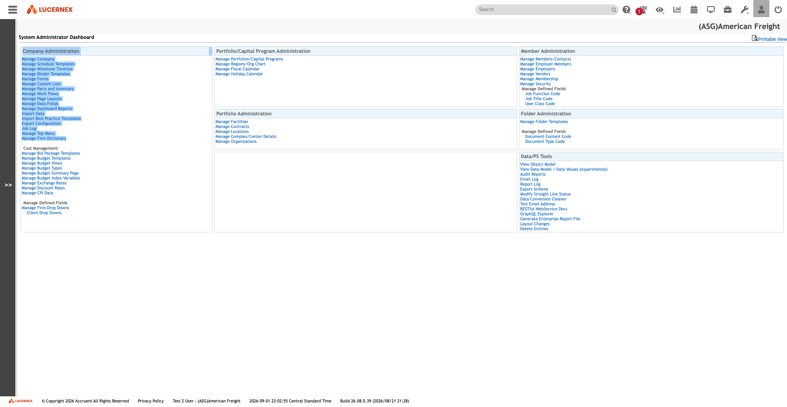

# 004 — Company Administration Dashboard

## Identification

| Property | Value |
|---|---|
| Screen | System Administrator Dashboard |
| Primary section | Company Administration |
| Tenant | `(ASG)American Freight` |
| Route | `https://train-americanfreight.lucernex.com/en/dashboard/DashboardDispatchOld.jsp?dashboardName=admin` |
| Dispatcher | `DashboardDispatchOld.jsp` |
| Named dashboard | `admin` |
| Browser title | `LxRetail` |
| Captured | 2026-09-02 |
| Application build | `26.08.0.39 (2026/08/21 21:28)` |
| Server-displayed time zone | Central Standard Time |

## Screenshot

Raw accessibility evidence: [`admin-landing.snapshot.txt`](../assets/raw-captures/admin-landing.snapshot.txt).

## Entry path

1. Sign in to the American Freight training tenant.
2. From the main Lucernex dashboard, activate the Administration toolbar control.
3. Lucernex navigates to the named `admin` dashboard through the legacy dashboard dispatcher.

This was a navigation-only action. No administrative record or configuration was changed.

## Visible layout

### Global shell

The Administration page retains the normal Lucernex shell:

- Far-left hamburger/navigation control.
- Lucernex logo.
- Global Search field and Advanced Search icon.
- Right-side global toolbar.
- Tenant heading `(ASG)American Freight`.
- Collapsed left navigation rail displaying `>>`.
- Footer with authenticated user, tenant, server time, time zone, and application build.
- **Printable View** link at the upper right of the dashboard content.

### Main workspace

The workspace title is **System Administrator Dashboard**. The body is a multi-column directory of administrative links, grouped into bordered panels with light-blue headings. It functions as a launchpad rather than a data grid: each item opens a specialized JSP administration screen.

The screenshot shows three principal columns. The left column contains Company Administration plus cost-management and firm-defined-field links. The center column contains portfolio/capital-program and portfolio administration. The right column contains member, folder, and Data/PS administration tools.

## Complete visible module inventory

### Company Administration

| Link | Target route | Initial interpretation |
|---|---|---|
| Manage Company | `/en/admin/FirmEdit.jsp?FirmID=3158` | Tenant/company profile; the route exposes the current firm identifier. |
| Manage Schedule Templates | `/en/admin/TaskTemplateEdit.jsp?includeType=Manage&BOType=TaskTemplate` | Reusable task/schedule template definitions. |
| Manage Milestone Timeline | `/en/admin/ProcessTimelineEdit.jsp` | Milestone timeline configuration. |
| Manage Binder Templates | `/en/CommitteeDocuments/BinderTemplateEdit.jsp` | Reusable document binder structures. |
| Manage Forms | `/en/admin/FirmCodeEdit.jsp?&includeType=Manage&TableType=2035&tableName=Manage%20Forms` | Tenant-defined forms, implemented through a generic firm-code editor. |
| Manage Custom Lists | `/en/admin/CustomListEdit.jsp` | Custom list definitions and values. High-priority exploration target. |
| Manage Parts and Inventory | `/en/lease/PartEdit.jsp` | Parts/inventory master configuration. |
| Manage Work Flows | `/en/workflow/WorkFlowTemplateEdit.jsp` | Workflow templates. |
| Manage Page Layouts | `/en/pagebuilder/SummaryEntityPageLayoutEdit.jsp` | Entity page-layout definitions. High-priority exploration target. |
| Manage Data Fields | `/en/pagebuilder/ReportGroupAvailableFieldEdit.jsp` | Field availability, labels, or metadata exposed to reporting/layout tooling. High-priority exploration target. |
| Manage Dashboard Reports | `/en/reports/ManageDashboardModules.jsp` | Dashboard-report/module definitions. |
| Import Data | `/en/admin/Messenger.jsp` | Data import workflow; potentially mutating and not activated during this pass. |
| Import Best Practice Templates | `/en/admin/BestPracticeTemplates.jsp` | Template import; potentially mutating and not activated during this pass. |
| Export Configuration | `/en/admin/MessengerExportData.jsp` | Configuration export; may expose tenant configuration and was not activated during this pass. |
| Job Log | `/en/admin/JobLogEdit.jsp?type=joblog` | Background/import job history. |
| Manage Top Menu | `/en/admin/ManageTopMenu.jsp` | Tenant navigation/menu configuration. |
| Manage Firm Dictionary | `/en/admin/Dictionary.jsp` | Tenant-specific terminology/label dictionary. |

### Cost Management

| Link | Target route |
|---|---|
| Manage Bid Package Templates | `/en/admin/BidPackageTemplate.jsp` |
| Manage Budget Templates | `/en/budget/BudgetTemplateEdit.jsp` |
| Manage Budget Views | `/en/budget/BudgetLayoutView.jsp` |
| Manage Budget Types | `/en/budget/BudgetColumnTypeEdit.jsp` |
| Manage Budget Summary Page | `/en/budget/BudgetSummaryEdit.jsp` |
| Manage Budget Index Variables | `/en/budget/BudgetIndexEdit.jsp` |
| Manage Exchange Rates | `/en/admin/ManageCurrencyRates.jsp` |
| Manage Discount Rates | `/en/admin/ManageDiscountRates.jsp` |
| Manage CPI Data | `/en/admin/ManageCPIData.jsp` |

These links show that financial configuration includes templates, presentation/layout definitions, budget column types, economic indices, currency exchange rates, discount rates, and CPI data.

### Company-level defined fields

| Link | Target route / behavior |
|---|---|
| Manage Firm Drop Downs | `/en/admin/FirmCodeList.jsp` |
| Client Drop Downs | `/en/admin/CustomCodeTableEdit.jsp` |

The visual indentation indicates **Client Drop Downs** is a child or more specific category under the firm dropdown manager.

### Portfolio/Capital Program Administration

| Link | Target route |
|---|---|
| Manage Portfolios/Capital Programs | `/en/admin/ProgramEdit.jsp` |
| Manage Regions/Org Chart | `/en/admin/OrgChartEdit.jsp` |
| Manage Fiscal Calendar | `/en/admin/ManageFiscalPeriod.jsp` |
| Manage Holiday Calendar | `/en/admin/ManageHolidayCalendar.jsp` |

### Portfolio Administration

| Link | Target route |
|---|---|
| Manage Facilities | `/en/admin/FacilityEditForm.jsp` |
| Manage Contracts | `/en/admin/ContractEdit.jsp` |
| Manage Locations | `/en/admin/LocationEdit.jsp` |
| Manage Complex/Center Details | `/en/admin/ComplexEdit.jsp` |
| Manage Organizations | `/en/admin/OrganizationEdit.jsp?AdminPage=true` |

This group exposes tenant-level administration for several of Lucernex's primary real-estate entities.

### Member Administration

| Link | Target route |
|---|---|
| Manage Members/Contacts | `/en/admin/ContactEdit.jsp` |
| Manage Employer Members | `/en/admin/ManageEmployerMembers.jsp` |
| Manage Employers | `/en/admin/EmployerEdit.jsp` |
| Manage Vendors | `/en/admin/VendorActivate.jsp` |
| Manage Membership | `/en/admin/ManageOneMemberManyProjects.jsp` |
| Manage Security | `/en/admin/SecurityPageAccess.jsp` |

#### Member-defined fields

The following links use `javascript:` rather than exposing a direct route in the accessibility tree. They likely invoke an in-page handler or generic code-table editor:

- Job Function Code
- Job Title Code
- User Class Code

No handler was activated during this capture.

### Folder Administration

| Link | Target route / behavior |
|---|---|
| Manage Folder Templates | `/en/admin/FolderTemplateEdit.jsp` |
| Document Content Code | `javascript:` handler |
| Document Type Code | `javascript:` handler |

### Data/PS Tools

| Link | Target route / behavior | Safety classification |
|---|---|---|
| View Object Model | `/en/admin/ShowObjectDetails.jsp` | Read-oriented discovery tool. |
| View Data Model / Data Values (experimental) | `/en/test/walkHierarchy.jsp` | Read-oriented but may expose broad tenant data. |
| Audit Reports | `/en/reports/AuditReport.jsp` | Read/reporting. |
| Email Log | `/en/reports/EMailLogs.jsp` | Read/logging; may contain personal information. |
| Report Log | `/en/admin/JobLogEdit.jsp?type=reportlog` | Read/logging. |
| Export Schema | `javascript:` handler | Export action; not activated. |
| Modify Straight Line Status | `/en/admin/lxadmin/SLDemoTweaks.jsp` | Explicitly mutating/high risk; not activated. |
| Data Conversion Cleaner | `/en/admin/lxadmin/DataLoadTweaks.jsp` | Potentially destructive/high risk; not activated. |
| Test Email Address | `/en/admin/lxadmin/EmailTest.jsp` | Can cause external side effects; not activated. |
| RESTful WebService Docs | `/en/test/RESTful.jsp` | Documentation/discovery. |
| GraphQL Explorer | `/en/admin/graphql.jsp` | API exploration; queries could expose data or mutate if unrestricted. |
| Generate Enterprise Report File | `/en/admin/GenBaseReport.jsp` | File-generation action; not activated. |
| Layout Changes | `/en/admin/ShowLayoutChanges.jsp` | Likely layout audit/change history. |
| Delete Entities | `/en/admin/lxadmin/DeleteEntities.jsp` | Destructive/high risk; not activated. |

## Observed behavior

- Administration opens as a full named dashboard, not a dropdown menu or modal.
- The route uses `DashboardDispatchOld.jsp`, while the normal dashboard used `DashboardDispatch.jsp`.
- The body is primarily server-rendered hyperlinks grouped by business capability.
- Each link maps to a dedicated JSP or to a JavaScript handler; this suggests a mixture of specialized legacy pages and generic shared code-table editors.
- The administration dashboard caused repeated `getLayoutNames` requests and refreshed the `RMTopMenu` navigation tree.
- No configuration editor was opened while capturing this landing state.

## Network evidence

The Administration transition issued:

- `GET /en/dashboard/DashboardDispatchOld.jsp?dashboardName=admin` — `200`.
- Eight `GET /servlet/uihelper?reqType=getLayoutNames...` requests — all `200`.
- `GET /servlet/JSONDataRequest?reqType=RMTopMenu&node=root` — `200`.
- Cloudflare RUM telemetry — `204`.

The repeated layout-name requests likely correspond to multiple administrative panels or framework components independently initializing layout metadata. This is an interpretation, not yet proven by request initiator analysis.

## Browser console state

The preserved console contained:

- Three CORB issue notices for cross-origin responses.
- Three deprecated-feature issue notices.
- One Quirks Mode issue notice.
- Two `ComboModel object already exist` log messages, one attributed to `lx-all.min.js`.

No uncaught JavaScript exception was listed. The issues nevertheless indicate technical debt in this legacy page and should not be described as a completely clean console state.

## Tenant and permission implications

- The tenant heading remains visible throughout the page.
- `Manage Company` contains the current firm's numeric identifier in its query string, confirming tenant-bound configuration.
- The breadth of visible links indicates this account has extensive administrative privileges, including security configuration and dangerous maintenance utilities.
- Visibility does not prove every target operation is permitted; target pages may apply additional authorization checks.
- The dashboard mixes ordinary tenant configuration with internal/maintenance tools, so role design and page-access controls are especially important.

## Safety notes

The following categories were deliberately not activated:

- Import or export operations.
- Save, Delete, Submit, Publish, Reset, Make Default, or Generate actions.
- Email-test or other actions that could trigger an external side effect.
- Straight-line status changes, data cleanup, or entity deletion.
- JavaScript-only defined-field handlers until their behavior can be inspected safely.

High-priority configuration links may be opened for read-only inspection, but no record will be changed.

## Interpretation

The System Administrator Dashboard is the central tenant-configuration directory for Lucernex. It spans five layers:

1. **Platform presentation and metadata** — page layouts, data fields, dashboard reports, top menu, dictionary, and dropdowns.
2. **Reusable process definitions** — schedules, milestone timelines, forms, workflows, binders, and budget templates.
3. **Tenant master data** — company, portfolios, regions, fiscal calendars, facilities, contracts, locations, organizations, members, employers, and vendors.
4. **Financial reference data** — exchange, discount, CPI, budget columns, and index variables.
5. **Operational diagnostics and maintenance** — job logs, audit reports, schema/object-model tools, API explorers, conversion utilities, and deletion tools.

The most important architectural clue is that Lucernex treats layout, terminology, menus, fields, lists, processes, and financial assumptions as tenant-configurable metadata rather than fixed application behavior.

## Confidence and open questions

### High confidence

- Visible labels, routes, grouping, tenant/build context, and the landing route are directly observed.
- The page is a legacy named dashboard and not the modern personal Dashboard tab.
- Several controls are inherently high-risk or mutating based on their names and destinations.

### Requires further exploration

- Whether Manage Data Fields controls reporting metadata only or also drives entity forms.
- How Custom Lists relate to Firm Drop Downs and Client Drop Downs.
- Whether Page Layouts are assigned by entity, role, user, company, or a combination.
- Which JavaScript-only code links share a generic code-table editor.
- Whether Layout Changes provides a complete audit history for Page Layouts.
- Which permissions govern each link and whether dangerous Data/PS tools are restricted separately.
