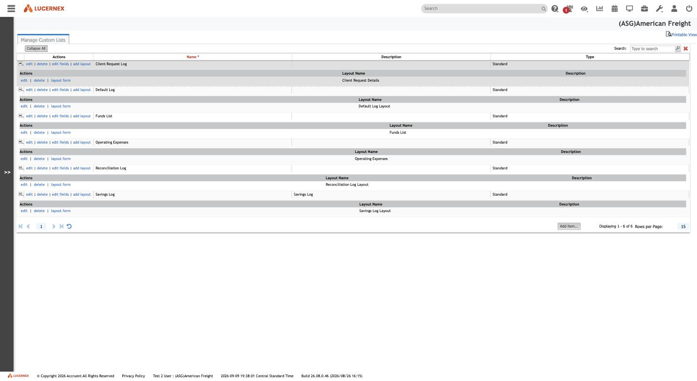
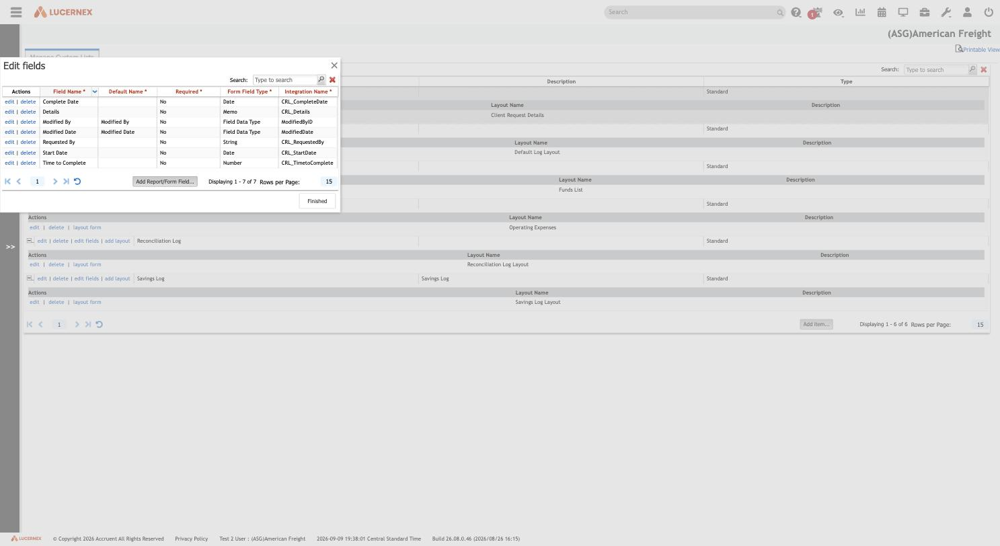
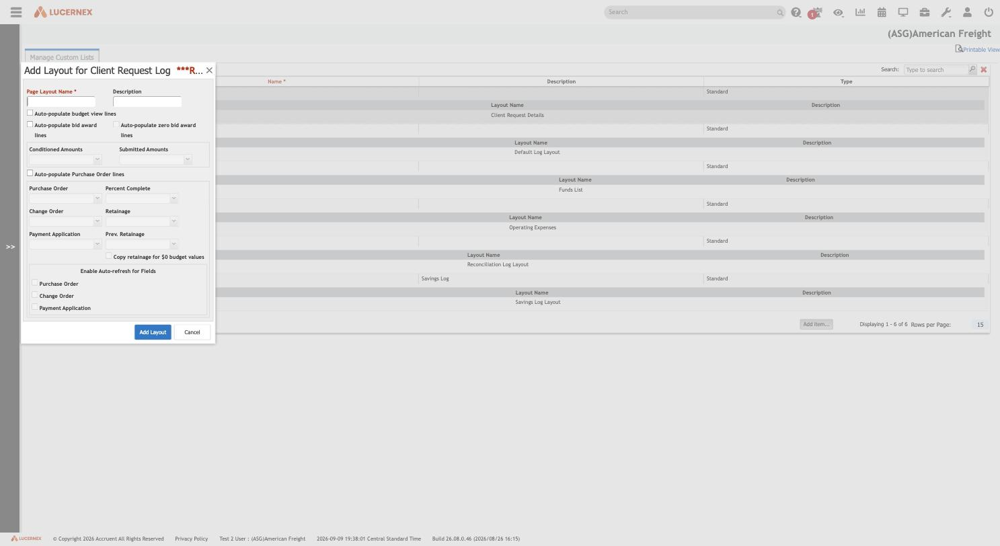

# 006 — Manage Custom Lists

## Identification

| Property | Value |
|---|---|
| Administration label | Manage Custom Lists |
| Browser/page title | LxRetail (generic; no distinct document title observed) |
| Tenant | `(ASG)American Freight` |
| Base route | `https://train-americanfreight.lucernex.com/en/admin/CustomListEdit.jsp` |
| Related editor route | `https://train-americanfreight.lucernex.com/en/issue/LayoutEditor.jsp?layoutMode=sublist&PageLayoutID={id}` |
| Captured | 2026-09-09/2026-09-10 local session dates; footer showed 2026-09-09 Central Standard Time |
| Application build | `26.08.0.46 (2026/08/26 16:15)` |
| Exploration mode | Read-only inspection; one field-editor dropdown was changed transiently in-memory and never saved |

**Manage Custom Lists is not a dropdown/picklist value master.** It is a small tenant-authored
**custom-entity builder**: each "custom list" is a named mini record-type with its own field
schema (via **Edit fields**) and its own dedicated page layout (via **Add layout** / **layout
form**). This is a materially different concept from ASG Edge+'s Masters, and closer to a
lightweight custom-object/custom-form feature. The genuine dropdown/picklist-value concept in
this tenant lives in **Manage Firm Drop Downs** and **Client Drop Downs** (documented in
[007](007-firm-and-client-drop-downs.md)), which this screen's field editor references directly.

## Screenshots

### Index (all six lists expanded, showing each list's one layout row)



### Edit fields (Client Request Log)



### Add Layout modal (Client Request Log)



### Layout editor (`layout form`, PageLayoutID=96279, opened by direct navigation)


## Entry path

1. Sign in to the authorized Lucernex training tenant.
2. Open the **Administration** toolbar destination (System Administrator Dashboard).
3. In **Company Administration**, follow **Manage Custom Lists**.

Only navigation, page rendering, expand/collapse, opening non-destructive "edit"/"edit
fields"/"Add item"/"add layout" dialogs, and cancelling out of them were performed.

## Visible page layout

### Index grid

The page is a single flat grid titled **Manage Custom Lists** with columns **Actions**, **Name**,
**Description**, **Type**. Each top-level row is one custom list. A `+`/`-` expander on the left
of each row reveals exactly one nested sub-row showing that list's associated layout: columns
**Actions**, **Layout Name**, **Description**. "Expand All" / "Collapse All" toggles all rows at
once. A page-level **Search** box filters client-side. Paging controls and a **Rows per Page**
field sit at the bottom; a page-level **Add item...** button creates a new custom list.

### Top-level row actions

Each custom list row exposes: `edit` (opens a small **Edit item** popup: Name*, read-only Type,
Description), `delete`, `edit fields` (opens the **Edit fields** grid for that list), `add layout`
(opens an **Add Layout for `<List Name>`** modal to create an *additional* layout for that list).

### Nested layout-row actions

Each list's single layout sub-row exposes: `edit`, `delete`, and `layout form` — the last opens
`LayoutEditor.jsp?layoutMode=sublist&PageLayoutID={id}` via
`JavaScript:lxPopup2('/en/issue/LayoutEditor.jsp?layoutMode=sublist&PageLayoutID=96279',700,500,true)`
(a 700×500 popup window).

## Data observed — full list inventory

| Custom List | Description | Type | Layout Name | PageLayoutID |
|---|---|---|---|---:|
| Client Request Log | — | Standard | Client Request Details | 96279 |
| Default Log | — | Standard | Default Log Layout | 96282 |
| Funds List | — | Standard | Funds List | 96269 |
| Operating Expenses | — | Standard | Operating Expenses | 96270 |
| Reconciliation Log | — | Standard | Reconciliation Log Layout | 96281 |
| Savings Log | Savings Log | Standard | Savings Log Layout | 96280 |

All six lists in this tenant are Type **Standard** and each has **exactly one** layout. The **Add
item** dialog's **Type** dropdown offers two values: **Standard** (`value="2634"`) and **Part**
(`value="2635"`) — no example of a **Part**-type custom list was observed in this tenant, but the
option's existence, alongside the separate **Manage Parts and Inventory** module
(`/en/lease/PartEdit.jsp`) noted in [004](004-company-administration.md), suggests Custom Lists
and Parts/Inventory share this same underlying "list + fields + layout" mechanism.

## Field schema — Edit fields (Client Request Log example)

The **Edit fields** grid columns are: **Field Name**, **Default Name**, **Required?**, **Form
Field Type**, **Integration Name**, plus an actions column (`edit`, `delete`) and a page-level
**Add Report/Form Field...** button.

| Field Name | Default Name | Required? | Form Field Type | Integration Name |
|---|---|:---:|---|---|
| Complete Date | — | No | Date | `CRL_CompleteDate` |
| Details | — | No | Memo | `CRL_Details` |
| Modified By | Modified By | No | Field Data Type | `ModifiedByID` |
| Modified Date | Modified Date | No | Field Data Type | `ModifiedDate` |
| Requested By | — | No | String | `CRL_RequestedBy` |
| Start Date | — | No | Date | `CRL_StartDate` |
| Time to Complete | — | No | Number | `CRL_TimetoComplete` |

**Modified By** / **Modified Date** are the only two rows carrying a **Default Name** and a
generic (non-`CRL_`-prefixed) Integration Name — they read as built-in system audit columns
common to every custom list, analogous to the `Firm_` prefix convention documented for Firm Data
Fields in [005](005-manage-data-fields.md). The remaining five fields use a `CRL_` prefix that
appears derived from the list's own initials (**C**lient **R**equest **L**og), implying each
custom list gets its own internal field-name namespace rather than sharing one tenant-wide pool.

### Field editor — Edit Report/Form Field (opened via `edit` on "Complete Date")

This is a materially richer editor than the simple Edit fields grid row suggests:

| Control | Observed values/behavior |
|---|---|
| Field Name* | Text, e.g. `Complete Date` |
| Integration Name* | Text, e.g. `CRL_CompleteDate` |
| Required* | Yes/No radio |
| Form Field Type* | Combobox: *(blank)*, Check Box, Confirmation Check Box, Currency, Date, Time, **Drop Down >>**, Memo, Number, String, Percent, Yes/No, Pass/Fail, Document, Budget Snapshot Value |
| Drop Down Types | Combobox, enabled when Form Field Type = **Drop Down >>**: *(blank)*, Change Management drop downs, Contract drop downs, Custom Drop downs, Entity and location drop downs, Miscellaneous drop downs, Person drop downs |
| Drop Downs | Combobox, populated from the selected Drop Down Type (empty in this capture — no type was actually committed) |
| Budget Column Type | Combobox (unexercised) |
| Cannot Exceed | Combobox (unexercised) |
| Lx Script Name | Read-only, e.g. `ClientListRow.CRL_CompleteDate` |
| Change field name globally | Checkbox |
| Functional Field? | Checkbox |
| Definition | Large textarea (presumably a scripted/computed-value definition, relevant when Functional Field is checked) |

**This is the direct, deterministic answer to the open question left in
[005](005-manage-data-fields.md) about how `sTYPE_CUSTOM_CODE_FIELD` / `sTYPE_CLIENT_LISTS`
connect to Custom Lists and the dropdown screens**: a custom-list field's Form Field Type can be
set to **"Drop Down >>"**, which reveals a **Drop Down Types** category selector. The six
category values shown here (Change Management, Contract, Custom, Entity and location,
Miscellaneous, Person) read as the exact category taxonomy that **Manage Firm Drop Downs** /
**Client Drop Downs** organize their code tables under — see the direct comparison in
[007](007-firm-and-client-drop-downs.md). Once a category is chosen, the **Drop Downs** combobox
would presumably list the specific named drop-down/code-table within that category to bind the
field to.

The **Lx Script Name** value `ClientListRow.<IntegrationName>` reveals the internal object model:
each custom list is backed by a generic `*ListRow`-style script object (here `ClientListRow`)
exposing every list-specific field as a scripted property — evidence that custom lists are
implemented as one shared generic row/record type parameterized per list, not as bespoke database
tables per list.

No field value was committed. The Form Field Type combobox was momentarily focused/re-clicked to
confirm its option set via the accessibility tree, but no `Update` was clicked and the dialog was
cancelled.

## Layout editor (`layout form`)

Because the link is a `javascript:lxPopup2(...)` popup, and no new window/tab surfaced inside the
automation-visible tab group after clicking it directly (see Mutation-risk register and technical
notes below), the same URL was loaded directly in a new plain tab for read-only inspection:
`/en/issue/LayoutEditor.jsp?layoutMode=sublist&PageLayoutID=96279`.

### Visible structure

The editor renders the list's fields as a single horizontal row of column "cards", in this order
for Client Request Log: **Modified By, Modified Date, Requested By, Details, Start Date, Complete
Date, Time to Complete (in hours)**. Each card has:

- A drag-handle (`⋮⋮⋮`) for reordering/resizing.
- Three alignment icons plus a delete (`X`) icon: `doAlign(fieldId,1,{0|8192|16384})`,
  `doDelete(fieldId, pageLayoutId)`.
- A text-overflow toggle labelled **wrap** or **fit** (`doWrap(fieldId, true|false)`) — Details
  and Time to Complete were captured in **fit** mode; the other five in **wrap** mode.
- The field's display label, itself wired to `editOptions(fieldId, hash, true, true, contextId)`
  for (presumably) field-specific layout options.

A trailing cell shows a count (**7**, matching the seven placed fields) with its own delete icon
(`doRemoveCol("7")`) and a `<-->` resize-toggle button, followed by an empty **`<Select>`**
combobox for adding another of the list's fields to the layout — it offered no real options here
because all seven fields were already placed.

Page-level controls: **Clear Layout**, **Save Layout**, **Close**.

### Technical note — popup/opener dependency

Clicking column-level controls (`editOptions`, `doAlign`, `doWrap`) on this directly-navigated
copy of the page produced no visible change and the browser console logged, on every such click:

```text
Failed to lookup pageLayoutID=96279, ids.length=0
```

This indicates the editor expects to be opened as a genuine `window.open` popup from the parent
**Manage Custom Lists** page (via `lxPopup2`), which evidently registers the layout's field
metadata into some shared/opener-side JavaScript state before the popup script runs. A tab
navigated to the same URL independently loads the static grid correctly (columns, labels, wrap/fit
state, and button set are all real server-rendered evidence) but cannot fully drive the
interactive column-editing handlers. The **field-level "edit options" panel contents remain
unobserved** as a result — this is a genuine exploration gap, not a mutation-risk decision.

## Add Layout modal (`add layout`)

Opened for Client Request Log via **Add Layout for Client Request Log**. Only **Page Layout
Name*** is required; every other control is optional:

- Description
- Auto-populate budget view lines (checkbox)
- Auto-populate bid award lines / Auto-populate zero bid award lines (checkboxes)
- Conditioned Amounts / Submitted Amounts (comboboxes)
- Auto-populate Purchase Order lines (checkbox)
- Purchase Order / Percent Complete (comboboxes)
- Change Order / Retainage (comboboxes)
- Payment Application / Prev. Retainage (combobox + "Copy retainage for $0 budget values" checkbox)
- Enable Auto-refresh for Fields: Purchase Order, Change Order, Payment Application (checkboxes)

**Interpretation:** almost none of these options are meaningful for a simple log-style custom
list like Client Request Log. They are budget/Purchase-Order/Change-Order/Payment-Application
concepts. This strongly suggests **"Add Layout" is one generic, shared sublist-layout-creation
component reused verbatim across very different data domains** (custom lists, and presumably
Budget/Bid/PO/Change-Order/Payment-Application sublists elsewhere in the product), rather than a
bespoke dialog built for Custom Lists specifically. This is architecturally significant for the
Page Layouts investigation in [008](008-manage-page-layouts.md): Lucernex appears to have (at
least) two shared, cross-domain layout subsystems — this "sublist" layout mode, and whatever
`SummaryEntityPageLayoutEdit.jsp` drives for full entity pages.

No layout name was entered and **Add Layout** was not clicked; the modal was cancelled.

## Per-row and page-level controls summary

| Control | Behavior/evidence | Activated? |
|---|---|---|
| `edit` (list row) | Opens **Edit item**: Name*, read-only Type, Description; **Update**/**Cancel** | Opened, cancelled |
| `delete` (list row) | Presumed list deletion | No |
| `edit fields` | Opens **Edit fields** grid for that list | Opened |
| `add layout` | Opens **Add Layout for `<Name>`** modal | Opened, cancelled |
| `edit` (layout row) | Presumed layout metadata edit (name/description/options seen in Add Layout) | No |
| `delete` (layout row) | Presumed layout deletion | No |
| `layout form` | Opens `LayoutEditor.jsp?layoutMode=sublist&PageLayoutID={id}` | Opened (via direct navigation) |
| `Add item...` | Opens **Add item**: Name*, Type* (Standard/Part), Description | Opened, cancelled |
| Field `edit` (in Edit fields) | Opens **Edit Report/Form Field** (see above) | Opened, cancelled |
| `Add Report/Form Field...` | Presumed same editor in "add" mode | No |
| Layout editor: `Clear Layout` | Clears all placed columns from the layout | No |
| Layout editor: `Save Layout` | Persists layout changes | No |
| Layout editor: `Close` | Presumed close-popup/return | No |
| Layout editor: column `X` / `doDelete` | Removes a field from the layout | No |
| Layout editor: `doAlign` / `doWrap` | Column alignment/overflow mode | No (attempted; blocked by popup/opener dependency, no state changed) |

No custom list, field, or layout was created, edited, or deleted during this exploration.

## Network evidence

Network-request tracking was attached only after the page had already loaded (a limitation of the
capture tooling for this pass), so no request log is included here. All findings in this document
come from server-rendered DOM/accessibility-tree evidence and directly observed `javascript:`
handler source strings, matching the standard used in
[005](005-manage-data-fields.md#network-evidence).

## Tenant and permission implications

- The same account that manages Global/Firm Data Fields and Firm add/edit/delete on that screen
  also has full CRUD-looking access (edit/delete/edit fields/add layout) on every custom list and
  its layout here.
- Custom Lists appear to be entirely Firm/tenant-scoped constructs — no Global/Firm toggle
  equivalent to the Data Fields screen was observed here; there is no evidence in this capture of
  a platform-wide custom list concept.
- The field editor's **Drop Down Types** categories imply that any custom-list field can be bound
  to a firm-level dropdown/code-table, meaning changes made in Manage Firm Drop Downs / Client
  Drop Downs (see [007](007-firm-and-client-drop-downs.md)) could affect the valid values
  available to custom-list fields defined here.

## Mutation-risk register

| Control/action | Potential effect | Exploration decision |
|---|---|---|
| Add item / Add Layout / Add Report/Form Field | Creates a new list, layout, or field definition | Not activated (dialogs opened, then cancelled) |
| edit / edit fields / field edit | Opens or changes metadata | Not activated (viewed, then cancelled) |
| delete (list, layout, or field) | Removes a definition, possibly orphaning data | Not activated |
| Clear Layout | Removes all placed columns from a layout | Not activated |
| Save Layout | Persists layout column arrangement | Not activated |

No Lucernex custom list, field, or layout was modified.

## Interpretation

### High-confidence conclusions

1. **Manage Custom Lists is a tenant-authored mini record-type builder**, not a picklist/master
   value screen. Each list = its own field schema + its own page layout.
2. **Each custom list has exactly a 1:1 relationship with a layout** in every observed case
   (though `add layout` implies more than one is structurally possible).
3. **Custom-list layouts and full entity-page layouts share underlying machinery**: the same
   `LayoutEditor.jsp` is used with `layoutMode=sublist`, and the "Add Layout" creation dialog is
   shared verbatim with Budget/PO/Change-Order concepts, evidencing one common, generic layout
   subsystem reused across very different domains.
4. **Custom-list fields can be typed as dropdown-bound fields**, cascading through a **Drop Down
   Types** category selector whose six categories line up with the taxonomy used by Firm/Client
   Drop Downs (see [007](007-firm-and-client-drop-downs.md)) — this is the concrete mechanism
   connecting "fields" to "dropdowns" that [005](005-manage-data-fields.md) could only infer from
   field-type names.
5. **Custom lists have their own per-list field namespace** (e.g. `CRL_*` for Client Request Log)
   layered on a shared generic script object (`ClientListRow`), rather than a single shared field
   pool like Global/Firm Data Fields.

### Moderate-confidence architectural model

- Custom Lists and the "Manage Parts and Inventory" module likely share the same underlying
  mechanism, distinguished by the list's **Type** (`Standard` vs `Part`).
- `layoutMode=sublist` is probably one of several `LayoutEditor.jsp` modes; **Manage Page Layouts**
  ([008](008-manage-page-layouts.md)) likely drives a different mode for whole-entity pages.

### Requires further exploration

1. What does the field-level `editOptions` panel actually contain? (Blocked by the popup/opener
   dependency described above — could potentially be reached by triggering the popup via a real
   mouse-driven click sequence rather than a synthetic `ref`-based click, or by inspecting the
   `lxPopup2`/`editOptions` implementation in `lx-all.min.js`.)
2. What does a **Part**-type custom list look like, and how does it differ structurally from
   **Standard**?
3. What does the **Drop Downs** third-level combobox actually list once a **Drop Down Type** is
   committed, and can that be cross-referenced against the concrete lists documented in
   [007](007-firm-and-client-drop-downs.md)?
4. Is there a Global/platform-wide custom list concept elsewhere, or are custom lists always
   Firm-scoped?
5. What do `doAlign`'s three constants (`0`, `8192`, `16384`) map to beyond the obvious
   left/center/right, and do they matter for anything beyond visual presentation?
6. Does `Save Layout` on a sublist layout create an audit trail comparable to the **Layout
   Changes** tool noted in [004](004-company-administration.md)?
