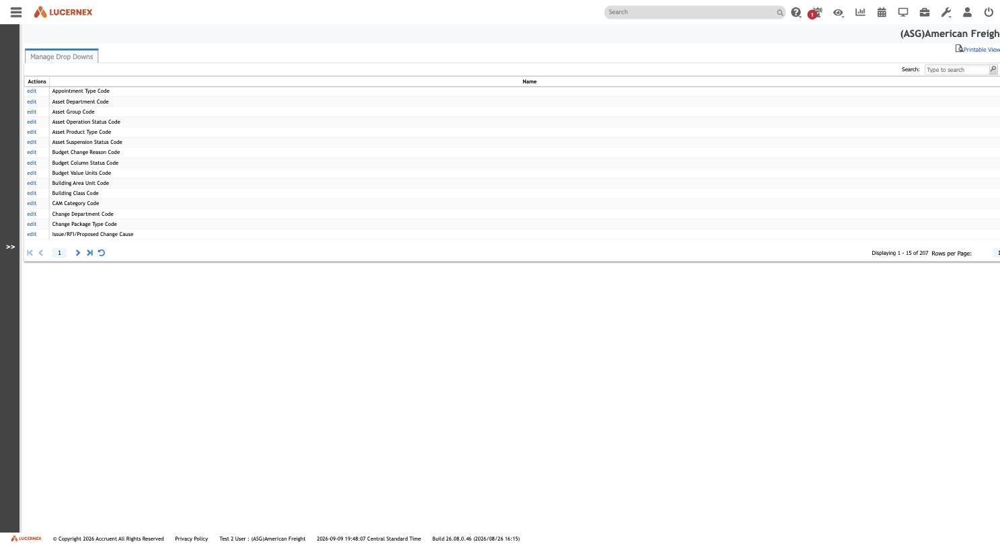
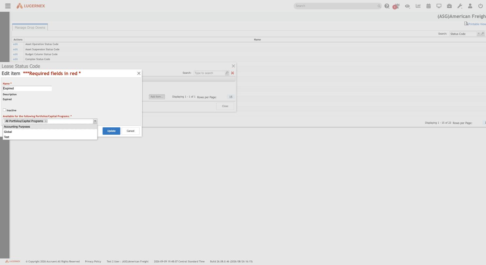
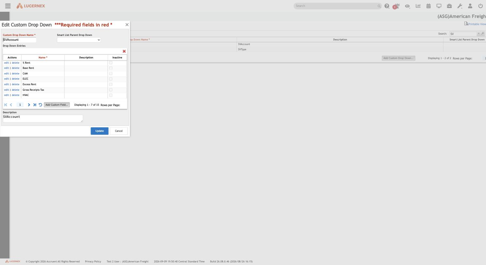
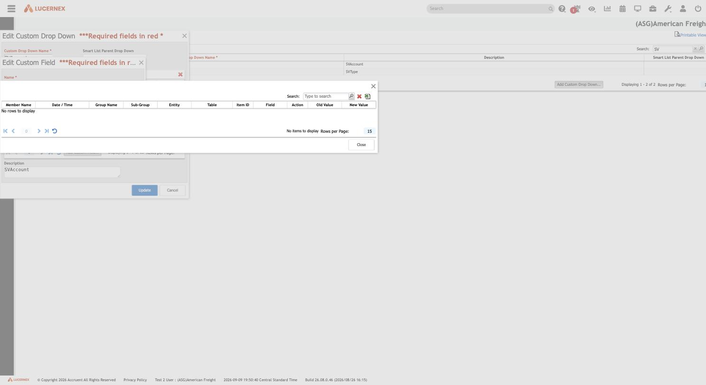
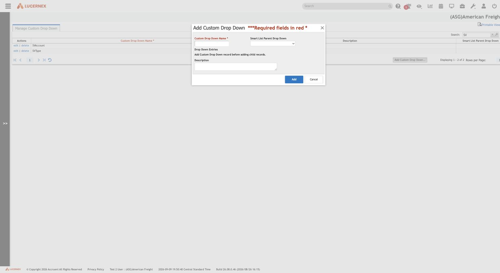

# 007 — Manage Firm Drop Downs and Client (Custom) Drop Downs

## Identification

| Property | Value |
|---|---|
| Administration labels | **Manage Firm Drop Downs** and **Client Drop Downs** (both under Company Administration → Manage Defined Fields) |
| Browser/page titles | "Manage Drop Downs" (Firm) and "Manage Custom Drop Down" (Client) |
| Tenant | `(ASG)American Freight` |
| Firm Drop Downs route | `https://train-americanfreight.lucernex.com/en/admin/FirmCodeList.jsp` |
| Client Drop Downs route | `https://train-americanfreight.lucernex.com/en/admin/CustomCodeTableEdit.jsp` |
| Captured | 2026-09-09/2026-09-10, footer showed 2026-09-09 Central Standard Time |
| Application build | `26.08.0.46 (2026/08/26 16:15)` |
| Exploration mode | Read-only inspection; no value, drop-down, or scope assignment was created, edited, or deleted |

These two screens are Lucernex's actual **dropdown/picklist-value master** concept — the direct
analogue of ASG Edge+'s Masters. They are **two structurally different mechanisms** sharing one
visual style, and the field-editor evidence in [006](006-manage-custom-lists.md) confirms both are
directly selectable as the target of a custom-list field typed **Drop Down >>**.

## Screenshots

### Manage Firm Drop Downs — index (207 platform-defined code-table slots)

### Firm Drop Downs — value editor showing Portfolio/Capital Program scoping

### Client (Custom) Drop Downs — combined name/parent/entries editor (SVAccount, 15 values)

### Client Drop Downs — per-value Audit Log

### Client Drop Downs — Add Custom Drop Down (empty-state entry point)

## Entry path

1. Sign in to the authorized Lucernex training tenant.
2. Open **Administration** → System Administrator Dashboard.
3. In **Company Administration**, under the indented **Manage Defined Fields** group, follow
   **Manage Firm Drop Downs** or **Client Drop Downs** (see [004](004-company-administration.md)).

Only navigation, opening non-destructive dialogs (including one Audit Log popup), reading
dropdown/select option lists, and cancelling out of every dialog were performed.

## Manage Firm Drop Downs (`FirmCodeList.jsp`)

### Structure

A single flat grid, page title **Manage Drop Downs**, columns **Actions** (`edit` only) and
**Name**. **207 total rows**, alphabetically sorted, e.g. `Appointment Type Code`, `Asset
Department Code`, `Asset Group Code`, `Asset Operation Status Code`, `Asset Product Type Code`,
`Asset Suspension Status Code`, `Budget Change Reason Code`, `Budget Column Status Code`, `Budget
Value Units Code`, `Building Area Unit Code`, `Building Class Code`, `CAM Category Code`, `Change
Department Code`, `Change Package Type Code`, `Issue/RFI/Proposed Change Cause`, ... through many
more `*Status Code` entries (`Complex Status Code`, `Decision Status Code`, `Invoice Status Code`,
`Lease Status Code`, `Pro Forma Budget Status Code`, `RE Transaction Status Code`, `SRQ Status
Code`, `Approval Status Code`, `Last Action Status Code`, `Contract Status Code`, `Facility Status
Code`, `Financial Adjustment Status Code`, etc.). A **Search** box filters the row list; **Rows per
Page** and paging controls sit at bottom.

**Critically, there is no top-level `delete` and no page-level "Add" control.** The 207 named code
tables read as a **fixed, platform-defined catalog** — the tenant cannot create a new Firm Drop
Down category or remove an existing one; it can only manage the *values inside* each fixed
category.

### Value editor (opened via `edit`)

Clicking `edit` on a category name opens a modal titled with that category's exact name (e.g.
**"Asset Department Code"**, **"Lease Status Code"**) containing a values grid:

| Column | Notes |
|---|---|
| Actions | `edit` per value (no `delete` visible in this capture) |
| Name* | Required |
| Description | Optional |
| Inactive | Checkbox |

A page-level **Add item...** button adds a new value. Many categories in this training tenant were
empty (`No rows to display`, e.g. **Asset Department Code**, **Budget Change Reason Code**);
**Lease Status Code** had exactly one value, **Expired**.

### Value-level editor — the Portfolio/Capital Program scope

Clicking `edit` on an individual value (e.g. **Expired** under Lease Status Code) opens a richer
**Edit item** dialog:

- **Name*** (text)
- **Description** (text)
- **Inactive** (checkbox)
- **Available for the following Portfolios/Capital Programs:*** — a required multi-select chip
  control. The captured value carried a single chip, **"All Portfolios/Capital Programs"**, and
  the dropdown's other selectable options in this tenant were **Accounting Purposes**, **Global**,
  and **Test** (real Portfolio/Capital Program names configured elsewhere in this tenant).

**This is a concrete, value-level scoping mechanism**: an individual dropdown value can be
restricted to specific Portfolios/Capital Programs rather than being visible tenant-wide by
default (default appears to be "All"). This is a materially different scoping axis from the
Global-vs-Firm toggle documented for Data Fields in [005](005-manage-data-fields.md) — it operates
*within* Firm scope, one level down, at the individual value.

No value, description, inactive flag, or portfolio scope was changed; every dialog was cancelled.

## Client Drop Downs (`CustomCodeTableEdit.jsp`)

### Structure

Page title **Manage Custom Drop Down**. A flat grid, columns **Actions** (`edit` **and**
`delete`), **Custom Drop Down Name***, **Description**, and **Smart List Parent Drop Down**. **27
total rows** in this tenant: Brands, Contingency Trigger, Cost Center, Fleet Review Decision, Funds
Type, Guarantor, Increase Type, Lease Admin Request Type, Lease Status, Lease Term Cap Type, Lease
Year, Month List, ONCOT Frequency, ONCOT Remedy, OpEx Type, Payment Method, Radius Unit, Rent
Payment Type, RLExpense, RLStatus, Section Status, SVAccount, SVType, Tenant Legal Name,
Termination Right, User Request Type, Yes/No. A page-level **Add Custom Drop Down...** button
creates a new category.

**Unlike Firm Drop Downs, the tenant has full CRUD over the category itself** (`edit`, `delete`,
and `Add Custom Drop Down...` all present at the top level) — this is a genuinely tenant-authored,
extensible dropdown catalog, not a fixed platform list.

Note the naming overlap: this tenant has both a platform-fixed **Lease Status Code** (Firm Drop
Downs, one value: "Expired") and a separate tenant-defined **Lease Status** (Client Drop Downs) —
two parallel, independently-managed status dropdowns for what looks like the same business
concept. This is a concrete example of the kind of Global/Firm-style duplication risk called out
in [005](005-manage-data-fields.md).

### Combined name/parent/entries/description editor

Opening `edit` on a category (e.g. **Cost Center**, **SVAccount**) shows one integrated dialog —
unlike Firm Drop Downs' two-level (category popup → value popup) structure:

- **Custom Drop Down Name*** (text)
- **Smart List Parent Drop Down** (combobox) — see cascading dropdowns below
- **Drop Down Entries** — an inline values grid (`edit`/`delete` actions, **Name***, Description,
  Inactive) with its own **Add Custom Field...** button
- **Description** (textarea)
- **Update** / **Cancel**

Example population: **Cost Center** had 2 values (`009`, `11`); **SVAccount** had 15 values,
including `% Rent`, `Base Rent`, `CAM`, `ELEC`, `Excess Rent`, `Gross Receipts Tax`, `HVAC`.

### Cascading dropdowns — "Smart List Parent Drop Down"

The **Smart List Parent Drop Down** combobox lists all **27** other Custom Drop Downs by name as
selectable parents (`Brands` id `7622` through `Yes/No` id `7618`), confirming Client Drop Downs
support **dependent/cascading picklists**: a child drop-down's available values can presumably be
filtered based on the value chosen in its designated parent drop-down elsewhere in the product.
**No category in this tenant currently has a parent assigned** (every category checked — Cost
Center, SVAccount, SVType — showed this field blank), so the actual runtime cascading behavior
(how a child list filters by the parent's selected value) was not observed in action, only the
configuration surface for it. **This capability does not exist at all in Firm Drop Downs** — the
platform-fixed catalog has no equivalent parent/child linkage field.

### Value-level editor — scoping and Audit Log

Opening `edit` on an individual entry (e.g. **% Rent** under SVAccount) opens an **Edit Custom
Field** dialog:

- **Name*** (text)
- **Description** (text)
- **Inactive** (checkbox)
- **Portfolios** — the same required multi-select chip control seen in Firm Drop Downs, defaulting
  to **"All Portfolios/Capital Programs"**
- **Audit Log** button (in addition to Update/Cancel)

Clicking **Audit Log** opened a dedicated dialog with columns **Member Name, Date/Time, Group
Name, Sub-Group, Entity, Table, Item ID, Field, Action, Old Value, New Value**, plus its own
search box and an export icon. The captured value ("% Rent") showed **no rows** (no changes
logged since audit tracking began, or none since creation), but **the schema itself is direct,
observed proof that Lucernex maintains a field-level change-audit trail for at least Custom
Drop-Down values** — Old Value/New Value/Field/Action/Item ID/Table/Entity is a materially richer
audit shape than anything glimpsed on the Data Fields or Custom Lists screens, and directly
informs the open question in [005](005-manage-data-fields.md#confidence-and-unresolved-questions)
about whether changes are audited.

**Firm Drop Down values did not show an Audit Log button** in this capture — this may be a
genuine feature difference or may simply not have been surfaced on the specific value dialog
opened; treat as a difference to re-verify rather than a certainty.

### Add Custom Drop Down (empty-state)

The creation modal shows **Custom Drop Down Name*** (required), **Smart List Parent Drop Down**
(optional, empty by default), and **Description**, with an inline note: *"Add Custom Drop Down
record before adding child records."* — confirming the parent category record must be persisted
before its values (child records) can be added, a two-step save flow. Not submitted.

## Direct comparison: Firm Drop Downs vs. Client (Custom) Drop Downs

| Aspect | Firm Drop Downs | Client (Custom) Drop Downs |
|---|---|---|
| Category CRUD | Fixed platform list (207 slots); **edit only**, no add/delete of categories | **Full CRUD** — add, edit, delete categories freely |
| Category count observed | 207 | 27 |
| Category editor shape | Two-level: category popup opens a separate values grid | One integrated dialog: name + parent + inline values + description |
| Cascading/parent-child | Not present | **"Smart List Parent Drop Down"** field — any other custom drop-down selectable as parent |
| Value fields | Name*, Description, Inactive, **Portfolios/Capital Programs*** (required) | Name*, Description, Inactive, Portfolios (same chip control, not required in this capture) |
| Value-level Audit Log | Not observed on the one value checked | **Present**, with a rich Entity/Table/Item ID/Field/Old-New schema |
| Naming convention | `*Code` suffix almost universally (e.g. `Asset Department Code`) | Free-form tenant naming (`Brands`, `Cost Center`, `SVAccount`) |

## How this connects to Custom Lists and Data Fields

[006](006-manage-custom-lists.md) showed that a **Custom List field** whose Form Field Type is set
to **Drop Down >>** exposes a **Drop Down Types** category selector with six values: *Change
Management drop downs, Contract drop downs, Custom Drop downs, Entity and location drop downs,
Miscellaneous drop downs, Person drop downs*. Given that one of those six is named **exactly**
"Custom Drop downs," the most likely reading is:

- **"Custom Drop downs"** in that selector routes to **this Client/Custom Drop Downs catalog**
  (`CustomCodeTableEdit.jsp`) — a tenant-extensible set the firm can freely add to.
- The other five categories (Change Management, Contract, Entity and location, Miscellaneous,
  Person) most plausibly partition the fixed 207-entry **Firm Drop Downs** catalog into
  functional groups for easier selection, rather than being separate storage systems. This is
  inferred from naming and was **not directly confirmed** by opening the third-level "Drop Downs"
  value picker in the field editor (it rendered empty until a category was actually committed) —
  flagged below as unresolved.

This gives a first-pass mapping for the ASG Edge+ comparison: **Firm Drop Downs ≈ platform-seeded
Masters** (fixed list of master types, tenant manages values only, with portfolio-level value
scoping), while **Client/Custom Drop Downs ≈ tenant-defined Masters** (firm can create wholly new
master types, with cascading/dependent-list support that ASG Edge+ Masters would need an explicit
design decision to match or intentionally omit).

## Per-screen controls summary

| Control | Screen | Behavior | Activated? |
|---|---|---|---|
| `edit` (category) | Firm Drop Downs | Opens values grid | Opened |
| `edit` (value) | Firm Drop Downs | Opens Name/Description/Inactive/Portfolios editor | Opened, cancelled |
| `Add item...` | Firm Drop Downs (values grid) | Presumed new value creation | Not activated |
| `edit` / `delete` (category) | Client Drop Downs | Opens combined editor / presumed deletion | `edit` opened; `delete` not activated |
| `Add Custom Drop Down...` | Client Drop Downs | Opens category-creation modal | Opened, cancelled |
| `edit` / `delete` (value) | Client Drop Downs | Opens Edit Custom Field / presumed deletion | `edit` opened; `delete` not activated |
| `Add Custom Field...` | Client Drop Downs (entries grid) | Presumed new value creation | Not activated |
| `Audit Log` | Client Drop Downs (value editor) | Opens read-only change-history dialog | Opened (read-only; genuinely non-mutating) |

No Firm Drop Down category/value, Client Drop Down category/value, portfolio scope assignment, or
parent-drop-down linkage was created, edited, or deleted.

## Tenant and permission implications

- The account has full visibility and apparent edit rights over both the fixed platform catalog
  and the tenant-extensible catalog, plus their value-level Portfolio scoping and (for Client Drop
  Downs) audit history.
- Portfolio/Capital Program scoping on individual dropdown values means a value's visibility is
  not simply Firm-wide-or-not; it can be further partitioned by Portfolio/Capital Program, adding
  a third scoping axis alongside Global-vs-Firm (Data Fields) and per-list field namespaces
  (Custom Lists).

## Interpretation

### High-confidence conclusions

1. **Firm Drop Downs and Client Drop Downs are two structurally distinct dropdown-master
   mechanisms**, not one screen under two names: fixed-catalog/values-only vs.
   fully-tenant-extensible-catalog.
2. **Only Client Drop Downs support cascading/dependent lists** via Smart List Parent Drop Down.
3. **Dropdown values carry Portfolio/Capital Program-level scoping** in both mechanisms, via an
   identical required multi-select chip control.
4. **Client Drop Downs carry a genuine field-level audit trail** (Entity/Table/Item ID/Field/Old
   Value/New Value), directly observed via the Audit Log dialog, even though no rows existed for
   the specific value checked.
5. **This tenant has at least one clear naming duplication** between the fixed and extensible
   catalogs (`Lease Status Code` vs. `Lease Status`).

### Requires further exploration

1. Confirm whether the six **Drop Down Types** categories in the Custom List field editor
   ([006](006-manage-custom-lists.md)) map 1:1 onto groupings of the 207 Firm Drop Downs, by
   actually committing a category selection and inspecting the resulting **Drop Downs** picker
   (blocked here because doing so meaningfully requires progressing further into a field-save flow
   than was attempted).
2. Does a Firm Drop Down value's editor ever show an Audit Log control, or is that exclusive to
   Client Drop Downs?
3. What visibly happens to a child Custom Drop Down's available values, in an actual data-entry
   context, once a Smart List Parent Drop Down is configured and a parent value is selected?
4. Is Portfolio/Capital Program scoping enforced only for display (client-side filtering) or also
   at the API/report level?
5. Are the 207 Firm Drop Down categories identical across all Lucernex tenants (truly
   platform-fixed), or can Accruent/Lucernex admins add to that list at a level this tenant's
   account cannot reach?
