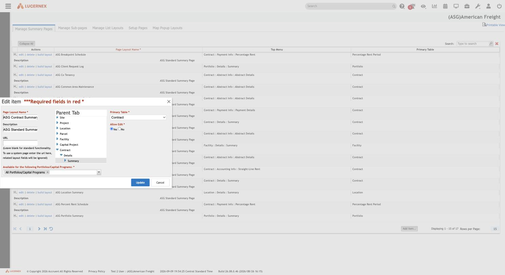
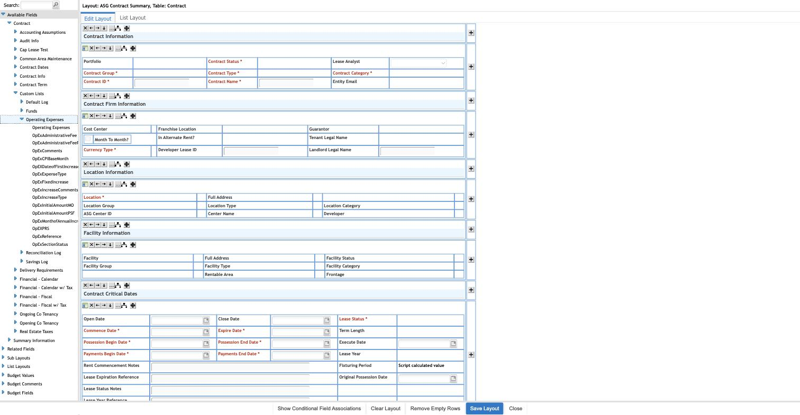
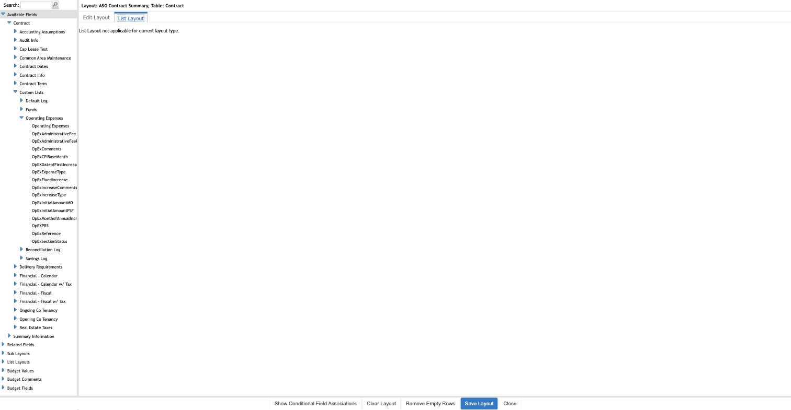
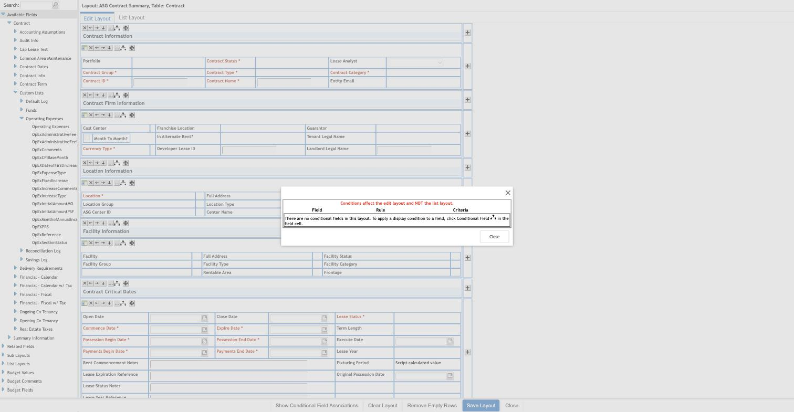
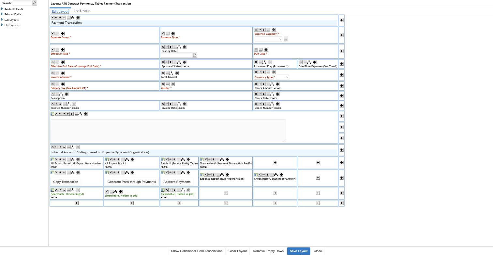
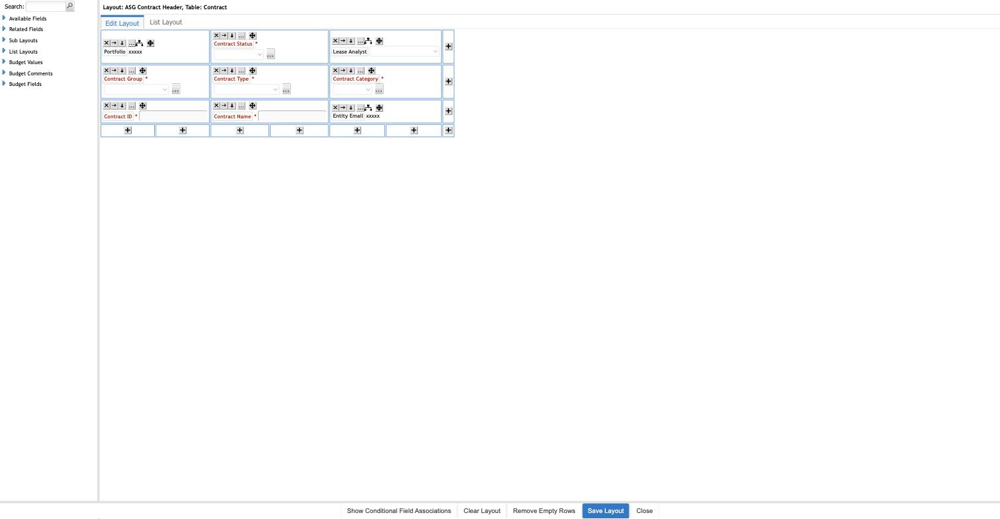
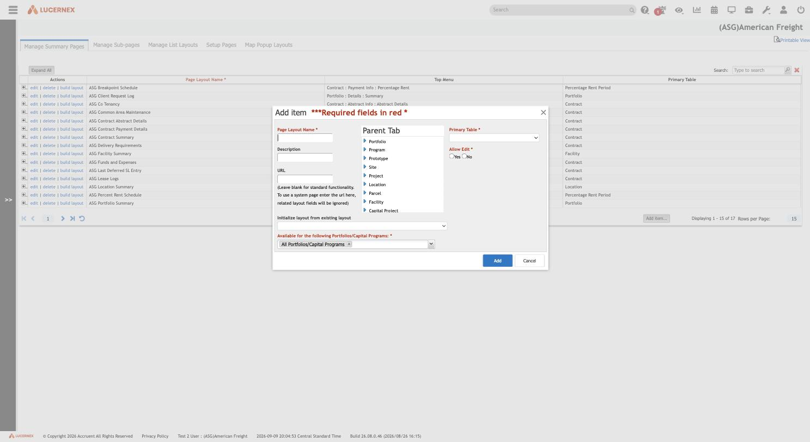

# 008 — Manage Page Layouts

## Identification

| Property | Value |
|---|---|
| Administration label | Manage Page Layouts |
| Base route | `https://train-americanfreight.lucernex.com/en/pagebuilder/SummaryEntityPageLayoutEdit.jsp` |
| Sub-tab routes | `?mode=SEP` (Manage Summary Pages, the default), `?mode=SUB` (Manage Sub-pages), `?mode=LIST` (Manage List Layouts) |
| Related routes | `/en/admin/FirmEdit.jsp?mode=SETUP` (Setup Pages), `/en/admin/FirmEdit.jsp?mode=MAP` (Map Popup Layouts) |
| Layout-builder route | `/en/pagebuilder/LayoutEditorAJAX.jsp?formSubmit=editBO&popupEdit=true&buildLayout=true&PageLayoutID={id}` (opened as a `lxPopup2` popup, ~1100×680) |
| Tenant | `(ASG)American Freight` |
| Captured | 2026-09-10, footer showed 2026-09-09 Central Standard Time |
| Application build | `26.08.0.46 (2026/08/26 16:15)` |
| Exploration mode | Read-only inspection; every editor was opened and inspected, no `Save Layout`/`Update`/`Add`/`Delete`/`Clear Layout` action was invoked |

This is the deepest and most architecturally important screen explored in this pass. **"Manage
Page Layouts" is not one screen but a five-way system**: a landing page with three sub-tabs
(Summary Pages, Sub-pages, List Layouts) that all edit the same underlying `PageLayoutID` record
type through one shared visual builder, plus two small satellite screens (Setup Pages, Map Popup
Layouts) that assign specific layouts to specific runtime roles.

## Screenshots

### Manage Summary Pages index (17 layouts) and its rich "Edit item" dialog

### Layout builder — Available Fields sidebar reaching into a Custom List's own fields

### List Layout tab — "not applicable" for a Summary-type layout

### Show Conditional Field Associations dialog

### A List-type record that HAS both an Edit Layout and a List Layout

### A Sub-page fragment, shown without its own section title

### Setup Pages — Global vs. Firm layout assignment per entity

![Setup Pages dropdowns showing [Global Layout] vs ASG-prefixed tenant layouts](../assets/screenshots/page-layouts/page-layouts-setup-pages.png)

### Add item — empty-state creation dialog with a clone option

## Entry path

1. Sign in to the authorized Lucernex training tenant.
2. Open **Administration** → System Administrator Dashboard.
3. In **Company Administration**, follow **Manage Page Layouts** (lands on **Manage Summary
   Pages**, `?mode=SEP`).
4. Switch sub-tabs for **Manage Sub-pages** (`?mode=SUB`) and **Manage List Layouts**
   (`?mode=LIST`).
5. **Setup Pages** and **Map Popup Layouts** are separate top-level Company Administration links
   (`FirmEdit.jsp?mode=SETUP` / `?mode=MAP`), not sub-tabs of the page-layout screen itself, but
   they render with the same five-tab strip and clearly belong to the same subsystem.

Only navigation, opening non-destructive `edit`/`build layout`/`Add item...` dialogs, expanding
sidebar trees, and cancelling/closing every dialog were performed. No `Save Layout`, `Clear
Layout`, `Update`, `Add`, or `delete` action was invoked at any point.

## The five tabs, at a glance

| Tab | Route param | Page title | Rows in this tenant | What it lists |
|---|---|---|---:|---|
| Manage Summary Pages | `mode=SEP` (default) | Manage Summary Page | 17 | Whole-entity "landing" pages (e.g. the Contract Summary screen) |
| Manage Sub-pages | `mode=SUB` | Manage Sub Pages | 31 | Reusable field-grid **fragments** composed into Summary Pages' sections |
| Manage List Layouts | `mode=LIST` | Manage List Pages | 40 | Grid/column layouts for child/related record lists (Payments, Receipts, Covenants, etc.) and for Custom Lists' sublists |
| Setup Pages | separate route | Manage Company | — | Assigns which layout is the creation **Wizard** for Portfolio/Facility/RE Contract/Equipment Contract/Location |
| Map Popup Layouts | separate route | Manage Company | — | Assigns which layout renders in a map-pin popup for Facility/Location/Scenario (unset in this tenant) |

## Manage Summary Pages (`?mode=SEP`)

### Index

Columns: **Actions** (`edit`/`delete`/`build layout`), **Page Layout Name***, **Top Menu**,
**Primary Table**. Expanding a row (`+`) reveals only a **Description** line — in this tenant
every row's description was the generic seeded text "ASG Standard Summary Page". 17 layouts
total, e.g. ASG Breakpoint Schedule (Primary Table: Percentage Rent Period), ASG Client Request
Log (Portfolio), ASG Co Tenancy (Contract), ASG Contract Summary (Contract), ASG Facility Summary
(Facility), ASG Location Summary (Location), ASG Portfolio Summary (Portfolio). **Top Menu** is a
literal breadcrumb string (e.g. `Contract : Details : Summary`) generated from the same tree
described next.

### The `edit` dialog — full metadata surface

Opening `edit` on **ASG Contract Summary** revealed by far the richest metadata form seen in this
exploration:

| Field | Notes |
|---|---|
| Page Layout Name* | Text |
| Description | Text |
| URL | Text, with inline help: *"Leave blank for standard functionality. To use a system page enter the url here, related layout fields will be ignored."* — a layout record can be redirected to an arbitrary system URL instead of rendering the built layout at all. |
| **Parent Tab** | A navigable **tree** control mirroring the app's top-menu hierarchy: `Site, Project, Location, Parcel, Facility, Capital Project, Contract, Equipment Contract, Administration` at the root; `Contract` expands to `Details → Summary` (a 3-level path exactly matching this layout's `Contract : Details : Summary` Top Menu value). This is literally where in the navigation menu the page is placed. |
| Primary Table* | Combobox, e.g. `Contract` — the driving business-object table for the page |
| Allow Edit* | Yes/No radio — a summary page can be marked **read-only** |
| **Available for the following Portfolios/Capital Programs:*** | The same required multi-select chip control seen on Drop Down values ([007](007-firm-and-client-drop-downs.md)), defaulting to `All Portfolios/Capital Programs` |

This single dialog answers several open questions at once: layouts are placed in the nav tree via
**Parent Tab**, can be **read-only** via **Allow Edit**, can be **scoped per Portfolio/Capital
Program**, and can be **bypassed entirely** in favor of a raw URL.

### `build layout` — the visual layout builder

`build layout` opens `LayoutEditorAJAX.jsp?formSubmit=editBO&popupEdit=true&buildLayout=true&PageLayoutID={id}`
(discovered by inspecting the link's `onclick`, since the visible `href` is a bare `javascript:`
placeholder and the real navigation is a second statement, `lxPopup2(...)`, inside the same
handler). Clicking the link through the automation layer did not surface a new tab (the
`window.open` popup appears to land outside the tooling's tracked tab group), so every layout in
this section was instead opened by **navigating directly to the same URL** in a fresh tab — a
read-only `GET` equivalent to what the popup link performs.

The builder has two tabs, **Edit Layout** and **List Layout**, and a persistent left sidebar with
collapsible palettes: **Available Fields, Related Fields, Sub Layouts, List Layouts, Budget
Values, Budget Comments, Budget Fields**.

#### Edit Layout — sections, field grids, and action buttons

For **ASG Contract Summary** (`PageLayoutID=96289`), Edit Layout rendered as a vertical stack of
collapsible **sections**, each with its own reorder/delete toolbar (`X`, left/right/down arrows,
a `...` handle, and a 4-way move icon) and a 2–3 column grid of fields inside:

`Contract Information, Contract Firm Information, Location Information, Facility Information,
Contract Critical Dates, Space Information, Notes`

Required fields render in red with a trailing `*` (e.g. `Contract Status *`, `Location *`). The
**Notes** section is a single large free-text block, not a field grid. At the very bottom, a
distinct grid of **placeable action-button widgets** appeared — **Approve Payments, Generate
Rent, Extend Contracts, Delete Payments, Alternate Rent Wizard, Activate/Deactivate** — each with
the same reorder/delete toolbar as a field, plus a grid of empty `+` slots for adding more
buttons. **Page layouts in Lucernex are not purely data-field surfaces — they also host
placeable, reorderable business-action buttons**, wired to backend workflows (payment approval,
rent generation, contract extension, etc.), not just to CRUD.

Page-level controls: **Show Conditional Field Associations, Clear Layout, Remove Empty Rows, Save
Layout, Close**.

#### Available Fields sidebar — the direct link to Data Fields and Custom Lists

Expanding **Available Fields → Contract** listed subgroups identical in name to the **subgroup**
level of the Global/Firm Data Fields hierarchy documented in
[005](005-manage-data-fields.md#top-level-group-inventory): `Accounting Assumptions, Audit Info,
Cap Lease Test, Common Area Maintenance, Contract Dates, Contract Info, Contract Term, **Custom
Lists**, Delivery Requirements, Financial - Calendar, Financial - Calendar w/ Tax, Financial -
Fiscal, Financial - Fiscal w/ Tax, Ongoing Co Tenancy, Opening Co Tenancy, Real Estate Taxes` (plus
a sibling top-level `Summary Information` group). **This is the concrete, directly-observed link
between the Manage Data Fields catalog and Page Layouts** that [005](005-manage-data-fields.md)
could only hypothesize.

Expanding the **Custom Lists** subgroup listed exactly the Contract-scoped custom lists from
[006](006-manage-custom-lists.md): `Default Log, Funds, Operating Expenses, Reconciliation Log,
Savings Log` (`Client Request Log` is absent here because its own Primary Table is `Portfolio`,
not `Contract` — custom lists appear only under the Available Fields tree of the table they
belong to). Expanding **Operating Expenses** further listed its own leaf fields — `Operating
Expenses, OpExAdministrativeFee, OpExAdministrativeFee[...], OpExComments, OpExCPIBaseMonth,
OpExDateofFirstIncrease, OpExExpenseType, OpExFixedIncrease, OpExIncreaseComments,
OpExIncreaseType, OpExInitialAmountMO, OpExInitialAmountPSF, OpExMonthofAnnualIncr[...], OpEXPRS,
OpExReference, OpExSectionStatus` — an `OpEx*`-prefixed namespace, confirming the per-list internal
field-prefix pattern documented in [006](006-manage-custom-lists.md#field-schema--edit-fields-client-request-log-example)
generalizes across custom lists, not just Client Request Log.

**Chain of evidence, now closed:** Manage Data Fields (the catalog) → Available Fields sidebar
(catalog filtered to one Primary Table) → Custom Lists subgroup → a specific custom list → that
list's own fields, all reachable from inside the Page Layout builder for the table the list
belongs to.

#### List Layout tab — "not applicable" for this record

Clicking **List Layout** on ASG Contract Summary showed only the text: *"List Layout not
applicable for current layout type."* Summary-type parent-entity pages (Contract itself has no
"list of many Contracts embedded in a Contract page" concept) simply have no list configuration.

#### Show Conditional Field Associations

A page-level dialog, separate from the section/field toolbars, headed **"Conditions affect the
edit layout and NOT the list layout"**, with a `Field / Rule / Criteria` table (empty for this
layout) and the instruction: *"There are no conditional fields in this layout. To apply a display
condition to a field, click Conditional Field [icon] in the field cell."* This is direct,
first-party confirmation that:

1. Lucernex supports **per-field conditional display rules** (show/hide a field based on another
   field's value) inside a page layout.
2. **Edit Layout and List Layout maintain independent conditional-field configuration** — a rule
   set on one does not apply to the other, even for the same `PageLayoutID`.

The field-level "Conditional Field" icon itself was not successfully triggered in this capture
(see Technical notes below) — its click target could not be located from the field cell's visible
icon row, and no field-level conditional-rule editor was actually opened.

### A List-type record can carry BOTH an Edit Layout and a List Layout

Opening `build layout` on **ASG Contract Payments** (`PageLayoutID=96214`, Primary Table
`PaymentTransaction`, reached from the **Manage List Layouts** tab) revealed that, unlike ASG
Contract Summary, **both tabs were populated**:

- **List Layout**: a single-row column grid — the same mechanism as Custom Lists' sublist layout
  editor in [006](006-manage-custom-lists.md#layout-editor-layout-form) — with columns `Effective
  Date*, Effective End Date (Coverage End Date)*, Expense Group*, Expense Type*, Description,
  Invoice Amount*, Primary Tax (Tax Amount #1)*, Total Amount, Due Date*, One-Time Expense (One
  Time?), Processed Flag (Processed?), AP Vendor Number, Vendor*`, and one field rendered in
  **green** text — `(Searchable, Hidden in grid)` — a distinct visibility state: excluded from the
  grid display but still searchable.
- **Edit Layout**: a full sectioned detail form (`Payment Transaction`, `Internal Account Coding
  (based on Expense Type and Organization)`) with the same green "(Searchable, Hidden in grid)"
  fields visible here too, several read-only-looking fields rendered with placeholder `xxxxx`
  text (e.g. `Check Amount`, `Check Date`, `Check Number`, `AP Export Base# (AP Export Base
  Number)`), and its own action-button row: **Copy Transaction, Generate Pass-through Payments,
  Approve Payments**, plus two buttons explicitly labelled **"(Run Report Action)"** — **Expense
  Report** and **Check History** — a distinct button *kind* (report-triggering) alongside the
  workflow-action buttons seen on ASG Contract Summary.

**This revises the "Edit Layout XOR List Layout" reading from the Summary-page capture alone**:
the "not applicable" state on ASG Contract Summary reflects that a top-level parent entity like
Contract has no natural list view, not a general rule that a `PageLayoutID` can only have one or
the other. A single `PageLayoutID` for a child/related entity (PaymentTransaction here) governs
**both** its detail-edit form and its list/grid column layout as two facets of one record.

## Manage Sub-pages (`?mode=SUB`)

Index columns: **Actions** (`edit`/`delete`/`build layout`), **Page Layout Name***, **Primary
Table** (no Top Menu column — sub-pages aren't independently placed in the nav tree). 31 rows, all
Primary Table `Contract` in this tenant, including: `ASG Accounting Schedule Details, ASG Co
Tenancy, ASG Common Area Maintenance, ASG Contract Critical Dates, ASG Contract Facility
Information, ASG Contract Firm Information, ASG Contract Header, ASG Contract Location
Information, ASG Contract Log Header, ASG Contract Space Information, ASG Contract Wizard, ASG
Contract Wizard Step 2` through **Step 5**.

These names are **not coincidentally similar** to the section titles inside ASG Contract Summary
— they are the same objects. Opening `build layout` on **ASG Contract Header**
(`PageLayoutID=96253`) rendered the *exact* field set seen in the Summary page's "Contract
Information" section (`Portfolio, Contract Status*, Lease Analyst, Contract Group*, Contract
Type*, Contract Category*, Contract ID*, Contract Name*, Entity Email`) — but **without any
section title bar**, just the raw field grid. **A Summary Page section is a titled container
wrapped around an independently-manageable Sub-page fragment**; the section's display title
appears to be supplied at the point of inclusion in the parent Summary Page, separate from the
Sub-page's own catalog name (`ASG Contract Header`) — this composition point itself was not
directly observed (see open questions).

The `ASG Contract Wizard` / `Wizard Step 2-5` rows indicate that multi-step entity-creation
**wizards** are themselves built by composing a sequence of Sub-page fragments — and Setup Pages
(below) is where a specific Wizard-type layout gets bound as the actual creation flow for an
entity type.

## Manage List Layouts (`?mode=LIST`)

Index columns: **Actions**, **Page Layout Name***, **Primary Table**, **Top Menu**. 40 rows,
almost entirely list/grid layouts for Contract's child business objects: `ASG ASC 842 Schedule`
(Straight-Line Schedule), `ASG Contract Allowance` (Allowance), `ASG Contract Alternate Rent`
(Alternate Rent Schedule), `ASG Contract Amendments` (Contract Amendment), `ASG Contract
Covenants` (Covenant), `ASG Contract Key Dates` (Key Date), `ASG Contract Payment Details -
Security Deposit` (Security Deposit), `ASG Contract Payments` (Payment Transaction), `ASG Contract
Receipts` (Payment Receipt), `ASG Contract Responsibilities` (Responsibility), `ASG Contract Sales
History` (Sales), `ASG Contract Terms` (Contract Term), `ASG Employers` (Employer), `ASG SL
Summary` (Straight-Line Schedule), `TABLE` (Contract).

This tab is the single index of every List-type `PageLayoutID` in the tenant — the same mechanism
that backs a Custom List's own `layout form` in [006](006-manage-custom-lists.md), now shown
covering built-in business objects (Payments, Receipts, Amendments, Covenants, etc.) as well.

## Setup Pages (`FirmEdit.jsp?mode=SETUP`)

Five simple dropdowns, one **Update** button, no grid: **Portfolio Layout** (unset in this
tenant), **Facility Layout** (`ASG Facility Wizard`), **RE Contract Layout** (`ASG Contract
Wizard`), **Equipment Contract Layout** (`Equipment Contract Wizard [Global Layout]`), **Location
Layout** (`ASG Location Wizard`).

This is the assignment point for which layout serves as an entity's **creation wizard**. Reading
the dropdown's full option list is the single most important discovery about Global-vs-Firm scope
for page layouts:

- **Facility Layout** options included both platform-seeded entries suffixed **`[Global
  Layout]`** — `Details (Facility) [Global Layout]`, `Facility Wizard [Global Layout]`, `Facility
  Summary [Global Layout]`, `Sustainability [Global Layout]`, etc. — **and** unsuffixed
  tenant-authored entries — `ASG Facility Wizard`, `ASG Facility Summary`, `ASG Facility Address`,
  `ASG Facility Header`, `ASG Facility Location Information`, `ASG Facility Space Information`.
- **RE Contract Layout** options mixed Global layouts (`Contract Summary [Global Layout]`,
  `Contract Payment Details [Global Layout]`, `Breakpoint Schedule [Global Layout]`, etc.) with
  every ASG-prefixed Summary Page **and** Sub-page for Contract (`ASG Contract Summary`, `ASG
  Contract Header`, `ASG Contract Critical Dates`, ...) in one flat list, filtered only by
  matching Primary Table.
- **Equipment Contract Layout** is currently assigned to a **Global** layout
  (`Equipment Contract Wizard [Global Layout]`) with no ASG-prefixed override configured.
- **Portfolio Layout** options included `Portfolio Summary [Global Layout]`, `ASG Portfolio
  Summary`, and — notably — `ASG Client Request Log`, confirming these selectors list *any*
  layout matching the target Primary Table, Summary or otherwise, not just dedicated Wizard-type
  records.

**This is the same Global-vs-Firm duality documented for Data Fields in
[005](005-manage-data-fields.md)**, now confirmed at the Page Layout level: Lucernex ships
built-in `[Global Layout]` layouts per entity, and a tenant's `ASG *`-prefixed layouts sit
alongside them as selectable, tenant-authored overrides — with the tenant free to keep using the
Global default (as with Equipment Contract) or fully replace it (as with Facility, Contract,
Location).

## Map Popup Layouts (`FirmEdit.jsp?mode=MAP`)

Three dropdowns — **Facility Layout, Location Layout, Scenario Layout** — all **unset** in this
tenant, plus an **Update** button. This is a third, minimal layout context: the compact layout
shown in a map-pin popup (GIS/map view), distinct from both the full Summary Page and the creation
Wizard. Because nothing is configured, its populated-state behavior was not observable.

## The `Add item` empty-state (Manage Summary Pages)

The **Add item** dialog carries every field from `edit` (Page Layout Name*, Description, URL,
Parent Tab tree, Primary Table*, Allow Edit*, Portfolio/Capital Program scope) plus one field
absent from `edit`: **"Initialize layout from existing layout"** — a dropdown (empty by default)
that presumably clones an existing layout's field placement as a starting point for the new one.
Not submitted; no layout was created.

## Technical notes — popup/opener dependency (same pattern as Custom Lists)

As in [006](006-manage-custom-lists.md#technical-note--popupopener-dependency), `build layout`
links use `href="javascript:"` with the real logic in a semicolon-joined `onclick` handler
(`rowHighLite(this); lxPopup2('/en/pagebuilder/LayoutEditorAJAX.jsp?...', 1100, 680)`), and
clicking them through the automation layer did not produce a trackable new tab or window —
consistent with the popup opening as a genuine separate browser window outside the tooling's
managed tab group, or being silently blocked. Every layout builder view in this document was
instead reached by **directly navigating to the same `LayoutEditorAJAX.jsp` URL** the popup would
open, which renders the full static structure correctly but likely runs without whatever
opener-side JavaScript state the true popup flow would set up. This is presumed to be why the
field-level "Conditional Field" icon (referenced by the Show Conditional Field Associations
dialog) could not be located/triggered — the same class of limitation documented for the
`editOptions` field-properties handler on Custom List layouts.

## Mutation-risk register

| Control/action | Potential effect | Exploration decision |
|---|---|---|
| Add item (Summary Page) | Creates a new page layout record | Opened, cancelled |
| edit (Summary Page / Sub-page / List Layout) | Opens or changes layout metadata | Opened, cancelled |
| delete | Removes a layout definition | Not activated |
| build layout | Opens the visual layout builder | Opened (via direct navigation), never saved |
| Layout builder: Clear Layout | Removes all placed sections/fields/buttons | Not activated |
| Layout builder: Save Layout | Persists layout changes | Not activated |
| Layout builder: Remove Empty Rows | Presumed layout cleanup | Not activated |
| Layout builder: field/section/button `X` (delete) | Removes an item from the layout | Not activated |
| Setup Pages / Map Popup Layouts: Update | Reassigns which layout serves a runtime role | Not activated |

No Lucernex page layout, sub-page, list layout, wizard assignment, or map-popup assignment was
created, edited, or deleted.

## Interpretation

### High-confidence conclusions

1. **"Page Layouts" is a five-part system on one shared record type** (`PageLayoutID`): Summary
   Pages, Sub-pages, and List Layouts are three *views* over page-layout records filtered by
   scope/kind, all edited through the same `LayoutEditorAJAX.jsp` builder; Setup Pages and Map
   Popup Layouts are role-assignment screens that point at records from that same pool.
2. **Summary Pages are composed, not monolithic.** Each visible section in a Summary Page
   corresponds to an independently-manageable Sub-page fragment (proven directly for `ASG Contract
   Header` ⇄ the "Contract Information" section).
3. **A page layout can be a detail form, a list/grid, or both**, depending on the target table's
   nature — genuinely orthogonal Edit Layout / List Layout configurations on the same record,
   each with its own conditional-field rules.
4. **Layouts carry the same Global-vs-Firm duality as Data Fields**, confirmed via the Setup Pages
   dropdowns' `[Global Layout]`-suffixed platform defaults sitting alongside tenant `ASG *`
   overrides, selectable per entity independently (some entities still run the Global default).
5. **Layouts can host business-action buttons**, not just fields — including a distinct
   "(Run Report Action)" button kind — making the page layout a workflow-composition surface as
   much as a form-design one.
6. **Layouts can be scoped per Portfolio/Capital Program** (same required chip control as Drop
   Down values), can be marked read-only (`Allow Edit* = No`), and can be redirected entirely to a
   custom URL.
7. **The Available Fields catalog inside the builder is table-scoped Manage Data Fields**, and it
   surfaces each table's Custom Lists (and their own fields) as a nested branch — closing the loop
   between [005](005-manage-data-fields.md), [006](006-manage-custom-lists.md), and this document.

### Requires further exploration

1. Where exactly is a Sub-page's section *title* configured when it's included in a parent Summary
   Page, since the Sub-page's own builder shows no title bar? (Likely a property of the inclusion
   itself, not observed directly.)
2. What does the field-level "Conditional Field" icon's editor actually contain? (Blocked by the
   same popup/opener dependency as Custom Lists' `editOptions`.)
3. What do **Related Fields**, **Budget Values**, **Budget Comments**, and **Budget Fields** in the
   builder sidebar actually enumerate? (Not expanded in this pass.)
4. How does a Sub-page or List Layout get *attached* to a parent Summary Page — is there a
   "include this sub-page as a section" step visible from the Summary Page's own builder that
   wasn't triggered here?
5. What happens when **Initialize layout from existing layout** is actually used — full clone, or
   partial template?
6. Are Map Popup Layouts and Setup Pages assignments themselves Portfolio/Capital-Program-scoped,
   or tenant-wide singletons?
7. Does the **Allow Edit = No** read-only mode change which controls render in the actual
   end-user-facing page, beyond this admin capture?
