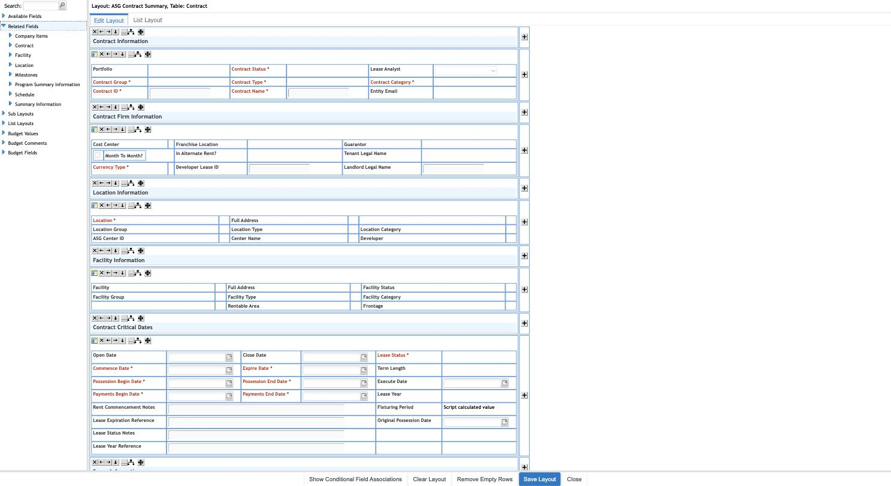
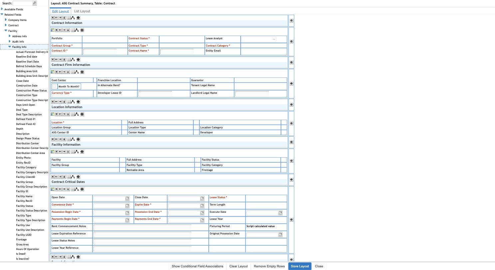
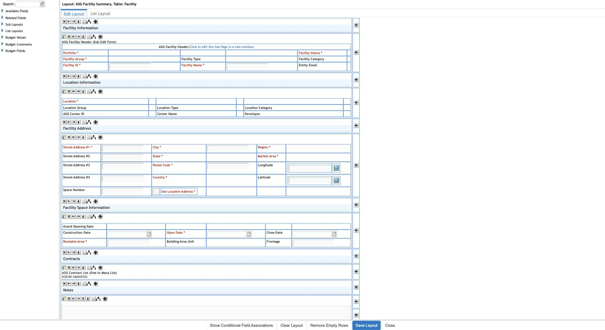
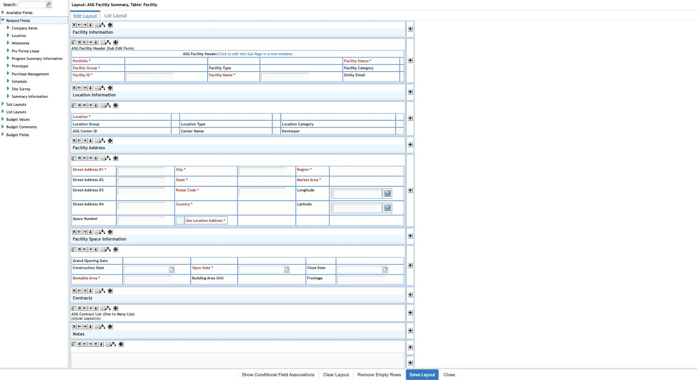
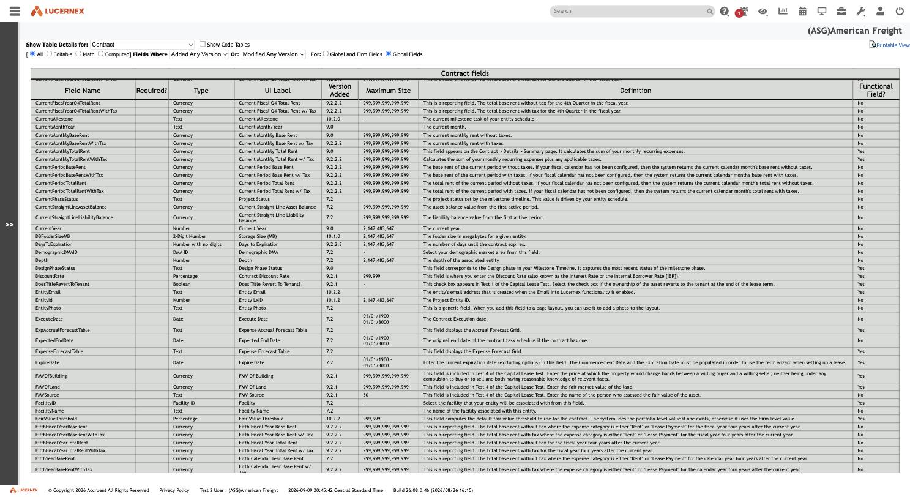
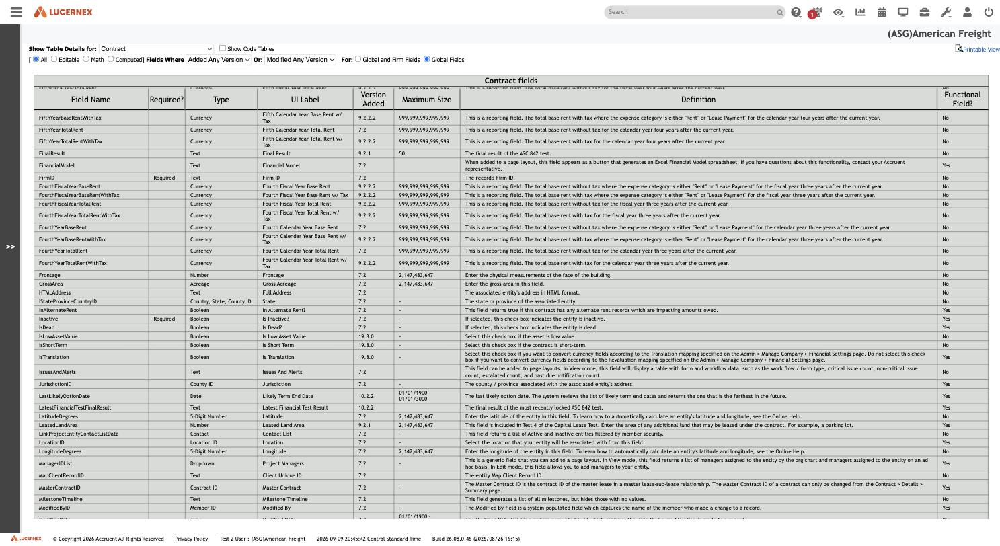
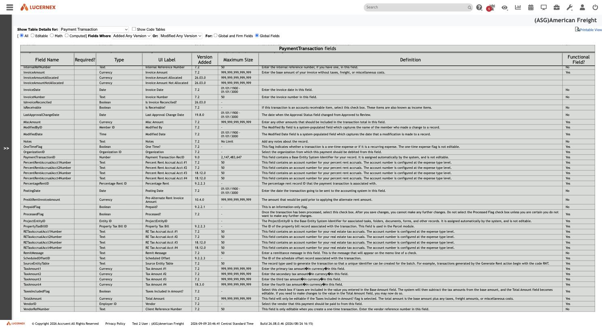
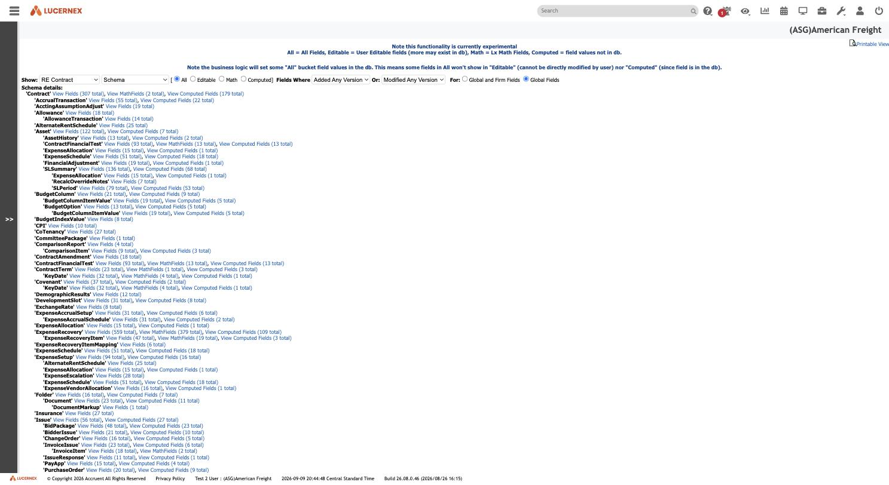

# 009 — Related Fields and the Underlying Data Model

## Identification

| Property | Value |
|---|---|
| Feature | The **Related Fields** palette inside the Page Layout builder, plus the **View Object Model** (`ShowObjectDetails.jsp`) and **View Data Model / Data Values (experimental)** (`walkHierarchy.jsp`) admin schema browsers |
| Base routes | `LayoutEditorAJAX.jsp?...&PageLayoutID={id}` (builder); `/en/admin/ShowObjectDetails.jsp` (Object Model); `/en/test/walkHierarchy.jsp` (Data Model, marked experimental) |
| Layouts used | ASG Contract Summary (`PageLayoutID=96289`, Primary Table `Contract`); ASG Facility Summary (`PageLayoutID=96291`, Primary Table `Facility`) — both reused from [008](008-manage-page-layouts.md) for continuity |
| Tenant | `(ASG)American Freight` |
| Captured | 2026-09-10, footer showed 2026-09-09 Central Standard Time |
| Application build | `26.08.0.46 (2026/08/26 16:15)` |
| Exploration mode | Read-only inspection. No `Save Layout`, `Update`, `Add`, `Delete`, or any field was placed, moved, or removed on any layout. The Object Model and Data Model tools are read-only report screens; the only interaction was changing the "Show Table Details for" filter dropdown, which re-renders the same report for a different table (a `GET`-equivalent, not a mutation). |

This document answers the question [008](008-manage-page-layouts.md) could only flag as unexplored: what exactly does the layout builder's **Related Fields** palette enumerate, and is it backed by a real foreign-key-driven relational model or something looser (e.g. a shared taxonomy with no real join).

**Short answer, stated up front:** it is a genuine, foreign-key-driven relational model. Contract carries literal FK columns — `FacilityID`, `LocationID`, `OrganizationID`, `MasterContractID` — each with a first-class schema **type** named after its target table (`Facility ID`, `Location ID`, `Organization ID`, `Contract ID`), directly visible in Lucernex's own schema-browser admin tools. See Interpretation for confidence levels on the parts that required more inference.

## Screenshots

### Related Fields — top-level list for Contract



### Related Fields → Facility → Facility Info — full field catalog pass-through



### Facility Summary layout — the reverse direction is a List Layout, not Related Fields



### Facility's own Related Fields list — no Contract entry



### View Object Model — Contract.FacilityID



### View Object Model — Contract.LocationID and Contract.MasterContractID



### View Object Model — PaymentTransaction.VendorID



### View Data Model (experimental) — RE Contract schema tree



## Entry path

1. Sign in to the authorized Lucernex training tenant.
2. Reuse [008](008-manage-page-layouts.md)'s layout builder route directly: navigate to
   `LayoutEditorAJAX.jsp?formSubmit=editBO&popupEdit=true&buildLayout=true&PageLayoutID=96289`
   (ASG Contract Summary) and expand **Related Fields** in the left sidebar.
3. For the bidirectionality check, do the same for **ASG Facility Summary**
   (`PageLayoutID=96291`, found via `Manage Summary Pages` → row for "ASG Facility Summary" →
   inspecting the `build layout` link's `onclick` for its `PageLayoutID`, exactly as [008](008-manage-page-layouts.md#technical-notes--popupopener-dependency-same-pattern-as-custom-lists)
   documents for the popup/opener limitation).
4. From the **System Administrator Dashboard** → **Data/PS Tools** column, follow **View Object
   Model** (`/en/admin/ShowObjectDetails.jsp`) and **View Data Model / Data Values (experimental)**
   (`/en/test/walkHierarchy.jsp`) — two admin-only schema browsers not previously explored.
5. On **View Object Model**, use the **"Show Table Details for"** dropdown (224 tables) to switch
   between `Contract`, `Payment Transaction`, and `Accrual Transaction`.

Only navigation, sidebar-tree expand/collapse, and dropdown-filter changes on read-only report
screens were performed.

## Visible layout and controls

**Related Fields** is a top-level, collapsible node in the Page Layout builder's left sidebar,
alongside **Available Fields**, **Sub Layouts**, **List Layouts**, **Budget Values**, **Budget
Comments**, **Budget Fields** (all documented structurally in [008](008-manage-page-layouts.md)).
Expanding it reveals a flat list of **other tables**, each independently expandable into the same
kind of group → subgroup → leaf-field tree that **Available Fields** uses for the layout's own
Primary Table.

**View Object Model** (`ShowObjectDetails.jsp`) is a plain schema-dump report: a "Show Table
Details for" dropdown listing all 224 tables in the system, filter radios (`All / Editable / Math /
Computed`, version-added/modified, Global vs. Firm), and a table with columns **Field Name**
(internal DB column), **Required?**, **Type**, **UI Label**, **Version Added**, **Maximum Size**,
**Definition**, **Functional Field?**.

**View Data Model / Data Values (experimental)** (`walkHierarchy.jsp`) is a different, complementary
report: a "Show" dropdown of **aggregate-root** entities (`Portfolio, Capital Program, Prototype,
Location, Parcel, Site, Opening Project, Facility, Capital Project, RE Contract, Equipment
Contract, Firm, Firm All Children, All Tables`) and a mode selector (`Schema`, `Schema With
Fields`, `All Values For`, `Non-Empty Values For`). Selecting `RE Contract` + `Schema` renders a
literal nested tree of **owned child business objects** rooted at `'Contract'`, each annotated with
its own field/computed-field counts — not a flat table list, but Lucernex's own declared
composition hierarchy.

## Data displayed — the Related Fields inventory for Contract

Expanding **Related Fields** on the ASG Contract Summary layout (Primary Table `Contract`) lists
exactly eight related tables:

`Company Items, Contract, Facility, Location, Milestones, Program Summary Information, Schedule,
Summary Information`

Each expands into subgroups, several of which visibly mirror the **same** subgroup names
documented for Facility/Location/Organization's own native catalogs:

| Related table | Subgroups seen | Leaf-field behavior |
|---|---|---|
| **Facility** | Address Info, Audit Info, Facility Info | Facility Info alone lists 40+ fields (`Facility ID, Facility Name, Facility Status, Facility Category, Frontage, Gross Area, ...`) — a **full pass-through** of Facility's own native field catalog, not a curated subset. |
| **Location** | Address Info, Audit Info, Location Info | Same 3-subgroup shape as Facility. Not fully re-expanded field-by-field, but the subgroup naming pattern matches. |
| **Company Items** | Organization, Summary | **Organization** lists a complete Organization-entity catalog (`Account Number #1–8, Organization Category, Organization Group, Organization Name, Organization RecID, Organization Type, Portfolio Access, ...`). **Summary** lists tenant/Firm-level configuration fields (`Facility Setup Page, Location Setup Page, JSON Configuration, Service Channel FirmID, ...`) — this is the singleton Firm/Company record, not a per-instance related record. |
| **Contract** (self) | Accounting Assumptions, Contract Term | **Much smaller** than Contract's own 16-subgroup Available Fields catalog: Accounting Assumptions → only `Contract Discount Rate`; Contract Term → only `Next Available Term, Next Available Term Key Date, Remaining Number of Term`. See Interpretation — this is fields pulled from a *linked* Contract record, not a full duplicate of Contract's own catalog. |
| **Milestones** | Milestone Tasks, Summary | Not fully expanded; consistent with a one-to-many child concept, distinct from the many-to-one lookups above. |
| **Program Summary Information** | Program Summary Information (single, same-named subgroup) | Not expanded further. |
| **Schedule** | Summary Information, Schedule Tasks | Not fully expanded. |
| **Summary Information** | Comparison Report, Contacts, Custom Lists, General Summary Information, Management, Membership, Summary Dates, Summary Page Buttons | Richest node; overlaps with the sibling top-level **Summary Information** group already visible directly under Contract's own **Available Fields** (per [008](008-manage-page-layouts.md#available-fields-sidebar--the-direct-link-to-data-fields-and-custom-lists)) — see Interpretation for the likely polymorphic-attachment reading. |

## The concrete foreign-key evidence

Two independent, corroborating pieces of direct evidence establish that these "related tables" are
real FK joins, not a shared-taxonomy illusion:

### 1. Placed-field HTML ids on the canvas

The Contract Summary layout already has Facility- and Location-sourced fields placed in its
"Location Information" and "Facility Information" sections. Inspecting the rendered DOM:

```
LocationID_label   (Location field's label element)
FacilityID_label   (Facility field's label element)
wdd_div_LocationID...   (widget wrapper div for the Location lookup control)
wdd_div_FacilityID...   (widget wrapper div for the Facility lookup control)
```

The underlying field names are literally `LocationID` and `FacilityID` — not "Location"/"Facility"
as cosmetic labels, but classic FK-style column names with an `...ID` suffix.

### 2. The View Object Model schema browser

Switching **View Object Model** to `Contract` (`sqlTableID=2792`) and reading its 307-field schema
directly confirms these as declared, typed columns:

| Field Name | Type | UI Label | Definition |
|---|---|---|---|
| `FacilityID` | **Facility ID** | Facility | "Select the facility that your entity will be associated with from this field." |
| `LocationID` | **Location ID** | Location | "Select the location that your entity will be associated with from this field." |
| `OrganizationID` | **Organization ID** | Organization | "Select the organization where payments should be debited from this field." |
| `MasterContractID` | **Contract ID** | Master Contract | "The Master Contract ID is the contract ID of the master lease in a master lease-sub-lease relationship..." — a **self-referencing** FK. |
| `NextAvailableTermID` | **Contract Term ID** | Next Available Term | FK to a `ContractTerm` child record — this is what backs Related Fields → Contract → Contract Term, clarifying that node is about *this contract's own* next-term lookup, not the master contract. |
| `ProgramID` | **Portfolio ID** | Portfolio | Internal column name (`ProgramID`) differs from both the UI Label ("Portfolio") and the display convention elsewhere ("Portfolio/Capital Program") — a naming-legacy mismatch, not a different relationship. |

Lucernex's schema **type system has first-class foreign-key types** — `Facility ID`, `Location
ID`, `Organization ID`, `Contract ID`, `Contract Term ID`, `Member ID`, `Portfolio ID`, `Employer
ID`, etc. — each one literally named after its target table. This is the strongest single piece of
evidence in this document: the relationship metadata is declared in the schema itself, not inferred
from naming conventions or UI grouping.

A third confirmation, one level down the graph: switching **View Object Model** to `Payment
Transaction` (`sqlTableID=2810`, the table behind ASG Contract Payments from [008](008-manage-page-layouts.md#a-list-type-record-can-carry-both-an-edit-layout-and-a-list-layout))
shows:

| Field Name | Type | UI Label | Definition |
|---|---|---|---|
| `ContractID` | **Contract ID** | ContractID | The reverse FK — child row pointing back to its parent Contract. |
| `VendorID` | **Employer ID** | Vendor | "Select the vendor that this payment should be paid to from this field." |

`VendorID`'s declared type is **Employer ID**, not a separate "Vendor" type — direct schema proof
that Lucernex's "Vendor" is a relabeled **Employer** record, not a distinct entity. This resolves
the user's original "Vendor" example concretely: Contract itself has no direct Vendor/Employer FK;
the FK lives one level down, on the child `PaymentTransaction` table.

### 3. A fourth, independent corroboration: the per-table Data Fields catalogs

A parallel exploration pass (running concurrently in this session) produced per-table field-catalog
documents under [`docs/data-fields/`](../data-fields/) — built from the **Manage Data Fields**
catalog ([005](005-manage-data-fields.md)) rather than View Object Model, and using Lucernex's
internal `sTYPE_*` type codes rather than the human-readable "Type" column. Cross-checking against
that independently-built source lines up exactly:
[`docs/data-fields/contract.md`](../data-fields/contract.md) lists `FacilityID` as `sTYPE_FACILITY`,
`LocationID` as `sTYPE_LOCATION`, `OrganizationID` as `sTYPE_ORGANIZATION`, and `MasterContractID`
as `sTYPE_CONTRACT` — the same four FK columns, named with the same target-table convention, from
a completely different admin screen. One instructive wrinkle:
[`docs/data-fields/payment-transaction.md`](../data-fields/payment-transaction.md) types `VendorID`
as `sTYPE_VENDOR`, not `sTYPE_EMPLOYER` — apparently a distinct field-level type code (likely
driving a Vendor-filtered lookup popup) that nonetheless resolves to the same underlying `Employer`
table, per View Object Model's "Employer ID" Type column above. The two tools describe the same
join from two different altitudes: `sTYPE_VENDOR` is the field's presentation-layer type; `Employer
ID` is what it actually joins to.

### 4. The Data Model (experimental) aggregate hierarchy

`walkHierarchy.jsp`'s `RE Contract` → `Schema` view renders roughly 70 tables nested **under**
`'Contract'` as owned children — `PaymentTransaction, PaymentReceipt, Covenant, ContractTerm →
KeyDate, ContractAmendment, Sales, SecurityDeposit, Space, Responsibility, WorkFlow, ...` — each
with its own field count. Critically, **`Facility`, `Location`, and `Organization` do not appear
anywhere in this nested tree.** They instead appear as separate, independent root entries in the
tool's own top-level "Show" dropdown (`Portfolio, Capital Program, Prototype, Location, Parcel,
Site, Opening Project, Facility, Capital Project, RE Contract, Equipment Contract, Firm, ...`).

This is a second, structurally independent confirmation of the same distinction the FK columns
show: Lucernex's data model has **owned one-to-many children** (nested in this hierarchy, exposed
in Page Layouts via **List Layouts**) and **referenced many-to-one lookups** (separate aggregate
roots, exposed in Page Layouts via **Related Fields**). The two admin tools and the Page Layout
builder all draw the same line, independently.

## Are Related Fields a full catalog or a curated subset?

Mixed, and the mix itself is informative:

- **Facility, Location, Organization** (true many-to-one FK targets): Related Fields exposes what
  appears to be each target's **complete native field catalog**, subdivided into the same kind of
  Address Info/Audit Info/`<Table> Info` subgroups the target's own Available Fields tree would
  use. This is a straight pass-through/join, not a curated slice.
- **Contract (self, via `MasterContractID`)**: Related Fields exposes only **4 fields total**
  across 2 subgroups — a small, apparently purpose-built rollup (discount rate, next-term
  information) rather than Contract's full 307-field catalog. Reasonable reading: pulling an
  entire second contract's worth of fields onto a layout would be unwieldy and mostly meaningless
  for a master-lease relationship, so this node is deliberately narrower. This is inference, not
  directly observed (no admin screen was found that defines *which* fields qualify for this
  narrower list).
- **Summary Information**: appears identically-named both directly under Contract's own Available
  Fields (per [008](008-manage-page-layouts.md)) and again under Related Fields, with overlapping
  subgroups (`Contacts, Custom Lists, Membership, ...`). The likely explanation is that "Summary
  Information" is a generic, polymorphic extension record attached to *any* entity type (Contract,
  Facility, Portfolio, ...) rather than a single dedicated FK target — but this is **interpretation,
  not confirmed** by any schema screen inspected in this pass.

## User interactions and observed behavior

- Expanding/collapsing Related Fields tree nodes is a pure client-side tree operation (matches the
  pre-rendered-DOM pattern already documented for Manage Data Fields in [005](005-manage-data-fields.md#main-content)).
- Switching **View Object Model**'s "Show Table Details for" dropdown re-renders the whole report
  for the newly selected `sqlTableID` via a `change` handler — confirmed a plain client-side
  filter/reload, not a mutating POST (the resulting URL carries `sqlTableID`, `limitFieldFilter`,
  `showVersion`, `modifiedVersion`, `showGlobal` as GET parameters).
- Attempting to inspect a **placed** related field's own properties dialog (to determine
  read-only-display vs. live-lookup rendering, per the original task's item 5) was **not
  achievable** in this pass: as in [008](008-manage-page-layouts.md#technical-notes--popupopener-dependency-same-pattern-as-custom-lists),
  the layout builder was reached by direct navigation rather than through the true `lxPopup2`
  popup flow, and the field-properties click targets that depend on that opener-side JavaScript
  state did not respond. The `wdd_div_FacilityID.../wdd_div_LocationID...` wrapper divs (empty
  placeholder containers, not simple text inputs) are consistent with these being complex
  lookup-type widgets rather than plain text fields, but this falls short of directly observing
  the live-lookup vs. snapshot behavior.

## Network requests or implementation clues

- `ShowObjectDetails.jsp?sqlTableID={id}&limitFieldFilter=All&showVersion=&modifiedVersion=&showGlobal=true`
  — table-scoped schema dump, `sqlTableID` values collected in this pass: Contract = `2792`,
  Facility = `2530`, Location = `2804`, Employer = `2529`, Payment Transaction = `2810`, Complex =
  `2791`. 224 tables exist in total.
- `walkHierarchy.jsp` takes no table-id parameter in this capture; its "Show" dropdown appears to
  select by a fixed set of named aggregate roots rather than an arbitrary table id.
- Both admin tools are explicitly labelled experimental/internal-feeling (`walkHierarchy.jsp`
  carries a visible "Note this functionality is currently experimental" banner) — these read as
  developer/support diagnostic tools exposed to System Administrators, not designed end-user
  documentation.

## Permissions/tenant implications

- Both schema browsers were reachable from the same System Administrator Dashboard → **Data/PS
  Tools** column already inventoried (but not opened) in [008](008-manage-page-layouts.md)'s
  sibling document context; no additional permission prompt or role check was visibly enforced
  beyond already being in the System Administrator Dashboard.
- The schema dump is **platform-wide** (`Global Fields` radio, 307 Contract fields, 224 tables) —
  this is Lucernex's built-in object model, not tenant-specific configuration. It answers "what can
  a layout possibly relate to," not "what has this tenant chosen to customize" (that remains the
  Firm-scope Data Fields catalog documented in [005](005-manage-data-fields.md)).

## Mutation-risk register

| Control/action | Potential effect | Exploration decision |
|---|---|---|
| Related Fields tree expand/collapse | None (client-side only) | Performed freely |
| View Object Model "Show Table Details for" dropdown | Re-renders report for a different table (GET) | Performed freely |
| View Data Model "Show" / mode dropdowns | Re-renders report (GET) | Only the default `RE Contract` + `Schema` view was captured; other roots/modes (`Schema With Fields`, `All Values For`, `Non-Empty Values For`) were **not** exercised — `All Values For`/`Non-Empty Values For` sound read-only but were not tested to confirm they do not trigger a heavier live-data query |
| Layout builder field-properties dialogs | Unknown — blocked by opener-dependency, never actually opened | Not activated |
| Save Layout / Clear Layout / Add / Delete (any layout) | Persists or removes layout changes | Not activated |

No Lucernex page layout, field placement, or schema definition was created, edited, or deleted.

## Interpretation

### High-confidence conclusions

1. **The Related Fields mechanism is backed by a genuine, foreign-key-driven relational data
   model**, not a shared-label illusion. Contract's own schema (via View Object Model) declares
   `FacilityID` (type `Facility ID`), `LocationID` (type `Location ID`), `OrganizationID` (type
   `Organization ID`), and `MasterContractID` (type `Contract ID`, self-referencing) as literal
   typed columns. The Related Fields sidebar's `Facility`/`Location`/`Contract` nodes correspond
   exactly to these columns.
2. **Lucernex's field-type system has first-class FK types** named after their target table
   (`<Entity> ID`) — this is declared schema metadata, directly visible to an administrator, not
   something this exploration had to infer from naming conventions alone.
3. **The relationship is directional/asymmetric by cardinality, and the UI reflects this
   correctly.** From Contract (the "many" side of a one-to-many with Facility), Facility is reached
   as a single related record via **Related Fields**. From Facility (the "one" side), Contract is
   **not** offered as a Related Fields target at all — instead it is composed as an embedded child
   grid explicitly labelled **"ASG Contract List (One to Many List)"** inside a List Layout
   sub-page. Two structurally independent tools (the Page Layout builder's own sidebar contents,
   and `walkHierarchy.jsp`'s aggregate-hierarchy tree, which nests Contract's one-to-many children
   but never Facility/Location) agree on this same distinction.
4. **"Vendor" is a relabeled Employer**, confirmed at the schema level: `PaymentTransaction.VendorID`
   has declared type `Employer ID`. Contract has no direct Vendor/Employer FK; that relationship
   exists one level down, on the child Payment Transaction table.
5. **Related Fields exposes each target table's full native catalog for true many-to-one lookups**
   (Facility, Location, Organization all show extensive, `<Table> Info`/`Address Info`/`Audit
   Info`-style subgroup catalogs matching each table's own field set) — this is a real join
   surfacing real columns, not a curated summary view.

### Moderate-confidence / inferred

1. The much smaller **Related Fields → Contract** (self) node (4 fields under Accounting
   Assumptions/Contract Term) is most likely a deliberately narrow rollup specific to the
   master-lease relationship, not evidence that self-references behave differently at the schema
   level — `MasterContractID`'s schema type is `Contract ID` just like any other FK, so the
   narrowing is a Page-Layout-builder UI/business decision, not a data-model limitation.
2. **Summary Information** appearing both directly under Available Fields and again under Related
   Fields, with overlapping subgroups (Contacts, Custom Lists, Membership), is consistent with it
   being a generic, polymorphic per-entity extension record (attachable to Contract, Facility,
   Portfolio, etc. alike) rather than a single dedicated FK target — but no schema screen in this
   pass named the actual join column for this specific case, so this remains an inference.
3. The `wdd_div_...` wrapper-div pattern around placed reference fields is consistent with a
   dynamic lookup/autocomplete widget (vs. a plain text input), supporting a "live reference"
   reading over a "static snapshot" reading for how a related field renders once placed — but this
   was not directly confirmed by opening the field's own properties dialog, which remained blocked
   by the same popup/opener dependency noted in [008](008-manage-page-layouts.md).

### Requires further exploration

1. What exactly determines the curated 4-field subset under Related Fields → Contract (self)? Is
   this configurable per-tenant, or a fixed platform decision?
2. Which column(s) back the **Summary Information**, **Milestones**, **Program Summary
   Information**, and **Schedule** Related Fields nodes specifically — are they all one-to-many
   children (like Milestones' own "Milestone Tasks" subgroup suggests) reached through a different
   mechanism than the Facility/Location/Organization many-to-one lookups, or a mix?
3. Opening a **placed** related field's own field-properties dialog (blocked by the same
   popup/opener limitation as [008](008-manage-page-layouts.md) and [006](006-manage-custom-lists.md))
   would directly settle the live-lookup-vs-snapshot question for item 5 of the original task.
4. `walkHierarchy.jsp`'s `Schema With Fields`, `All Values For`, and `Non-Empty Values For` modes
   were not exercised — `Schema With Fields` in particular would likely show the actual FK column
   name annotated directly onto each nested child in the hierarchy tree, which would be a stronger,
   single-screen confirmation of the whole relational picture documented here.
