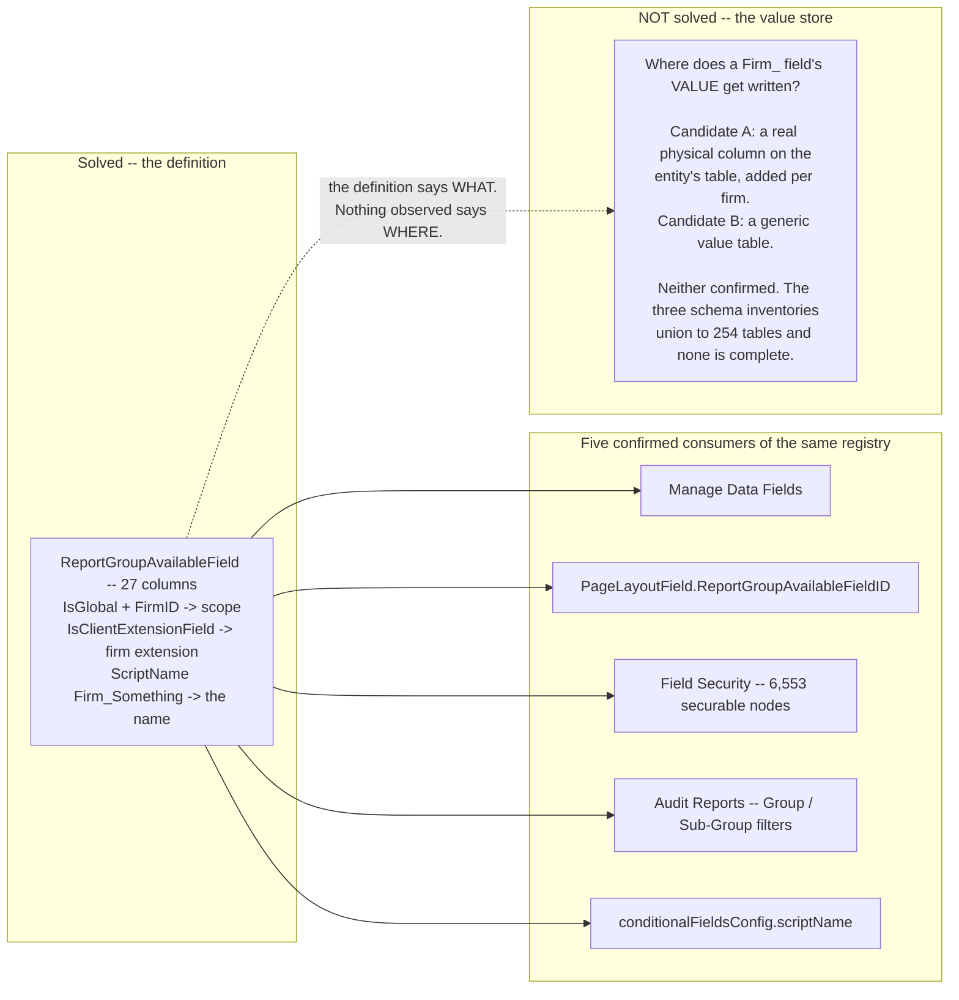

# Data Fields — the field catalog, and where firm custom fields actually live

**Stated up front.** Manage Data Fields is the catalog every other configuration surface draws from:
**6,158 leaves across 214 entities**, each with a label, an internal name, one of 448 field-type
codes, a scope, and a `Required` flag. The Available Fields palette in the layout editor *is* this
tree, which makes the catalog the single upstream source for page composition.

Two findings matter more than the catalogue itself.

**First: firm custom fields are ordinary physical columns, named `Firm_<Name>`, on the base table
itself.** The 223-object census carries **359 `Firm_`-prefixed columns across 20 objects**, and
**258 of them are on `Contract` alone** — 258 of that table's 570 columns. There is no EAV table, no
JSON bag and no side store: a firm extension is a real, typed column next to the platform's own.

> **This corrects an earlier reading in this document.** A first pass concluded "0 of 205 firm fields
> exist as a physical column", from a join against
> [`../../tenants/bbw-platform-tables.json`](../../tenants/bbw-platform-tables.json). That sweep was
> run with `showGlobal=true`, which selects the viewer's **Global Fields** radio rather than *Global
> and Firm Fields* — so it captured the global layer only, and firm columns were absent by
> construction. The caveat is recorded in that file as `_CAVEAT_GLOBAL_FIELDS_ONLY` (severity HIGH).
> The census, which is not filtered, settles it. The retracted claim is left visible below rather
> than deleted.

**Second: `ReadOnly` is `No` for all 6,158 leaves.** The catalog never marks a field read-only. Taken
with the finding that the catalog's `Required` flag is simply the physical column's flag
([`../required-and-validation/`](../required-and-validation/)), the catalog describes **what a field
is** and never **how it behaves**. Behaviour is entirely the layout's business.

| | |
|---|---:|
| Catalog leaves | **6,158** |
| Entities | **214** |
| Scope `Global` | 5,953 |
| **Scope `Firm`** | **205** |
| Entities carrying firm fields | **15** |
| **`Firm_` columns in the census** | **359** across 20 objects |
| — of which on `Contract` | **258** of its 570 columns |
| Leaves marked `Required` | 637 |
| Leaves marked `ReadOnly` | **0** |
| Distinct field-type codes | 448 (`sTYPE_*`), over a canonical 10-value GraphQL `FieldType` enum |

Sources: [`../../data-fields/all-fields.csv`](../../data-fields/all-fields.csv) and the 131
per-entity files under [`../../data-fields/`](../../data-fields/INDEX.md), joined against
[`../../tenants/bbw-platform-tables.json`](../../tenants/bbw-platform-tables.json). The screen itself
is [`../../admin/005-manage-data-fields.md`](../../admin/005-manage-data-fields.md); the type
vocabulary is [`../../data-model/type-system.md`](../../data-model/type-system.md) and
[`../../data-model/graphql-api.md`](../../data-model/graphql-api.md). **Observed** unless labelled;
joins are **Derived**.

---

## Firm custom fields: 205 leaves, 0 columns

**Observed.** Every Firm-scope leaf carries a `Firm_` internal-name prefix, and they concentrate
hard:

| Entity | Firm fields |
|---|---:|
| `Contract` | **147** |
| `KeyDate` | 10 |
| `ExpenseRecovery` | 9 |
| `Covenant` | 7 |
| `Employer`, `Location`, `ProjectEntity` | 5 each |
| `Allowance` | 4 |
| `ContractTerm`, `PercentageRent` | 3 each |
| `ContractAmendment`, `ExpenseSetup` | 2 each |
| `SecurityDeposit`, `Facility`, `Firm` | 1 each |

**Derived.** 147 of 205 — **72%** — are on `Contract`, and the great majority of those are a single
subject: CAM. `Firm_CAMAdministrativeYN`, `Firm_CAMAuditRightsYN`, `Firm_CAMExclusionsYN`,
`Firm_CAMFixedIncreasePercent`, `Firm_CAMLeaseTermCapPercent` and dozens more form a
lease-abstraction surface for common-area-maintenance clauses that the base product does not model.
**ASG's customisation of Lucernex is, numerically, almost entirely a CAM clause abstraction.**

**Observed.** Their types are not generic text dumps:

| Type | Count | Note |
|---|---:|---|
| `sTYPE_TEXT` | 83 | |
| **`sTYPE_CUSTOM_CODE_FIELD`** | **54** | A firm field bound to a firm-defined code table |
| `sTYPE_DATE` | 12 | |
| `sTYPE_NUMBER` | 12 | |
| `sTYPE_PERCENTAGE` | 9 | |
| `sTYPE_TEXTAREA` | 8 | |
| `sTYPE_MONEY` | 8 | |
| `sTYPE_CLIENT_LISTS` | 6 | Bound to a Custom List |
| `sTYPE_MONEY_MATH_OPERATION` | 4 | A computed money expression |
| `sTYPE_FIRM_LOGO` | 3 | |

**Derived.** A custom field is fully typed — it can be money, a percentage, a date, a computed
expression, a binding to a custom code table, or a binding to a Custom List. This is **not** a
generic "extra attributes" bag. Any rebuild that models firm extensions as untyped key/value pairs
is strictly less capable than what ASG already uses.

### The definition is solved; the value store is not

**Definitions — solved, and already documented.** A firm field is a **row in
`ReportGroupAvailableField` (RGAF)**, the one shared field registry
([`../../modules/reporting/report-field-registry.md`](../../modules/reporting/report-field-registry.md),
[`../../modules/platform-tenancy/udf-registry.md`](../../modules/platform-tenancy/udf-registry.md)).
Its 27 columns carry exactly the surface Manage Data Fields renders, which settles where every
column of that screen comes from:

| Manage Data Fields column | RGAF column |
|---|---|
| Label | `UILabel` / `DefaultLabel` |
| Internal name | `ScriptName` / `AccessorName` |
| Entity | `TableName` / `ApiTableName` / `CodeSQLTableID` |
| Field type | `FormFieldType`, `DropdownTableName` |
| **Scope (Global / Firm)** | **`IsGlobal`** + **`FirmID`** |
| **Required** | **`IsRequired`** |
| **ReadOnly** | **`IsReadOnly`** |
| Default | `DefaultValue` |
| *(schema viewer)* Maximum Size | `MaxLength` |
| *(schema viewer)* Version Added | `VersionAdded`, `VersionModified` |

**Derived, and it is the consequence that matters.** If a `Firm_` field is a **real column**, then
adding a custom field is a **DDL operation on a tenant's table** — which forces database-per-tenant,
or at least schema-per-tenant, and makes the Hub/Spoke decision for you. If it is a generic value
table, it does not. **The two answers have opposite architectural consequences**, which is why this
is recorded as the open question it is rather than assumed either way.

| *(schema viewer)* Functional Field? | **`IsFunctional`** |
| The group tree | `ReportGroupDataID`, `ParentReportGroupDataID`, `HierarchyName` |

**Observed, and new here.** RGAF also carries **`IsClientExtensionField (Boolean)`** — a flag
distinct from `IsGlobal`. **Inferred:** `IsGlobal=false` marks *scope* (this row belongs to one
firm) while `IsClientExtensionField=true` marks *provenance* (this row is a customer extension
rather than a platform field). The two need not coincide, and the distinction matters directly for
Hub→Spoke publishing. Unverified — `all-fields.csv` exposes `Scope` but not the extension flag.

**Independently confirmed by a second capture.** The BBW schema sweep was re-run with
`showGlobal=false` — the viewer's *Global **and** Firm Fields* radio — and the firm layer appears
exactly where this section predicted:

| | Global-only sweep | Re-swept (global + firm) |
|---|---:|---:|
| Fields captured | 6,487 | **6,785** |
| Of which firm-scope | 0 | **298** — **296 carry the `Firm_` prefix** |
| `Contract` columns | 307 | **477** |
| **Firm-scope fields marked `Required`** | — | **0** |

**Derived.** Two controls make this clean. The global subset reproduced at *exactly* 6,487, so
nothing drifted between runs. And **zero firm fields are `Required`** — predicted in advance from
`all-fields.csv`, where none of the 205 firm-scope leaves is `Required=Yes`, then confirmed by the
independent capture. That also settles a worry raised against the required-ness analysis: the missing
firm fields could never have changed it, because none of them is required
([`../required-and-validation/`](../required-and-validation/)).

**Note the two counts are not the same number and should not be conflated.** The census records
**359** `Firm_` columns across 20 objects (258 on `Contract`); the BBW re-sweep records **296** across
its 202 readable tables (170 on `Contract`). Different vintages and different table sets — the census
is the older offline dump, the sweep is BBW today and covers only tables the viewer will expose.
Both establish the same structural fact; neither is the authoritative count.

**Values — answered: they are columns.** The census is unambiguous:

| Object | `Firm_` columns | of total |
|---|---:|---:|
| `Contract` | **258** | 570 |
| `Location` | 10 | 141 |
| `Facility` | 8 | 133 |
| `Covenant`, `KeyDate` | 7 each | 44, 39 |
| `AllowanceTransaction`, `BudgetOptionTemplate`, `Parcel`, `PotentialProject`, `Program`, `Project`, `ProjectEntity`, `Prototype` | 6 each | |
| `Allowance`, `Employer` | 5 each | |
| `ContractTerm`, `PercentageRent` | 3 each | |
| `ContractAmendment`, `ExpenseSetup` | 2 each | |
| `Firm` | 1 | 18 |

**Observed.** Their declared types are real types, not text: 188 `Text`, **77 `Dropdown (Custom
Field)`**, 28 `Date`, 22 `Percentage`, 19 `Currency`, 14 `Number`, 7 `Custom List`, 2 `Boolean`. The
77 `Dropdown (Custom Field)` columns are the physical counterpart of the 54 catalog leaves typed
`sTYPE_CUSTOM_CODE_FIELD`, bound to `CustomCodeField` values
([dependent drop-downs](../drop-downs-code-tables/#dependent-drop-downs--an-unnoticed-feature)).

**Derived.** So the model is: **definition in RGAF, data in a `Firm_`-prefixed column on the base
table.** Adding a firm field is a **schema change** — a DDL operation against the tenant's table —
which explains two things at once: why Manage Data Fields is read-only to a firm in both tenants,
and why the base tables are so wide (`Contract` at 570 columns, 45% of them firm extensions).

**Derived, and it is the most important consequence for the rebuild.** A per-firm column on a shared
table only works if every tenant has its own copy of the table — which is **database-per-tenant**.
Lucernex's firm-field mechanism is therefore direct evidence for ADR-004's database-per-tenant
choice and against the shared-platform-database reading of the conflicting ADR-004 in
`ASG-Edgeplus-Configuration-Service`. It cannot be built on a shared schema with row-level
isolation.

**More columns than leaves.** `Contract` has 258 `Firm_` columns but only **147** `Firm`-scope
catalog leaves; `Facility` has 8 columns and 1 leaf; `Parcel`, `Program`, `Project`, `Prototype`,
`PotentialProject`, `AllowanceTransaction` and `BudgetOptionTemplate` have firm columns and **zero**
leaves. **Derived:** firm columns can exist in the schema without being exposed in the catalog —
provisioned but not published. Conversely `ExpenseRecovery` has 9 leaves and no `Firm_` columns, and
`SecurityDeposit` has 1 leaf and none, so the mapping is not one-to-one in either direction. Note
the two sources are different vintages and possibly different tenants, which may account for some of
the gap.

~~**Values — still unknown.** Joined leaf-by-leaf against the physical schema: 0 of 205 Firm-scope
leaves match a physical column; 0 of `Contract`'s 307 columns start `Firm_`.~~ **Retracted** — the
sweep behind those numbers was global-fields-only. See the note at the top.

**Why this matters more than it looks.** Firm custom fields are the Global/Firm reconciliation the
ASG workspace `CLAUDE.md` records as still needing Paul's sign-off. The **definition** side now has a
clear answer to copy — one registry table, `IsGlobal` + `FirmID` + `IsClientExtensionField`. The
**value** side does not, and it decides what "the Spoke forked the field" means physically.

---

## Global versus Firm

**Observed.** 5,953 `Global` and 205 `Firm`. 199 of 214 entities have no firm fields at all.

> **Global and Firm are two tabs, not a radio.** The radio that has burned this corpus is a different
> screen — `ShowObjectDetails.jsp`'s `Global Fields` selector, whose `showGlobal=true` default
> excluded every firm column from a sweep and produced a confident, complete-looking result over the
> wrong population ([`../../CONVENTIONS.md`](../../CONVENTIONS.md)). The two are easy to conflate
> because they carry the same words. Any count must state which control on which screen it came from.

> **Discrepancy, recorded rather than resolved.** This document and
> [`../../admin/005-manage-data-fields.md`](../../admin/005-manage-data-fields.md) describe
> Manage Data Fields as **read-only in both tenants**, and the Hub/Spoke argument below leans on it.
> The screen above does not obviously agree: its instruction block reads *"Use add/edit/delete links
> to change an individual Field or Group"* and *"For bulk changes export these fields into a
> spreadsheet and make changes to it and import that spreadsheet"*, and it carries **`Add Group`**,
> **`Export Data Fields`** and **`Import Data Fields`** buttons. No `add`/`edit`/`delete` link is
> visible on any row — but every group is **collapsed**, and the links may live on the expanded field
> rows. **Unresolved.** The two readings differ on whether a firm can change a field *definition*,
> which is load-bearing for the Hub/Spoke design, so it should be settled by expanding one group
> rather than argued from either screenshot.

**Capture note.** Both images are `(ASG)American Freight` on build **`26.08.0.39`**, captured
2026-09-01 — an older build than the `26.09.0.113` most of this corpus was read on.

**Derived.** The Global catalog is platform-wide and identical across tenants — consistent with
navigation (109/109 identical), code tables (207/207 identical) and sql tables (227/227 identical).
The firm layer is thin, entity-concentrated, and the only part that is genuinely tenant-shaped.

**Derived, for Hub/Spoke.** The split lands exactly on the Hub/Spoke line: **Global fields are Hub,
Firm fields are Spoke.** Lucernex did not have to invent a reconciliation between them because a
firm cannot edit a Global field's definition — Manage Data Fields is read-only in both tenants
([`../../admin/005-manage-data-fields.md`](../../admin/005-manage-data-fields.md)). ASG Edge+'s
proposed publish/accept/fork mechanism is therefore **more permissive than Lucernex**, and the
"never more than one version behind" rule has no Lucernex precedent to copy. See
[`../../assets/data-fields-global-vs-firm-comparison.md`](../../assets/data-fields-global-vs-firm-comparison.md).

---

## Required and ReadOnly

**Observed.** 637 of 6,158 leaves are `Required`; **0 of 6,158 are `ReadOnly`**.

**Derived.** The `Required` flag is the physical column's flag surfaced — 5,452 of 5,496 jointly
observable fields agree, and all 44 disagreements are owner foreign keys. Full analysis in
[`../required-and-validation/`](../required-and-validation/). The `ReadOnly` column, being uniformly
`No`, carries no information at all in this tenant: it is a catalog slot the product never fills.

**Derived.** Two flags, one of which is a duplicate of the schema and the other of which is always
empty, mean the catalog contributes **no behaviour** of its own. Everything a user experiences as
"this field is mandatory" or "this field is locked" is decided downstream, in the layout.

---

## The catalog is not the whole schema

**Observed.** Three inventories of the same product disagree, in both directions:

| | Count | |
|---|---:|---|
| 223-object census (`_lucernex_objects_summary.txt`) | 223 objects, 7,421 fields | The offline schema dump |
| Sql-table picker (`ShowObjectDetails.jsp`) | 227 tables, 6,487 fields harvested from 202 | The live platform viewer |
| Manage Data Fields | 214 entities, 6,158 leaves | The configuration catalog |

**Method note, because this join has a known trap.** The reconciliation below joins on **physical /
object name**, not on UI label. A label-based join manufactures phantom gaps: `bbw-tracker` found
**12** apparent absences from `object-catalog.md` that were nothing of the kind — the UI simply
renames the object. Ten of the twelve are `Virtual*` computed views presented under a business name:

| UI label | Physical |
|---|---|
| General Entity Info | `ProjectEntity` |
| Development Target | `DevelopmentSlot` |
| Sales Period | `VirtualSalesPeriod` |
| Usage Period | `VirtualUsagePeriod` |
| Percentage Rent Period | `VirtualPercentageRentPeriod` |
| Percentage Rent Accrual Period | `VirtualPRAccrualPeriod` |
| Percentage Rent Summary Period | `VirtualPRPAggregate` |
| Use Based Rent Period | `VirtualUseBasedRentPeriod` |
| Use Based Rent Summary Period | `VirtualUBRPAggregate` |
| Expense Forecast Period | `VirtualExpenseForecastPeriod` |
| Exp Accrual Forecast Period | `VirtualExpAccrualForecastPeriod` |
| Schedule Template | `VirtualTemplateSchedule` |

**Derived.** **The UI systematically renames computed views**, so any label-based join against this
product will invent gaps that do not exist. `ProjectEntity` appearing as *"General Entity Info"* is
the one that matters most, since it is the universal entity supertype.

**Derived.** **31 picker tables are absent from the census**, and the composition matters more than
the count — this is a story about **a viewer that refuses certain tables**, not a census that missed
things:

| Group | Count | |
|---|---:|---|
| **Refused by `ShowObjectDetails.jsp`** | **25** | Absent from the catalogue *by construction*, since the catalogue derives from that viewer. **All 25 are recoverable over REST** (`/rest/businessObject/{type}/lxid/{id}?deep=true`) — that is how the `Page Layout` trio was obtained |
| **`Punch List` family** | 4 | `PunchList`, `PunchListAssignee`, `PunchListTask`, `PunchListTaskAssignee` — **out of scope**, see below |
| **Genuine in-scope omissions** | **2** | `ChangeManage` (1 field), `VirtualTemplateMember` (1 field) |

**Derived, and it is a better headline than the raw number.** Of 227 tables, the genuine in-scope
catalogue gap is **two single-field tables**. The business-object census is **essentially complete
for in-scope work**.

**`Punch List` is out of scope.** A search of all 38 approved BRDs returns **zero** files for
`punch` / `punch list`, `snag`, `defect list` or `site survey`, verified against a control term. More
decisively, two BRDs describe the existing ASG Edge system — *"the deal-making and **construction
management** platform"* — as a **separate product** that ASG Edge+ integrates with and migrates away
from. Punch List is snagging, i.e. construction management, so the BRDs actively place it in another
system rather than merely omitting it. Treat it as the 27 budgeting/bid/cost-tracking objects are
treated in [`../../data-model/object-catalog.md`](../../data-model/object-catalog.md): census and
FK-graph completeness only, one-line purpose, no analysis. All four tables are fully captured in
[`bbw-platform-tables.json`](../../tenants/bbw-platform-tables.json) (33 fields between them).

And **27 census objects never appear in the picker**:

| Group | Objects |
|---|---|
| **Code tables** | `CodeASC842Schedule`, `CodeAssetCategory`, `CodeBudgetColumnStatus`, `CodeExpenseType`, `CodeIFRS16Schedule`, `CodeIssueType`, `CodeProblem`, `CodeResponsibleParty`, `CodeSLSchedule`, `CodeSalesGroup`, `CodeSalesType` |
| **Template families** | `BudgetTemplate`, `BudgetTemplateAudit`, `BudgetOptionTemplate`, `BudgetLineGroup`, `BudgetLineLeaf`, `BidPackageBreakout`, `FolderTemplate`, `FolderTemplateAudit`, `FolderSecurity`, `TaskTemplate`, `TaskTemplateAudit`, `TaskGroup`, `TaskItem` |
| **Security** | `Security` |
| **Import staging** | **`PaymentTransactionFullImport`**, **`WFStepFullImport`** |

**Derived.** The `Code*` absences are expected — those are edited through `FirmCodeEdit.jsp`, not the
sql viewer. The two **`*FullImport`** tables are the interesting ones: dedicated staging tables for
payment transactions and workflow steps, a direct lead for import/export.

**Derived, stated plainly.** **No single inventory is complete.** The union is **254** distinct
tables — joined on physical name, so this is not the label trap described above. Any parity
comparison run against one inventory alone will report false gaps.

---

## What this means for ASG Edge+

| Finding | Consequence |
|---|---|
| Firm fields are `Firm_`-prefixed physical columns — 359 of them, 258 on `Contract` | Adding a firm field is a **DDL change**. This is direct evidence for **database-per-tenant** and against a shared schema |
| Firm columns are fully typed — money, percentage, date, custom drop-down, custom list | Do not model firm extensions as untyped key/value |
| 147 of 205 are CAM clauses on `Contract` | ASG's real customisation need is CAM abstraction. Consider making it first-class rather than a custom-field surface |
| Manage Data Fields is read-only to a firm | Global = Hub, Firm = Spoke, with no reconciliation needed because no fork is possible. ASG Edge+'s fork model is **more permissive** and has no precedent here |
| `ReadOnly` empty, `Required` a duplicate of the schema | The catalog carries no behaviour. Put behaviour on the placement, not the field |
| Three inventories, none complete, union **254** (joined on physical name) | Reconcile all three before declaring parity — and **never join on UI label**, which invents 12 phantom gaps |
| `PaymentTransactionFullImport` / `WFStepFullImport` | Expect a staging-then-promote import pipeline |

---

## Open questions

1. ~~**Where are firm custom field values stored?**~~ **Answered: `Firm_`-prefixed columns on the
   base table.** The follow-on question is **who runs the DDL** — whether a firm can provision a new
   firm column self-service, or whether Accruent does it on request. Manage Data Fields is read-only
   in both tenants, which points to the latter. If it is a service rather than a feature, the rebuild
   requirement changes completely.
2. **Re-run the schema sweep with firm fields included.** `bbw-platform-tables.json` was captured with
   `showGlobal=true` and is the **global layer only** — its own `_CAVEAT_GLOBAL_FIELDS_ONLY` records
   this at severity HIGH. Every field count derived from it is a lower bound (`Contract` 307 there
   versus 570 in the census). Re-running with `showGlobal=false` would give the first complete
   per-tenant field census and let the BBW/AF firm-column sets be compared.
3. **Can a firm create a new custom field, or only populate pre-provisioned ones?** Manage Data
   Fields is read-only in both tenants, so the creation path has never been seen. If firm fields are
   provisioned by Accruent on request, the "firm custom field" feature is a service, not a
   self-service capability — which changes the rebuild requirement completely.
4. **What is `sTYPE_CUSTOM_CODE_FIELD` bound to?** 54 firm fields use it. Answered in structure —
   RGAF carries `DropdownTableName`, and the values are `CustomCodeField` rows under a
   `CustomCodeTable`. Which table each of the 54 points at is still not visible in `all-fields.csv`.
5. **Do the two `*FullImport` tables confirm a staging pipeline?** Their field lists are in the
   census and unread. Pairs with the import/export capture requested from `af-tracker`.
6. **Why do only 2 of 223 objects have a `FullImport` twin?** If staging were general there would be
   more. Payment transactions and workflow steps may be the only bulk-import paths.
7. **Is the firm-field set identical in BBW?** `all-fields.csv` is an American Freight capture. BBW
   is the more advanced fork and may carry more. Not compared.
