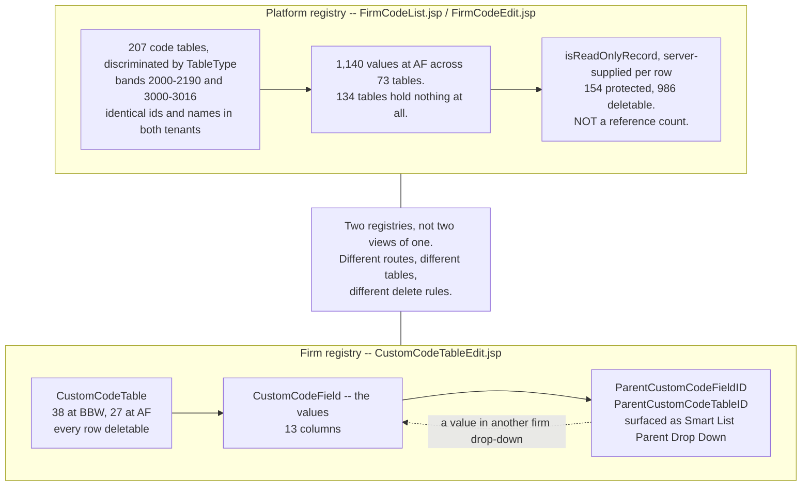

# Drop-downs and code tables — one editor, 207 tables, and a protection flag that moved

**Stated up front.** Every drop-down in Lucernex is a row in one generic code-table editor,
`FirmCodeEdit.jsp`, discriminated by a numeric `TableType`. There are **207** of them, the identical
207 in both tenants — same ids, same names — which puts the whole registry firmly in the Hub. What
is *in* those tables is a different story: in `(ASG)American Freight` only **73 of 207 carry any
values at all**. **134 code tables — 65% of the registry — are empty.**

Whether a value can be deleted is decided by a **server-supplied per-row boolean, `isReadOnlyRecord`** —
not by a reference count. Nothing in the client's render path counts usages. And the flag is not
static: on build `26.08.0.46` the value `AI Abstracted` in `Contract Status Code` carried a `delete`
action; on build `26.09.0.113`, **same tenant, three days later, it does not.** A protection flag
that changes across a platform upgrade is evidence about who owns the value, and it undercuts an
earlier reading in this corpus that `AI Abstracted` is a tenant-added status.

| | |
|---|---:|
| Code tables (`TableType`) | **207** — identical in both tenants |
| `TableType` bands | 2000–2190 (**190**) and 3000–3016 (**17**) |
| Tables carrying values (AF) | **73** |
| **Empty tables (AF)** | **134** |
| Total values (AF) | **1,140** |
| Values protected from delete | **154** |
| Values deletable | **986** |
| Tables where *every* value is protected | 23 |
| Tables where *no* value is protected | 38 |
| Tables with a **mix** | 12 |

Sources: [`../../tenants/af-code-table-actions.json`](../../tenants/af-code-table-actions.json)
(all 207 tables swept, 0 scan errors),
[`../../tenants/bbw-drop-downs.json`](../../tenants/bbw-drop-downs.json) (207 names + ids),
[`../../tenants/af-counts.json`](../../tenants/af-counts.json). Build `26.09.0.113`, captured
2026-09-13. Read-only — no code table or value was created, edited or deleted.

The full 207-row catalogue with type ids, the 2000/3000 band analysis and the "a Form is an Issue
Type" finding live in [`../../data-model/code-table-registry.md`](../../data-model/code-table-registry.md)
and are not repeated here. This document covers the **feature**: how values behave, what protects
them, and what is actually populated.

---

## 134 of 207 tables are empty

**Observed.** 73 tables carry values; 134 return none. The populated ones are concentrated, not
spread:

| `TableType` | Code table | Values |
|---:|---|---:|
| `3016` | Recovery Item Type Code | **314** |
| `2049` | Market Area Code | **213** |
| `3013` | Expense Type Code | **107** |
| `2061` | Security Privilege Code | 70 |
| `3004` | Covenant Type Code | 58 |
| `2116` | Location Category Code | 33 |
| `3005` | Facility Type Code | 30 |
| `3006` | Key Date Type Code | 23 |
| `2105` | Facility Category Code | 17 |
| `2047` | Asset Category Code | 16 |
| `3002` | Amendment Type Code | 16 |
| `2022` | Contact Type Code | 14 |
| `3007` | Location Type Code | 13 |
| `2070` | User Class Code | 10 |

**Derived.** Three tables hold **634 of the 1,140 values — 56%**. The long tail is short: 11 tables
have exactly one value, 8 have two, 17 have three. Below the top fourteen, a "code table" is
typically a handful of rows.

**Derived.** The 3000-band carries the weight relative to its size: **11 of 17** 3000-band tables are
populated against **62 of 190** in the 2000-band, and the 3000-band holds the two largest tables in
the product. That matches the band split recorded in
[`code-table-registry.md`](../../data-model/code-table-registry.md) — 3000-band rows carry
*behaviour* (`CodeExpenseType` has 31 fields including schedule-routing foreign keys), 2000-band rows
are mostly plain lookups.

**Derived, and it matters for the rebuild.** A registry that is 65% empty is a registry shipped
speculatively — the platform defines every code table it might ever need, and each tenant fills in
the fraction it uses. ASG Edge+ should not seed 207 empty masters to match. It should seed the ~73
that carry data and let the rest be created on demand, **or** deliberately adopt the same
pre-declared model and accept the emptiness. Either is defensible; inheriting it by accident is not.

---

## What protects a value from deletion

**Observed.** The Actions column (`dataIndex EditDeleteLink`) renderer, read live off the grid column
definition, is literally:

```js
var q = c.data.isReadOnlyRecord;
...
if (!q) { l = Ext.String.format(f.config.editDelStr, s, s) }
else { if (f.config.editStr) { l = Ext.String.format(f.config.editStr, s, s) } }
```

`isReadOnlyRecord = true` renders `edit` only; `false` renders `edit | delete`. **There is no count,
threshold or usage lookup anywhere in the render path.**

**Observed.** `isReadOnlyRecord` is computed server-side and is not derivable from the client. The
`FirmCode` record itself exposes only four fields — `Name`, `Description`, `Inactive`, and the
Available-for-Portfolios multi-select — none of which is a provenance, owner or reference-count
attribute.

### It is not a reference count

**Observed**, and this is a **retraction** of an earlier reading in this corpus (see
[`bbw-vs-american-freight.md`](../../tenants/bbw-vs-american-freight.md) §3). The distribution
inverts what usage would predict:

| Table | Protected | Deletable |
|---|---|---|
| `2157` Covenant Status Code | `AI Abstracted` | **`Active`**, `Deleted`, `Inactive`, `Not Applicable` |
| `2107` Facility Status Code | `AI Abstracted` | **`Open`**, `Closed`, `Possession` |
| `2181` Security Deposit Status Code | `AI Abstracted` | **`Active`**, `Deleted` |

**Derived.** In a training tenant with live facilities and 20.4 GB of documents, `Open` and `Active`
are far more likely to be referenced than `AI Abstracted`. A reference count cannot produce this
ordering, and `2157` is the exact inversion of it.

**Consequence, stated plainly.** This must **not** be used to reopen ASG Edge+'s **D-07** /
**MST-015**. Lucernex is not demonstrably doing a Where-Used reference check on code-table values,
so it is no precedent for proving zero-reference.

### It splits on provenance instead

**Observed.** `2022` Contact Type Code splits cleanly, and not by usage:

| Protected (10) | Deletable (4) |
|---|---|
| Broker, Construction Manager, Employer, Equipment Manager, Landlord, Lawyer, Primary Owner, Property Manager, Team Member, Vendor | Client, Notice, Sales Reporting, **Third Party - ASG** |

**Derived.** The protected ten are generic IWMS roles; the deletable four include one with **`ASG` in
its name**. The `lxBOID`s reinforce it — the protected rows are `9972`–`9981`, a contiguous block,
and the deletable ones are `9982`–`9986`, appended after.

**Inferred (the best-supported hypothesis, not confirmed).** `isReadOnlyRecord` marks
**platform-seeded, vendor-owned rows**, which a firm may rename but not delete, as against
firm-added rows which it may delete.

**The open test.** If the flag is provenance, a platform-seeded value should carry the **same
`lxBOID` and the same flag in both tenants**, while firm-added rows should have tenant-local ids.
This is testable today with one capture — and it has not been run, because
[`bbw-drop-downs.json`](../../tenants/bbw-drop-downs.json) records BBW's 207 table names and ids but
**no values**. A BBW value sweep matching the AF one would settle it. See
[Open questions](#open-questions).

---

## The flag moved between builds

**Observed.** Same tenant, `(ASG)American Freight`, `TableType 2094` Contract Status Code:

| Value | Build `26.08.0.46` (captured 2026-09-10) | Build `26.09.0.113` (captured 2026-09-13) |
|---|---|---|
| `Active` | edit only — protected | edit only — protected |
| `Inactive` | edit, delete | edit, delete |
| **`AI Abstracted`** | **edit, delete** | **edit only — protected** |

Earlier reading: [`code-table-registry.md`](../../data-model/code-table-registry.md#2094-contract-status-code--3-values).
Later reading: [`af-code-table-actions.json`](../../tenants/af-code-table-actions.json).

**Derived.** `isReadOnlyRecord` is not a stable property of a value. It changed for one value across
a platform upgrade, in a tenant where nobody edited that table.

**Observed, and the tenants now agree.** On build `26.09.0.113` `AI Abstracted` has **no delete at
American Freight either** — the AF/BBW difference recorded earlier vanished with the upgrade. It is
protected in **every one of the four tables it appears in** (`2094`, `2107`, `2157`, `2181`).

**What is Observed is narrow: the flag changed across a build upgrade, in a tenant where nobody
edited that table.** Everything beyond that is inference.

**Inferred.** Under the provenance hypothesis, protection implies vendor ownership, so `AI
Abstracted` would be **vendor-shipped rather than ASG-added** — most economically, Accruent shipped
AI abstraction as a platform feature in `26.09` and the value was promoted from firm-added to
platform-seeded. That rests on an unconfirmed hypothesis and should not be stated as fact.

**What this does settle:** `code-table-registry.md`'s claim that "**`AI Abstracted` is a tenant-added
status** — ASG has extended the contract lifecycle" is **no longer supported by the current build**.
Its provenance is now genuinely uncertain, which is itself the correction worth making. That document
has been annotated accordingly. The wider context — a live Atlas/RocketClub AI lease-abstraction
pipeline with per-firm field mapping — is in [`../import-export/`](../import-export/), and makes the
vendor-shipped reading the more plausible of the two.

**Derived, for the rebuild.** A protection flag the platform can flip during an upgrade is a
**Hub→Spoke publish concern**, not a row attribute. It is exactly the "never more than one version
behind" problem named as unwritten in the ASG workspace `CLAUDE.md`: when the Hub promotes a value
from firm-owned to platform-owned, what happens to a Spoke that has already edited or deleted it?
Lucernex's answer appears to be "the flag simply changes"; ASG Edge+ needs a deliberate one.

---

## `Inactive` is present, and essentially unused

**Observed**, [`../../tenants/af-code-table-values.json`](../../tenants/af-code-table-values.json) —
all 73 populated tables, 1,140 values, at American Freight:

| | |
|---|---:|
| Values with `Inactive = Yes` | **1** of 1,140 |
| Tables rendering **no** `Inactive` column at all | **2** — `Issue Type Code` (2035), `User Class Code` (2070) |

**Derived.** `Inactive` is a **per-value flag surfaced as its own grid column**, separate from
deletability. But at AF, **deactivation is essentially unused in practice** — values are added and
kept. So the deactivate-don't-delete model described above is what the product *supports*, not what
this tenant *does*.

**Derived.** The attribute is **not universal**: two code tables do not expose it. Both are tables
whose rows are structural rather than data — form types and user classes — which suggests
deactivation is withheld where a row is referenced by configuration rather than by records.
**Inferred**; two cases is thin evidence.

## A naming trap worth stating plainly

**Observed.** The admin tool labelled **"Manage Forms" is `TableType 2035`, internally
`Issue Type Code`**. The form-types count and the issue-types code table are **the same object**.

**Derived.** Two counts that look contradictory are the same number seen twice: "6 form types in
BBW" and "the `Issue Type Code` table has 6 values" are one fact. Anywhere this corpus reports a
form-type count, it is reporting rows in code table `2035`. See
[`../workflows-forms/`](../workflows-forms/) and [`../custom-lists/`](../custom-lists/).

## Dependent drop-downs — an unnoticed feature

**Observed.** The census object `CustomCodeField` — the row type that holds a custom drop-down's
*values* — has 13 columns:

| Column | |
|---|---|
| `CustomCodeFieldID` | The value's key |
| `CustomCodeFieldName` | The displayed value |
| `CustomCodeTableID` | The drop-down it belongs to |
| **`ParentCustomCodeFieldID`** | **A value in another drop-down** |
| **`ParentCustomCodeTableID`** | **The drop-down that other value belongs to** |
| `Description`, `Inactive`, `RevNumber`, `BOMapClientRecordID` | |
| `CreatedByID`, `CreatedDate`, `ModifiedByID`, `ModifiedDate` | Audit |

**Derived.** A value can name a **parent value in a different code table**. That is a
**cascading / dependent drop-down**: pick a value in table A and the options offered in table B
narrow to those whose parent is the value you picked. Nothing in this corpus had recorded the
feature.



**Derived.** The cascade is a self-reference on the firm side only. The platform registry's value
editor exposes four fields and none of them is a parent pointer
([below](#what-a-code-table-value-is-made-of)), so as far as anything observed goes **dependent
drop-downs are a firm-registry feature**. That is an argument from the *editor*, not from the
platform table's declared schema, which has not been read. That matters for the split: a rebuild can keep platform code tables flat and must give
the tenant-defined ones a parent edge.


**Derived.** It also explains the field type `sTYPE_CUSTOM_CODE_FIELD`, which **54 of the 205 firm
custom fields** use ([`../data-fields/`](../data-fields/)) — a firm field bound to a custom drop-down
whose values are `CustomCodeField` rows, optionally chained to a parent.

**Note the naming trap.** `CustomCodeTable` is the drop-down; `CustomCodeField` is a **value** in it,
not a field. Both are in the 223-object census; **`CustomCodeTable` is one of the 25 tables the
schema viewer refuses** and `CustomCodeField` is not in the picker at all, so neither is readable
through the live viewer. The `Firm Drop Downs` admin screen is a view over exactly this pair.

**Observed — confirmed by the admin routes.** These are the *firm-defined* drop-downs, and they have
their **own administration tool**: `Client Drop Downs` is `/en/admin/CustomCodeTableEdit.jsp`, while
`Manage Firm Drop Downs` is `/en/admin/FirmCodeList.jsp`
([`../administration/`](../administration/)). Two separate screens over two separate registries —
the platform one keyed by `TableType`, the firm one keyed by `CustomCodeTableID`. This was inferred
from the object names; the routes settle it.

**Observed — the firm registry, read.** `Client Drop Downs` opens a tab titled **"Manage Custom Drop
Down"** listing **38** firm-defined drop-downs, every one with `edit | delete`
(`bbw-admin/28-client-drop-downs.jpg`,
detail in [`../administration/`](../administration/#client-drop-downs--38-firm-defined-drop-downs)).

| | Platform registry | Firm registry |
|---|---|---|
| Screen | `Manage Firm Drop Downs` | `Client Drop Downs` |
| Route | `/en/admin/FirmCodeList.jsp` | `/en/admin/CustomCodeTableEdit.jsp` |
| Count in BBW | **207** | **38** |
| Keyed by | `TableType` (2000–3016) | `CustomCodeTableID` |
| Values | `FirmCode` rows | `CustomCodeField` rows |
| Deletable | **154 of 1,140 values protected** | **0 of 38 tables protected** |

**Derived.** Every firm-defined drop-down is deletable while a seventh of platform values are not.
That is exactly what the provenance reading of `isReadOnlyRecord` predicts — firm-owned things can be
deleted, platform-owned things cannot — and it is the first evidence for that hypothesis from the
*other* side of the boundary.

### `Lease Status` may be the missing contract lifecycle

**Observed.** Among the 38 firm drop-downs is **`Lease Status`** — alongside `Lease Admin Request
Type`, `Co-Tenancy Violation Type`, `Funds Type`, `Increase Type`, `Guarantor`, `Brands`,
`Cost Center`, `ASC 842 Month`, `ASC 842 Year` and others.

**Inferred, and it is the most promising lead on a long-standing question.** The platform's
`Contract Status Code` (`2094`) carries only three values and does not match BRD-24's
Open → Active → Possession → Paying Rent → Closed. A **firm-defined `Lease Status`** drop-down is
precisely what a tenant would create to track a lifecycle the platform field cannot express. If its
values match BRD-24, the contract-lifecycle question
([`../../INDEX.md`](../../INDEX.md#what-is-still-open), item 2) is answered — and the answer is that
ASG tracks lifecycle in a **custom** field, which the rebuild must model as first-class rather than
as an extension.

**Now partly confirmed, from the end-user side.** The first rendered Contract screens show **both
status fields on one record**:

| Field | Value |
|---|---|
| `Contract Status` *(platform, `TableType 2094`)* | `Active` |
| **`Lease Status`** *(firm-defined)* | **`Open`** |

**Derived, and it is close to decisive.** `Open` is the **first state of BRD-24's lifecycle**
(Open → Active → Possession → Paying Rent → Closed), and it is not among the platform field's three
values. More tellingly, **the record's own breadcrumb header ends with the `Lease Status`**, not the
contract status: `Contract: 2386/Lease ID 31117 - … - 06/30/2034 - Open`. The product surfaces
`Lease Status` as the record's headline state.

**Still unconfirmed:** nobody has opened the `Lease Status` drop-down and read its full value list, so
whether it carries all five BRD-24 states is not established. **That remains one click**, and it is
still the cheapest high-value check outstanding.

> **That click has been made.** The screenshot below is the `Lease Status` drop-down open in the
> value editor. The paragraph above is left standing because the answer it predicted is only half
> what arrived.


**Observed**, `(ASG)American Freight`, build `26.08.0.46`, captured 2026-09-10. The pager reads
**`Displaying 1 - 7 of 9`**, so **two values are on a second page and have not been seen**. The seven
that have:

| `Lease Status` value | Matches a BRD-24 state? |
|---|---|
| `Open` | **yes** — BRD-24 state 1 |
| `Active` | **yes** — BRD-24 state 2 |
| `Future Possession` | near — BRD-24 says `Possession` |
| `Closed` | **yes** — BRD-24 state 5 |
| `Closed - Active` | no — a compound state BRD-24 does not describe |
| `Accounting Purposes Only` | no |
| `Accounting Purposes Only: Close…` *(truncated)* | no |

**Derived, and it is weaker than the prediction.** The firm-defined `Lease Status` is **not** simply
BRD-24's lifecycle. Four of BRD-24's five states are present or near-present, `Paying Rent` is
**absent from the seven observed**, and three values exist that BRD-24 has no equivalent for —
including `Closed - Active`, which reads as two states at once, and two `Accounting Purposes Only`
variants that look like an accounting-visibility flag smuggled into a status field.

**The question is therefore narrowed, not closed.** Two values remain unread, and `Paying Rent` could
be one of them. Until page 2 is read, the honest statement is: *ASG tracks a lease lifecycle in a
firm-defined drop-down, it overlaps BRD-24 substantially, and it is not the same list.* A rebuild
that implements BRD-24's five states verbatim will not be able to represent the three extra values
this tenant actually uses.

**Observed, and unrelated but worth recording.** The grid behind the modal reads
`Displaying 1 - 15 of 27`, so **American Freight holds 27 custom drop-downs** against BBW's 38.


**Answered — the fourth column is `Smart List Parent Drop Down`.** It was truncated at `Smar…` in the
BBW capture and **Inferred** to relate to cascading behaviour; the American Freight capture above
renders it in full, and the value editor carries a matching `Smart List Parent Drop Down` `<select>`
on every drop-down. That is the UI for `CustomCodeField.ParentCustomCodeFieldID` /
`ParentCustomCodeTableID` described below, so the dependent-drop-down feature is **Observed** from
both the schema side and the screen side. It is empty on `Lease Status`.

**Still open:** no screen has been opened that shows a firm *creating* a `CustomCodeTable`, and
whether a firm table can extend or shadow a platform one.

**Open.** Is the parent link used in either tenant? Neither `CustomCodeField` nor `CustomCodeTable`
is readable through the schema viewer, so no row has ever been seen. Like conditional fields, this
may be a capability that is wired and unused — worth checking before committing to build it.

## The contract lifecycle, and why it is still a problem

**Observed.** `Contract Status Code` (`2094`) carries exactly **three** values in **both** tenants:
`Active`, `AI Abstracted`, `Inactive`. The three-value set is not an American Freight peculiarity.

**Derived.** That does not match BRD-24's Open → Active → Possession → Paying Rent → Closed. Note
that `Facility Status Code` (`2107`) *does* carry `Open`, `Closed` and `Possession` — so the
lifecycle vocabulary BRD-24 describes exists in the product, on the **facility**, not on the
contract. **And a third candidate has now appeared**: the firm-defined `Lease Status` drop-down —
see [above](#lease-status-may-be-the-missing-contract-lifecycle). Whether BRD-24's contract lifecycle is really a facility lifecycle, or whether contract
status is tracked somewhere other than this code table, is unresolved and blocks freezing the
contract schema. Carried forward from [`INDEX.md`](../../INDEX.md#what-is-still-open) item 2.

---

## What a code-table value is made of

**Observed.** The value editor exposes four fields only:

| Field | Notes |
|---|---|
| `Name` | The displayed value |
| `Description` | Free text |
| `Inactive` | The soft-delete / hide flag — **the real deactivation mechanism**, available on every value including protected ones |
| Available for the following Portfolios/Capital Programs | A required multi-select chip control defaulting to `All Portfolios/Capital Programs` |


> **A name collision worth catching before it causes a mistake.** There is a **platform**
> `Lease Status Code` table, shown above, holding exactly **one** value (`Expired`) at American
> Freight — and a **firm-defined** `Lease Status` custom drop-down holding **nine**
> ([above](#lease-status-may-be-the-missing-contract-lifecycle)). They are different objects in
> different registries with near-identical names, and the nine-value one is the one carrying the
> lifecycle. Anything citing "Lease Status" must say which registry it means. This is the same
> label-versus-mechanism hazard [`../../CONVENTIONS.md`](../../CONVENTIONS.md) warns about, and the
> second instance of it in this document after `Manage Forms` / `Issue Type Code`.


**Derived.** Because `Inactive` is editable on protected rows, **`isReadOnlyRecord` blocks
destruction but not withdrawal**. A firm that cannot delete a vendor value can still take it out of
circulation. That is a cleaner model than hard delete and maps directly onto ASG Edge+'s
`DeactivationPolicy`, which currently defaults to `WARN_AND_BLOCK` precisely because zero-reference
cannot be proven (D-07). **Lucernex avoids the problem by not offering the operation.**

**Derived.** The portfolio multi-select means a code table's values are **scoped**, not global to the
tenant: the same table can present different values in different portfolios. Any rebuild modelling
masters as a flat per-tenant list will not express this.

---

## What this means for ASG Edge+

| Finding | Consequence |
|---|---|
| 207 identical `TableType`s in both tenants | The registry belongs in the **Hub**; the values belong in the **Spoke** |
| 134 of 207 tables empty | Do not seed 207 empty masters. Decide deliberately between pre-declared and on-demand |
| Delete is gated by a server flag, not a reference count | **Do not cite Lucernex as precedent for Where-Used.** D-07 / MST-015 stay as they are |
| Best reading of the flag is provenance | Model `origin enum(PLATFORM, FIRM)` on a master value, not a computed refcount |
| The flag changed across an upgrade | Ownership transfer is a publish-time concern. Define what happens to a Spoke that already forked the value |
| `Inactive` is editable on protected rows | Deactivate, don't delete. Matches `DeactivationPolicy` |
| Values are scoped per portfolio | Master values need a scope dimension |
| Contract status has 3 values, not BRD-24's 5 | Unresolved. Blocks the contract schema |

---

## Open questions

1. **Run the provenance test.** Sweep BBW's 207 code tables for values with their `lxBOID` and
   `isReadOnlyRecord`, exactly as [`af-code-table-actions.json`](../../tenants/af-code-table-actions.json)
   did for AF. Matching ids + matching flags on protected rows confirms the hypothesis; tenant-local
   ids on deletable rows confirms the other half. One capture settles it. **Not yet requested** —
   worth queueing with `bbw-tracker`.
2. **What sets `isReadOnlyRecord` server-side?** Not observable from the client. Needs the REST or
   GraphQL representation of a `FirmCode` record, if either exposes more than the four UI fields.
3. **Did `AI Abstracted` really change ownership in `26.09`, or did the flag's meaning change?**
   The two readings are not distinguishable from one tenant's before/after.
4. **Where does contract status actually live**, given `2094` has three values and BRD-24 needs five?
   **Best lead: open the firm-defined `Lease Status` drop-down and read its values.** One click.
5. **Are the 134 empty tables empty in BBW too?** The BBW capture has names and ids but no values, so
   this is unknown. If BBW populates tables AF leaves empty, "empty" is a tenant fact, not a product
   fact — and the Hub/Spoke seeding decision changes with it.
6. **Why do `Issue Type Code` and `User Class Code` lack an `Inactive` column?** Two cases only.
7. **What does the portfolio scoping do at runtime** — filter the drop-down's options, or only
   control which portfolios may use the table at all?
