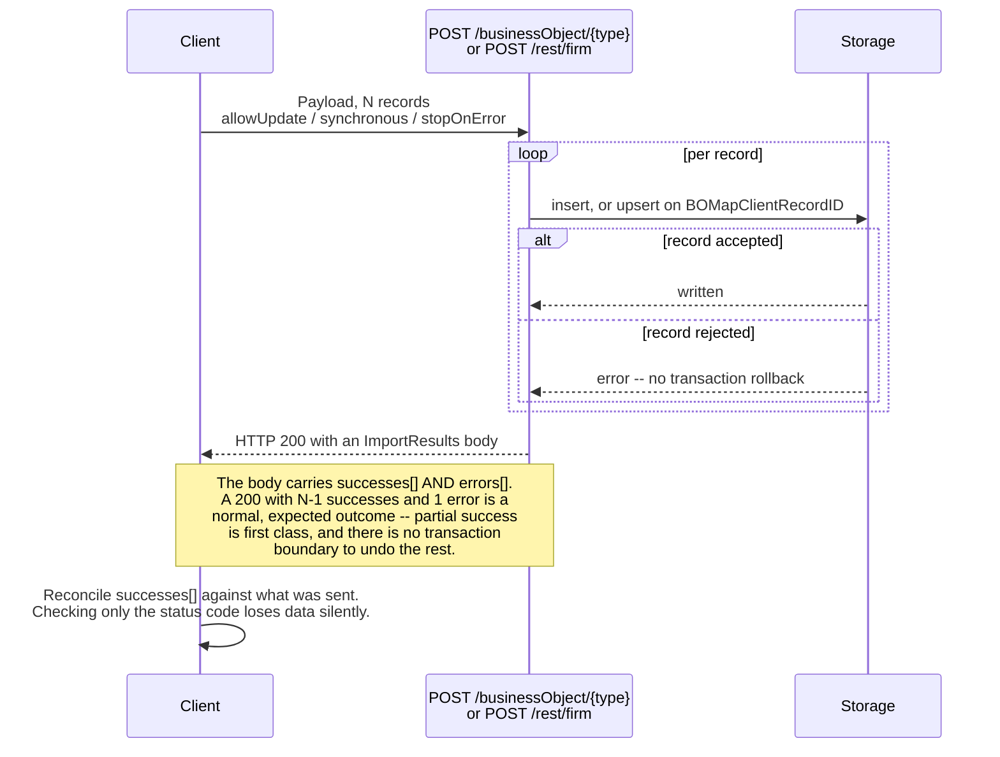
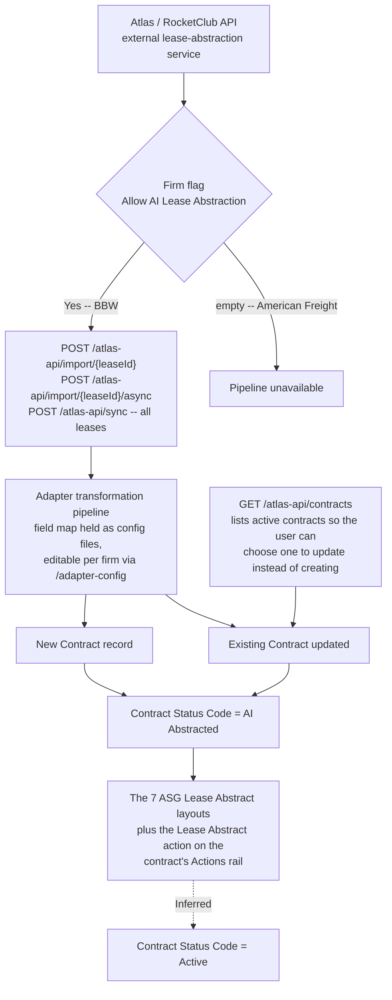

# Import and export — the bulk data paths, and the AI lease-abstraction pipeline

**Stated up front.** Lucernex has **four distinct inbound data paths**, not one, and only the first
is what "Import Data" on the admin dashboard suggests:

| Path | Endpoint | What it takes |
|---|---|---|
| **Generic bulk import** | `POST /rest/firm` | A **form post** carrying either a `file` upload or raw `xml` text. `synchronous` is **required**; `stopOnError` optional |
| **Document import** | `POST /rest/firm/document` | One document file into a folder on a project entity, with type, author, description and check-in control |
| **Vendor lease abstraction** | `/rest/vendor-lease` | "Import vendor-abstracted lease data via the **adapter transformation pipeline**" |
| **Atlas lease API** | `/rest/atlas-api` | "Fetch and import lease records from the **Atlas (RocketClub) API**" — one lease, one lease async, or `syncAll` |

**The most consequential finding is the fourth.** `/atlas-api` and its companion `/adapter-config`
("Admin: manage lease-abstraction adapter mapping config files") are a **live AI lease-abstraction
integration**, and they tie together four loose threads that were previously unconnected: the Firm
entitlement flag `Allow AI Lease Abstraction`, BBW's seven `ASG Lease Abstract - *` layouts, the
`AI Abstracted` value that appears in four different status code tables, and the vendor's promotion
of that value from firm-owned to platform-owned in build `26.09`.

**Every record type is writable.** The REST surface is fully CRUD over the generic controller —
**160 operations, 104 GET / 40 POST / 7 PUT / 9 DELETE** — and all 227 record types are addressable
through it. The corpus's earlier "617 GraphQL queries against 3 mutations" picture describes GraphQL
only and says nothing about how data actually gets in.

Source: [`../../tenants/bbw-rest-api.json`](../../tenants/bbw-rest-api.json), fetched from
`/en/test/RESTful.jsp` on `(ASG)BBW`, build `26.09.0.113`, 2026-09-13. **Observed.** All probes were
read-only GETs. *No authentication token was captured — that page renders live Basic and JWT
credentials and the capture was structure-only.*

> **Status.** The API side and **all four admin screens** are now documented from the BBW captures.
> What remains unread is the `Spreadsheets` and `Schedule Job` tabs of `Import Data`, and
> `Export Configuration`'s `Templates` and `Others` tabs.

---

## HTTP 200 does not mean the write succeeded

**Observed** ([`../../tenants/bbw-rest-api.json`](../../tenants/bbw-rest-api.json), OpenAPI 3.0.1 at
`/rest/api-docs/swagger`). Write operations return an **`ImportResults`** body carrying
**`successes[]` and `errors[]`**.

**Derived, and it is the single most important integration constraint on this API.** A `200` means
*the request was processed*, not *the records were written*. A client that checks only the status
code will silently lose data. Any ASG Edge+ integration against Lucernex — and any migration tooling
that reads from it — must parse `ImportResults` and reconcile `successes[]` against what it sent.

**Derived.** Two details of the loop are settled and one is not. `stopOnError` decides whether the
loop breaks at the first rejection or runs to the end — **either way the records already committed
stay committed**, so both modes can leave a partial import behind. What is *not* settled is whether
any record-level rollback exists at all; nothing in the spec or the screen suggests one, and
`Job Log` is built to report per-run outcomes after the fact, which is what a system without
rollback needs.

**Derived.** This is consistent with the rest of the import design: `stopOnError` is optional, there
is no transaction boundary, and `Job Log` exists to report per-run outcomes. The product's model is
**partial success as a first-class outcome**, reported in the body. A rebuild should decide
deliberately whether to copy that or to make writes atomic.

**Observed.** Authentication is **out of band** — the spec declares no `securitySchemes`. *(No token
of any kind has been captured anywhere in this corpus, and `/en/test/RESTful.jsp` and
`/en/admin/graphql.jsp` are both on the capture-exclusion list for that reason.)*

---

## The generic import: `POST /rest/firm`

**Observed.**

| Parameter | In | Required | Meaning |
|---|---|:--:|---|
| `file` | form | — | A file upload |
| `xml` | form | — | Raw XML text, as an alternative to the file |
| `synchronous` | query | **yes** | *"Block until import complete?"* |
| `stopOnError` | query | no | *"Stop processing on the 1st error encountered"* |

**Derived.** Four things follow directly.

1. **The payload format is XML**, not CSV — the alternative to a file upload is literally an `xml`
   form parameter, so the uploaded file is presumably the same XML.
2. **`synchronous` being required, with no default, is a deliberate design choice.** The caller must
   decide every time whether to block. That implies a real asynchronous path, which is what
   `Job Log` exists to report on.
3. **`stopOnError` controls the failure mode, and the UI defaults to stopping.** The API parameter is
   optional, which suggested partial import was the default; the screen shows otherwise — the
   `Import Data` form offers **`Stop: ⦿ On first error  ○ Continue till the end`** with **on-first-error
   pre-selected**. Either way there is no transaction boundary in evidence: "continue till the end"
   plainly leaves a partial import behind, and even "on first error" leaves everything before the
   failing row committed. A rebuild must decide this explicitly.
4. There is **no dry-run or validate-only parameter**. If a preview step exists it is in the UI, not
   the API.

### The upsert key

**Observed.** The generic write endpoints key on two identifiers:

| Endpoint | Keyed by |
|---|---|
| `GET`/`DELETE` `/businessObject/{objectType}/lxid/{lxID}` | The internal primary key |
| `GET`/`DELETE` `/businessObject/{objectType}/clientid/{clientID}` | **The client identifier** |
| `POST /businessObject/{objectType}` | Creates — **or updates when `?allowUpdate=true`** |

**Observed.** `@clientID` in the REST serialisation **is `BOMapClientRecordID`**
([`../../tenants/bbw-layout-engine-tables.json`](../../tenants/bbw-layout-engine-tables.json)).

**Derived — and this confirms an inference that was previously flagged as unsafe to build on.**
`BOMapClientRecordID` is the external client key, addressable in its own right through
`/clientid/{clientID}`, and `POST … ?allowUpdate=true` is an upsert against it. That is why it is
**required in 133 of the 202 tables** that have field detail — by far the most required field in the
product — and why its UI labels read `Contract ClientID`, `Facility ClientID`, `Location ClientID`
([`../required-and-validation/`](../required-and-validation/)). The reading was **Inferred** there;
it is now **Observed** here.

**Consequence for ASG Edge+.** A stable external identifier on effectively every record is not
optional in this design — it is what makes re-import idempotent. Model it as a first-class, unique,
per-tenant column, not as an afterthought.

---

## The `Import Data` screen

**Observed** (`/en/admin/Messenger.jsp`,
`bbw-admin/12-import-data.jpg`). Four tabs:
**`Import Data`**, **`Spreadsheets`**, **`Schedule Job`**, **`Job Log`**.

The `Import Data` tab itself is minimal:

| Control | Detail |
|---|---|
| Banner | *"Note: When Facility records get imported the Location data will be automatically created/updated"* |
| `Stop:` | **`⦿ On first error`** / `○ Continue till the end` — this is the API's `stopOnError` |
| `File:` | A text box with a `Browse…` button |
| | `Import` button (disabled until a file is chosen) |

**Derived.** Three things the API spec did not show.

1. **A `Spreadsheets` tab exists.** So spreadsheet import is a first-class path alongside the XML
   the REST endpoint documents. Whether it is a different parser or a spreadsheet-to-XML conversion
   is unobserved.
2. **A `Schedule Job` tab exists.** Imports can be **scheduled**, not only run on demand — which is
   what the `ScheduledJob` table (one of the 25 the schema viewer refuses) is for, and what makes the
   API's required `synchronous` parameter meaningful.
3. **`Job Log` is a tab here as well as a dashboard entry.** Import, schedule and log are one
   workflow, presented as one screen.

**Observed, and it is a real business rule.** *"When Facility records get imported the Location data
will be automatically created/updated."* **Derived:** the importer **creates parent records
implicitly**. That is consistent with `Location` being the site and `Facility` the building on it
([`../../modules/facilities-locations/location-vs-facility-vs-site.md`](../../modules/facilities-locations/location-vs-facility-vs-site.md))
— you cannot have a building without a site, so importing one manufactures the other. A rebuild that
rejects a facility whose location does not yet exist will fail on files Lucernex accepts.

**Open.** No dry-run, validate-only or column-mapping control appears on this tab. Either the format
is fixed and self-describing (consistent with XML), or mapping lives on the `Spreadsheets` tab.

---

## `Export Configuration` is the publish mechanism

**Observed** (`/en/admin/MessengerExportData.jsp`,
`bbw-admin/14-export-configuration.jpg`).
**This is the most structurally important of the four screens**, and it is not a data export at all —
it exports **configuration**.

Seven tabs: **`Summary Pages`**, **`Sub Pages`**, **`List Pages`**, **`Forms`**, **`Reports`**,
**`Templates`**, **`Others`**.

**Derived.** The first three are exactly the `SEP` / `SUB` / `LIST` layout modes
([`../page-layouts/`](../page-layouts/)); the `Summary Pages` tab shows *"Displaying 1 - 15 of 15"*,
matching BBW's **15 SEP layouts** one for one. So the export surface is the layout registry plus
forms, reports and templates.

| Element | Detail |
|---|---|
| Grid columns | `Page Layout Name`, `Primary Table`, **`Top Menu`**, **`Previous Layout`** |
| Row selection | A checkbox per row, plus a select-all in the header |
| Actions | `Export Selected` and **`Export All`** |
| Search | The standard free-text list search |

**Observed, and this is the mechanism.** A checkbox above the grid reads:

> *"Clone these layouts in this firm and environment (new layouts/fields created when this xml is
> imported)"*
>
> *"Do not check this if you are moving layouts, forms,… from one environment to another or one firm
> to another (e.g. dev to iwms)"*

**Derived — the publish-and-fork model, confirmed from the product's own UI.** This document's
sibling [`../page-layouts/`](../page-layouts/#the-publish-and-fork-model) derived from id arithmetic
that "ASG publishes one template set per tenant, re-keyed, which then forks": 80 layouts shared by
`(mode, name)`, **zero by id**, contiguous id-offset blocks, and the same duplicate row reproduced in
both tenants. The checkbox above **is that operation**, and it names both modes explicitly:

| Mode | Checkbox | Effect | Produces |
|---|---|---|---|
| **Clone** | checked | *"new layouts/fields created when this xml is imported"* | **New ids** — same names, different keys |
| **Move** | unchecked | for moving between environments or firms | Identity preserved |

**The observed evidence matches "clone", exactly.** Same names, disjoint ids, zero primary-table
mismatches. ASG exported its template set and imported it into each tenant **with `Clone` checked**,
which is why the ids are disjoint and why the two sets then drift independently.

**Derived, and it matters for the Hub/Spoke design.** The export is **XML**, and
`POST /rest/firm` takes XML — so **configuration round-trips through the same Messenger format as
data**. Lucernex's Hub→Spoke publish mechanism is: export configuration to XML, import it into the
target firm, choose clone or move. That is concrete prior art for the publish/accept/fork mechanism
the ASG workspace `CLAUDE.md` records as *not written down anywhere yet* — with one important
limitation: **clone-on-import means the Spoke's copy has no pointer back to the Hub original.** There
is no `source_global_layout_id`, which is exactly why the AF↔BBW join had to be done on name. A
rebuild should keep the lineage that Lucernex discards.

**Observed.** The `Previous Layout` column here is what revealed that layouts form **ordered chains**
within a navigation node — see
[`../page-layouts/`](../page-layouts/#the-chain--how-several-layouts-share-one-navigation-node).

---

## `Import Best Practice Templates` — the vendor's publish channel

**Observed** (`/en/admin/BestPracticeTemplates.jsp`,
`bbw-admin/13-import-best-practice-templates.jpg`).
A modal listing **versioned configuration packages published by Accruent**, with a search box, a
checkbox per row, and columns **`Name`**, **`Description`**, **`Version`**, **`Min Version`**,
**`Released`**.

| Package | Version | Min Version | Released |
|---|---|---|:--:|
| Bidding Sub-Module Package | 1.8 | 20.10 | true |
| Budget Package - Site and Project Standard Budget Items | 4.4 | 19.12 | true |
| Folder Template - RE Contracts | 1.9 | 19.12 | true |
| Folder Template - Sites and Projects | 2.9 | 19.12 | true |
| Package - GC Bidding | 1.0 | 19.12 | true |
| Project Cost Tracking Package | 4.1 | 20.2 | true |
| Request for Information (RFI) | 2.3 | 19.12 | true |

**Observed.** The descriptions say what a package contains: *"includes key forms and a bid package
template"*, *"a budget template, budget types, and a budget summary page"*, *"our standard sub page
layouts, forms, and workflows"*, *"standard folder groups used typically for RE Contracts"*.

**Derived — this is a third publish tier, and the corpus had recorded none of it.** Configuration
moves along three distinct channels:

| Tier | Mechanism | Versioned? | Lineage kept? |
|---|---|:--:|:--:|
| **Accruent → firm** | `Import Best Practice Templates` | **Yes** — `Version`, `Min Version`, `Released` | Unknown |
| **Firm → firm, or environment → environment** | `Export Configuration` XML, clone or move | **No** | **No** — clone discards it |
| Within a firm | Direct layout editing | No | `PreviousPageLayoutID` orders, does not version |

**Derived, and it bears directly on the Hub/Spoke design.** The ASG workspace `CLAUDE.md` records
that the Hub→Spoke publish/accept/fork mechanism and its *"never more than one version behind"* rule
**are not written down anywhere**. Lucernex has a working version of exactly that at the vendor tier:
a package carries a `Version` and a **`Min Version`** — the minimum platform release it can be
installed on — plus a `Released` flag separating published packages from drafts. That is a
compatibility contract between a configuration package and the platform it lands on, and it is the
closest prior art available. **What Lucernex does not have is lineage at the firm tier**: once a
package or a template set is cloned into a tenant, nothing records where it came from.

**Observed.** Two descriptions carry **dependency and environment instructions in prose**:
*"IMPORTANT: Import the Budget Package first"* (twice), and *"Customers using the old Lucernex bidding
process, import this into your Train environment first to confirm setup."*

**Derived.** Package **dependencies are documented, not modelled** — nothing enforces the ordering,
and a user who imports in the wrong order finds out afterwards. A rebuild should make dependencies
declarative. The Train-environment advice also confirms a **dev/train/production environment
progression**, which matches `Export Configuration`'s own hint about moving *"from one environment to
another (e.g. dev to iwms)"*.

**Derived.** All seven packages target **bidding, budget, cost tracking, folder templates and RFI** —
which are, with the exception of folder templates, precisely the areas ASG Edge+ has ruled **out of
scope**. So this channel is well-populated for capital projects and empty for lease accounting.

---

## `Job Log` — the first evidence of the product actually running

**Observed** (`/en/admin/JobLogEdit.jsp`,
`bbw-admin/15-job-log.jpg`). **818 entries.** Filter:
`Start Time between [date] And [date]` with a `Show Entries` button, plus `Expand All` and the
standard free-text search. Each row has `view | delete` and an expander.

| Column | |
|---|---|
| `Name` | The job's label |
| **`Job Type`** | `Generate Payments`, **`Data Import`**, `Scheduled Report` |
| **`Scheduled`** | `Manual`, or the scheduled date and time |
| `Initiated By` | A named user, or **`Lx Administrator`** for scheduled runs |
| **`Status`** | `Complete`, `Completed`, `Finished` |
| `Start Time` / `End Time` | Timestamps, sorted descending by start |
| **`Input File`** | The uploaded file, or an `LxHttpMsg…` identifier |
| `Log…` | A link to a log file — `LxRetroPaymentR…`, `LxImportLog…`, `LxDataImportLog_…` |

*(Per this corpus's rules, the named individuals in `Initiated By` and in one uploaded filename are
deliberately not recorded. Three distinct human initiators and the system principal `Lx
Administrator` were present.)*

**Derived — four things nothing else in the corpus shows.**

1. **A spreadsheet import really ran.** One row is `Import Job` / `Data Import` / `Manual` /
   `Completed`, with an **`.xlsx`** input file. So the `Spreadsheets` tab is a live path, not a
   vestige, and **XLSX is an accepted import format** alongside the XML the REST endpoint documents.
2. **There is an hourly scheduled integration.** `BBW Transaction Update` runs as a
   `Scheduled Report` every hour on the half-hour — 12:30 AM, 01:30, 02:30 … 10:30 AM — initiated by
   `Lx Administrator`, each with an `LxHttpMsg…` input and an `LxDataImportLog_…` log. **Derived:**
   an external system posts transaction data hourly over HTTP and it lands through the import
   pipeline. That is a **live inbound integration in a tenant described as training**, and nothing in
   this corpus had recorded it.
3. **`Generate Payments` is logged as a job.** It appears with `Scheduled = Manual` and a human
   initiator, confirming from the other side what
   [`../../data-model/screen-routing.md`](../../data-model/screen-routing.md) found — *"`Generate
   Rent` and `Calculate Schedule` are buttons on a record, not batch jobs"*. They are user-triggered
   **and** they produce job-log entries with their own retro-payment logs.
4. **The status vocabulary is inconsistent.** `Complete`, `Completed` and `Finished` all appear, and
   they correlate with job type rather than with outcome — `Generate Payments` reports `Complete`,
   `Data Import` reports `Completed`, `Scheduled Report` reports `Finished`. **Derived:** each job
   type writes its own status string; there is no shared status enum. A rebuild should define one.
   **No failed job appears in the visible page**, so the failure vocabulary is unobserved.

**Derived.** `Job Log` is the asynchronous half of the import design — it is what makes the API's
required `synchronous` parameter meaningful, and it is where `stopOnError` outcomes would surface.
Note `Job Log` and `Report Log` are the same screen ([`../administration/`](../administration/)),
which is consistent with scheduled *reports* and scheduled *imports* sharing one job runner.

---

## The lease-abstraction pipeline

**Observed.** Three REST tags, working together:

| Tag | Description |
|---|---|
| `/atlas-api` | Fetch and import lease records from the Atlas (RocketClub) API |
| `/vendor-lease` | Import vendor-abstracted lease data via the adapter transformation pipeline |
| `/adapter-config` | **Admin:** manage lease-abstraction adapter mapping config files |

**Observed.** The `/atlas-api` operations:

| Operation | What it does |
|---|---|
| `POST /atlas-api/import/{leaseId}` | Fetch one lease by Atlas ID, transform it, persist it |
| `POST /atlas-api/import/{leaseId}/async` | Queue the same as a background task |
| `POST /atlas-api/sync` | Fetch **all** leases, transform each through the adapter pipeline, persist |
| `GET /atlas-api/contracts` | List active contracts visible to the current user, **for selecting an existing contract to update** |

**Derived.** The architecture is: an external abstraction service produces lease data → a
**configurable adapter mapping** transforms it → it lands as `Contract` records, either creating new
ones or updating one the user picks. `/adapter-config` being an *admin* surface for *mapping config
files* means the field mapping is **tenant-configurable**, not hard-coded.

**Evidence labels on that diagram, because they differ by step.** The Atlas endpoints, the adapter
config surface, the entitlement flag, the `AI Abstracted` status value and the seven BBW-only
`ASG Lease Abstract - *` layouts are each **Observed**. The `Lease Abstract` entry on the contract's
`Actions` rail is **Observed** too
([`../page-layouts/`](../page-layouts/#action-buttons-render-in-a-right-hand-actions-rail-and-they-are-per-layout)).
**The dotted edge is Inferred** — that a human reviews the abstraction on those layouts and promotes
the contract from `AI Abstracted` to `Active`. No Lease Abstract screen has been opened, no
abstraction run appears in `Job Log`, and no contract carrying `AI Abstracted` has been observed in
either tenant. The promotion step is the part of this picture with no evidence behind it.

**Derived — four threads, now one story.** These were separate observations in this corpus:

| Thread | Where it was recorded | How it fits |
|---|---|---|
| Firm flag `Allow AI Lease Abstraction` — empty at AF | [`af-firm-record.json`](../../tenants/af-firm-record.json) | The entitlement for this pipeline |
| 7 BBW-only `ASG Lease Abstract - *` layouts | [`../page-layouts/`](../page-layouts/#the-publish-and-fork-model) | The human review surface for what the pipeline produces |
| `AI Abstracted` in 4 status code tables | [`../drop-downs-code-tables/`](../drop-downs-code-tables/) | The record state it writes |
| `AI Abstracted` became delete-protected in build `26.09` | same | Accruent shipping the feature as platform, not firm |
| `Contract Status Code` has `AI Abstracted` but not BRD-24's lifecycle | [`../drop-downs-code-tables/`](../drop-downs-code-tables/#the-contract-lifecycle-and-why-it-is-still-a-problem) | The status vocabulary is shaped by this pipeline |

**Derived.** BBW's advantage over AF is not "a more advanced fork" in general — it is **this one
feature**, entitled, laid out and in use. That is a much more specific statement than the layout diff
alone supported.

**Inferred.** The `ASG Lease Abstract - *` layouts present machine-extracted terms for human
confirmation before the contract is promoted from `AI Abstracted` to `Active`. Consistent with every
piece of evidence above, but **no Lease Abstract screen has been opened** and no abstraction run has
been observed.

---

## Export

**Observed.** `Export Configuration` is documented above. A second tool, `Export Schema`, appears in
the workbook and on AF's dashboard and **has not been opened**. `Export Schema` would yield the complete physical schema in one
file and is the cleanest route to the `Firm_`-column question and the 25 refused tables; it is a
download and needs explicit approval
([`../../INDEX.md`](../../INDEX.md#what-is-still-open)).

**Observed.** Per-list export from the UI is unconfirmed. `PageLayoutField.JSONConfigText` carries
`rowsPrintablePerPage` on 21 placements, which implies a print/export path off a list, but the
control has not been seen ([`../search-filtering/`](../search-filtering/)).

**Derived.** `POST /rest/firm` has no `GET` counterpart in the 160 operations, so **there is no
generic bulk *export* endpoint**. Export is a UI feature, not an API one — asymmetric with import.
Note the asymmetry is only in the *transport*: `Export Configuration` produces the same XML that
`POST /rest/firm` consumes, so configuration does round-trip, just not programmatically.

---

## Staging tables

**Observed.** The 223-object census contains two objects that never appear in the 227-table picker
and whose names say what they are:

| Object | Fields | Shape |
|---|---:|---|
| `PaymentTransactionFullImport` | **118** | A near-copy of `PaymentTransaction` (139 fields) |
| `WFStepFullImport` | **47** | A near-copy of `WorkFlowStep` |

Both carry `BOMapClientRecordID`.

**Inferred.** These are import staging tables: rows land here, are validated, then promoted.
**Unconfirmed**, and one fact argues against a general staging design — only **2 of 223** objects
have a `FullImport` twin. If staging were the universal mechanism there would be more. The likelier
reading is that payment transactions and workflow steps are the two **bulk** import paths and the
rest go through the generic `POST /businessObject` route one record at a time.

---

## What this means for ASG Edge+

| Finding | Consequence |
|---|---|
| Import is XML, form-posted, with required `synchronous` | Decide the sync/async contract explicitly; do not default it |
| `stopOnError` is optional, so partial import is the default | Choose the transaction boundary deliberately |
| No dry-run parameter in the API | If a validate step is wanted, design it — Lucernex's API has none |
| `BOMapClientRecordID` is the upsert key, addressable as `/clientid/{id}` | A unique external identifier on every record, enforced. **Now Observed, not inferred** |
| The adapter mapping is admin-configurable | A lease-abstraction integration needs a tenant-editable field map, not hard-coded transforms |
| No generic bulk export endpoint | Import and export are asymmetric. Confirm before promising round-tripping |
| Only 2 objects have staging twins | Bulk staging is the exception, not the pattern |

---

## Open questions

1. **What is on the `Spreadsheets` and `Schedule Job` tabs**, and on `Import Best Practice
   Templates`? `Import Data` and `Export Configuration` are now read; these are not.
2. **What XML schema does `POST /rest/firm` accept?** No schema is named in the spec. Without it the
   import format is unknown even though the endpoint is documented.
3. **What does a *failed* job look like?** `Job Log` is read and its success vocabulary captured
   (`Complete` / `Completed` / `Finished`), but **no failed row was visible**, so the failure states,
   any retry control, and whether a per-row error report is downloadable are all unobserved. The
   `Log…` column links to log files that would show it.
4. **What is the hourly `BBW Transaction Update` integration?** An external system posting
   transaction data over HTTP every hour, in a training tenant. Its source, payload and target table
   are unknown, and it is the only live integration this corpus has found.
5. **What is on `Export Configuration`'s `Templates` and `Others` tabs?** The first five tabs are
   accounted for (three layout modes, forms, reports); these two are not, and `Others` is where
   drop-downs and data fields would have to live if they are exportable at all.
6. **Is there any export API at all?** None found among 160 operations.
7. **Has an Atlas import ever run in either tenant?** The `Job Log` shows no Atlas job type in the visible page. `AI Abstracted` exists as a status value in
   both, but no contract has been observed carrying it.
8. **What is in the adapter mapping config files?** `/adapter-config` is an admin surface; its
   content would show exactly which Lucernex fields a lease abstraction populates — effectively a
   vendor-authored map of "the fields that matter on a lease".
9. **Do the two `*FullImport` tables actually stage anything?** Their field lists are in the census;
   no row has been seen.
