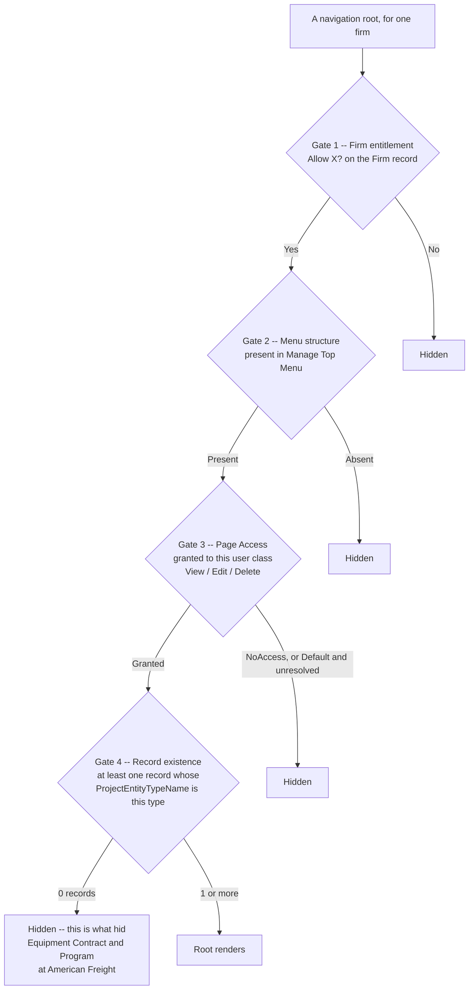

# Security and access — four securable kinds, and a gate we cannot find

**Stated up front.** `Manage Security` grants privileges to a **user class** over four different
kinds of thing, one per tab — **Page Access**, **Actions**, **Field Security**, **Budget Columns** —
on a ladder of `NoAccess` / `View` / `Edit` / (`Delete`) / `Default`. That model is now read, across
all 10 user classes, and it is richer than the corpus previously described: **field-level and
action-level security are first-class**, not afterthoughts.

**It does not, however, explain why `Equipment Contract` fails to render at American Freight.** An
earlier revision of this document argued that by elimination. **That argument is refuted** — see
below. Three plausible gates were enumerated and **all three are observed open at AF**, and the root
still does not appear. A fourth mechanism exists and has not been identified.

| Tab | Route | Secures | Vocabulary |
|---|---|---|---|
| **Page Access** | `/en/admin/SecurityPageAccess.jsp` | Navigation nodes and layouts | `NoAccess` / `View` / `Edit` / **`Delete`** / `Default` |
| **Actions** | `/en/admin/SecurityActions.jsp` | **70 operation verbs** | `NoAccess` / `View` / `Edit` / `Default` — **no `Delete`** |
| **Field Security** | `/en/admin/SecurityFieldSecurity.jsp` | **6,553 individual fields** | `NoAccess` / `View` / `Edit` / `Default` |
| **Budget Columns** | `/en/admin/SecurityBudget.jsp` | Budget column types *(out of scope)* | *(not read)* |

> **Read the class selector before reading the radios.** The `<select>` above the grid decides what
> every value on the page means, and the tabs do not default to the same class -- Page Access opens
> on `Default Security`, Field Security on `System Administrator`. The grid above is
> `Default Security`, which denies almost everything; it is not the tenant's effective permission set.

Sources: [`../../tenants/af-security-page-access.json`](../../tenants/af-security-page-access.json),
[`../../tenants/af-security-field-actions.json`](../../tenants/af-security-field-actions.json),
`(ASG)American Freight`, build `26.09.0.113`, 2026-09-13. **Observed.** Read by GET only — the user
class is a query parameter (`?UserClass={id}`), so no control was clicked and nothing was saved.

> **Method note, and it corrects an earlier caveat of mine.** I previously wrote that the bare
> `SecurityPageAccess.jsp` shows "an unselected default" that is not evidence. **Withholding judgement
> was right; the explanation was wrong.** The page loads with `Default Security` (`7884`) *genuinely
> selected*, and that class really does deny nearly everything — including `Contract`. The correct
> caution is different and sharper: **the tabs default to different classes.** Page Access opens on
> `Default Security` (`7884`); Field Security opens on **`System Administrator` (`7885`)**. Always read
> the returned `<select>` to confirm which class a value belongs to, or permissions get attributed to
> the wrong one.

---

## The Equipment Contract gate — three gates open, root still hidden

**This section records a refuted hypothesis, because the refutation is more useful than the guess
was.**

**The hypothesis.** Whether a screen renders looked like it was decided by three gates: the Firm
entitlement flag, the menu structure, and per-user-class page access. Gates 1 and 2 were known open
at American Freight, so by elimination gate 3 had to be the suppressor — and `Equipment Contract` is
one of the 18 top-level nodes in the Page Access tree, exactly the right shape of control.

**The refutation.** **Observed**, across all 10 AF user classes:

| Access to `Equipment Contract` | User classes |
|---|---|
| **`Delete`** | Full Access, Lease Admin, Lease Admin Accounting, Lease Admin Manager, System Administrator |
| **`View`** | Lease Admin Client, Lease Admin Client - Allowances, Lease Admin View |
| `NoAccess` | Default Security, Lease Admin Mail |

**`Equipment Contract` is granted for 8 of 10 user classes.** And more decisively: **in every class
that grants `Contract` at all, `Equipment Contract` is granted at the same level.** The two are
indistinguishable in this matrix.

So at American Freight:

| Gate | State |
|---|---|
| 1. Firm entitlement — `Allow Equipment Contracts?` | **Yes** |
| 2. Menu structure — id `41087`, 5 groups, 64 nodes | **Present** |
| 3. Page access | **Granted, 8 of 10 classes** |
| **The root** | **Does not render** |

**Derived. There is a fourth mechanism, and we have not identified it.** That is the honest state,
and it is a stronger position than a wrong attribution.

> **Update — the fourth mechanism has since been identified, and this section has not been rewritten
> around it.** [`../../tenants/af-navigation-gate.json`](../../tenants/af-navigation-gate.json) and
> [`../../tenants/bbw-navigation-gate.json`](../../tenants/bbw-navigation-gate.json) settle it, and
> the full argument is in [`../../tenants/bbw-vs-american-freight.md`](../../tenants/bbw-vs-american-freight.md).
> **A navigation root renders if and only if the firm holds at least one record of that root's
> `ProjectEntityTypeName`.** Everything above about the three gates being open remains correct and
> is the reason the fourth had to be looked for; only the closing "we have not identified it" is
> superseded. The diagram below states the settled model.

**Observed**, both tenants, build `26.09.0.113`. Counts from
[`bbw-navigation-gate.json`](../../tenants/bbw-navigation-gate.json) (`GET
/rest/businessObject/{type}?fields=lxid`, one link per record) and
[`af-navigation-gate.json`](../../tenants/af-navigation-gate.json) (`GET
/rest/businessObject/{Type}/details?fields=ProjectEntityTypeName`). The rendering column is what a
browser actually shows. *(The two methods return slightly different totals — the master findings
document reports 2,014 BBW contracts against the 2,190 below, because one counts links and the other
counts a `$top`-capped detail page. Neither number is near the threshold, which is 1, so the
difference does not touch the argument.)*

| Root type | BBW records | BBW root | AF records | AF root |
|---|---:|:--:|---:|:--:|
| `Contract` | 2,190 | renders | 2 | renders |
| `Location` | 2,140 | renders | 400 | renders |
| `Facility` | 2,173 | renders | 36 | renders |
| `Portfolio` (`Program` table) | 2 | renders | 3 | renders |
| **`EquipmentContract`** | **1** | **renders** | **0** | **hidden** |
| **`Program`** (the menu structure) | — | — | **0** | **hidden** |
| `Parcel`, `Prototype`, `Project`, `CapitalProject` | 0 | hidden | 0 | hidden |

**Derived, and it is what makes the rule an answer rather than a correlation.** `Program` is the
control. At AF the `Program` *table* holds three rows, but those rows carry
`ProjectEntityTypeName = Portfolio`; **nothing at AF is typed `Program`**, and the `Program` menu
structure stays hidden while the `Portfolio` one renders off the same three rows. The gate reads the
**type name**, not the table. And BBW renders `Portfolio` off **two** records, so the threshold is
existence, not volume.

**Derived, on gate 3.** `Default` is drawn as a failure edge deliberately. It means *inherit*, not
*allowed*, and reading it as a grant is the error that produced the refuted hypothesis above.

**Caveat, stated by the capture itself.** Record existence could be a *consequence* rather than a
*cause* — nobody creates records in a module they cannot see. `Equipment Contract` escapes that
circularity because AF holds the entitlement, the menu structure and the page-access grant, and
still shows nothing; the only remaining difference between the two tenants is the one row BBW has.

**The obvious rescue is also ruled out.** No single user class explains the 4-root navigation.
`Lease Admin Mail` is the only class granting `Contract` while denying `Equipment Contract` — but it
also denies `Location` and `Facility`, which **do** render. Nor does any union of classes produce the
observed set.

### An independent counterexample in the same data

**Observed.** `Program` is granted by **all 10** classes (`Default`, and `Delete` for System
Administrator), and **`Program` does not render as a navigation root either.**

**Derived.** An open page-access grant is **demonstrably not sufficient** for a root to appear. That
is a second, independent case of the same failure, and it means the missing mechanism is general
rather than something peculiar to Equipment Contract.

> **Do not conflate two things named Program.** AF's root *labelled* `Portfolio` carries
> `requestedProjectEntityType = Program`. The separate `Program` **menu structure** (id `3851`) is the
> one that stays hidden. They are different objects with overlapping names.

### What `Default` means, and why it is a trap

**Observed.** `Default` is one of the five radio options, and it is rendered **`disabled`** on some
rows.

**Derived.** It means *inherit* — "not explicitly granted" — rather than "granted by default". The
`Program` case proves the distinction matters: `Program` is `Default` for all 10 classes and renders
for none. **Reading `Default` as an effective grant is exactly the error that produced the refuted
hypothesis**, and any future analysis of this matrix should treat `Default` as *unknown until the
inheritance chain is resolved*, not as *allowed*.

---

## Field Security — 6,553 fields, and the read-only answer

**Observed.** `/en/admin/SecurityFieldSecurity.jsp` is a **5.0 MB** page carrying **6,553 field
nodes** and **26,212 radio inputs** (four per node). Vocabulary: `NoAccess` / `View` / `Edit` /
`Default`. **There is no dedicated `ReadOnly` level.**

**Observed, and it answers a standing question.** **Read-only-ness is expressible here — as `View`.**
Granting `View` on a field lets a user class see it without editing it, which is read-only in effect.
The capability exists; it simply is not spelled "ReadOnly".

**Derived, and it withdraws an anomaly this corpus had been treating as one.** The field catalog
reports `ReadOnly = No` on **all 6,158** leaves, which looked like a column the product never fills.
It is not an error: **the two measure different things.**

| | Measures | Scope |
|---|---|---|
| Catalog `ReadOnly` | Is this field **inherently** non-editable, for everyone? | The field *definition* |
| Field Security `View` | May **this user class** edit it? | A per-class *grant* |

A field can be universally editable by definition and still be read-only for eight of ten classes.
**`No` across the board answers a question nobody was asking**, rather than answering the wrong one.
Corrected in [`../required-and-validation/`](../required-and-validation/).

> **Trap.** The strings `Is ReadOnly?` and `Read Only?` **do** appear on that page — but they are the
> **names of data fields being secured**, sitting alongside `Allow UI Edit?` and `Is Inactive?`. They
> are not access levels. This is the label-versus-mechanism confusion that
> [`../../CONVENTIONS.md`](../../CONVENTIONS.md) warns about, in its purest form.

**Derived.** 6,553 securable field nodes against 6,158 catalog leaves is close enough to suggest
Field Security is driven by the same registry — `ReportGroupAvailableField`, which
`UserClassSecurity` references directly. A fourth consumer of the shared field registry, after data
fields, layouts and the audit trail.

---

## Actions — 70 securable verbs

**Observed.** `/en/admin/SecurityActions.jsp` lists **70 action rows**, each `SecurityFieldId_*`, on
the vocabulary `NoAccess` / `View` / `Edit` / `Default` — **no `Delete`**, unlike Page Access.

**Derived.** Actions govern **operations**, not records, which is why the delete level is absent —
there is nothing to delete. Examples: `Create Contract`, **`Create Equipment Contract`**,
`Convert Site To Project`, `Condition Bids`, `Allow Import Data Action`, `Allow Vendor Update`,
`Allow WebDAV Access`, and six budget-status verbs.

**Derived.** This is the surface that separates **seeing a record from doing something to it**. A
user class can hold `Edit` on the contract page and `NoAccess` on `Create Contract`. For the rebuild
that means **operation-level authorisation is a separate axis from record-level access** — and it
maps onto the placeable action-button widgets on a page layout (`Generate Rent`, `Approve Payments`,
`Extend Contracts`), which are the UI for exactly these verbs
([`../page-layouts/`](../page-layouts/)).

**Observed, and relevant to the open gate.** Two action rows concern Equipment Contract:
`Create Equipment Contract` and `Default access to Equipment Contracts for Portfolio Members`. The
second is worth a look — an action-level default that mentions Portfolio membership is a plausible
shape for the missing fourth mechanism, though nothing yet connects it to root rendering.

---

## The audit trail — field-level, before and after

**Observed** (`Audit Reports`, `/en/reports/AuditReport.jsp`,
`bbw-admin/47-audit-reports.jpg`).

| Filter | Values |
|---|---|
| `Changes made by` | `<All Members>` |
| `And Last Viewed` | `<All Entities>` |
| `Between … And …` | Two date + time pickers, each with AM/PM |
| `In Group` / `And Sub-Group` | `<All Groups>` and a dependent second list |
| `And Table` | `<All Tables>` |
| `Special Filters` | `<SELECT>` |
| | `Show Changes` button |

Result columns: **`Member Name`**, **`Date / Time`**, **`Group Name`**, **`Sub-Group`**, `Entity`,
`Table`, **`Item ID`**, **`Field`**, **`Action`**, **`Old Value`**, **`New Value`**.

**Derived.** This is a **row-and-field-level before/after audit**: one row per changed field, carrying
who, when, which record, which field, the action, and both values. It is the reporting face of the
census objects `AuditMaster`, `AuditTable` and `AuditColumn` — the last described as *"one logged
field-change row: which column, old/new value, who, when"*
([`../../modules/platform-tenancy/data-model.md`](../../modules/platform-tenancy/data-model.md),
field lists in [`../../data-fields/audit-history-tables.md`](../../data-fields/audit-history-tables.md)).

**Derived — and it bears on an ASG blocker.** The ASG workspace `CLAUDE.md` records an open decision:
an ADR superseding **ADR-0020** (in-transaction audit) versus the outbox of **ADR-0012**, which is
still only a `NoOpOutboxPublisher`, and it blocks the durable audit adapter in
configuration-service. Lucernex's answer is visible here and it is unambiguous: **a synchronous,
in-transaction, row-level audit table with old and new values**, queryable directly by a report
screen. There is no event stream, no outbox, and no projection — the audit *is* the table. That is
not automatically the right answer for ASG Edge+, but it is what the system being replaced does, and
a rebuild that emits events instead will not be able to answer this screen's questions without
building a projection.

**Derived.** `Group Name` and `Sub-Group` are the **data-field grouping tree** — `ReportGroupData`,
the hierarchy above `ReportGroupAvailableField`. So the audit trail is navigable **along the same
field hierarchy the Manage Data Fields screen presents**, not merely by table. That is a fourth
consumer of the shared field registry, alongside data fields, layouts and field security, and it
corroborates [`../../modules/reporting/report-field-registry.md`](../../modules/reporting/report-field-registry.md).

**Observed.** BBW returns *"No rows to display"* — but the filter defaults to a **single day**
(`Between 13/09/2026 12:00 AM` and an empty end), which is the capture date. That is not evidence of
an empty audit trail.

**Open.** `And Last Viewed <All Entities>` is an unexplained filter. **Inferred:** the product may
track record *views* as well as changes, which would be a read-audit — relevant to SOC 2. Not
confirmed; the control was not exercised. Likewise `Special Filters <SELECT>` was never opened.

## What this means for ASG Edge+

| Finding | Consequence |
|---|---|
| **Screen visibility is governed by something we have not found** | Three plausible gates are all open at AF and the root still hides. **Do not design a visibility model on the three-gate reading** — it is incomplete |
| The ladder is `NoAccess` / `View` / `Edit` / `Delete` / `Default` | Four levels plus **explicit inherit**. The inherit option is what makes a permission tree maintainable |
| **`Default` means *inherit*, not *allowed*** | `Program` is `Default` for all 10 classes and renders for none. Resolve the inheritance chain before treating it as a grant |
| The ladder is **pruned per kind** | Actions and Field Security have no `Delete`; Page Access does. Each securable kind declares which operations apply |
| Four securable kinds: pages, **actions**, **fields**, budget columns | Operation-level and field-level authorisation are **separate axes** from record access |
| **Read-only is `View` on a field**, not a dedicated level | Model read-only as a grant level, not as a property of the field definition |
| The catalog's `ReadOnly` and Field Security's `View` measure different things | Definition-level versus per-class grant. A rebuild needs both, and they are not substitutes |
| **70 securable action verbs** | These are the UI's action buttons. Authorise the verb, not just the record |
| 6,553 securable field nodes against 6,158 catalog leaves | Field Security is driven by the shared field registry — a fourth consumer of `ReportGroupAvailableField` |
| `List Layouts` and `Sub-pages` are securable nodes | Security attaches to the layout registry across all three modes |
| 14 menu structures exist; a tenant renders a subset | The full menu model belongs in the **Hub**; what renders is per-tenant |
| Audit is a **synchronous in-transaction field-level table** with old/new values | This is what ADR-0020 proposes and what the replaced system does. An event/outbox design must add a projection to answer the same questions |
| The audit trail is navigable by the **field grouping tree** | A fifth consumer of the shared field registry |

---

## Open questions

1. **What suppresses a navigation root, given all three known gates can be open?** The central
   question in this area, and now sharper than before: it must explain **both** `Equipment Contract`
   and `Program` at AF. Candidate worth checking first — the action row
   `Default access to Equipment Contracts for Portfolio Members`, since an action-level default
   mentioning Portfolio membership is the right *shape*, though nothing yet connects it to root
   rendering. Other candidates: a `Program`/`Portfolio` record-level setting, a licence record
   outside `FirmEdit.jsp`, or a per-member rather than per-class grant.
2. **Do the two hidden roots share a cause?** `Equipment Contract` and `Program` both fail to render
   with page access open. If one mechanism explains both, it is general; if not, there may be two.
3. ~~**What do real user classes hold?**~~ **Answered** — all 10 AF classes read, matrix in
   [`af-security-page-access.json`](../../tenants/af-security-page-access.json). BBW's have not been
   read, and BBW is the tenant where the root *does* render, so its matrix is the natural control.
4. ~~**What is on the `Field Security` tab?**~~ **Answered** — 6,553 field nodes, and read-only is
   `View`. What remains: whether its node tree is exactly the RGAF hierarchy, and what the 395-node
   difference from the 6,158 catalog leaves consists of.
5. ~~**What is on the `Actions` tab?**~~ **Answered** — 70 verbs. What remains: whether this list is
   the same as the placeable action-button inventory on a page layout, or merely overlaps it.
6. **Is `Manage Top Menu` editable?** If a firm can restructure navigation, "navigation is
   platform-seeded" needs qualifying — and it is another candidate for the missing mechanism.
7. **How do the 70 `Security Privilege Code` values relate to the four-level ladder?** Note the
   coincidence that the Actions tab also has 70 rows; whether the code table *is* the action list is
   untested and would be worth one join.
8. **Does Lucernex audit reads as well as writes?** The `And Last Viewed <All Entities>` filter on
   `Audit Reports` hints at view tracking. Unexercised, and it matters for SOC 2.
9. **What is behind `Special Filters` on `Audit Reports`?** Never opened.
10. **What is on the `Budget Columns` tab?** Not read; budget is out of scope, so low priority.
