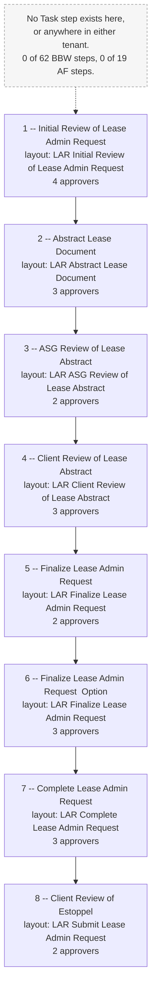

# Workflows and Forms — the corrected cardinality, and how versioning actually works

**Stated up front.** Two tenants refute what one tenant appeared to prove. Read from
`(ASG)American Freight` alone — 4 workflows, 4 form types, the same four names on both admin
screens — Form and Work Flow looked **1:1**, and [`modules/workflow/`](../../modules/workflow/) says
so in seven places. `(ASG)BBW` has **13 workflow templates, 62 steps and 6 form types**, and the
relationship collapses: only **4 of 13** workflow names match a form name, **9** workflows match no
form, and **2 form types carry no workflow at all**. Form↔Workflow is not 1:1, is not name-keyed,
and `IsWorkFlow = Yes for every form type` is not a product rule — it was an American Freight
coincidence.

Everything else in the workflow module survives the second tenant intact: steps are ordinal 1..N,
there is no branch/merge/parallel construct, the branching predicate is the human's choice of
action button, and layout-per-step-per-role is the real source of expressiveness. **The shape was
right; the counts were local.**

Two mechanisms visible only in BBW are recorded here for the first time: **workflow versioning is
done by suffixing the name** (`Lease Admin Request` / `v1` / `v2`, with 8 / 8 / 10 steps), and
**workflows chain** — one kicks off another.

| | American Freight | BBW |
|---|---:|---:|
| Workflow templates | 4 | **13** |
| Total steps | 19 | **62** |
| Form types (`TableType=2035`) | 4 | **6** |
| Workflow names matching a form name | 4 of 4 | **4 of 13** |
| Form types with no workflow | 0 | **2** |
| Steps of type `Task` | **0** | **0** |

Sources: [`../../tenants/bbw-workflow-steps.json`](../../tenants/bbw-workflow-steps.json),
[`../../tenants/bbw-platform-inventory.json`](../../tenants/bbw-platform-inventory.json),
[`../../tenants/af-counts.json`](../../tenants/af-counts.json). Both tenants on build
`26.09.0.113`, captured 2026-09-13. **Observed**; joins **Derived**. Approver identities are
deliberately not recorded anywhere in this corpus — counts only.

---

## The 13 BBW workflow templates

**Observed.**

| Workflow template | `WorkFlowTemplateID` | Steps | Matching form type? |
|---|---:|---:|:--:|
| ASC 842 Tracking | `2475` | 2 | **yes** |
| Cotenancy Update | — | 2 | no |
| Implementation Workflow - Document Abstraction | — | 2 | no |
| Implementation Workflow - Financial Abstraction | — | 6 | no |
| **Lease Admin Request** | — | **8** | **yes** |
| Lease Admin Request v1 | — | 8 | no |
| Lease Admin Request v2 | — | 10 | no |
| Lease Date Review | — | 2 | no |
| Lucernex Change Request | — | 6 | no |
| Lucernex Change Request v1 | — | 5 | no |
| User Request | — | 2 | **yes** |
| Vendor Change (Notice) | — | 4 | no |
| Vendor Changes (Integration) | — | 5 | **yes** |

The 6 BBW form types: `ASC 842 Tracking`, `Change Request`, `Lease Admin Request`, `QC Request`,
`User Request`, `Vendor Changes (Integration)`. **`Change Request` and `QC Request` have no
workflow of any name.**

**Observed.** Every one of the 62 steps is `type = Form`. Approval levels observed across the whole
set are exactly two: `Ad Hoc` and `Member`.

**Observed.** BRD-24's eight `Lease Admin Request` steps are visible here for the first time — the
live process the rebuild has to reproduce.

**Observed**, [`../../tenants/bbw-workflow-steps.json`](../../tenants/bbw-workflow-steps.json),
`WorkFlowTemplateID` `2472`. Every one of the eight is `type = Form` with
`approvalLevel = Member`; `approverCount` runs 2–4. Approver identities are deliberately not recorded
anywhere in this corpus.

**Derived — four things the diagram makes visible that the table does not.**

1. **The ordering is a plain 1..N sequence with no branch, merge or parallel construct.** What looks
   like branching — step 6 being a variant of step 5 — is two ordinal steps, not a fork.
2. **Two steps share one layout.** Steps 5 and 6 both render
   `LAR Finalize Lease Admin Request(Approvers)`, so the layout is not a step identity.
3. **Step 8 renders the *submit* layout.** `Client Review of Estoppel` points at
   `LAR Submit Lease Admin Request`, which is layout `98946` — the one carrying **19 of the tenant's
   54 conditional-field clauses**
   ([`../page-layouts/`](../page-layouts/#conditional-fields--used-and-the-stored-shape-is-now-known)).
   The conditional engine's whole production job is making that one form change shape by
   `Issue.LAR_RequestType`, and it is reached from two different points in this process.
4. **The `Task` step type is in the vocabulary and used nowhere.** Half the step model is unexercised
   across both tenants, and the `Task Templates` count is zero. It is drawn above as an unattached
   note because that is exactly its status: defined, and connected to nothing.

**Inferred**, and worth stating because the diagram will otherwise be read as more than it is: the
**edges** are the ordinal numbering, not an observed transition table. The branching predicate is the
human's choice of action button on the step's form, so the real runtime graph may skip steps. No
instance has been observed executing.

---

## Workflows are tenant-authored — they do **not** fork from a published set

**Observed.** Applying the same name-join test that established the page-layout publish-and-fork
model: **only 2 of American Freight's 4 workflow templates share a name with any of BBW's 13** —
`Lease Admin Request` and `User Request`. There is **no clustered id-offset block** of the kind the
layouts show (`+2626…+2677` across 58 of 80 shared layouts), and BBW carries locally-cloned `v1` /
`v2` variants that AF does not.

**Derived, and it bounds a model that was at risk of being over-generalised.** The publish-and-fork
reading — one ASG template set exported, cloned into each tenant with new ids, then drifting — is
**specific to page layouts**. It does not describe workflows. Workflows are **genuinely
tenant-authored**.

| | Page layouts | Workflow templates |
|---|---|---|
| Shared by name | **80 of 93 / 88** | **2 of 13 / 4** |
| Shared ids | 0 | 0 |
| Clustered id-offset block | **Yes**, `+2626…+2677` | **No** |
| Reading | Published once, cloned, then forked | Authored independently per tenant |

**Derived, for Hub/Spoke.** These two subsystems belong on **different sides of the line**. Layouts
have a Hub template set that Spokes receive; workflow configuration is Spoke-native. A design that
publishes both from the Hub would be imposing a model the incumbent does not use — and a migration
that expects to find a shared workflow baseline will not find one.

## Versioning by name suffix

**Observed.** Five of the 13 templates are versions of two processes:

| Process | Variants | Steps |
|---|---|---|
| Lease Admin Request | base, `v1`, `v2` | 8, 8, 10 |
| Lucernex Change Request | base, `v1` | 6, 5 |

**Derived.** There is no version column, no effective-date pair and no supersedes pointer anywhere in
the captured template grid — the version lives in the **name**. Three consequences follow:

1. **Which variant is current cannot be read from the data.** `v2` has the most steps and `base` has
   the same count as `v1`; none of that establishes ordering or currency.
2. **In-flight instances are presumably pinned to the template they started on** — that is the usual
   reason to copy rather than edit a template — but the pinning mechanism is unobserved.
3. This is the *same* pattern as the contract wizard's `Step 2`…`Step 5` sub-layouts
   ([`../page-layouts/`](../page-layouts/#sub--a-reusable-section-attached-to-a-layout-rather-than-to-navigation)).
   **Lucernex encodes ordering and versioning in names in at least two subsystems.** A rebuild
   should treat that as a defect to fix, not a convention to copy.

**Open question.** Does creating a new version copy the template's steps, actions and per-step
layouts, or reference them? A 10-step `v2` next to an 8-step base suggests a copy that was then
edited, but the layouts each step points at may still be shared.

### Currency is recorded — in free text, in the `Description` column

**Observed**, `bbw-admin/08-manage-work-flows.jpg`. The grid's `Description` column is empty on nine
of the 13 templates and carries an archive note on exactly the versioned ones:

| Template | `Description` |
|---|---|
| Lease Admin Request | *(empty)* |
| Lease Admin Request `v1` | *"Workflow has been archived and replaced on 09.22.25"* |
| Lease Admin Request `v2` | *"Workflow has been archived and replaced on 03.26.26"* |
| Lucernex Change Request | *(empty)* |
| Lucernex Change Request `v1` | *"Archived and replaced with new workflow on 10.02.25"* |

**Derived, and it answers this document's first open question.** The **live** Lease Admin Request is
the **unsuffixed** one. The `v1` and `v2` suffixes mark *superseded* templates, not successive
improvements — which inverts the natural reading of the names, and is why the step counts (8, 8, 10)
looked unorderable. The same holds for Lucernex Change Request.

**Derived, and it sharpens rather than softens the finding above.** There *is* a supersession record
— a date, and the fact of replacement — but it is **prose in a free-text field**, written by hand, in
`MM.DD.YY`. Nothing queries it, nothing enforces it, nothing stops a template being archived without
the note being written, and the three dates use two different years' conventions with no year
boundary check possible. A rebuild needs `status`, `supersededBy` and `supersededOn` as real columns;
Lx has an administrator's habit.

**Still open**, and unchanged: what pins an in-flight instance to the template it started on. An
archive note does not answer that.

---

## What the second tenant does *not* change

**Observed in both tenants**, and therefore safe to build against:

| Finding | Status |
|---|---|
| A **Form IS an Issue Type** — `TableType=2035` (`Issue Type Code`); the record a Form produces is an `Issue` | Holds |
| A **Custom List is a Form without the workflow** | Holds — and BBW's 2 workflow-less form types are the first direct instance of the workflow-less case appearing in `Manage Forms` itself |
| Steps are **ordinal 1..N**, no branch/merge/parallel | Holds across all 62 BBW steps |
| The branching predicate is **the human's choice of action button** | Holds |
| **Layout-per-step-per-role** — the same record shows a different field surface at each stage | Holds; BBW's `formOrTask` values follow the same `<prefix> <step name> (<audience>)` pattern |
| The only condition language is a raw JavaScript blob | Holds — and BBW adds a second one, below |
| **Zero `Task` steps** | Holds. `StepType=Task` exists in the vocabulary; **0 of 62** BBW steps and **0 of 19** AF steps use it, and Task Templates = 0. Half the step model is unobserved in both tenants |

---

## Two mechanisms only BBW shows

**Observed**, [`../../tenants/bbw-vs-american-freight.md`](../../tenants/bbw-vs-american-freight.md):

1. **Workflows chain.** One workflow kicks off another. The `WorkFlowTemplateStepAction` flag bundle
   already documented in [`modules/workflow/step-actions.md`](../../modules/workflow/step-actions.md)
   includes "spawn another workflow" — BBW is where it is actually used. **Derived:** the two
   `Implementation Workflow - *` templates (Document Abstraction, 2 steps; Financial Abstraction,
   6 steps) look like a chained pair, but which spawns which is unobserved.
2. **A `Conditional Workflow JS` field** holds workflow-level rules as **JavaScript**, separate from
   the layout-level `conditionalFieldsConfig`. **Derived:** there are therefore *two* independent
   JavaScript escape hatches in the product — `IsEnabledLxJSCode` on a step action, and
   `Conditional Workflow JS` on a workflow. Neither has been read.

**Derived.** Both matter for the rebuild in the same way: they are the places where the declarative
model ran out and the vendor reached for code. Any ASG Edge+ workflow design should expect to need
an equivalent escape hatch, and should decide deliberately what form it takes rather than
discovering the need late.

---

## Routing — a correction carried forward

**Previously documented** as "routing is by organisational position, not by name". **Corrected** in
[`bbw-vs-american-freight.md`](../../tenants/bbw-vs-american-freight.md): in practice routing
resolves to lists of **named individuals**. Approval levels observed are `Ad Hoc` and `Member`, and
`approverCount` per step ranges up to 5.

**Derived.** Position-based routing is what the model *supports*; named-individual routing is what
the tenants *use*. Build the position abstraction — but expect the data to arrive as people, and
expect a migration problem when those people leave.

---

## What this means for ASG Edge+

| Finding | Consequence |
|---|---|
| Form↔Workflow is not 1:1 | No unique FK from form type to workflow. Model many workflows per form type, and form types with none |
| 2 form types have no workflow | The workflow-less form type is a real, supported state — not a misconfiguration |
| Versioning is by name suffix | Give templates a real `version` and a `supersedes` pointer, and pin running instances explicitly |
| 13 templates in one tenant, 4 in another, only 2 names shared and no id-offset block | Workflow configuration is genuinely tenant-**authored**, unlike page layouts which are published then forked. It belongs in the **Spoke** |
| 0 Task steps in 2 tenants | Task steps can be deferred. Do not delete the concept — it is in the vendor vocabulary and ASG may have it in another tenant |
| Two JavaScript escape hatches | Decide the rule-language story up front |
| Routing resolves to named individuals | Positions in the model, people in the data |

---

## Open questions

1. ~~**Which `Lease Admin Request` variant is live?**~~ **Answered** — the **unsuffixed** template.
   `v1` and `v2` each carry a hand-written *"archived and replaced"* note in the grid's `Description`
   column; the base template carries none. See
   [above](#currency-is-recorded--in-free-text-in-the-description-column). There is still no
   active/inactive column — the record is prose.
2. **What pins a running instance to a template version?** Unobserved.
3. **Which workflow chains to which?** The spawn flag is documented; the actual edges are not.
4. **What is in `Conditional Workflow JS`?** Never read, in either tenant.
5. **Why do 9 workflows have no form type?** Candidates: they attach to a Task or an entity rather
   than an Issue; they are named differently from the form they serve; or they are inactive.
   The `formOrTask` column on each step names a layout, not a form type, so it does not settle this.
6. **Are `Change Request` and `QC Request` really workflow-less, or served by the similarly-named
   `Lucernex Change Request`?** A name-based join cannot tell. Needs the Form Type property editor
   opened on both, reading `WORK FLOW field set?`.
7. **What does a `Task` step do?** Unobserved in both tenants. `WorkFlowTemplateStep` has 56 fields;
   the admin grid surfaces six.
