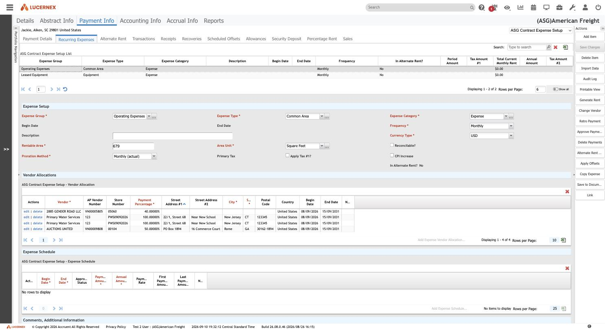
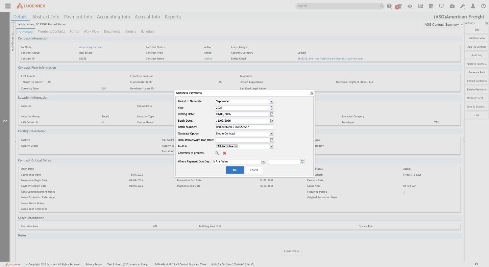

# Rent generation — what `Generate Rent` actually does

**Stated up front.** `Generate Rent` opens a **Generate Payments** dialog, and on OK it writes rows
into `PaymentTransaction` — one per expense setup, per period, per vendor allocation. The output is
recognisable on sight because the generator stamps its own naming convention into the description:
`BRNT 04/2025` for base rent, `CAM - PRS 01/31/2024-03/31/2024` for prorated CAM.

**This was established without running it.** The tenant already contains **11,426 generated payment
transactions**, so the engine's output could be read directly rather than manufactured. That is
strictly better evidence — it shows what the generator produces at scale and over time, not what one
synthetic invocation would produce.

| Property | Value |
|---|---|
| Trigger | `Generate Rent` button on a Contract page layout → `Lx.ui.generateRentPopup(<projectEntityId>)` |
| Dialog | **Generate Payments** |
| Writes to | `PaymentTransaction` |
| Undo | `Delete Payments` → `Lx.ui.deletePaymentsPopup(<projectEntityId>)` |
| Captured | 2026-09-11, tenant `(ASG)American Freight`, build `26.08.0.46` |
| Exploration mode | **Read-only. The dialog was opened and cancelled; OK was never pressed.** Output was characterised from the 11,426 transactions already present. |

## The four layers, seen live

[`setup-schedule-transaction-pattern.md`](setup-schedule-transaction-pattern.md) derived a four-layer
pattern from the schema. Opening a real contract shows all four, and shows what happens when one is
missing.



| Layer | Screen | On contract 506967 |
|---|---|---|
| **Clause** — what is owed and how | Payment Info → Recurring Expenses | **2 rows**: Operating Expenses / Common Area, and Leased Equipment. Both Monthly, USD, Rentable Area 679 sq ft, **Proration Method `Monthly (actual)`** |
| **Allocation** — who is paid | Vendor Allocations grid | **4 rows** with `Payment Percentage` — 40%, 100%, 100%, 50% — each with its own address and begin/end dates |
| **Schedule** — the amounts, period by period | Expense Schedule grid | **empty** |
| **Transaction** — what was posted | Payment Info → Transactions | **empty** |

**Derived, and it is the operative rule:** the clause describes the obligation but carries no money.
`Total Current Monthly Rent` on both setups reads **$0.00** because the Expense Schedule is empty.
**Generation reads the Schedule layer, not the Setup layer** — so running `Generate Rent` on this
contract would produce nothing. The clause says "monthly common-area charge, prorated on actual
days, split across four vendors"; the schedule says how much, and without it there is nothing to
post.

For the rebuild: **amounts live on the schedule, not the clause.** A design that puts the amount on
the setup record will not be able to represent a rent step, an escalation, or a mid-term change.

## The Generate Payments dialog



**Observed** — the full parameter surface:

| Parameter | Value seen | Notes |
|---|---|---|
| `Period to Generate` | September | 12 values, January–December |
| `Year` | 2026 | spinner |
| `Posting Date` | 01/09/2026 | the GL date |
| `Batch Date` | 11/09/2026 | today |
| `Batch Number` | `RNT20260911-060054587` | **auto-generated**: `RNT` + date + sequence |
| `Generate Option` | **Single Contract** | see below |
| `Default/Overwrite Due Date` | *(blank)* | optional override |
| `Portfolio` | All Portfolios | tenant has three: `Accounting Purposes`, `Global`, `Test` |
| `Contracts to process` | *(blank)* | picker, used in the multi-contract modes |
| `Where Payment Due Day` | Is Any Value | filter on the due day |

### `Generate Option` — four scopes

```
Single Contract
Payables  All Contracts
Receivables  All Contracts
All Contracts
```

**This is the safety-relevant control.** The button is launched with a contract id, and the dialog
defaults to `Single Contract`, but three of the four options run across **every contract in scope**.
A rebuild offering the same capability should make the scope impossible to mistake — here, a dialog
that reads "All Portfolios" while scoped to one contract is genuinely ambiguous.

Note also the **payables/receivables split**: the same engine generates both money owed and money
due, and they can be run independently.

### `Where Payment Due Day` — the filter grammar again

```
Is Any Value · Last Day Of the Month · = · > · >= · < · <=
```

**Derived:** this is the same operator vocabulary as the conditional-field engine
([`../layouts-and-forms/conditional-fields.md`](../layouts-and-forms/conditional-fields.md)), which
uses `is any value`, `=`, `<>`, `>`, `>=`, `<`, `<=` for numeric drivers. Lucernex reuses one filter
grammar across unrelated features. Worth copying — one grammar, learned once.

## What the generator produces

Characterised from a 600-row sample of the 10,771 transactions with a positive amount.
**Observed.**

### The description is the generator's signature

| Prefix | Count | Means |
|---|---:|---|
| `BRNT` | 263 | Base rent |
| `RET` | 116 | Real estate taxes |
| `CAM - PRS` | 104 | Common area, **prorated** |
| `INS` | 91 | Insurance |
| `ELEC` | 6 | Electricity |
| `CAM - FIXED` | 6 | Common area, **fixed** |
| `INS - PRS` | 3 | Insurance, prorated |
| `UTIL`, `MISC`, `WTR` | 2–3 each | Utilities, miscellaneous, water |

Format is `<MNEMONIC> MM/YYYY` for a whole period (`BRNT 04/2025`) and
`<MNEMONIC> - PRS <from>-<to>` for a partial one (`CAM - PRS 01/31/2024-03/31/2024`).

**`PRS` versus `FIXED` is the proration method surfacing in the description** — the same
`Proration Method` field seen on the Expense Setup (`Monthly (actual)`). The generator records *how*
it computed the row, in the row.

### Expense types generated

| Type | Count |
|---|---:|
| Base Rent | 258 |
| Real Estate Taxes | 112 |
| Common Area | 102 |
| Insurance | 91 |
| Electric | 6 |
| Common Area - Fixed | 6 |
| **Base Rent DC** | 5 |
| **Real Estate Taxes DC** | 4 |
| **Insurance DC** | 3 |
| Utilities - Other | 3 |

The `DC` variants are **Distribution Centre** — a parallel set of expense types for a different
property class, which explains the `Distribution Center Code` drop-down (`TableType=2028`) in the
code-table registry. A rebuild needs expense type to be extensible per property class, not a fixed
enum.

### Amounts and flags

- **`totalAmount` ≠ `invoiceAmount`.** Example: 13,311.80 against 12,924.08 — the difference is tax.
  `PaymentTransaction` carries `primaryTax` plus `APExportTax1Number`…`Tax4Number`, so up to four tax
  components are tracked per row.
- **Every sampled row: `processedFlag = true`, approval status `Approved`.** Generated payments
  arrive already processed and approved in this tenant.
- **Every sampled row: `exportBatchNumber = null`.** The batch number shown in the dialog is not the
  same field. **Inferred:** `exportBatchNumber` is stamped by a later AP-export step that has never
  been run here — consistent with `apExportBaseNumber`, `apExportPrepaidNumber` and the eight
  `AccountNumber1..8` GL columns also existing on the record. Generation and GL export are two
  distinct stages, and only the first has happened.

## Rules

| ID | Rule | Confidence |
|---|---|---|
| `CON-R-145` | `Generate Rent` reads the **Expense Schedule** layer. A contract whose schedule is empty generates nothing, regardless of how many Expense Setups exist. | Derived |
| `CON-R-146` | Generation is parameterised by period (month + year), posting date, batch date and an auto-generated batch number of the form `RNT<yyyymmdd>-<sequence>`. | Observed |
| `CON-R-147` | Generation scope is one of four: `Single Contract`, `Payables — All Contracts`, `Receivables — All Contracts`, `All Contracts`. Payables and receivables are separately runnable. | Observed |
| `CON-R-148` | A generated transaction's description encodes the expense mnemonic, the period, and whether the amount was prorated (`- PRS`) or fixed (`- FIXED`). | Observed |
| `CON-R-149` | `totalAmount` is `invoiceAmount` plus tax; up to four tax components are carried per transaction. | Observed |
| `CON-R-150` | Generated transactions are created already `processed` and `Approved` in this tenant. Whether that is configuration or engine behaviour is unresolved. | Observed / Inferred |
| `CON-R-151` | `exportBatchNumber` is not set by generation. GL export is a separate, later stage. | Derived |
| `CON-R-152` | One Expense Setup fans out to many transactions via its **Vendor Allocation** rows, each carrying a `Payment Percentage`. Allocations have their own begin and end dates, so the split can change mid-term. | Observed |

## Why the button was not pressed

The contract under examination has an empty Expense Schedule, so invoking generation would have
written a batch record and produced no transactions — cost without evidence. The alternative was a
contract carrying real money (the largest is `07820 - Kansas City ORDC MO` at **$7,755,430.66**
aggregate total rent), where generating payments would create financial records in a tenant other
people use.

Since 11,426 generated transactions already existed, the question was answerable by observation. It
was.

**What running it would still add**, if that is wanted later: the exact row count produced from a
known schedule, whether it overwrites or duplicates on a re-run for the same period, and what the
`Batch Number` is actually stored against. Those need a disposable contract.

## Open questions

1. **Does re-running a period overwrite or duplicate?** The dialog has `Default/Overwrite Due Date`,
   which hints at overwrite semantics, but the field concerns due dates rather than rows.
2. **Where is the dialog's `Batch Number` stored**, given `exportBatchNumber` is null on every
   generated row?
3. **Are generated payments always auto-approved**, or is this tenant configured to skip approval?
   It matters — `Approve Payments` exists as a separate action and the Rent Payment Review/Approval
   workflow has six steps.
4. **What populates the Expense Schedule** in the first place? Something must turn a clause into
   dated amounts; that step has not been observed.
5. **What do the `DC` expense types do differently**, beyond naming?
6. **What triggers AP export**, and what writes `exportBatchNumber`, `apExportBaseNumber` and the
   eight `AccountNumber` columns?
