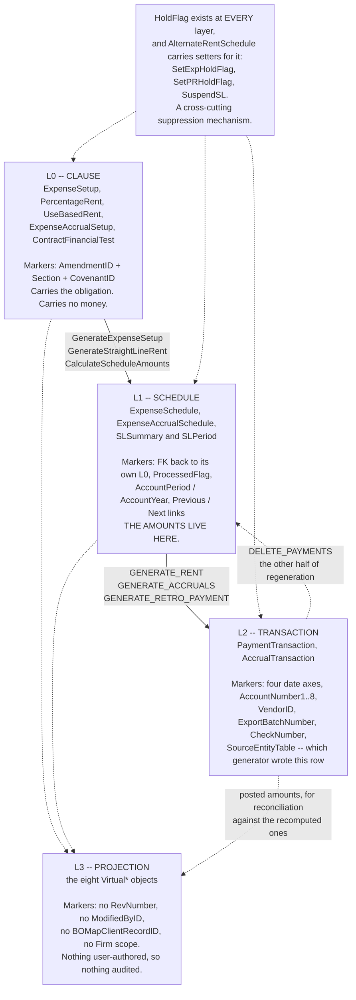
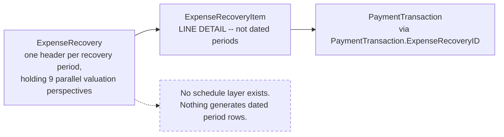

# The Clause / Schedule / Transaction / Projection pattern

**Stated up front — the hypothesis is confirmed, with one correction and one exception.**

Confirmed: Lucernex's financial engine is **one architectural pattern instantiated five times**.
Correction: it is **four layers, not three**. The `Virtual*` objects are not reporting sugar — they
are the layer where breakpoint arithmetic, cap/floor clamping and the actual-versus-projected
distinction actually live, and percentage rent cannot be derived without them.
Exception: **expense recovery (CAM) does not instantiate the pattern.** It is a reconciliation grid
with no schedule layer, and treating it as an instance of the pattern would be the single most
expensive modelling mistake ASG Edge+ could make here.

| Layer | Role | Cardinality | Written by | Mutable after? |
|---|---|---|---|---|
| **L0 — Clause** | The negotiated lease term, as abstracted by a human | 1 per clause per amendment | Analyst / abstraction workflow | Yes, versioned by `RevNumber` + `AmendmentID` |
| **L1 — Schedule** | The clause expanded into dated period rows with amounts | N per clause | A named generator command | Yes, until `ProcessedFlag` is set |
| **L2 — Transaction** | A posted, GL-coded, vendor-bound money movement | N per schedule row (or 1:1) | A named generator command | Guarded by `ProcessedFlag` / `ConfirmedFlag` / `ExportBatchNumber` |
| **L3 — Projection** | Forward-looking computed periods, never stored | Computed at read time | The platform, on read | N/A — not persisted |

Source for the whole table: `_lucernex_objects_summary.txt` (field inventory) and
`docs/data-fields/*.md` (labels, scope, group taxonomy). **Observed.**



**The exception, drawn separately because it is the expensive mistake.** Expense recovery / CAM
looks like an instance of the pattern and is not — **there is no `ExpenseRecoverySchedule`, and no
object plays L1**:



**Derived.** CAM is a **reconciliation grid**, not a generated schedule: a header, its line items, and
a posting. `Allowance` is the second near-miss for the same reason —
`Allowance` to `AllowanceTransaction` with `RequestDate` / `RequestAmount` / `ReceiveDate` /
`ReceiveAmount`, which is a claim shape, not a schedule. See
[`expense-recovery-cam.md`](expense-recovery-cam.md).


---

## 1. The five instantiations

| # | Family | L0 — Clause | L1 — Schedule | L2 — Transaction | L3 — Projection |
|---|---|---|---|---|---|
| 1 | **Recurring expense / base rent** | `ExpenseSetup` (96) | `ExpenseSchedule` (51) | `PaymentTransaction` (118) | `VirtualExpenseForecastPeriod` (20) |
| 2 | **Expense accrual** | `ExpenseAccrualSetup` (31) | `ExpenseAccrualSchedule` (31) | `AccrualTransaction` (55) | `VirtualExpAccrualForecastPeriod` (13) |
| 3 | **Percentage rent** | `PercentageRent` (45) + `PercentageRentBreakpoint` (40) | `VirtualPercentageRentPeriod` (38) † | `PaymentTransaction` via `PercentageRentID` | `VirtualSalesPeriod` (66), `VirtualPRPAggregate` (16), `VirtualPRAccrualPeriod` (20) |
| 4 | **Use-based rent** | `UseBasedRent` (23) + `UseBasedRentBreakpoint` (31) | `VirtualUseBasedRentPeriod` (23) † | `PaymentTransaction` | `VirtualUsagePeriod` (66) |
| 5 | **Straight-line / ASC 842 / IFRS 16** | `ContractFinancialTest` (93) + Contract's Accounting Assumptions (43) | `SLSummary` (134) → `SLPeriod` (79) | posting is in-place (`PostedDate`, `LastBalancePosted`) | `SLSummary` fiscal-year rollups (25 Roll Forward Report fields) |

† Families 3 and 4 are the correction: their L1 is *itself* a `Virtual*` object. The schedule is
computed, not stored. This is the deepest structural difference between the fixed-amount families
(1, 2) and the variable-amount families (3, 4), and it follows directly from the domain: a
fixed-rent schedule can be materialised the day the lease is signed; a percentage-rent schedule
cannot exist until sales are reported. **Derived** from field inventories; the `Virtual`
naming convention's meaning is **Observed** in `docs/data-fields/virtual-sales-period.md`:
*"'Virtual' entities in this catalog are calculated projections generated at read-time rather than
persisted transactional rows, which is why none of them appear in Firm scope (a tenant cannot
customize a calculation the platform generates)."*

Field counts are from `_lucernex_objects_summary.txt`. The Manage Data Fields catalog reports
counts 1–2 lower on several objects (e.g. `ExpenseRecovery` 565 vs 567, `PercentageRent` 45 vs 44)
because the two admin screens count computed/button pseudo-fields differently. **Observed
discrepancy, not reconciled.**

### Two near-misses that are *not* instances

| Family | Why not | Correct shape |
|---|---|---|
| **Expense recovery / CAM** | No schedule layer exists. `ExpenseRecovery` (L0-ish) → `ExpenseRecoveryItem` (line detail, not periods) → posted via `PaymentTransaction.ExpenseRecoveryID`. There is no `ExpenseRecoverySchedule`. | A **reconciliation grid**: one header per recovery period holding 9 parallel valuation perspectives. See [`expense-recovery-cam.md`](expense-recovery-cam.md). |
| **Allowance** | `Allowance` (23) → `AllowanceTransaction` (20) with no schedule layer; `AllowanceTransaction` carries `RequestDate`/`RequestAmount`/`ReceiveDate`/`ReceiveAmount` — a **claim** shape, not a generated schedule. | Clause → Claim → Receipt. |

---

## 2. How to tell which layer a record is in — the discriminator test

These are the field-level signatures that separate the layers. They hold across all five families
and are the reusable part for ASG Edge+.

### L0 — Clause markers

| Marker | Present on |
|---|---|
| `AmendmentID` (`Contract Amendment ID`) — which amendment introduced this term | `ExpenseSetup`, `ExpenseAccrualSetup`, `PercentageRent`, `UseBasedRent`, `ContractTerm`, `Covenant`, `CoTenancy`, `SecurityDeposit`, `Allowance`, `ExpenseRecovery` |
| `CovenantID` — the lease clause this term implements | `ExpenseSetup`, `ExpenseAccrualSetup`, `PercentageRent`, `UseBasedRent`, `ContractTerm`, `CoTenancy`, `SecurityDeposit`, `Allowance`, `ExpenseRecovery`, `FinancialAdjustment` |
| `Section` (`Text`) — the lease paragraph reference | `ExpenseSetup`, `ExpenseAccrualSetup`, `PercentageRent`, `ContractTerm`, `CoTenancy`, `SecurityDeposit`, `Allowance`, `ExpenseRecovery` |
| `RevNumber` — optimistic-concurrency / clause revision counter | `PercentageRentBreakpoint`, `SalesExclusion`, `SalesExclusionCap`, `UseBasedRentBreakpoint`, `AlternateRentSchedule`, `ScheduledOffset`, `ExpenseAccrualSetup`, `ExpenseVendorAllocation`, `ExpenseRecovery`, `ExpenseRecoveryItem` |
| `BeginDate` / `EndDate` — the **clause** validity window, not a billing period | all L0 objects |
| `Notes` (`Textarea`) + `Description` | all L0 objects |

**Rule of thumb:** an object carrying `AmendmentID` **and** `Section` is L0. That combination
appears on no L1 or L2 object.

### L1 — Schedule markers

| Marker | Meaning | Present on |
|---|---|---|
| An FK back to its own L0 (`ExpenseSetupID`, `ExpenseAccrualSetupID`) | provenance of the generated row | `ExpenseSchedule`, `ExpenseAccrualSchedule`, `AlternateRentSchedule`, `ExpenseAllocation`, `ExpenseVendorAllocation`, `ExpenseEscalation` |
| `ProcessedFlag` + `ProcessedDate` | "this schedule row has already produced transactions" | `ExpenseSchedule` |
| `ReadyForPaymentFlag` | approval gate before generation | `ExpenseSetup`, `ExpenseSchedule` |
| `HoldFlag` | suppression gate (see §4) | `ExpenseSetup`, `ExpenseSchedule`, `ExpenseAccrualSetup`, `PaymentTransaction`, `AccrualTransaction` |
| `CodeApprovalStatusID` + `LastApprovalChangeDate` | workflow state | `ExpenseSchedule`, `PaymentTransaction` |
| `PreviousExpenseScheduleID` / `NextExpenseScheduleID` | **the schedule is a doubly-linked list** — successive rate steps are chained, not merely date-adjacent | `ExpenseSchedule` |
| `PreviousPaymentAmount` / `PaymentAmount` / `NextPaymentAmount`, `PreviousAnnualAmount` / `AnnualAmount` / `NextAnnualAmount` | the three-way amount window that makes an escalation step legible on one row | `ExpenseSchedule` |
| `FirstPaymentAmount` / `LastPaymentAmount` | stub-period proration at the ends of the schedule | `ExpenseSchedule`, `ExpenseAccrualSchedule` |
| `AccountPeriod` / `AccountYear`, `BeginPeriod` / `BeginYear` / `EndPeriod` / `EndYear` | period-keyed, not date-keyed | `ExpenseSchedule`, `ExpenseAccrualSchedule` |

### L2 — Transaction markers

| Marker | Meaning |
|---|---|
| `PostingDate` **and** `EffectiveDate` **and** `DueDate` **and** `CoverageBeginDate`/`CoverageEndDate` | four independent date axes — GL period, economic effect, cash due, service coverage. All four exist on `PaymentTransaction`. |
| `AccountNumber1..8`, `APExportBaseNumber`, `APExportPrepaidNumber`, `APExportTax1..4Number`, `ExpAccrualAcct1..4Number`, `PercentRentAccrualAcct1..4Number`, `RETaxAccrualAcct1..4Number` | GL coding, snapshotted onto the row (see [`payment-lifecycle.md` §5](payment-lifecycle.md#5-the-gl-export-contract)) |
| `VendorID` (`Employer ID`), `OrganizationID` | the counterparty and the debited org |
| `ExportBatchNumber`, `CheckNumber`, `CheckDate`, `CheckAmount` | the record has left the system |
| `SourceEntityTable` + `CodeSourceEntityID` | **polymorphic provenance** — which generator produced this row |
| `ConfirmedFlag`, `ProcessedFlag`, `PrepaidFlag`, `CreditFlag`, `OneTimeFlag`, `IsReceivable` | posting-state booleans |

`SourceEntityTable(Text)` on both `PaymentTransaction` and `AccrualTransaction` is the strongest
single confirmation that the transaction layer is **shared** across families: one table receives
posted output from the rent generator, the pass-through generator, the percentage-rent generator,
the usage generator and the property-tax generator, and records which one it came from. **Observed**
(field exists and is typed `Text` alongside a `Dropdown (Source Entity Code)` sibling).

### L3 — Projection markers

| Marker | Meaning |
|---|---|
| Object name prefixed `Virtual` | 7 objects: `VirtualSalesPeriod`, `VirtualUsagePeriod`, `VirtualPercentageRentPeriod`, `VirtualUseBasedRentPeriod`, `VirtualPRAccrualPeriod`, `VirtualPRPAggregate`, `VirtualExpenseForecastPeriod`, `VirtualExpAccrualForecastPeriod` |
| **No `RevNumber`, no `ModifiedByID`, no `ModifiedDate`, no `BOMapClientRecordID`** | nothing is user-authored, so nothing is audited or client-mapped. Note: seven of the eight Virtual objects nonetheless name a physical PG table — see open question 6 |
| No `Firm`-scope fields at all | a tenant cannot customise a computed projection (**Observed**, `docs/data-fields/virtual-sales-period.md`) |
| `IsActual(Boolean)` | distinguishes a period backed by reported data from a pure forecast — on `VirtualSalesPeriod`, `VirtualUsagePeriod` |
| `IsPosted(Boolean)` + `Posted*` mirror fields | on `VirtualPRAccrualPeriod`: `AccrualAmountThisPeriod` vs `PostedAccrualAmountThisPeriod` — computed-now versus what-was-actually-posted |

`VirtualPRAccrualPeriod` is worth singling out. It carries three computed amounts
(`AccrualAmountPriorPeriods`, `AccrualAmountThisPeriod`, `AccrualAmountTotal`) and their three
posted counterparts (`PostedAccrualAmountPriorPeriods`, `PostedAccrualAmountThisPeriod`,
`PostedAccrualAmountTotal`). That pairing **is** the reconciliation between L3 and L2 — the
platform re-computes what the accrual should be and shows it next to what was posted. ASG Edge+
should copy this idea explicitly. **Derived** from the field names.

**And it renders.** `Contract -> Accrual Info -> Percentage Rent Accruals` is `VirtualPRAccrualPeriod`
on screen, with the computed/posted pairing as adjacent columns:


**Observed**, and three details support the L3 reading directly:

1. **No `Edit` action.** Every other contract screen captured carries one; this one does not. A
   projection is not editable, which is the same fact the absent `RevNumber` / `ModifiedByID` /
   `BOMapClientRecordID` columns state from the schema side.
2. **A period picker with a `Refresh` button.** The 12 rows shown run `6/2026` to `5/2027` — a window
   selected at the top of the screen, not a stored range. That is a read-time computation with a
   parameter, which is what "generated at read-time" looks like in the UI.
3. **The computed columns read `$0.00`; the posted columns are *blank*.** Zero and unposted are
   rendered differently. A rebuild that stores the projection with a non-nullable posted amount
   loses that distinction.

**It does not settle open question 6.** Whether the rows are computed per request or read from a
materialised `virtual_pr_accrual_period` table is invisible from the screen — a `Refresh` button is
equally consistent with recompute-now and with re-read-the-cache.


---

## 3. The generators are named, first-class commands

This is the decisive evidence that L1 and L2 are *generated* rather than incrementally maintained.
Lucernex exposes the generators as `sTYPE_SUBMITBUTTON` pseudo-fields in the Manage Data Fields
catalog — 32 of them on `Contract` alone, under `Summary Information / Summary Page Buttons`.
**Observed**, `docs/data-fields/contract.md`.

| Command (internal name) | Label | Produces / affects |
|---|---|---|
| `GenerateExpenseSetup` (on `ExpenseSetup`) | Generate Expense Setup | L0 — from the Expense Setup Wizard inputs |
| `GenerateContractTerms` (on `ContractTerm`) | Generate Contract Terms | L0 — N option terms from term length + option count |
| `CalculateScheduleAmounts` (on `ExpenseSchedule`) | Calculate Amounts | **L1** — recomputes the schedule's amounts in place |
| `GENERATE_RENT` | Generate Rent | **L2** — `PaymentTransaction` rows from `ExpenseSchedule` |
| `GENERATE_PASS_THROUGH_PAYMENTS` | Generate Pass-through Payments | **L2** — recovery/pass-through payments |
| `GENERATE_ASSET_RENT` | Generate Asset Rent | **L2** — equipment-contract rent |
| `GENERATE_RETRO_PAYMENT` | Generate Retro Payment | **L2** — catch-up for a retroactive rate change |
| `PROCESS_PAYMENT`, `PROCESS_MID_MONTH_PAYMENT`, `PROCESS_USAGE_PAYMENT` | Process Payment / Mid Month / Usage | **L2** state advance |
| `GENERATE_ACCRUALS`, `GENERATE_EXPENSE_ACCRUALS`, `GENERATE_ESTIMATED_ACCRUALS`, `GENERATE_PERCENTAGE_RENT_ACCRUALS` | Generate … Accruals | **L2** — `AccrualTransaction` |
| `GenerateStraightLineRent`, `GenerateFASBSchedule`, `GenerateIFRS16Schedule` | Generate Straight-line / 842 / IFRS 16 Rent Schedule | **L1** — `SLSummary` + `SLPeriod` |
| `DELETE_PAYMENTS`, `DELETE_ACCRUAL_PAYMENTS`, `DELETE_ASSET_PAYMENTS` | Delete … Payments | **L2 teardown** — the other half of regeneration |
| `APPLY_OFFSETS` | Apply Offsets | applies `ScheduledOffset` / `VariableRentOffset` against L2 |
| `CPI_ADJUSTMENTS`, `IMPORT_CPI_DATA` (on `ProjectEntity`) | CPI Adjustments / Import CPI Data | escalation index ingest + application |
| `RECONCILE`, `RECONCILE_RECEIPT` | Reconcile / Reconcile Receipt | CAM and receipt reconciliation |
| `RECOVERY_SETUP`, `UPDATE_ESCROW` | Recovery Setup / Update Escrow | CAM escrow maintenance |
| `IMPORT_INVOICE` | Import Invoice | `LandlordInvoice` ingest |
| `ALTERNATE_RENT_WIZARD` | Alternate Rent Wizard | `AlternateRentSchedule` |
| `COPY_EXPENSE_SETUP`, `COPY_PAYMENT_TRANSACTION` | Copy Expense / Copy Transaction | clone-with-new-dates |
| `CHANGE_EXPENSE_ALLOCATION_VENDOR` | Change Vendor | rewrites `ExpenseVendorAllocation` |
| `PLAN_FORECAST` | Plan/Forecast | drives `VirtualExpenseForecastPeriod` |
| `ModifyStraightLineStatus` | Modify Straight-Line Status | L1 state for SL |
| `APPROVE_PAYMENTS`, `EXTEND_CONTRACTS`, `EXTEND_PAYMENTS` (on `ProjectEntity`) | Approve / Extend | **batch** variants, scoped above a single contract |

### The regeneration contract

`DELETE_PAYMENTS` + `GENERATE_RENT` existing as a *pair* is the proof that L2 is derived output,
not source data: the supported way to correct a rent schedule is to delete the generated
transactions and regenerate them. `ExpenseSchedule.ProcessedFlag`/`ProcessedDate` is the guard
that stops the same schedule row generating twice, and `ExportBatchNumber` /
`CheckNumber` on `PaymentTransaction` are the guards that stop a row that has already left for AP
being deleted silently. **Derived** — the flags exist and the commands exist; the exact enforcement
(does `DELETE_PAYMENTS` refuse an exported row?) is an open question for the live UI.

---

## 4. The `HoldFlag` cascade

`HoldFlag(Boolean)` appears at every layer of family 1 and 2:

```
ExpenseSetup.HoldFlag          (L0)  — suspend the whole clause
ExpenseAccrualSetup.HoldFlag   (L0)
ExpenseSchedule.HoldFlag       (L1)  — suspend one period step
PaymentTransaction.HoldFlag    (L2)  — suspend one posted payment
AccrualTransaction.HoldFlag    (L2)
```

and `AlternateRentSchedule` carries *setters* for it — `SetExpHoldFlag(Boolean)`,
`SetPRHoldFlag(Boolean)`, `SuspendSL(Boolean)` — i.e. entering an alternate-rent period can
programmatically hold the normal expense schedule, hold percentage rent, and suspend straight-line
accounting. `Covenant.HoldAmountInSchedLiability(Boolean)` does the equivalent for the ASC 842
liability.

That is a genuine cross-cutting suppression mechanism, and it is the one piece of the pattern most
likely to be missed in a rebuild. **Observed** (fields exist); the propagation semantics (does a
held `ExpenseSetup` prevent `GENERATE_RENT` from producing rows, or produce them already held?) is
an open question.

---

## 5. The pattern, specified for ASG Edge+

```
FinancialClause            (abstract L0)
  contractId, amendmentId?, covenantId?, section?, notes?
  effectiveFrom, effectiveTo          // clause window
  revision                            // optimistic lock + clause version
  onHold: boolean
  classification: { group, type, category }   // -> GL + accounting treatment
  currency

ScheduleRow                (abstract L1)
  clauseId (FK to its L0)
  periodStart, periodEnd, accountingPeriod, accountingYear
  amount: BigDecimal, annualAmount: BigDecimal
  previousRowId?, nextRowId?          // linked list of rate steps
  firstPaymentAmount?, lastPaymentAmount?   // stub proration
  approvalStatus, onHold, processed, processedAt

PostedTransaction          (abstract L2)
  contractId
  sourceKind, sourceId                // polymorphic provenance
  postingDate, effectiveDate, dueDate, coverageStart, coverageEnd
  totalAmount: BigDecimal, taxAmounts: BigDecimal[4]
  counterpartyId (vendor), organizationId
  glCoding: GlCoding                  // see payment-lifecycle.md §5
  onHold, processed, confirmed, exportBatchRef?, settlementRef?

PeriodProjection           (abstract L3, never persisted)
  contractId, periodStart, periodEnd
  isActual: boolean
  computedAmount: BigDecimal
  postedAmount: BigDecimal?           // for reconciliation display
```

### The five instantiations, as a build order

| Order | Instance | L0 | L1 | L2 | Why this order |
|---|---|---|---|---|---|
| 1 | Recurring expense | `ExpenseSetup` | `ExpenseSchedule` | `PaymentTransaction` | Blocks ASG component #21 (Payment Processing) directly |
| 2 | Escalation | `ExpenseEscalation` + `EscalationIndex` | modifies L1 in place | — | Cannot generate a correct schedule without it |
| 3 | Percentage rent | `PercentageRent` + breakpoints | computed | `PaymentTransaction` | Blocks ASG component #22 |
| 4 | Accrual | `ExpenseAccrualSetup` | `ExpenseAccrualSchedule` | `AccrualTransaction` | Blocks ASG component #23 |
| 5 | Use-based rent | `UseBasedRent` + breakpoints | computed | `PaymentTransaction` | Structurally identical to (3); near-free once (3) is done |

Items 3 and 5 share their entire shape: `VirtualUsagePeriod` (66 fields) and `VirtualSalesPeriod`
(66 fields) are the same object with `Sales`→`Usage` and `PRP`→`UBRP` prefix substitution.
Confirmed field-by-field: both carry `BillingBucket*`/`ReportingBucket*` date pairs,
`Gross*PeriodAmount`/`Net*PeriodAmount`, eight `*BreakpointAmount1..8`, eight `*BreakpointRentDue1..8`,
eight `*PastBreakpoint1..8`, `*CapFloorAdjustedRent`, `*RentDue`, `*TotalRent`, `*PeriodRentPaid`,
`IsActual`. **Observed.** A rebuild should implement one generic tiered-rent engine parameterised
by measure (`sales amount` | `sales count` | `usage count` | `usage share`), not two.

---

## Open questions

Ranked by what most changes the ASG Edge+ schema.

1. **Does `GENERATE_RENT` regenerate idempotently, or does it append?** The presence of
   `ExpenseSchedule.ProcessedFlag`/`ProcessedDate` implies idempotence, but `DELETE_PAYMENTS`
   existing implies the correction path is delete-then-regenerate. Whether ASG Edge+ needs an
   append-only transaction ledger with reversals (safer for SOX) or a delete-and-rebuild model
   turns entirely on this. **Confirm in the live UI: run `GENERATE_RENT` twice on the same
   contract and compare the Payment Transaction list.**
2. **Does `DELETE_PAYMENTS` refuse rows that carry an `ExportBatchNumber` or `CheckNumber`?**
   Determines whether "exported to AP" is a hard immutability boundary.
3. **What are the members of `Dropdown (Source Entity Code)`?** This enumerates every generator
   that can write to `PaymentTransaction` and is therefore the complete list of L2 producers. It is
   directly readable from Manage Firm Drop Downs / Client Drop Downs (screen 007 route).
4. **Does `ExpenseSetup.HoldFlag` block generation, or generate-then-hold?** Changes whether hold
   is a schedule-time or a payment-time concept.
5. **Is `ExpenseSchedule.PreviousExpenseScheduleID`/`NextExpenseScheduleID` maintained by the
   generator, or hand-editable?** Both are declared `Text` rather than `Expense Schedule ID` in the
   object model even though Manage Data Fields types them `sTYPE_EXPENSE_SCHEDULE` — a typing
   inconsistency worth resolving before copying the linked-list design.
6. **Is the `Virtual*` layer materialised, and if so how?** This is the sharpest unresolved
   contradiction in the corpus. `docs/data-fields/virtual-sales-period.md` states plainly that
   Virtual entities are *"calculated projections generated at read-time rather than persisted
   transactional rows"* — but seven of the eight Virtual objects **do** name a Postgres table in
   `_lucernex_objects_summary.txt` (`virtual_usage_period`, `virtual_percentage_rent_period`,
   `virtual_pr_accrual_period`, `virtual_p_r_p_aggregate`, `virtual_use_based_rent_period`,
   `virtual_expense_forecast_period`, `virtual_exp_accrual_forecast_period`). Only
   `VirtualSalesPeriod` has a blank PG table, alongside six unrelated objects
   (`AuditColumn`, `BidPackageBreakout`, `BudgetColumnItemValue`, `BudgetOptionTemplate`,
   `PaymentTransactionFullImport`, `Security`). The likely reconciliation is **materialised views
   or cache tables** — computed by the platform, physically landed, never user-edited — which is
   consistent with the absence of `RevNumber`/`ModifiedByID`/Firm scope on every Virtual object.
   ASG Edge+ needs this settled before deciding whether L3 is a query, a materialised view, or a
   cached table with an invalidation trigger. **Confirm via `walkHierarchy.jsp` →
   `Schema With Fields`, and by checking whether a Virtual row survives a sales edit without
   recalculation.**
7. **Where does the Alternate Rent suppression get released?** `AlternateRentSchedule.SetExpHoldFlag`
   sets a hold; nothing observed clears it. Confirm whether exiting an alternate-rent window
   auto-releases the hold or requires manual action.
