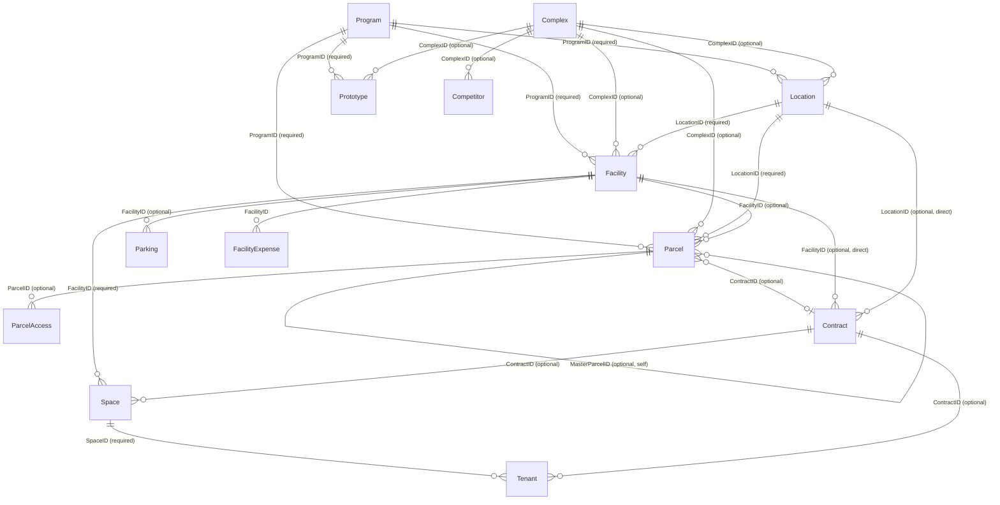

# Facilities, Locations & Sites — data model

**Stated up front.** Twenty objects, 918 fields. Four of them — `Facility`, `Location`, `Parcel`,
`Prototype` — are full `ProjectEntity` subtype roots, each independently ownable, each carrying its
own copy of the supertype's identity block (`ProjectEntityID` typed `Number`, not `Entity ID` — see
[`../../data-model/project-entity.md`](../../data-model/project-entity.md)). `Complex` and `DMA` are
firm-global reference data with no `ProjectEntityID` at all. The remaining fourteen are children,
scoped either to one of the four subtypes by a hard FK, or generically to any `ProjectEntity` via
the soft `ProjectEntityID` column, or both at once.

Source: `_lucernex_objects_summary.txt` (**Observed**, full field lists reproduced below verbatim),
cross-checked against [`../../mindmap/edges.json`](../../mindmap/edges.json) (**Derived** FK
resolution) and, where a per-entity Data Fields catalog exists, against
[`../../data-fields/`](../../data-fields/) (an independently captured admin-screen source — see
§5 for where the two sources disagree and why that disagreement is itself informative).

## 1. The object roster

| Object | PG table | Fields | Role | Notes |
|---|---|---:|---|---|
| `Facility` | `facility` | 133 | `subtype_root` | The building/premises. Required parent: `Location`, `Program`. |
| `Location` | `location` | 141 | `subtype_root` | The site/"Center". Required parent: `Program`. No parent among the four subtypes points at it except `Facility`/`Parcel`. |
| `Parcel` | `parcel` | 154 | `subtype_root` | The legal land parcel. Required parent: `Location`, `Program`. Self-references via `MasterParcelID`. The most cross-linked object in the module (6 outbound FKs into this module alone). |
| `Prototype` | `prototype` | 113 | `subtype_root` | The reusable store/building design template. Required parent: `Program`. Carries `LocationID`/`ComplexID` in the schema but **not** in its admin Data Fields catalog — see §5. |
| `Complex` | `complex` | 45 | `firm_global` | The shopping-center/campus container. No `ProjectEntityID`, no `FirmID`-style scoping column visible, no upward FK to anything in this module. Sits *above* the four subtypes as an optional shared parent. |
| `DMA` | `d_m_a` | 7 | `firm_global` | Designated Market Area — a fixed US media-market geography reference list. |
| `Space` | `space` | 27 | `entity_scoped` | A leasable subdivision of a `Facility` (floor/suite/room). Required parent: `Facility`. Optional: `Contract`. |
| `Tenant` | `tenant` | 42 | `entity_scoped` | An occupant of a `Space` — the sub-occupancy/headcount record. Required parent: `Space`. Optional: `Contract`, `Employer` (the occupant company), `Organization`. |
| `FacilityExpense` | `facility_expense` | 22 | `entity_scoped` | A non-recovered operating expense line against a `Facility`. |
| `Parking` | `parking` | 19 | `entity_scoped` | A parking allocation against a `Facility`. |
| `ParcelAccess` | `parcel_access` | 20 | `entity_scoped` | An access easement/right-of-way against a `Parcel`. |
| `Competitor` | `competitor` | 26 | `entity_scoped` | A nearby competing retailer, optionally grouped under a `Complex`. |
| `Ownership` | `ownership` | 9 | `entity_scoped` | A funding/ownership-stake line against any `ProjectEntity` (soft FK only). |
| `SiteSurvey` | `site_survey` | 79 | `entity_scoped` | A physical due-diligence checklist for a candidate site (soft FK only — no hard link to `Facility`/`Location`). |
| `LandPurchaseSummary` | `land_purchase_summary` | 35 | `entity_scoped` | A raw-land purchase deal record (soft FK only). |
| `LinkLandPurchaseInspection` | `link_land_purchase_inspection` | 8 | `entity_scoped` | Inspection-period terms attached to a `LandPurchaseSummary` (soft FK only — see §4, the one column that is *not* a typed FK in this module). |
| `DemographicResults` | `demographic_results` | 12 | `entity_scoped` | A saved demographic analysis output for a specific site (soft FK only). |
| `DemographicReport` | `demographic_report` | 10 | `firm_global` | A reusable report definition, tied to a `Prototype`/`Region`, not to a specific site. |
| `DemographicFact` | `demographic_fact` | 10 | `firm_global` | One ordered data point inside a `DemographicReport`. |
| `DemographicStudyArea` | `demographic_study_area` | 6 | `firm_global` | A reusable trade-area definition (radius or drive-time). |

**Role counts: 4 `subtype_root`, 2 `firm_global` reference tables tightly bound to the four
(`Complex`, `DMA`), 4 more `firm_global` demographic reference tables, and 10 `entity_scoped`
children.** No object in this module is itself a join/`Link*` table in the platform-tenancy sense
except `LinkLandPurchaseInspection`.

## 2. The internal FK graph — 23 edges

**Observed**, resolution `high` throughout — every edge below is a type name that matches an
object name exactly after normalisation ([`../../mindmap/edges.json`](../../mindmap/edges.json)).

| Source.Column | Target | Required? | Meaning |
|---|---|---|---|
| `Facility.LocationID` | `Location` | **Yes** | A Facility sits inside exactly one Location. |
| `Facility.ComplexID` | `Complex` | No | A Facility may optionally belong to a shopping-center/campus complex. |
| `Facility.PrototypeID` | `Prototype` | No | A Facility may have been built from a standard design template. |
| `Facility.DemographicDMAID` | `DMA` | No | A Facility's media-market designation. |
| `Location.ComplexID` | `Complex` | No | Same optional complex grouping, one level up. |
| `Location.PrototypeID` | `Prototype` | No | |
| `Location.DemographicDMAID` | `DMA` | No | |
| `Parcel.LocationID` | `Location` | **Yes** | A Parcel's true containment parent is the Location, not the Facility (see §3). |
| `Parcel.FacilityID` | `Facility` | No | Optional refinement — this land underlies a specific building, if one exists. |
| `Parcel.ComplexID` | `Complex` | No | |
| `Parcel.PrototypeID` | `Prototype` | No | |
| `Parcel.DemographicDMAID` | `DMA` | No | |
| `Parcel.MasterParcelID` | `Parcel` (self) | No | Parcel subdivision — mirrors `Contract.MasterContractID`. |
| `Prototype.LocationID` | `Location` | *(not in Data Fields catalog — see §5)* | |
| `Prototype.ComplexID` | `Complex` | *(not in Data Fields catalog — see §5)* | |
| `Prototype.DemographicDMAID` | `DMA` | *(not in Data Fields catalog — see §5)* | |
| `Competitor.ComplexID` | `Complex` | No | |
| `DemographicReport.PrototypeID` | `Prototype` | No | A market report can be run against a store prototype, not just a physical address. |
| `FacilityExpense.FacilityID` | `Facility` | *(required per data-fields, see space-management note)* | |
| `ParcelAccess.ParcelID` | `Parcel` | No | |
| `Parking.FacilityID` | `Facility` | No | |
| `Space.FacilityID` | `Facility` | **Yes** | |
| `Tenant.SpaceID` | `Space` | **Yes** | |

Required/optional is read from the corresponding Data Fields catalog's `Required` column where the
field is exposed there ([`../../data-fields/facility.md`](../../data-fields/facility.md),
[`location.md`](../../data-fields/location.md), [`parcel.md`](../../data-fields/parcel.md),
[`space.md`](../../data-fields/space.md)); where a field is not exposed in that catalog, only the
schema-level presence of the column is **Observed**, and required-ness is not determinable from
this corpus.

## 3. Cross-module edges — who else touches this module

### 3.1 Inbound (34 columns, but only 7 distinct source objects)

**Observed** ([`../../mindmap/edges.json`](../../mindmap/edges.json)):

| Source object | Source module | Targets in this module | Columns |
|---|---|---|---|
| `Contract` | contracts-leases | `Complex`, `DMA`, `Facility`, `Location`, `Prototype` | 5 |
| `Project` | platform-tenancy | `Complex`, `DMA`, `Facility`, `Location`, `Prototype` | 5 |
| `Program` | portfolio-transactions | `Complex`, `DMA`, `Location`, `Prototype` | 4 |
| `PotentialProject` | portfolio-transactions | `Complex`, `DMA`, `Location`, `Prototype` | 4 |
| `ProjectEntity` | platform-tenancy | `Complex`, `DMA`, `Location`, `Prototype` | 4 |
| `BudgetOptionTemplate` *(out of scope)* | out-of-scope-cost-budget | `Complex`, `DMA`, `Location`, `Prototype` | 4 |
| `RETransaction` | portfolio-transactions | `Facility` | 1 |
| `DevelopmentSlot` | portfolio-transactions | `Prototype` | 1 |
| `PropertyTaxAppeal`, `PropertyTaxAppealAward`, `PropertyTaxAssessment`, `PropertyTaxBill`, `PropertyTaxDetail`, `PropertyTaxSummary` | property-tax | `Parcel` | 6 (one each) |

**The pattern in the first six rows is not six separate relationships — it is one.** `Contract`,
`Project`, `Program`, `PotentialProject` and `BudgetOptionTemplate` are, along with `Facility`,
`Location`, `Parcel` and `Prototype`, all `ProjectEntity` subtype roots (or, for `ProjectEntity`
itself, the supertype). They all carry the *same* shared column block, which happens to include
`ComplexID`, `DemographicDMAID`, `LocationID` and `PrototypeID`. So every subtype root in the
product — not just Contract — can point at a Complex, a DMA, a Location or a Prototype. This is
the supertype-inheritance finding from
[`../../data-model/project-entity.md`](../../data-model/project-entity.md) §1.2, confirmed again
here from the opposite direction.

**Notice what is absent:** `Contract`/`Project` carry `FacilityID` too (5th column), but `Program`
and `PotentialProject` do not — `Facility` is one column short in those two rows. That is *not*
part of the shared block; `FacilityID` typed `Facility ID` exists only on `Contract` and `Project`
in the cross-module inbound set. **Derived**, and consistent with `walkHierarchy.jsp`'s aggregate
roots (Program/Portfolio does not itself carry a Facility pointer — a Program *contains* Facilities
via the reverse `Facility.ProgramID`, it does not point at one).

**Property tax attaches only to `Parcel`.** All six `PropertyTax*` objects (property-tax module,
out of this module's scope for detail but material to the FK story) FK to `Parcel` and nothing
else in this module. Confirms: the taxable unit is the land parcel, never the building or the
lease.

### 3.2 Outbound (82 columns)

**Observed.** The dominant shapes, none of them specific to this module — every subtype root in the
product carries this same tail:

| Pattern | Target | Columns | Reading |
|---|---|---:|---|
| Audit | `Member` | 2 per subtype root (`CreatedByID`, `ModifiedByID`) | Standard audit trail. |
| Region hierarchy | `Region` | 3 per subtype root (`RegionID`, `RootRegionID`, `SubRegionID`) | Every subtype root sits in the region tree independently of its Location/Complex chain. |
| Geography | `StateProvinceCountry`, `Jurisdiction` | 1–2 per subtype root | Address normalisation and the taxing authority. |
| Budget default | `BudgetTemplate` *(out of scope)* | 1 per subtype root | The entity's default budget template. |
| Party/company | `Organization`, `Employer` | `Location`, `Parcel`, `Tenant` only | See §4. |
| Generic attachment | `ProjectEntity` | Every `entity_scoped` child in this module | The soft, universal pointer. |
| Documents | `Document`, `Folder` | `FacilityExpense`, `ParcelAccess`, `DemographicResults` | Attached evidence/backup. |

## 4. The one non-typed FK in the module

`LinkLandPurchaseInspection.LandPurchaseSummaryID` is declared type **`Text`**, not
`Land Purchase Summary ID`. Every other cross-reference in this module's 20 objects is a properly
typed FK column. **Derived** (exhaustive read of the raw field list) — this is either an export
artefact or a genuine untyped join column; either way it is the one place in the module where the
schema's own type system does not confirm the relationship, and a rebuild should not silently
assume referential integrity here the way it can everywhere else in this module.

## 5. Schema export vs. admin Data Fields catalog — a real divergence, and what it means

| Object | Schema fields (`_lucernex_objects_summary.txt`) | Admin Data Fields catalog fields | Gap |
|---|---:|---:|---:|
| `Facility` | 133 | 89 | 44 |
| `Location` | 141 | 66 | 75 |
| `Parcel` | 154 | 74 | 80 |
| `Prototype` | 113 | 15 | **98** |
| `Complex` | 45 | 45 | 0 |
| `Space` | 27 | 26 | 1 |

A gap is expected and unremarkable for the first three — the Manage Data Fields tool
([005](../../admin/005-manage-data-fields.md)) catalogs *configurable/placeable* fields, and every
subtype root carries dozens of system columns (audit, lifecycle-phase text fields, the shared
`ProjectEntity` block) that are never placed on a layout as a discrete configurable field.

**Prototype's gap is not that kind of gap.** Its Data Fields catalog exposes exactly two
relationship fields — `ProgramID` and its own `PrototypeID` — and **nothing else that is a Related
Field elsewhere in this module**: no `LocationID`, no `ComplexID`, no `DemographicDMAID`, even
though all three exist as typed columns in the schema export and are structurally identical to the
copies on `Facility`/`Location`/`Parcel`. **Derived, and worth a decision before building:** either
(a) ASG's tenant genuinely never places those fields on a Prototype layout because a template
doesn't need a fixed site, or (b) the Prototype↔Location/Complex association is set through some
other mechanism this corpus has not captured (e.g., only ever read, never authored, on a Prototype
record). Flagged again in the Open Questions below.

## 6. The containment diagram

Confidence: **Observed** for every edge and its required/optional label (schema type + Data Fields
`Required` column); the diagram's *layout* (top-to-bottom containment reading) is **Derived** from
required-vs-optional FK direction, not a separate observed fact.

## Open questions

1. What actually populates `Prototype.LocationID`/`ComplexID`/`DemographicDMAID` if the admin
   Data Fields catalog never exposes them for placement? (§5)
2. Is `LinkLandPurchaseInspection.LandPurchaseSummaryID` truly untyped in the live schema, or is
   that a parsing artefact of the offline export? (§4)
3. Does `Complex` carry any tenant-scoping column at all, or is it genuinely one flat list shared
   across every Portfolio in the Firm? Nothing in this module's field list answers it.
