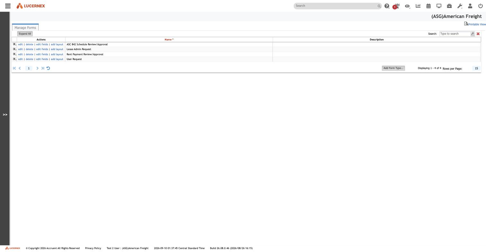
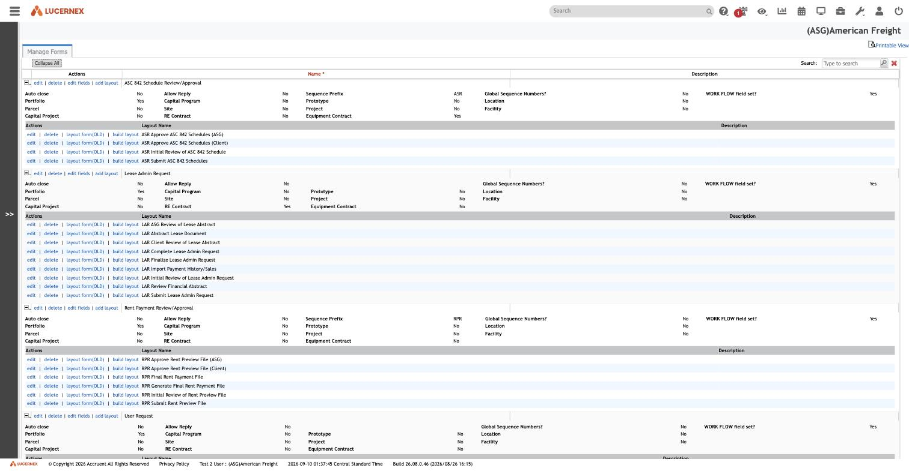
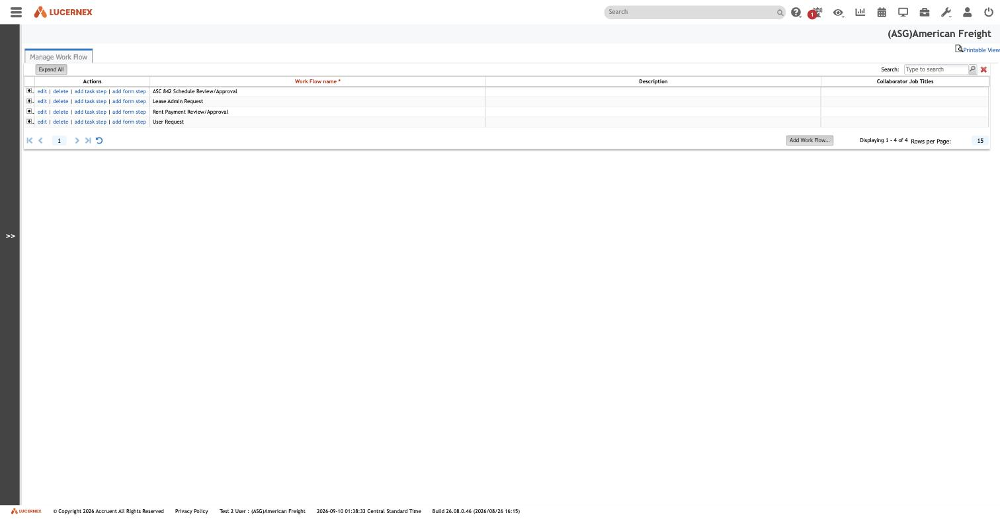
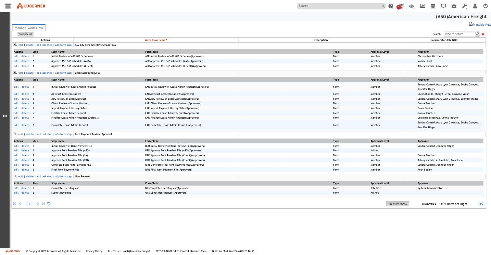

# Forms vs Pages vs Layouts vs Custom Lists — reconciled

**Stated up front.** These four admin concepts are not four unrelated features. Lucernex has **one
layout engine** and **two kinds of thing you can point it at**:

| Concept | What it actually is |
|---|---|
| **Page Layout** | A *presentation* of an entity that already exists in the platform (Contract, Facility, Location). You do not define the entity; you arrange it. |
| **Form** | A *tenant-defined request/approval record type* that carries a workflow. You define its fields, and it gets one layout **per workflow step**. |
| **Custom List** | A *tenant-defined reference/log record type* with no workflow. You define its fields, and it gets a layout. |
| **Layout** | The shared machinery all three use — one `LayoutEditor` driven by a `layoutMode` discriminator. |

The distinction that matters: **a Page Layout presents an existing entity; a Form and a Custom List
each define a new one.** Form and Custom List are the same mechanism differentiated by purpose —
a Form is a Custom List that has a workflow and a step-per-layout structure.

Captured 2026-09-10, tenant `(ASG)American Freight`, build `26.08.0.46`. Read-only throughout: no
form type, workflow, step, layout or field was created, edited or deleted.

## Evidence: the routes

**Observed.** The admin menu labels hide the fact that these share machinery. The routes do not.

| Admin label | Route | Note |
|---|---|---|
| Manage Page Layouts | `/en/pagebuilder/SummaryEntityPageLayoutEdit.jsp?mode={SEP,SUB,LIST}` | Three views over one `PageLayoutID` record type |
| Manage Custom Lists | `/en/admin/CustomListEdit.jsp` → `LayoutEditor.jsp?layoutMode=sublist` | |
| **Manage Forms** | `/en/admin/FirmCodeEdit.jsp?includeType=Manage&TableType=2035&tableName=Manage Forms` | **The same code-table editor Firm Drop Downs uses**, with a `TableType` discriminator |
| Manage Work Flows | `/en/workflow/WorkFlowTemplateEdit.jsp` | |
| The shared builder | `/en/pagebuilder/LayoutEditorAJAX.jsp?...&PageLayoutID={id}` | |

**Manage Forms running on `FirmCodeEdit.jsp` is the surprise — and `TableType=2035` names what a
Form really is.** That JSP is the generic code-table editor, discriminated by a numeric `TableType`.
The full registry of all 207 platform code tables has since been captured
([`code-table-registry.md`](../../data-model/code-table-registry.md)), and **`TableType=2035` is
`Issue Type Code`**.

**A Form is an Issue Type. The record a Form produces is an `Issue`.** Every otherwise-loose
observation in this document follows from that one fact:

| Observation | Explained by |
|---|---|
| Form types carry a `Sequence Prefix` (`ASR`, `LAR`, `RPR`) and `Global Sequence Numbers?` | `Issue` carries `SequenceNumber` — issues are numbered tickets |
| Form types declare attachability per entity kind | `Issue` hangs off `ProjectEntity`, the universal supertype |
| Every form type reports `WORK FLOW field set? = Yes` | `Issue` is what a workflow routes |
| `Auto close`, `Allow Reply` | ticket lifecycle properties |
| GraphQL declares an `IssueInterface` | `Issue` is a supertype with variants |
| `InvoiceIssue` (23 fields) and `BidderIssue` (21 fields) exist as objects | two more Issue variants, for invoicing and bidding |
| `CodeIssueType` exists as a 19-field object | the code table behind `TableType=2035` |
| `Issue` has 56 fields | it is the generic unit-of-work record for the whole product |

**Derived.** Lucernex did not build a form builder. It built one ticket type, made its subtype a
code-table value, gave each subtype its own user-defined fields and one layout per workflow step,
and got a form builder for free. That is an economical design and ASG Edge+ should consider copying
it rather than modelling each request type as its own aggregate.

The corollary is a warning. **Every request-shaped feature in this product is the same table.** A
rebuild that models Lease Admin Requests, rent-payment approvals, invoice disputes and bid questions
as four separate aggregates will need four separate workflow engines. Lucernex needs one.

### `layoutMode` values

**Observed** — `sublist` (from [006](../../admin/006-manage-custom-lists.md)), plus `list` and
`budget` (from the `conditionOptions` source read in the layout builder:
`if(layoutMode=="list"||layoutMode=="budget")`). **Inferred:** a `form` mode and a summary/`sep`
mode also exist, given the five page-layout kinds in [008](../../admin/008-manage-page-layouts.md).
Not yet enumerated exhaustively.

## Forms

**Observed.** Four form types exist in this tenant. Each row offers `edit | delete | edit fields |
add layout` — the identical action set Custom Lists offers.

| Form type | Sequence prefix | Workflow field set? |
|---|---|---|
| ASC 842 Schedule Review/Approval | `ASR` | Yes |
| Lease Admin Request | `LAR` | Yes |
| Rent Payment Review/Approval | `RPR` | Yes |
| User Request | *(none shown)* | Yes |

### A form type's own properties

**Observed**, from the expanded rows. Each form type carries two groups of settings:

**Behaviour**

| Property | Meaning |
|---|---|
| `Auto close` | Close the request automatically on completion |
| `Allow Reply` | Whether responses are permitted |
| `Sequence Prefix` | Human-readable request-number prefix (`ASR`, `RPR`, `LAR`) |
| `Global Sequence Numbers?` | Whether numbering is platform-wide or per-scope |
| `WORK FLOW field set?` | Whether the type participates in workflow — **Yes for all four** |

**Attachability** — a boolean per entity type, controlling what a request of this type can be raised
against:

`Portfolio`, `Capital Program`, `Prototype`, `Location`, `Parcel`, `Site`, `Project`, `Facility`,
`Capital Project`, `RE Contract`, `Equipment Contract`

For `ASC 842 Schedule Review/Approval` and `Lease Admin Request`, `Portfolio = Yes` and
`RE Contract = Yes`; the rest are `No`. **Derived:** these two request types can only be raised
against a portfolio or a real-estate contract, which is exactly right for lease accounting.

This `IsValidFor*`-style boolean family is the same attachability pattern that appears on templates
elsewhere in the schema — a recurring Lucernex idiom worth adopting.

### One layout per workflow step

**Observed.** This is the structural heart of the Form concept. A form type has **many** layouts, and
their names are step names:

| Form type | Layouts |
|---|---|
| **ASC 842 Schedule Review/Approval** | ASR Submit ASC 842 Schedules · ASR Initial Review of ASC 842 Schedule · ASR Approve ASC 842 Schedules (ASG) · ASR Approve ASC 842 Schedules (Client) |
| **Lease Admin Request** | LAR Submit Lease Admin Request · LAR Initial Review of Lease Admin Request · LAR Abstract Lease Document · LAR Review Financial Abstract · LAR ASG Review of Lease Abstract · LAR Client Review of Lease Abstract · LAR Import Payment History/Sales · LAR Finalize Lease Admin Request · LAR Complete Lease Admin Request |
| **Rent Payment Review/Approval** | RPR Submit Rent Preview File · RPR Initial Review of Rent Preview File · RPR Approve Rent Preview File (ASG) · RPR Approve Rent Preview File (Client) · RPR Generate Final Rent Payment File · RPR Final Rent Payment File |
| **User Request** | *(see screenshot)* |

**Derived — the key insight.** A Form is a single record type whose *presentation changes at every
stage of its lifecycle*. The same underlying request shows a different set of fields, in a different
arrangement, to a different person, depending on which workflow step it is sitting on. Submit shows
entry fields; Review shows read-mostly fields plus a decision; Approve shows the approval surface.

That is a materially different idea from "one entity, one edit page", and it is what makes the
Form/Workflow pair expressive enough to run a real business process. Any ASG Edge+ reimplementation
of request/approval flows needs **layout-per-step**, not one form with conditional sections — though
note that conditional rules ([`conditional-fields.md`](conditional-fields.md)) can *also* vary a
single layout, so the two mechanisms overlap and a deliberate choice is needed.

Each layout row offers `edit | delete | layout form(OLD) | build layout` — **Observed** evidence of
two builder generations coexisting, the older `layout form` and the current `build layout`.

## Work Flows

**Observed.** `Manage Work Flow` lists **exactly the same four names** as `Manage Forms`:
ASC 842 Schedule Review/Approval, Lease Admin Request, Rent Payment Review/Approval, User Request.

**Derived:** the relationship is 1:1. The Form is the *record*; the Work Flow is its *process*. They
are configured on separate screens but they are two halves of one concept — which is why every form
type reports `WORK FLOW field set? = Yes`.

Row actions are `edit | delete | add task step | add form step`. **Observed: there are exactly two
kinds of step — a Task step and a Form step.** A Form step presents one of the form type's layouts
and collects a decision; a Task step is work with no form surface.

### The step model

**Observed.** Each step row has these columns:

| Column | Meaning |
|---|---|
| `Step` | Ordinal — 1, 2, 3… |
| `Step Name` | Human name |
| `Form/Task` | The bound layout, suffixed `(Approvers)` |
| `Type` | `Form` or `Task` — every step observed here is `Form` |
| `Approval Level` | How the approver is resolved |
| `Approver` | The resolved approver(s) |

**Approval Level vocabulary observed:** `Member`, `Job Title`, `Ad Hoc`.

This corroborates the GraphQL `AssigneeType` enum (`ALL`, `PARENT`, `REGION1`, `REGION2`, `MARKET`,
`JOB_TITLE`) and `MemberNotifyType` (`ORGCHART_*`, `USERCLASS`, `JOBTITLE`, `MEMBERID`) recorded in
[`graphql-api.md`](../../data-model/graphql-api.md) — routing is by organisational position, with
named members as one option among several rather than the default.

**Derived:** steps are a strictly ordered sequence (1..N). No branch, merge, or parallel construct is
visible on this screen. Whether branching exists at all is an open question — the GraphQL
`KickOffMethod` enum (`STEP_ACTION`, `PAGE_LAYOUT`, `STATUS_CHANGE`, `TASK`) shows a step *action*
can kick off further work, which is how non-linearity would most likely be expressed.

### The four live workflows

**Observed.** These are ASG's real, running processes.

**ASC 842 Schedule Review/Approval** — 3 steps, all `Form`:

| # | Step | Approval Level |
|---:|---|---|
| 1 | Initial Review of ASC 842 Schedules | Member |
| 2 | Approve ASC 842 Schedules (ASG) | Member |
| 3 | Approve ASC 842 Schedules (Client) | Member |

**Lease Admin Request** — 8 steps, all `Form`, all `Member`:

| # | Step |
|---:|---|
| 1 | Initial Review of Lease Admin Request |
| 2 | Abstract Lease Document |
| 3 | ASG Review of Lease Abstract |
| 4 | Client Review of Lease Abstract |
| 5 | Import Payment History/Sales |
| 6 | Finalize Lease Admin Request |
| 7 | Finalize Lease Admin Requests (Defaults) |
| 8 | Complete Lease Admin Request |

**Rent Payment Review/Approval** — 6 steps, all `Form`:

| # | Step | Approval Level |
|---:|---|---|
| 1 | Initial Review of Rent Preview File | Member |
| 2 | Approve Rent Preview File (ASG) | **Ad Hoc** |
| 3 | Approve Rent Preview File (LA) | Member |
| 4 | Approve Rent Preview File (Client) | Member |
| 5 | Generate Final Rent Payment File | Member |
| 6 | Final Rent Payment File | Member |

**User Request** — 2 steps:

| # | Step | Approval Level | Approver |
|---:|---|---|---|
| 1 | Complete User Request | **Job Title** | System Administrator |
| 2 | Submit Revisions | **Ad Hoc** | — |

> **Personal data.** The `Approver` column names real ASG employees. Those names are recorded in the
> screenshots but are deliberately not transcribed into these tables. For the rebuild, model
> approvers by **role**, not by name — note that `User Request` step 1 already routes by Job Title
> rather than by person, which is the pattern to follow.

### Why this matters for ASG Edge+

**Lease Admin Request is BRD-24's contract-setup process, already implemented.** Its eight steps map
onto the abstraction and review phases documented in `docs/contracts-explained.html` (PJ-01…PJ-13):
submit → initial review → abstract the lease document → ASG review → client review → import payment
history → finalize → complete.

This is the single most valuable thing found so far. The BRD describes what the process *should* be;
this screen shows what it *is*, in production configuration, including who approves each step. Any
gap between the two is a real requirements question, not a documentation gap.

Likewise **ASC 842 Schedule Review/Approval** shows that the accounting engine's output is not
auto-published: schedules are produced, then reviewed internally, then approved by ASG, then
approved by the client. The rebuild's accounting engine needs a review/approval gate, not just a
calculation.

And **Rent Payment Review/Approval** shows the payment run is a *preview-then-approve-then-generate*
pipeline, with a distinct "Generate Final Rent Payment File" step — i.e. file generation is itself a
workflow step, not a side effect.

## The reconciliation, stated as rules

| ID | Rule |
|---|---|
| `LAY-R-001` | There is one layout engine. `LayoutEditor` is parameterised by a `layoutMode` discriminator; observed values include `sublist`, `list`, `budget`. |
| `LAY-R-002` | A **Page Layout** presents a platform-defined entity. It does not define fields; it arranges fields drawn from that entity's Data Fields catalog. |
| `LAY-R-003` | A **Form** is a tenant-defined record type registered in the code-table registry (`TableType=2035`), extended with its own field schema and **one layout per workflow step**. |
| `LAY-R-004` | A **Custom List** is a tenant-defined record type with its own field schema and a layout, but no workflow. |
| `LAY-R-005` | A Form type declares attachability as a boolean per entity kind (Portfolio, RE Contract, Facility, …). A request may only be raised against an entity whose flag is set. |
| `LAY-R-006` | A Form type declares a sequence prefix and whether numbering is global. |
| `LAY-R-007` | Every Form type has exactly one Work Flow, identified by the same name. |
| `LAY-R-008` | A Work Flow is an ordered sequence of steps, each of type `Form` or `Task`. A `Form` step binds one of the form type's layouts. |
| `LAY-R-009` | A step resolves its approver by `Approval Level`: `Member`, `Job Title`, or `Ad Hoc`. |

`LAY-R-010`…`LAY-R-018` cover conditional filtering and live in
[`conditional-fields.md`](conditional-fields.md).

## Open questions

1. **What does a `Task` step look like?** All 22 steps observed across four workflows are `Form`
   steps. `add task step` exists but no task step is configured in this tenant. Its field set is
   unknown, and `WorkFlowTemplateStep` has 55 fields — far more than this grid shows.
2. **Is branching possible?** The grid is strictly ordinal. Determine whether
   `WorkFlowTemplateStepAction` (37 fields) expresses conditional routing, and how `KickOffMethod`'s
   four trigger types are configured.
3. **What is `Ad Hoc` approval?** Used on `Rent Payment Review/Approval` step 2 and `User Request`
   step 2, with no approver listed. Runtime-chosen approver, presumably.
4. **What does `edit fields` on a Form type show**, and does it use the same field editor as Custom
   Lists (which was itself blocked by the `Lx`-namespace dependency now understood — see
   [`conditional-fields.md`](conditional-fields.md#how-the-blocker-was-cleared) for the working
   method to reach it)?
5. **What is `Collaborator Job Titles`**, a column on the workflow grid that is empty for all four?
6. **Enumerate every `layoutMode` value**, and confirm whether Form layouts use a distinct one.
7. **How does a step transition?** What records the decision, what happens on rejection, and is there
   a rollback or re-open path?
