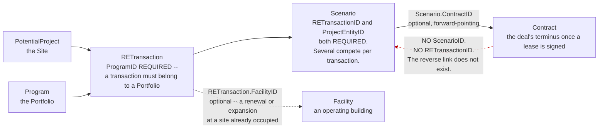

# Portfolio & Real-Estate Transactions — module overview

**Stated up front.** This module is two things bolted together on one shared object,
`Program` — the record the menu calls **Portfolio**: (1) the **portfolio container** that sits at
the top of the ownership hierarchy and carries the tenant's accounting policy, fiscal calendar, and
org-chart region tree, and (2) the **pre-lease deal pipeline** — `PotentialProject` ("Site") →
`RETransaction` → `Scenario` — that runs before a `Contract` exists. **11 objects, 513 fields.**
`PotentialProject` is the site-selection record itself
([`../facilities-locations/location-vs-facility-vs-site.md`](../facilities-locations/location-vs-facility-vs-site.md)
already established it does not belong to the facilities module); this module owns it and
everything that evaluates it. **The central finding: two page-layout fields exist on `Program` and
nowhere else in the 223-object schema — `SiteToProjectSetupLayoutID` and
`ProjectToFacilitySetupLayoutID`** — naming a two-step promotion pipeline, Site → Project → Facility,
that no other evidence in the corpus confirms end-to-end. Full argument in
[`site-pipeline.md`](site-pipeline.md).

*Evidence class for this paragraph: **Observed** field names and FK types from
`_lucernex_objects_summary.txt` and `docs/mindmap/edges.json`; the two-step pipeline reading is
**Derived**, corroborated by a genuine, admin-labelled FK (`Project.FacilityID`, "Related Project
Facility") for the second step only. Full citations in [`site-pipeline.md`](site-pipeline.md).*

## The module at a glance

| Property | Value |
|---|---|
| Objects | 11 |
| Fields | 513 |
| `ProjectEntity` subtype roots in this module | 2 of 9 — `Program`, `PotentialProject` |
| Firm-scoped/rollup container | `Program` (Portfolio) — 180 fields, the largest object in the module |
| Deal-pipeline records | `RETransaction`, `Scenario`, `ReTransScenContact`, `LinkReTransScenContact` |
| Rollout-planning family | `DevelopmentPlan`, `DevelopmentSlot`, `ProgramRevenueWeeks` |
| Comparison/reporting family | `ComparisonReport`, `ComparisonItem` |
| Internal FK edges | 12 |
| Inbound cross-module edges | 10 |
| Outbound cross-module edges | 66 |
| End-user screens (from [003](../../screens/003-main-navigation.md)) | Portfolio 14 |
| Dashboard heading | Portfolio/Capital Program Administration; Portfolio Administration |

## The shape of the module

```
                                   Firm (tenant)
                                     │
                                  Program  ◄── self-references via OrgChartProgramID
                              (Portfolio / Capital Program)
                    ┌─────────────────┼───────────────────────────────────┐
              policy carrier     rollup counters                  deal pipeline
        SLDiscountRate, FairValueThreshold,   TotalSites, TotalOpeningProjects,     PotentialProject ("Site")
        FiscalYearEnd, 14 FX rate types  TotalCapitalProjects, TotalFacilities,           │  (0 inbound FKs anywhere —
        (→ accounting module)           TotalLocations, TotalContracts, …                 │   see site-pipeline.md)
                    │                                                                     ▼
             org-chart / region tree                                                 RETransaction
        RegionID / RootRegionID / SubRegionID                                       (FacilityID direct FK — a
        (→ platform-tenancy's Region object)                                      transaction CAN already name
                    │                                                              an existing Facility)
             11 × per-subtype                                                             │
          "Setup Page Layout" columns                                              ┌──────┴──────┐
      (Contract/Facility/Location/Parcel/                                     Scenario      ReTransScenContact /
      Prototype/CapProject/OpenProject/                                    (ContractID FK —   LinkReTransScenContact
      EquipmentContract/…)                                                  forward pointer      (broker/attorney
                    +                                                        to an executed        contacts)
      2 × conversion layouts found nowhere                                    lease, once one
      else in the schema:                                                        exists)
      SiteToProjectSetupLayoutID
      ProjectToFacilitySetupLayoutID
      (→ site-pipeline.md)

      DevelopmentPlan ──1:N──► DevelopmentSlot ──rolls up to──► ProgramRevenueWeeks
      (rollout-pipeline capacity planning, independent of the RETransaction/Scenario deal record)

      ComparisonReport ──1:N──► ComparisonItem   (competitive/market comparison analysis)
```

Full FK-by-FK evidence: [`data-model.md`](data-model.md).

## `Program` — the Portfolio, and what hangs off it


**Derived, and it is the control case for the navigation gate.** Two Portfolio records is enough for
the `Portfolio` root to render, while `Parcel`, `Prototype` and the project types hold zero and do
not render at all — which is what pins the visibility threshold at **existence, not volume**
([`../../features/security-access/`](../../features/security-access/#the-equipment-contract-gate--three-gates-open-root-still-hidden)).
`Displaying 1 - 2 of 2` in the footer is the authoritative count here; the grid is short enough that
the image and the JSON capture agree, which is not true of the larger admin lists.


**"Portfolio" (menu label), `Program` (schema object), and `Portfolio ID` (the FK type every
child column carries) are three names for one record** — already established from the routing
layer in [`screen-routing.md`](../../data-model/screen-routing.md) and repeated here because this
module owns the record. `Program` is one of the 9 `ProjectEntity` subtype roots
([`project-entity.md`](../../data-model/project-entity.md) §2), self-references via
`OrgChartProgramID` (also typed `Portfolio ID`), and at 180 fields is the largest object in this
module by a wide margin — larger than `Scenario` (69) and `PotentialProject` (108) combined.

Three things hang off `Program` that belong to *other* modules but are worth flagging here because
this is where they are configured:

1. **The tenant's accounting policy.** `SLDiscountRate`, `FairValueThreshold`,
   `RemainingEconomicLifeThreshold`, three amortisation-basis switches, a 28-day proration switch,
   `FiscalYearEnd`, and fourteen FX rate-type selectors all live on `Program`, resolved
   Contract → Portfolio → Firm. Fully documented in
   [`../accounting/data-model.md`](../accounting/data-model.md#program--the-portfolio-level-policy-carrier)
   and `ACC-R-056`…`059` — not repeated here.
2. **The fiscal calendar.** `FiscalPeriod.ProgramID` means the fiscal calendar is owned by the
   portfolio, not the firm (`CON-R-023`,
   [`../contracts/rules.md`](../contracts/rules.md)). **`POR-R-001`.**
3. **The org-chart region hierarchy.** `RegionID`, `RootRegionID`, `SubRegionID` on `Program` (and
   on `PotentialProject`, `DevelopmentSlot`, and every entity in `facilities-locations`) point at
   `Region` — a `platform-tenancy` object. **`Region`'s own schema entry carries exactly one column
   (`ProjectEntityID`)**, so the hierarchy's structure is not directly observable from the schema
   dump; it is inferred from the three-level FK chain (`RegionID`/`RootRegionID`/`SubRegionID`) and
   corroborated by the GraphQL `AssigneeType` enum's `REGION1`/`REGION2`/`MARKET` routing levels
   ([`graphql-api.md`](../../data-model/graphql-api.md)). `Program.OrgChartProgramID` (a
   self-reference) is a second, independent hierarchy — a portfolio can roll up into a parent
   portfolio — and is not the same tree as the `Region` chain. **`POR-R-002`**, confidence
   **Inferred** for the exact level mapping. See "The org chart" below.

## The one-setup-layout-per-subtype mechanism, and the two that don't fit the pattern

`Program` carries **11 columns of the shape `<Subtype>SetupPageLayoutID`** — one per `ProjectEntity`
subtype (`Contract`, `Facility`, `Location`, `Parcel`, `Prototype`, `CapProject`, `OpenProject`,
`EquipmentContract`, plus three `*MapSetupLayoutID` variants) — a per-portfolio override of the
tenant-wide defaults `Firm` carries for the same eleven subtypes
([`project-entity.md`](../../data-model/project-entity.md) §3). **`POR-R-003`.**

Two more columns do not fit that one-per-subtype shape at all: **`SiteToProjectSetupLayoutID`** and
**`ProjectToFacilitySetupLayoutID`**. Neither names a subtype; both name a *transition between two
subtypes*. They are the only fields anywhere in the 7,421-field schema whose name contains
`ToProject` or `ToFacility`. This is the module's central open question — full treatment in
[`site-pipeline.md`](site-pipeline.md).

## The deal pipeline: Site → Transaction → Scenario → (maybe) Contract

`PotentialProject` ("Site") is evaluated through one or more `RETransaction` records
(`RETransaction.ProgramID` is **required** — a transaction must belong to a Portfolio), each of
which can carry multiple competing `Scenario` rows (`Scenario.RETransactionID` and
`Scenario.ProjectEntityID` are both **required**). `Scenario.ContractID` is a genuine, optional,
forward-pointing FK to `Contract` — the deal's terminus once a lease is signed. **The reverse link
does not exist**: `Contract` has no `ScenarioID` or `RETransactionID` column
([`data-model.md`](data-model.md#4-the-contract-boundary--one-way-only)) — the same
asymmetric-FK-plus-child-grid pattern
[`../facilities-locations/README.md`](../facilities-locations/README.md) found between `Facility`
and `Contract`. **`POR-R-004`.**

Three code tables classify the pipeline, all named in the brief and all confirmed present:
`Deal Type Code` (`TableType` 2024, on `PotentialProject.CodeDealTypeID` and
`Program.CodeDealTypeID`), `Scenario Type Code` (2060, on `Scenario.CodeScenarioTypeID`),
`Scenario Deal Type Code` (2059, on `Scenario.CodeScenarioDealTypeID` **and**
`RETransaction.PreferredScenarioCodeDealTypeID`), and `RE Transaction Status Code` (2057, on
`RETransaction.CodeRETransactionStatusID` — the actual pipeline-stage field). None of the four
tables' row *values* were captured — all four are 2000-band lookups
([`code-table-registry.md`](../../data-model/code-table-registry.md)) with no live-tenant read
performed, so the pipeline's actual stage names are not confirmed. **`POR-R-005`**, confidence
**Observed** for the tables' existence and attachment, **unconfirmed** for their contents.

`RETransaction.FacilityID` is a direct, optional FK to `Facility` — meaning a transaction can
*already* reference an operating Facility even before a Scenario or Contract exists (a renewal or
expansion at a site the tenant already occupies, most plausibly). **`POR-R-006`.**



**Derived, and the missing edge is the finding.** The pipeline is one-way. `Contract` carries no
`ScenarioID` and no `RETransactionID`
([`data-model.md`](data-model.md#4-the-contract-boundary--one-way-only)), so **from a signed lease
you cannot reach the deal that produced it** without scanning every `Scenario` for a matching
`ContractID`. It is the same asymmetric-FK-plus-child-grid shape
[`../facilities-locations/README.md`](../facilities-locations/README.md) found between `Facility`
and `Contract`. A rebuild that wants deal-to-lease traceability has to add the back-pointer; Lx does
not have one.

**Observed, and it bounds this whole section.** The four code tables that classify the pipeline
exist and are attached, but **none of their values has been read**, so the stage names above are
structural, not the tenant's actual vocabulary.


## The rollout-planning family, briefly

`DevelopmentPlan` (a named plan, 6 admin-exposed fields of 7 raw) is the header over `DevelopmentSlot`
(a build-out slot: broker, duration, `CodeSlotTypeID`, `CodeStorePhaseID`), which rolls up into
`ProgramRevenueWeeks` (filled/unfilled slot and week counters per Program). This is capacity
planning for a rollout program — "how many stores can we open this year and are we behind" — and is
**independent of `RETransaction`/`Scenario`**: nothing FKs `DevelopmentSlot` to a specific
`PotentialProject` or transaction; the only entity link is the generic `ProjectEntityID` plus a
denormalised `ProjectPEID`. **`POR-R-007`**, confidence **Derived** — no screen was captured to
confirm how (or whether) a user actually connects a slot to the site filling it.

## The comparison/reporting family, briefly

`ComparisonReport` (a saved report, own page-layout assignment) and `ComparisonItem` (one line —
`ExpenseGroup`, `ComputedValue`, `ScenarioName`/`ScenarioDate` as plain text, not FKs) support
side-by-side evaluation of competing scenarios or sites. Both attach only via `ProjectEntityID`.
**`POR-R-008`.**

## The org chart

**`Program` is where the org-chart position hierarchy actually lives**, even though the `Region`
object it points at is catalogued under `platform-tenancy`. Workflow routing
(`AssigneeType` = `REGION1`/`REGION2`/`MARKET`/`JOB_TITLE`,
[`graphql-api.md`](../../data-model/graphql-api.md)) most plausibly resolves through
`Program.RegionID`/`RootRegionID`/`SubRegionID` for the first two levels and
`CodeMarketAreaID` (`TableType` 2049, a different code table, not a `Region` level) for `MARKET` —
but this mapping is **Inferred**, not observed in a screen. `LinkRegionManager` (1 field in the raw
dump — a member-to-region assignment) and `LinkTaskByCodeMember.OrgChartLevel` (a numeric level on
a task-routing join, `projects-capital`) are the only other schema artefacts touching the
hierarchy. No dedicated `OrgChart` object exists anywhere in the 223-object list; [003](../../screens/003-main-navigation.md)'s `Org Chart` screen is served by `/en/admin/OrgChartEdit.jsp`
([`screen-routing.md`](../../data-model/screen-routing.md)) and was never opened. **`POR-R-009`.**

## Capital projects vs. contracts

Both are `ProjectEntity` subtype roots with budgets, schedules and workflows, and the distinction
is not fully settled by this corpus — see [`site-pipeline.md`](site-pipeline.md) §3 for the full
argument. In outline: `Project` (the schema object behind both "Capital Project" and "Opening
Project" — one admin-exposed field, `ProjectType`, is literally labelled *"Opening Project or
Capital Project"*) models **work done to create or improve a physical asset**, budgeted and
scheduled via `Task`/`TaskGroup`/`TaskItem` ([`projects-capital`](../projects-capital/)); `Contract`
models **the legal right to occupy or use** a `Facility`/`Location`/`Equipment` item, with its own
independent financial engine ([`../accounting/`](../accounting/)). A single site's lifecycle can
touch both — a store is built (`Project`) and then leased (`Contract`) — but nothing in the schema
forces them through one another. `Program.TotalCapitalProjects` and `Program.TotalREContracts` are
tracked as separate rollup counters, confirming the platform itself treats them as distinct
countable populations. **`POR-R-010`.** Note `Project` itself is classified under `platform-tenancy`
in [`modules.json`](../../mindmap/modules.json), not this module or `projects-capital` — flagged
here because it is central to this module's deal-pipeline story regardless of which folder owns it.

## Contents

| Document | Answers |
|---|---|
| [`data-model.md`](data-model.md) | Every object, field count, role, the 12-edge internal FK graph, and the cross-module inbound/outbound edges. |
| [`site-pipeline.md`](site-pipeline.md) | **The central question of this module** — how a `PotentialProject` ("Site") becomes a real `Location`/`Facility`, worked out from the FK graph, the two unique `Program` layout columns, and the one confirmed FK (`Project.FacilityID`) that closes half the chain. |
| [`rules.md`](rules.md) | `POR-R-001`…`POR-R-016` — every rule in trigger/input/effect/confidence form. |
| [`asg-edgeplus-mapping.md`](asg-edgeplus-mapping.md) | What exists, what must be built, what should deliberately differ, and the open decisions blocking it. |

## What a rebuild must not get wrong

1. **"Portfolio", `Program`, and `Portfolio ID` are one thing, not three.** Any rebuild glossary
   needs this mapping written down once, in one place — it is not restated per module.
2. **`Program` is not just a container — it is the accounting engine's policy carrier and the
   fiscal calendar's owner.** A rebuild that models Portfolio as a bare grouping folder will be
   missing `SLDiscountRate`, `FairValueThreshold`, `FiscalYearEnd` and thirteen more fields that the
   accounting engine reads through a Contract → Portfolio → Firm resolution chain. `POR-R-001`.
3. **`PotentialProject` ("Site") has zero inbound foreign keys anywhere in the 972-edge graph, and
   zero rows in the Manage Data Fields admin catalog** (108 raw schema fields, 0 admin-exposed).
   Nothing hard-links a Facility or Location back to the Site it came from. `POR-R-011`.
4. **The only two "conversion" layout fields in the entire schema sit on `Program`, not on any of
   the three entities they name.** `SiteToProjectSetupLayoutID` and `ProjectToFacilitySetupLayoutID`
   are portfolio-level configuration, meaning the promotion mechanism — whatever it is — is
   configured per-portfolio, not globally. `POR-R-003`.
5. **The deal pipeline reaches `Contract` one way only.** `Scenario.ContractID` is a real, optional
   FK; `Contract` has no column pointing back. `POR-R-004`.
6. **Three overlapping "deal type" code tables exist** (`Deal Type Code`, `Scenario Type Code`,
   `Scenario Deal Type Code`) attached to three different objects. Do not collapse them into one
   without checking whether ASG's tenant actually uses all three distinctly — their row values were
   never captured. `POR-R-005`.

## Open questions

Ranked by how much each blocks a rebuild decision.

1. **How does a `PotentialProject` ("Site") actually become a `Project`, and then a `Facility`?**
   The two unique `Program` layout fields name the transition; no FK, workflow capture, or screen
   confirms the mechanism. The single biggest open question in this module — full treatment in
   [`site-pipeline.md`](site-pipeline.md).
2. **What are the row values of `RE Transaction Status Code`, `Deal Type Code`, `Scenario Type
   Code`, and `Scenario Deal Type Code`?** All four attach to this module's pipeline; none were read
   from the live tenant. Without them the pipeline's actual stage names are unconfirmed.
3. **Does `AssigneeType`'s `REGION1`/`REGION2`/`MARKET` resolve through `Program.RegionID`/
   `RootRegionID`/`SubRegionID`, or through some other structure?** No screen or query confirms the
   mapping; `Region`'s own 1-column schema entry gives no independent evidence either way.
4. **Is `DevelopmentSlot` ever actually linked to the `PotentialProject`/`RETransaction`/`Scenario`
   it is meant to fill?** No FK connects them; only the generic `ProjectEntityID` is shared.
5. **What does the `Org Chart` screen (`/en/admin/OrgChartEdit.jsp`) actually render**, and does a
   dedicated org-chart data structure exist that this schema dump simply does not surface?
6. **Are `ComparisonReport`/`ComparisonItem` used for site comparisons, scenario comparisons, or
   both?** Both are plausible from the fields (`ScenarioName`, `ExpenseGroup`); no screen was opened.
