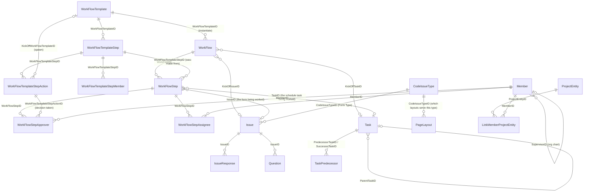

# Workflow engine — data model

**Stated up front.** The engine is thirteen tables in three tiers. **Definition tier:**
`WorkFlowTemplate` → `WorkFlowTemplateStep` → `WorkFlowTemplateStepAction`, with
`WorkFlowTemplateStepMember` as the normalised routing-target table. **Instance tier:** `WorkFlow`
→ `WorkFlowStep` → (`WorkFlowStepApprover` | `WorkFlowStepAssignee`). **Work-object tier:** `Issue`
(the *Form*) and `Task`/`TaskGroup`/`TaskItem` (the *schedule*), which are what a step actually acts
on. Two satellites complete the picture: `CodeIssueType` (the Form Type registry that carries
attachability) and the `NotifyTemplate`/`NotifyTemplateMember`/`Notify` trio (a *separate*
notification subsystem that is not part of the workflow engine and is keyed by
`CodeSQLTableID` + `ObjectID` rather than by workflow).

There is no workflow-step predecessor table, no branch/gateway object, no condition object, no
delegation object, and no approval-round object. **Derived** — exhaustive search of all 223 objects
in `_lucernex_objects_summary.txt`.

## Source files and how to read them

| Marker | File | Meaning |
|---|---|---|
| **S1** | `_lucernex_objects_summary.txt` | 223 objects / 7,421 columns. TSV; column 4 is ` \| `-separated `Name(Type)`. This is the **PostgreSQL-extracted physical schema**. |
| **S2** | `_xlsx_lucernex_jcrew.txt` (sheet `Field Inventory`) | 7,421 rows of **vendor field documentation** — object, internal name, UI label, data type, required, max size, and a `Definition` column carrying Lucernex's own help text. This is the authoritative statement of *intent*. |
| **S3** | `docs/data-fields/all-fields.csv` + `docs/data-fields/*.md` | The 6,158-leaf **Manage Data Fields** catalog — what an administrator can place on a page layout. |
| **S4** | `_xlsx_feature_list.txt` | ASG's feature/pain-point workbook. Behavioural evidence about the running system. |
| **S5** | `../../admin/004`, `007`, `008` | Captured administration screens. |
| **S6** | `../layouts-and-forms/forms-vs-pages-vs-layouts.md` | **Live capture of `Manage Forms` and `Manage Work Flows`**, tenant `(ASG)American Freight`, build `26.08.0.46`, captured 2026-09-10, read-only. Four form types, four workflows, 19 steps, the Form Type property editor, and the layout-per-step naming. Written by the layouts-and-forms agent; cited here, never edited. |
| **S7** | `../../data-model/graphql-api.md` | **Live GraphQL introspection**, 490 types. Supplies the declared interfaces (`IssueInterface`, `ProjectEntity`, `iCodeTable`) and the rule enums `KickOffMethod`, `AssigneeType`, `MemberNotifyType`, `SecurityLevel`. Written by another agent; cited, never edited. |

S1 and S3 disagree in known, systematic ways. The reconciliation is in
[Schema vs. catalog reconciliation](#schema-vs-catalog-reconciliation) below; every field table in
this document is the **union** of S1 and S3, with catalog-only fields marked.

## Object inventory

| Object | PG table | S1 cols | S3 leaves | Union | Tier | S1 line |
|---|---|---:|---:|---:|---|---:|
| `WorkFlowTemplate` | `work_flow_template` | 25 | 25 | 25 | Definition | 221 |
| `WorkFlowTemplateStep` | `work_flow_template_step` | 55 | 59 | 59 | Definition | 222 |
| `WorkFlowTemplateStepAction` | `work_flow_template_step_action` | 37 | 38 | 38 | Definition | 223 |
| `WorkFlowTemplateStepMember` | *(none in S1)* | — | 9 | 9 | Definition | — |
| `WorkFlow` | `work_flow` | 19 | 20 | 21 | Instance | 217 |
| `WorkFlowStep` | `work_flow_step` | 47 | 53 | 54 | Instance | 218 |
| `WorkFlowStepApprover` | `work_flow_step_approver` | 20 | 19 | 20 | Instance | 219 |
| `WorkFlowStepAssignee` | `work_flow_step_assignee` | 11 | 10 | 11 | Instance | 220 |
| `WFStepFullImport` | `w_f_step_full_import` | 47 | — | 47 | Instance (import mirror) | 216 |
| `Issue` | `issue` | 56 | 4 | 56 | Work object | 101 |
| `CodeIssueType` | `code_issue_type` | 19 | — | 19 | Registry | 41 |
| `IssueResponse` | `issue_response` | 11 | 11 | 11 | Work object | 102 |
| `IssueSubmittal` | `issue_submittal` | 1 | — | 1 | Work object (stub) | 103 |
| `Task` | `task` | 37 | 37 | 37 | Work object | 189 |
| `TaskGroup` | `task_group` | 37 | — | 37 | Work object | 190 |
| `TaskItem` | `task_item` | 37 | — | 37 | Work object | 191 |
| `TaskPredecessor` | `task_predecessor` | 15 | 14 | 15 | Work object | 192 |
| `TaskTemplate` | `task_template` | 1 | — | 1 | Definition (stub) | 193 |
| `TaskTemplateAudit` | `task_template_audit` | 18 | — | 18 | Audit | 194 |
| `NotifyTemplate` | *(none in S1)* | — | 12 | 12 | Notification | — |
| `NotifyTemplateMember` | *(none in S1)* | — | 6 | 6 | Notification | — |
| `Notify` | `notify` | 1 | 1 | 1 | Notification (stub) | 134 |
| `ProcessTimeline` | `process_timeline` | 31 | 31 | 31 | Milestone | 153 |
| `ProcessTimelineTemplate` | `process_timeline_template` | 10 | 10 | 10 | Milestone | 154 |

**Observed** (S1 line numbers; S3 counts from `docs/data-fields/INDEX.md` and `all-fields.csv`).

`TaskTemplate`, `IssueSubmittal`, `LinkTaskDocument`, `Notify` and `LinkPEMemberCodeJobTitle` each
report exactly one column (`ProjectEntityID`) in S1. These are **stubs — tables the extractor
declared but that have never received a row**; S2 marks equivalent tables
"Not created yet — no data … the loader only issues `CREATE TABLE` once the first row arrives."
Their real shape is unknown. **Derived.**

## The GraphQL rule vocabulary

**Observed**, S7. The live API declares enums that pin down vocabulary the physical schema leaves as
bare integers and free text. These outrank anything inferred from column names.

| Enum | Values | What it settles |
|---|---|---|
| `KickOffMethod` | `STEP_ACTION`, `PAGE_LAYOUT`, `STATUS_CHANGE`, `TASK` | **Four** kick-off methods, correcting the vendor help text's three. `STATUS_CHANGE` explains `WorkFlowTemplate.StatusChangeID` / `StatusChangeType`. |
| `MemberNotifyType` | `ORGCHART_ALL`, `ORGCHART_LEV1`, `ORGCHART_LEV2`, `ORGCHART_LEV3`, `ORGCHART_MKT`, `USERCLASS`, `JOBTITLE`, `MEMBERID` | The **principal selector** in its complete form — the vendor help's four categories, with org-chart depth bounded at three explicit levels plus All and Market. |
| `AssigneeType` | `ALL`, `PARENT`, `REGION1`, `REGION2`, `MARKET`, `JOB_TITLE` | Read as a **scope selector** — where to search for the principal — since `PARENT`/`REGION*`/`MARKET` are all `ProjectEntity` hierarchy concepts. **Derived**; see [`routing-and-approvals.md` §2](routing-and-approvals.md#2-three-competing-routing-vocabularies-reconciled). |
| `SecurityLevel` | `DEFAULT`, `NO_ACCESS`, `VIEW`, `EDIT`, `DELETE` | The permission ladder behind *"users with appropriate permissions"* on the reassignment fields. |

`IssueInterface` is a **declared GraphQL interface**, not a naming convention — which upgrades the
`Issue`-as-supertype reading in [`issues-and-tasks.md`](issues-and-tasks.md) from Derived to
Observed. `iCodeTable` being an interface likewise supports the reading that `CodeIssueType` is a
code table.

**Caveat.** These enums belong to the modern GraphQL surface. The legacy JSP columns
`ApproverType` / `AssigneeType` / `NotifieeType` are `sTYPE_UNFORMATTED_NUMBER` — raw integers —
and nothing yet proves the two surfaces share an encoding. **OQ-8.**

## Entity–relationship diagram

Every edge above is **Observed** — each is a named FK column in S1 whose declared type is the FK
type of the target (`Work Flow ID`, `Step ID`, `Action ID`, `Work Flow Step ID`, `Task/Group ID`,
`Member ID`, `Entity ID`). The `WorkFlow → Issue` / `WorkFlow → Task` edges are typed `Text` and
`Task/Group ID` respectively, which is an inconsistency in the vendor schema, not in this reading.

## The polymorphic attachment edge

The single most important edge is **not** a typed FK. `WorkFlow` carries a two-column polymorphic
pointer:

| Column | Type | Vendor label | Source |
|---|---|---|---|
| `TriggerCodeSQLTableID` | `sCODE_SQLTABLE` | Trigger CodeSQLTable | S3 `docs/data-fields/work-flow.md`; **absent from S1** |
| `TriggerObjectID` | `sTYPE_UNFORMATTED_NUMBER` | Trigger Object | S3 `docs/data-fields/work-flow.md`; **absent from S1** |

`sCODE_SQLTABLE` is the platform's table-name registry; the same type appears on
`AuditColumn.CodeSQLTableID`, `ReportGroupAvailableField.CodeSQLTableID`,
`NotifyTemplate.CodeSQLTableID` and `PageLayout.PrimaryCodeSQLTableID`. **Observed** (S3
`all-fields.csv`, five rows). The pair therefore reads *"this workflow was triggered by row
`TriggerObjectID` of table `TriggerCodeSQLTableID`"* — a classic table-name + PK polymorphic
reference. **Derived, high confidence.**

Both columns are missing from the S1 physical extract of `work_flow`. Two readings are possible:
the columns are virtual/computed accessors rather than stored columns, or the extract is
incomplete. This is **Open question OQ-1**.

## Schema vs. catalog reconciliation

Set differences between S1 (physical schema) and S3 (Manage Data Fields catalog), computed field by
field. **Derived.**

| Object | Only in S1 | Only in S3 | Reading |
|---|---|---|---|
| `WorkFlowTemplate` | — | — | Identical. |
| `WorkFlowTemplateStep` | — | `runAtStartScheduledJob1ID`, `runAtStartScheduledJob2ID`, `runAtCompleteScheduledJob1ID`, `runAtCompleteScheduledJob2ID` | Four scheduled-job hooks exist as placeable fields but have no physical column. Their four sibling columns `RunAtStartApprover1/2ID` and `RunAtCompleteApprover1/2ID` **are** physical and S2 documents all four as *"This field is a placeholder for an upcoming feature."* The whole Run-At family is dead. |
| `WorkFlowTemplateStepAction` | — | `bidAwdApCodeLastActionStatusID` (Bid Award Approval Status) | A second `sCODE_LAST_ACTION_STATUS` slot used only by the bid-award path. |
| `WorkFlow` | `ProjectEntityID` | `TriggerCodeSQLTableID`, `TriggerObjectID` | See above. `ProjectEntityID` is the owning entity; the Trigger pair is the specific record. |
| `WorkFlowStep` | `ProjectEntityID` | `CheckedOutByMemberID`, `CheckedOutDate`, `ComputedAlertDateApprovers`, `ComputedAlertDateAssignees`, `ComputedWarnDateApprovers`, `ComputedWarnDateAssignees`, `ComputedDueDateNotification` | Seven `Statics / Hidden` fields. The five `Computed*` dates are the materialised SLA calendar; the two `CheckedOut*` are the record lock. Their absence from S1 means they are computed at read time, not stored. |
| `WorkFlowStepApprover` | `ProjectEntityID` | — | — |
| `WorkFlowStepAssignee` | `ProjectEntityID` | — | — |

`ProjectEntityID` is present physically on every instance table but is not exposed in the Manage
Data Fields catalog for those tables — it is infrastructure, not a placeable field.

`WorkFlowTemplateStepMember`, `NotifyTemplate` and `NotifyTemplateMember` appear in S3 with 9, 12
and 6 leaves respectively but have **no S1 table at all**.

The same is true of the whole page-layout family: **`PageLayout`, `PageLayoutField` and
`PageLayoutFilter` are catalog-only — none of the three exists in the physical schema dump**
(**Observed**, exhaustive search of S1 for `PageLayout` / `page_layout`: zero hits). Every layout FK
this document cites — `WorkFlowTemplate.PageLayoutID`, `WorkFlowTemplateStep.PageLayoutApproversID`
/ `PageLayoutAssigneesID`, `WorkFlowStep.PageLayoutApproversID` / `PageLayoutAssigneesID`,
`PageLayout.CodeIssueTypeID`, `Issue.LastPageLayoutID` — therefore points at a table the extract
never reached. The layouts are unmistakably real (they are rendered in the live capture, S6), so
this is an extraction gap, not a modelling one. Credit: identified by the reporting-forms agent from
the same dumps. They are `Statics / Hidden` in the
catalog. **Derived:** these are either views over columns stored elsewhere, or tables the
PostgreSQL extractor did not reach. This is **Open question OQ-2** and it matters, because
`WorkFlowTemplateStepMember` is the only place `OrgChartLevel` routing is expressible.

---

## Definition tier

### `WorkFlowTemplate` — the workflow definition

25 columns. Admin screen: **Manage Work Flows**, `/en/workflow/WorkFlowTemplateEdit.jsp`
(**Observed**, `docs/admin/004-company-administration.md` line 66). Catalog group:
`Company Items / Work Flow Template`.

| Field | Schema type | UI label | Req | Definition (vendor help text) |
|---|---|---|---|---|
| `AutoAssignInitiator` | Boolean | Auto Assign Initiator as Ad Hoc Assignee | Y | When selected, the system will automatically assign the person who kicks off the work flow as an ad hoc assignee to the kickoff step or form, and on any step that requires an ad hoc assignee in the work flow. For more information about this functionality, see the Manage Work Flows page in the Lucernex Online Help. |
| `BOMapClientRecordID` | Text | Work Flow Template ClientID | Y | The ClientID field is a free form text field that can be used when importing data to uniquely look up a record for update. This record identifier can either be system-generated or defined by the user upon the initial import of record data. The ClientID has the database name "BOMapClientRecordID". |
| `CollaboratorJobTitleIDList` | Dropdown (Job Title Code) | Collaborator Job Title List |  |  |
| `CreatedByID` | Member ID | Created By |  | The Created By field is a system-populated field which captures the name of the member making changes to a record. |
| `CreatedDate` | Time | Created Date |  | The Created Date field is a system-populated field which captures the date that a record was created. |
| `DefaultWFCodePriorityID` | Dropdown (Priority Code) | Default Work Flow Priority | Y | Select the priority of the work flow from this field. |
| `Description` | Text | Description |  | Write a description of the record. |
| `EnableVendorCollaboration` | Boolean | Enable Vendor Collaboration | Y |  |
| `IsEnabledLxJSCode` | Text | Javascript Source Code |  | This field is where you will enter your custom JavaScript used to kick off conditional work flows. |
| `KickOffDescription` | Text | Description of KickOff |  | Contains the text description of the kick off step or form. |
| `KickOffID` | Number | Work Flow Kick-off Record |  | Displays the workflow template kickoff ID. |
| `KickOffMethod` | Text | Kick-off Method |  | There are three ways a work flow can be kicked off: by completion of an action in another work flow, by completion of a schedule task, or by completion of a form. |
| `LimitByEntity` | Boolean | Limit By Entity? | Y | If this value is 1, the work flow template is only available for certain portfolios. If this value is 0, the work flow template is available for all portfolios. |
| `ModifiedByID` | Member ID | Modified By |  | The Modified By field is a system-populated field which captures the name of the member who made a change to a record. |
| `ModifiedDate` | Time | Modified Date |  | The Modified Date field is a system-populated field which captures the date that a modification is made to a record. |
| `NotifyAllApproversComplete` | Boolean | Notify All Approvers When Complete? | Y | Select this check box if you want to send an email notification to prior work flow approvers when the work flow is complete. |
| `NotifyAllAssigneesComplete` | Boolean | Notify All Assignees When Complete? | Y | Select this check box if you want to send and email notification to prior work flow assignees when the work flow is complete. |
| `NotifyInitiatorComplete` | Boolean | Notify Initiator When Complete? | Y | Select this check box if you want to send an email notification to the work flow initiator when the work flow is complete. |
| `PageLayoutID` | Text | Active Layout |  | Select the form whose completion you want to have kick off this work flow. |
| `RevNumber` | Number | Rev Number |  | The Rev Number field indicates how many times a record has been modified. This value of the field increases by 1 each time the record is modified. |
| `StatusChangeID` | Number | Status Change ID |  | Gives the status change id of the workflow template kick off. |
| `StatusChangeType` | Number | Status Change Type |  | Gives the status change type of the workflow template kick off. |
| `TaskName` | Text | Associated Task |  | Select the schedule task whose completion you want to have kick off this work flow. |
| `WorkFlowTemplateID` | Number | Work Flow Template RecID |  | This field contains a Base Entity System Identifier for your record. It is assigned automatically by the system, and is not editable. |
| `WorkFlowTemplateName` | Text | Work Flow Template Name | Y | Enter the name of your work flow template in this field. |

Structural notes (**Derived** unless marked):

- **Kick-off is a four-column bundle**: `KickOffMethod` (Text), `KickOffID` (Number),
  `StatusChangeID`, `StatusChangeType`, plus `KickOffDescription` and the two targets
  `PageLayoutID` ("Select the form whose completion you want to have kick off this work flow") and
  `TaskName` ("Select the schedule task whose completion you want to have kick off this work
  flow"). Both target fields are **Observed** from S2. `KickOffMethod` being free `Text` rather
  than a code FK is a schema smell — but its legal values are now **Observed** from the GraphQL
  enum `KickOffMethod: [STEP_ACTION, PAGE_LAYOUT, STATUS_CHANGE, TASK]`
  (`../../data-model/graphql-api.md`). **There are four, not the three the vendor help text names**;
  `STATUS_CHANGE` is the omitted one, and it is what `StatusChangeID` / `StatusChangeType`
  configure — the only reading that explains two otherwise-undocumented columns. **Derived.**
- **`PageLayoutID` is the kick-off *form layout*, not the workflow's own layout.** The catalog
  labels it "Active Layout" and types it `sTYPE_FORM_PAGE_LAYOUT`, but S2's definition is
  unambiguous. `PageLayout` itself carries `CodeIssueTypeID`, so the chain is
  `WorkFlowTemplate.PageLayoutID → PageLayout.CodeIssueTypeID → CodeIssueType.IsValidFor*`.
  `sTYPE_FORM_PAGE_LAYOUT` occurs on **exactly three fields in the whole 6,158-leaf catalog** — this
  one, plus `WorkFlowTemplateStep.PageLayoutApproversID` and `PageLayoutAssigneesID` (**Observed**,
  exhaustive grep of `../../data-fields/all-fields.csv`). A "Form Page Layout" is therefore
  definitionally a workflow-bound layout. Note the split: **one** kick-off layout per workflow,
  **two** per step. See [`template-vs-instance.md` §3a](template-vs-instance.md#3a-layout-per-step-per-role--the-real-source-of-expressiveness).
- **Three completion-notification flags at header level** (`NotifyAllApproversComplete`,
  `NotifyAllAssigneesComplete`, `NotifyInitiatorComplete`) fire when the *whole workflow* closes.
  They are duplicated, with different meaning, at action level — see
  [`step-actions.md`](step-actions.md).
- **`LimitByEntity`** — "If this value is 1, the work flow template is only available for certain
  portfolios. If this value is 0, the work flow template is available for all portfolios."
  **Observed**, S2 line 7293. Note *portfolios*, not the eleven `IsValidFor*` entity types. **The
  join table that stores which portfolios does not appear anywhere in the 223-object schema** —
  **Open question OQ-3**.
- **`IsEnabledLxJSCode`** — "This field is where you will enter your custom JavaScript used to kick
  off conditional work flows." **Observed**, S2. Conditional kick-off is therefore *only*
  expressible as tenant JavaScript stored in a text column.
- **`EnableVendorCollaboration` + `CollaboratorJobTitleIDList`** open the workflow to external
  vendor users, scoped by job title. Neither has vendor help text.
- **`AutoAssignInitiator`** — "the system will automatically assign the person who kicks off the
  work flow as an ad hoc assignee to the kickoff step or form, and on any step that requires an ad
  hoc assignee." **Observed**, S2.
- There is **no version, no publish/draft state, and no effective-date** on the template. `RevNumber`
  is a modification counter, not a version. Editing a template mutates it in place for every
  running instance that reads through to it.

### `WorkFlowTemplateStep` — one step of the definition

59 fields (55 physical + 4 catalog-only). Catalog group: `Company Items / Work Flow Template Step`.
Ordered by `StepNumber`.

| Field | Schema type | UI label | Req | Definition (vendor help text) |
|---|---|---|---|---|
| `ApproverJobTitleIDList` | Dropdown (Job Title Code) | Approver Job Title List |  | Select the job titles that should approve this work flow task. |
| `ApproverMemberIDList` | Member ID | Approver Member List |  | Select the members that should approve this work flow task. |
| `ApproverType` | Number | Approver Type |  | Select the category of approver you want to use, such as by Job Title, User Class, Member, or Org Chart Level. |
| `ApproverUserClassIDList` | Dropdown (User Class) | Approver User Class List |  | Select the user classes that should approve this work flow task. |
| `AssigneeJobTitleIDList` | Dropdown (Job Title Code) | Assignee Job Title List |  | Select the job titles that should be assigned to this work flow task. |
| `AssigneeMemberIDList` | Member ID | Assignee Member List |  | Select the members that should be assigned to this work flow task. |
| `AssigneeType` | Number | Assignee Type |  | Select the category of assignee you want to use, such as by Job Title, User Class, Member, or Org Chart Level. |
| `AssigneeUserClassIDList` | Dropdown (User Class) | Assignee User Class List |  | Select the user classes that should be assigned to this work flow task. |
| `AutoAdjustTaskDates` | Boolean | Automatically Adjust Task Dates to WF Step | Y | Select this check box if you want Lucernex to automatically adjust the task dates to match the step durations. |
| `AutoLaunchNextStep` | Boolean | Automatically Transition to Next Step | Y | Select this check box if you want Lucernex to automatically launch the next step if it is a form. |
| `BOMapClientRecordID` | Text | Work Flow Template Step ClientID | Y | The ClientID field is a free form text field that can be used when importing data to uniquely look up a record for update. This record identifier can either be system-generated or defined by the user upon the initial import of record data. The ClientID has the database name "BOMapClientRecordID". |
| `ComputedRequiresApprovers` | Boolean | Requires Approvers? |  | The value of this field is true if the work flow step requires approvers. |
| `ComputedRequiresAssignees` | Boolean | Requires Assignees? |  | The value of this field is true if the work flow step requires assignees. |
| `CreatedByID` | Member ID | Created By |  | The Created By field is a system-populated field which captures the name of the member making changes to a record. |
| `CreatedDate` | Time | Created Date |  | The Created Date field is a system-populated field which captures the date that a record was created. |
| `DaysUntilAlertApprovers` | Number | Days Until Alert Approvers |  | Enter how many days there will be before a manager is notified that this step has not been completed in this field. |
| `DaysUntilAlertAssignees` | Number | Days Until Alert Assignees |  | Enter how many days there will be before a manager is notified that this step has not been completed in this field. |
| `DaysUntilNotification` | Number | Days Until Notification |  | Enter the number of days after the form completion date a notification should be sent in this field. |
| `DaysUntilWarnApprovers` | Number | Days Until Warn Approvers |  | Enter how many days there will be before an approver receives a notification that this step has not been completed in this field. |
| `DaysUntilWarnAssignees` | Number | Days Until Warn Assignees |  | Enter how many days there will be before an assignee receives a notification that this step has not been completed in this field. |
| `Description` | Text | Description |  | Write a description of the record. |
| `DurationDaysApprovers` | Number | Number of Days for Approvers to Act |  | Enter how long in days an approver has to complete a step in this field. |
| `DurationDaysAssignees` | Number | Number of Days For Assignees to Act |  | Enter how long in days an assignee has to complete a step in this field. |
| `EMailAlertApprovers` | Boolean | Should Alert Approvers? |  | Select this check box if you want to send a dashboard alert to the approver of this task when the task starts. |
| `EMailAlertAssignees` | Boolean | Should Email Assignees? |  | Select this check box if you want to send a dashboard alert to the assignee of this task when the task starts. |
| `EMailMessage` | Text | Text of Email to Send |  | Enter any additional information you want to include in the notification email in this field. |
| `EnableForDashboard` | Boolean | Step Enabled for Dashboard |  | Select this check box if you would like the notification to be sent as a Dashboard alert. |
| `EnableForEMail` | Boolean | Should Send Email? |  | Select this check box if you would like the notification to be sent as an email. |
| `IsFormStep` | Boolean | Is a Form Step (vs Task Step) |  | This field has one of two values: Form Step or Task Step. |
| `ModifiedByID` | Member ID | Modified By |  | The Modified By field is a system-populated field which captures the name of the member who made a change to a record. |
| `ModifiedDate` | Time | Modified Date |  | The Modified Date field is a system-populated field which captures the date that a modification is made to a record. |
| `NotifieeJobTitleIDList` | Dropdown (Job Title Code) | Notifiee Job Title List |  | Select the job titles that should receive a notification once this work flow task is completed. |
| `NotifieeMemberIDList` | Member ID | Notifiee Member List |  | Select the members that should receive a notification once this work flow task is completed. |
| `NotifieeType` | Number | Notifiee Type |  | Select the category of notifiee you want to use, such as by Job Title, User Class, Member, or Org Chart Level. |
| `NotifieeUserClassIDList` | Dropdown (User Class) | Notifiee User Class List |  | Select the user classes that should receive a notification once this work flow task is completed. |
| `NotifyStepApproversStarted` | Boolean | Notify Step Approvers When Started | Y | Select this check box if you want Lucernex to send an email notification to the task approver when the step starts. |
| `NotifyStepAssigneesStarted` | Boolean | Notify Step Assignees When Started | Y | Select this check box if you want Lucernex to send an email notification to the task assignee when the step starts. |
| `PageLayoutApproversID` | Text | Layout To Use With Approvers |  | Select which form layout approvers should see for this step. |
| `PageLayoutAssigneesID` | Text | Layout To Use With Assignees |  | Select which form layout assignees should see for this step. |
| `Priority` | Number | Relative Priority |  | Select the priority of this task from this field. |
| `ReassignApproversJobTitleIDList` | Dropdown (Job Title Code) | Reassign Approvers Job Title List |  | When added to a form, this field allows users with appropriate permissions to reassign approvers by job title. |
| `ReassignAssigneesJobTitleIDList` | Dropdown (Job Title Code) | Reassign Assignees Job Title List |  | When added to a form, this field allows users with appropriate permissions to reassign assignees by job title. |
| `RevNumber` | Number | Rev Number |  | The Rev Number field indicates how many times a record has been modified. This value of the field increases by 1 each time the record is modified. |
| `RunAtCompleteApprover1ID` | Member ID | At Complete Approver 1 ID |  | This field is a placeholder for an upcoming feature. |
| `RunAtCompleteApprover2ID` | Member ID | At Complete Approver 2 ID |  | This field is a placeholder for an upcoming feature. |
| `runAtCompleteScheduledJob1ID` *(catalog only)* | — | At Complete Scheduled Job 1 ID |  |  |
| `runAtCompleteScheduledJob2ID` *(catalog only)* | — | At Complete Scheduled Job 2 ID |  |  |
| `RunAtStartApprover1ID` | Member ID | At Start Approver 1 ID |  | This field is a placeholder for an upcoming feature. |
| `RunAtStartApprover2ID` | Member ID | At Start Approver 2 ID |  | This field is a placeholder for an upcoming feature. |
| `runAtStartScheduledJob1ID` *(catalog only)* | — | At Start Scheduled Job 1 ID |  |  |
| `runAtStartScheduledJob2ID` *(catalog only)* | — | At Start Scheduled Job 2 ID |  |  |
| `SetTaskCanceled` | Boolean | Cancel Task When Step is Canceled | Y | Select this check box if you want to set the work flow step status to "Canceled" when the user cancels the step. |
| `SetTaskInProcess` | Boolean | Mark Task In Progress When Step Starts | Y | Select this check box if you want to set the work flow step status to "In Process" when the step starts. |
| `StepNumber` | Number | Step Number | Y | Enter the step number in this field. |
| `TaskName` | Text | Associated Task Name |  | Select the schedule task that this work flow step should be associated with from this field. |
| `UnassignedApproverID` | Member ID | Unassigned Approver |  | This field is a placeholder for an upcoming feature. |
| `WorkFlowTemplateID` | Work Flow ID | Work Flow Template | Y | The name of the work flow template that this work flow step is associated with. |
| `WorkFlowTemplateStepID` | Number | Work Flow Template Step RecID |  | This field contains a Base Entity System Identifier for your record. It is assigned automatically by the system, and is not editable. |
| `WorkFlowTemplateStepName` | Text | Step Name | Y | Enter the name of the work flow step in this field. |

The 59 fields decompose into eight groups. **Derived.**

| Group | Fields | Count |
|---|---|---:|
| Identity & ordering | `WorkFlowTemplateStepID`, `WorkFlowTemplateStepName`, `WorkFlowTemplateID`, `StepNumber`, `Description`, `BOMapClientRecordID`, `RevNumber` | 7 |
| Audit | `CreatedByID`, `CreatedDate`, `ModifiedByID`, `ModifiedDate` | 4 |
| Approver routing | `ApproverType`, `ApproverMemberIDList`, `ApproverJobTitleIDList`, `ApproverUserClassIDList`, `ComputedRequiresApprovers`, `ReassignApproversJobTitleIDList`, `UnassignedApproverID` | 7 |
| Assignee routing | `AssigneeType`, `AssigneeMemberIDList`, `AssigneeJobTitleIDList`, `AssigneeUserClassIDList`, `ComputedRequiresAssignees`, `ReassignAssigneesJobTitleIDList` | 6 |
| Notifiee routing | `NotifieeType`, `NotifieeMemberIDList`, `NotifieeJobTitleIDList`, `NotifieeUserClassIDList` | 4 |
| SLA & notification timing | `DurationDaysApprovers`, `DurationDaysAssignees`, `DaysUntilWarnApprovers`, `DaysUntilWarnAssignees`, `DaysUntilAlertApprovers`, `DaysUntilAlertAssignees`, `DaysUntilNotification`, `NotifyStepApproversStarted`, `NotifyStepAssigneesStarted`, `EMailAlertApprovers`, `EMailAlertAssignees`, `EnableForEMail`, `EnableForDashboard`, `EMailMessage` | 14 |
| Step behaviour & task coupling | `IsFormStep`, `Priority`, `PageLayoutApproversID`, `PageLayoutAssigneesID`, `AutoLaunchNextStep`, `AutoAdjustTaskDates`, `SetTaskInProcess`, `SetTaskCanceled`, `TaskName` | 9 |
| Dead placeholders | `RunAtStartApprover1ID`, `RunAtStartApprover2ID`, `RunAtCompleteApprover1ID`, `RunAtCompleteApprover2ID`, `runAtStartScheduledJob1ID`, `runAtStartScheduledJob2ID`, `runAtCompleteScheduledJob1ID`, `runAtCompleteScheduledJob2ID` | 8 |

The eight `RunAt*` fields are all documented by S2 as *"This field is a placeholder for an upcoming
feature"* (**Observed**, four of them; the four `runAt*ScheduledJob*` variants have no physical
column at all). **A rebuild should not implement them.** Their naming — start/complete × approver ×
scheduled-job — reveals the *intended* design: pre-step and post-step hooks that could run a
scheduled job or notify an out-of-band approver. That intent is worth capturing even though the
feature never shipped.

### `WorkFlowTemplateStepAction` — the action buttons

38 fields (37 physical + `bidAwdApCodeLastActionStatusID` from the catalog). Full catalog and
taxonomy in [`step-actions.md`](step-actions.md); the raw table is reproduced there rather than
duplicated here.

### `WorkFlowTemplateStepMember` — normalised routing targets

Nine catalog leaves, no physical table in S1. Catalog group `Statics / Hidden`. This is the table
that makes **Org Chart Level** routing expressible; the four `*IDList` columns on
`WorkFlowTemplateStep` cannot represent it.

| Field | Schema type | UI label | Req | Definition (vendor help text) |
|---|---|---|---|---|
| `AdhocMemberID` *(catalog only)* | — | Adhoc Member ID |  |  |
| `CodeJobTitleID` *(catalog only)* | — | WF Template Step Member Job Title |  |  |
| `CodeUserClassID` *(catalog only)* | — | WF Template Step Member User Class |  |  |
| `IsAdhoc` *(catalog only)* | — | Is Adhoc? |  |  |
| `MemberID` *(catalog only)* | — | WF Template Step Member |  |  |
| `OrgChartLevel` *(catalog only)* | — | WF Template Step Member Org Chart Level |  |  |
| `StepMemberResponsibility` *(catalog only)* | — | WF Template Step Member Responsibility | Y |  |
| `WorkFlowTemplateStepID` *(catalog only)* | — | WF Template Step Member Step | Y |  |
| `WorkFlowTemplateStepMemberID` *(catalog only)* | — | WF Template Step Member RecID |  |  |

`StepMemberResponsibility` is a free-text role tag; its instance counterpart
`WorkFlowStepAssignee.StepMemberResponsibility` is documented as *"This field lists step members
whose responsibility matches the responsibility for the workflow template step"* (**Observed**,
S2). It is therefore a **fifth, undocumented routing dimension**: match on a responsibility string.
This is **Open question OQ-4**.

---

## Instance tier

### `WorkFlow` — the running instance

21 fields in union. Catalog groups: `Statics / Hidden` (the two Trigger fields) and
`Workflow / Workflow Summary Info (All)`.

| Field | Schema type | UI label | Req | Definition (vendor help text) |
|---|---|---|---|---|
| `AdhocMemberID` | Member | Ad Hoc Assignee |  | Select an ad hoc assignee from this field. |
| `BOMapClientRecordID` | Text | Work Flow ClientID | Y | The ClientID field is a free form text field that can be used when importing data to uniquely look up a record for update. This record identifier can either be system-generated or defined by the user upon the initial import of record data. The ClientID has the database name "BOMapClientRecordID". |
| `ClosedDate` | Date | Closed Date |  | The date that the work flow was closed. |
| `CodeWorkFlowStatusID` | Dropdown (Work Flow Status Code) | Status | Y | This field displays the status of the work flow on the Work Flows page. |
| `CreatedDate` | Time | Created Date |  | The Created Date field is a system-populated field which captures the date that a record was created. |
| `Inactive` | Boolean | Inactive? | Y | If true, this work flow has been deactivated on the Work Flow page. |
| `InitiatedByMemberID` | Member ID | Initiated By Member |  | The member ID of the user who initiated the work flow. |
| `IsCompleted` | Boolean | Is Completed? |  | If true, this work flow has been completed. |
| `KickOffIssueID` | Text | Kick Off Form |  | The ID of the form that kicked off the work flow. |
| `KickOffTaskID` | Task/Group ID | Kick Off Task |  | The ID of the schedule task that kicked off the work flow. |
| `ModifiedByID` | Member ID | Modified By |  | The Modified By field is a system-populated field which captures the name of the member who made a change to a record. |
| `ModifiedDate` | Time | Modified Date |  | The Modified Date field is a system-populated field which captures the date that a modification is made to a record. |
| `NumberOfDaysOpen` | Number | Number Of Days Open |  | This field captures how many days the work flow has been open. |
| `ProjectEntityID` | Entity ID | ProjectEntityID |  |  |
| `TriggerCodeSQLTableID` *(catalog only)* | — | Trigger CodeSQLTable |  |  |
| `TriggerObjectID` *(catalog only)* | — | Trigger Object |  |  |
| `WFApproverList` | Work Flow Step Approver ID | WF Approver List |  | This field displays a pick list where you can select approvers assigned to the entity to approve the work flow. |
| `WorkFlowCodePriorityID` | Dropdown (Priority Code) | Priority | Y | The priority of the work flow. |
| `WorkFlowID` | Number | Work Flow RecID |  | This field contains a Base Entity System Identifier for your record. It is assigned automatically by the system, and is not editable. |
| `WorkFlowName` | Text | Name | Y | The name of the work flow. |
| `WorkFlowTemplateID` | Work Flow ID | Workflow Template | Y | The ID of the work flow. |

Notes (**Derived** unless marked):

- The instance shares **almost nothing** with its template. The only overlap beyond bookkeeping is
  the FK `WorkFlowTemplateID`. Even the name is not copied: `WorkFlowTemplateName` → `WorkFlowName`.
  Full analysis in [`template-vs-instance.md`](template-vs-instance.md).
- **Two kick-off pointers, not one.** `KickOffIssueID` ("The ID of the form that kicked off the
  work flow") and `KickOffTaskID` ("The ID of the schedule task that kicked off the work flow") —
  both **Observed**, S2. The third kick-off method (another workflow's action) leaves **no trace on
  the instance**: there is no `ParentWorkFlowID` or `KickOffWorkFlowStepActionID`. A spawned
  workflow cannot be traced back to its parent. **Open question OQ-5**, and a real defect for
  audit.
- `WFApproverList` is typed `Work Flow Step Approver ID` — a denormalised roll-up of every
  `WorkFlowStepApprover` under the instance, for list rendering.
- `NumberOfDaysOpen` is a stored derived value; there is no `ClosedBy` to pair with `ClosedDate`.
- Termination is expressed **three ways at once**: `IsCompleted` (Boolean),
  `CodeWorkFlowStatusID` (dropdown) and `ClosedDate` (Date), plus `Inactive` for soft delete.
  Nothing in the schema constrains them to agree.
- `AdhocMemberID` is the single ad-hoc assignee slot for the whole instance — not per step.

### `WorkFlowStep` — one running step

54 fields in union. Catalog groups: `Statics / Hidden` (7 fields) and
`Workflow / Workflow Step (All)`.

| Field | Schema type | UI label | Req | Definition (vendor help text) |
|---|---|---|---|---|
| `ApproverMemberIDList` | Member ID | WF Approver(s) |  | This field gets a list of the approvers that can be assigned to this work flow step. |
| `AssigneeMemberIDList` | Member ID | WF Assignee(s) |  | This field gets a list of the assignees that can be assigned to this work flow step. |
| `BOMapClientRecordID` | Text | Work Flow Step ClientID | Y | The ClientID field is a free form text field that can be used when importing data to uniquely look up a record for update. This record identifier can either be system-generated or defined by the user upon the initial import of record data. The ClientID has the database name "BOMapClientRecordID". |
| `CheckedOutByMemberID` *(catalog only)* | — | CheckedOutByMemberID |  |  |
| `CheckedOutDate` *(catalog only)* | — | CheckedOutDate |  |  |
| `CodeWorkFlowStatusID` | Dropdown (Work Flow Status Code) | Step Status | Y | The status of the work flow step. |
| `CompleteDate` | Date | Complete Date |  | The date the work flow step was completed. |
| `ComputedAlertDateApprovers` *(catalog only)* | — | ComputedAlertDateApprovers |  |  |
| `ComputedAlertDateAssignees` *(catalog only)* | — | ComputedAlertDateAssignees |  |  |
| `ComputedDueDateNotification` *(catalog only)* | — | ComputedDueDateNotification |  |  |
| `ComputedWarnDateApprovers` *(catalog only)* | — | ComputedWarnDateApprovers |  |  |
| `ComputedWarnDateAssignees` *(catalog only)* | — | ComputedWarnDateAssignees |  |  |
| `CurrentStepMemberIDList` | Member ID | Current Step Members |  | The members associated with the current workflow step. |
| `DaysUntilAlertApprovers` | Number | Days Until Alert Approvers |  | This field contains how many days there will be before a manager is notified that this step has not been completed. |
| `DaysUntilAlertAssignees` | Number | Days Until Alert Assignees |  | This field contains how many days there will be before a manager is notified that this step has not been completed. |
| `DaysUntilWarnApprovers` | Number | Days Until Warn Approvers |  | This field contains how many days there will be before an approver receives a notification that this step has not been completed. |
| `DaysUntilWarnAssignees` | Number | Days Until Warn Assignees |  | This field contains how many days there will be before an assignee receives a notification that this step has not been completed. |
| `DueDate` | Date | Due Date |  | Calculates the due date of the work flow step. |
| `DueDateApprovers` | Date | WF Approver Due Date |  | Calculates the due date of the work flow step for approvers. |
| `DueDateAssignees` | Date | WF Assignee Due Date |  | Calculates the due date of the work flow step for assignees. |
| `DurationDaysApprovers` | Number | Duration Days Approvers |  | Calculates the duration of this work flow step for approvers. |
| `DurationDaysAssignees` | Number | Duration Days Assignees |  | Calculates the duration of this work flow step for assignees. |
| `EMailAlertApprovers` | Boolean | EMail Alert Approvers |  | If set to true, a dashboard alert will be sent to the approver of this task when the task starts. |
| `EMailAlertAssignees` | Boolean | EMail Alert Assignees |  | If set to true, a dashboard alert will be sent to the assignee of this task when the task starts. |
| `EMailMessage` | Text | Email Message |  | This field contains additional information to be included in the notification email. |
| `EnableForDashboard` | Boolean | Enable For Dashboard |  | This setting will be set to true if your system administrator set the notification to be sent as a Dashboard alert. |
| `EnableForEMail` | Boolean | Enable For Email |  | This setting will be set to true if your system administrator set the notification to be sent as an email. |
| `IsCompleted` | Boolean | Is Completed? |  | If this step is completed, this value of this field is true. If this step is not complete, the value of this field is false. |
| `IsFormStep` | Boolean | Is Form Step |  | If this step is a form step, this value of this field is true. If this step is a task step, the value of this field is false. |
| `IsNotifyClosed` | Boolean | Is Notify Closed? |  | Indicates whether the workflow step has notifications configured. |
| `IsReadOnly` | Boolean | Read Only? | Y | If this step is read-only, this value of this field is true. If this step is not read-only, the value of this field is false. |
| `IsReDo` | Boolean | Re Do? | Y | If this value is true, the step must be completed again. If this value is false, the step can be completed and the user can progress to the next step in the work flow. This is related to the action the approver takes on the step. |
| `IssueID` | Text | Issue |  | The ID of the form associated with this work flow step. |
| `ModifiedByID` | Member ID | Modified By |  | The Modified By field is a system-populated field which captures the name of the member who made a change to a record. |
| `ModifiedDate` | Time | Modified Date |  | The Modified Date field is a system-populated field which captures the date that a modification is made to a record. |
| `NotifieeMemberIDList` | Member ID | WF Notify List |  | If a notification has been set up for this work flow step, this field returns a list of the users who will receive the notification. |
| `PageLayoutApproversID` | item ID | Page Layout Approvers |  | The ID of the page layout used for approvers. |
| `PageLayoutAssigneesID` | item ID | Page Layout Assignees |  | The ID of the page layout used for assignees. |
| `Priority` | Number | Priority |  | The priority of the work flow step. |
| `PriorSubmitByMemberID` | Member ID | Prior Submit By Member |  | The member ID of the person who previously submitted the form for approval. |
| `PriorSubmitForApprovalDate` | Date | Prior Submit For Approval Date |  | The date the previous person submitted the form for approval. |
| `ProjectEntityID` | Entity ID | ProjectEntityID |  |  |
| `StartDate` | Date | Start Date |  | The date the work flow step started. |
| `StepNumber` | Number | Step Number | Y | The work flow step number. |
| `SubmitForApprovalByMemberID` | Member ID | Submit For Approval By Member |  |  |
| `SubmitForApprovalByMemberName` | Text | Submit For Approval By Member Name |  | The member ID of the person who submitted the form for approval. |
| `SubmitForApprovalDate` | Date | Submit For Approval Date |  | The date the person submitted the form for approval. |
| `TaskID` | Task/Group ID | Associated Task |  |  |
| `TaskName` | Text | Associated Task Name |  | The name of the schedule task this work flow step is associated with. |
| `WFStepNotificationLink` | Text | WF Step Notification Link |  |  |
| `WorkFlowID` | Work Flow ID | Work Flow | Y | The ID of the work flow this step is associated with. |
| `WorkFlowStepID` | Number | Work Flow Step RecID |  | This field contains a Base Entity System Identifier for your record. It is assigned automatically by the system, and is not editable. |
| `WorkFlowStepName` | Text | Step Name |  | The name of the work flow step from the work flow template. |
| `WorkFlowTemplateStepID` | Step ID | Workflow Template Step |  | The ID of the work flow step from the work flow template. |

Notes (**Derived** unless marked):

- **The step carries three parallel date tracks.** Actual: `StartDate`, `CompleteDate`. Deadline:
  `DueDate`, `DueDateApprovers`, `DueDateAssignees` — all three documented as *"Calculates the due
  date…"* (**Observed**, S2), i.e. computed from `StartDate` + `DurationDays*`. Escalation:
  `ComputedWarnDateApprovers/Assignees`, `ComputedAlertDateApprovers/Assignees`,
  `ComputedDueDateNotification` — computed from the `DaysUntilWarn*`/`DaysUntilAlert*` offsets.
- **Submission is a two-slot ring buffer.** `SubmitForApprovalByMemberID` / `…Date` hold the current
  round; `PriorSubmitByMemberID` / `PriorSubmitForApprovalDate` hold exactly one previous round.
  `WorkFlowStepApprover` mirrors this with `ActionTakenDate`/`ActionComment` +
  `PriorActionTakenDate`/`PriorActionComment`/`PriorWFTemplateStepActionID`. **A step therefore
  retains only its immediately preceding round; a third re-do overwrites the second.** This is the
  engine's entire re-do history and it is lossy.
- `IsReDo` — *"If this value is true, the step must be completed again… This is related to the
  action the approver takes on the step."* **Observed**, S2. This is the runtime marker set by an
  action whose `RestartStep = true`.
- `CurrentStepMemberIDList` is the "who is this waiting on right now" projection — distinct from
  `ApproverMemberIDList` (who *may* act) and `AssigneeMemberIDList`.
- `IsReadOnly` and `CheckedOutByMemberID`/`CheckedOutDate` are two different locks: a step-level
  read-only flag (set by an action's `DisableEditAfterDecision`) and a pessimistic record checkout
  with **no expiry column** — the cause of the reported accidental-lockout defect (S4 line 363).
- `WFStepNotificationLink` is the deep link embedded in notification emails.
- `IsNotifyClosed` — *"Indicates whether the workflow step has notifications configured."*
  **Observed**, S2. The name and the definition disagree; treat the definition as authoritative and
  flag it. **Open question OQ-6.**

`WFStepFullImport` (S1 line 216) is a **column-for-column duplicate of `WorkFlowStep`** — all 47
physical columns match exactly. **Derived.** It is the bulk-import staging mirror; S2 marks its
table "Not created yet — no data". A rebuild needs an import path, not this table.

### `WorkFlowStepApprover` — one approver's decision

20 columns. Catalog group `Workflow / Workflow Step Approver (All)`.

| Field | Schema type | UI label | Req | Definition (vendor help text) |
|---|---|---|---|---|
| `ActionComment` | Text | Action Comment |  | Enter any comments about the action taken on the work flow step. |
| `ActionTakenDate` | Date | Action Taken Date |  | The date the approver took action on the work flow step. |
| `ActionTakenName` | Text | Action Taken |  | The name of the action taken on the work flow step. |
| `BOMapClientRecordID` | Text | WF Step Approver ClientID | Y | The ClientID field is a free form text field that can be used when importing data to uniquely look up a record for update. This record identifier can either be system-generated or defined by the user upon the initial import of record data. The ClientID has the database name "BOMapClientRecordID". |
| `EMailSentStatus` | Text | Email Sent Status | Y | Indicates whether the assignee has been sent an email about an alert. |
| `HasApproved` | Boolean | Has Approved? |  | If this value is true, the work flow step has been approved. |
| `HasTakenAction` | Boolean | Has Taken Action? |  | If this value is true, the approver has taken action on the work flow step. |
| `MemberID` | Member ID | Approver | Y | The member ID of the approver. |
| `ModifiedByID` | Member ID | Modified By |  | The Modified By field is a system-populated field which captures the name of the member who made a change to a record. |
| `ModifiedDate` | Time | Modified Date |  | The Modified Date field is a system-populated field which captures the date that a modification is made to a record. |
| `NotifyAcknowledgedStatus` | Text | Notify Acknowledged Status | Y | Indicates whether the approver has acknowledged the workflow alert or email. |
| `PriorActionComment` | Text | Prior Action Comment |  | The previous comment added about an action taken on the work flow step. |
| `PriorActionTakenDate` | Date | Prior Action Taken Date |  | The date that a previous action was taken on the work flow step. |
| `PriorWFTemplateStepActionID` | Action ID | Prior WF Step Action |  | The action that a previous approver took on this work flow step. |
| `ProjectEntityID` | Entity ID | ProjectEntityID |  |  |
| `SignatureDate` | Date | Signature Date |  | The date an approver's signature was applied to a work flow form step. |
| `WorkFlowStepApproverID` | Number | WF Step Approver RecID |  | This field contains a Base Entity System Identifier for your record. It is assigned automatically by the system, and is not editable. |
| `WorkFlowStepID` | Work Flow Step ID | Work Flow Step | Y | The ID of the work flow step. |
| `WorkFlowTemplateStepActionID` | Action ID | WF Step Action |  | The approver should select the appropriate action for the work flow step from this field. |
| `WorkFlowTemplateStepID` | Step ID | Work Flow Template Step |  | The ID of the work flow template. |

This table is the **audit record of a decision**. `WorkFlowTemplateStepActionID` is the button the
approver pressed — *"The approver should select the appropriate action for the work flow step from
this field"* (**Observed**, S2) — which makes the action row, not a status enum, the primary record
of what happened. `ActionTakenName` denormalises its name.

Note there is **no sequence, order, or level column**. All approver rows for a step are peers.
Sequential approval is not representable. **Derived**, and corroborated by S4 line 352.

### `WorkFlowStepAssignee` — one assignee's notification state

11 columns. Catalog group `Workflow / Workflow Step Assignee (All)`.

| Field | Schema type | UI label | Req | Definition (vendor help text) |
|---|---|---|---|---|
| `BOMapClientRecordID` | Text | WF Step Assignee ClientID | Y | The ClientID field is a free form text field that can be used when importing data to uniquely look up a record for update. This record identifier can either be system-generated or defined by the user upon the initial import of record data. The ClientID has the database name "BOMapClientRecordID". |
| `EMailSentStatus` | Text | Email Sent Status | Y | Indicates whether the assignee has been sent an email about an alert. |
| `MemberID` | Member ID | Assignee | Y | The assignee of the work flow step. |
| `ModifiedByID` | Member ID | Modified By |  | The Modified By field is a system-populated field which captures the name of the member who made a change to a record. |
| `ModifiedDate` | Time | Modified Date |  | The Modified Date field is a system-populated field which captures the date that a modification is made to a record. |
| `NotifyAcknowledgedStatus` | Text | Notify Acknowledged Status | Y | Indicates whether the assignee has acknowledged the workflow alert or email. |
| `ProjectEntityID` | Entity ID | ProjectEntityID |  |  |
| `StepMemberResponsibility` | Text | Step Member Responsibility | Y | This field lists step members whose responsibility matches the responsibility for the workflow template step. |
| `WorkFlowStepAssigneeID` | Number | WF Step Assignee RecID |  | This field contains a Base Entity System Identifier for your record. It is assigned automatically by the system, and is not editable. |
| `WorkFlowStepID` | Work Flow Step ID | Work Flow Step | Y | The ID of the work flow step. |
| `WorkFlowTemplateStepID` | Step ID | Work Flow Template Step |  | The ID of the work flow template. |

**The asymmetry with `WorkFlowStepApprover` is the single clearest statement of the engine's
model:** an assignee has no `ActionTakenName`, no `HasApproved`, no `WorkFlowTemplateStepActionID`,
no `SignatureDate`. Assignees **do the work and submit**; the submission is recorded once on
`WorkFlowStep.SubmitForApprovalByMemberID`, not per assignee. Approvers **decide**, and each
decision is recorded individually.

There is no `WorkFlowStepNotifiee` table at all — notifiees exist only as
`WorkFlowStep.NotifieeMemberIDList`, with no per-person delivery or acknowledgement tracking.

---

## Work-object tier

### `CodeIssueType` — the Form Type registry

19 columns. The **Manage Forms** admin link resolves to `/en/admin/FirmCodeEdit.jsp?&includeType=
Manage&TableType=2035&tableName=Manage%20Forms` — the same generic *firm-code* editor that Firm Drop
Downs uses, discriminated by `TableType` (**Observed**, S5 `admin/004` line 63; S6).

**OQ-39 is now answered conclusively, from three independent directions.** From the code-table
registry: **`TableType=2035` is `Issue Type Code`** (**Observed**,
`../../data-model/code-table-registry.md`), and `TableType=2035` is exactly the discriminator on the
Manage Forms route. That is proof, not inference: **a Form type is a row in the Issue Type code
table, and the record a Form produces is an `Issue`.** From the schema: `Issue.CodeIssueTypeID`
carries the declared type `Dropdown (Form Type)` (**Observed**, S1 line 101). From the UI: the live
Form Type editor renders exactly `CodeIssueType`'s field set —
eleven attachability checkboxes, plus `Auto close`, `Allow Reply`, `Sequence Prefix`,
`Global Sequence Numbers?` and `WORK FLOW field set?` (**Observed**, S6). Every one of those maps to
a named `CodeIssueType` column. A Form Type is therefore **a code-table registry entry that has
grown a field schema and a set of layouts** — registered in the same infrastructure as a drop-down,
then extended. That is the mechanism, and it is worth reproducing deliberately or rejecting
deliberately, not by accident.

| Field | Schema type | UI label | Req | Definition (vendor help text) |
|---|---|---|---|---|
| `ActualLongName` | Text | Description |  |  |
| `AllowReply` | Boolean | AllowReply |  |  |
| `AutoClose` | Boolean | AutoClose |  |  |
| `Inactive` | Boolean | Inactive |  |  |
| `IsSequencePerFirm` | Boolean | IsSequencePerFirm |  |  |
| `IsValidForCapProgram` | Boolean | IsValidForCapProgram |  |  |
| `IsValidForCapProject` | Boolean | IsValidForCapProject |  |  |
| `IsValidForContract` | Boolean | IsValidForContract |  |  |
| `IsValidForEquipContract` | Boolean | IsValidForEquipContract |  |  |
| `IsValidForFacility` | Boolean | IsValidForFacility |  |  |
| `IsValidForLocation` | Boolean | IsValidForLocation |  |  |
| `IsValidForOpenProject` | Boolean | IsValidForOpenProject |  |  |
| `IsValidForParcel` | Boolean | IsValidForParcel |  |  |
| `IsValidForPortfolio` | Boolean | IsValidForPortfolio |  |  |
| `IsValidForPotentialProject` | Boolean | IsValidForPotentialProject |  |  |
| `IsValidForPrototype` | Boolean | IsValidForPrototype |  |  |
| `IsWorkFlow` | Boolean | IsWorkFlow |  |  |
| `SequencePrefix` | Text | SequencePrefix |  |  |
| `ShortName` | Text | Name |  |  |

None of these 19 columns carries vendor help text — the whole object is undocumented in S2. Reading
was therefore **Inferred** from names until the live capture upgraded most of it (see the sections
below), and the eleven `IsValidFor*` names are self-describing. The family recurs identically on
seven other template objects (`BidPackageTemplate`, `BudgetColumnType`, `CostTrackingTemplate`,
`VirtualTemplateBudget`, `VirtualTemplateBudgetOption`, `VirtualTemplateFolder`,
`VirtualTemplateSchedule` — **Observed**, S1, all eight objects carry exactly the same eleven
flags).

Five of those seven are Cost Management objects and are **⊘ out of scope as modules**. They are
retained here as **pattern evidence** for the attachability idiom — the same retention team-lead
approved for `BudgetColumnType`'s `IsValidFor*` family. The point they carry is that eight
unrelated template objects share one eleven-flag shape, which makes attachability a platform
convention rather than a `CodeIssueType` peculiarity. **Nothing here is a requirement to build
those modules.**

| Column | Reading | Confidence |
|---|---|---|
| `ShortName` / `ActualLongName` | Code value name and description. | Inferred |
| `IsWorkFlow` | This Form Type drives a workflow. Rendered as `WORK FLOW field set?`, **Yes for all four live types**; `Manage Forms` and `Manage Work Flows` list the same four names, so Form:Workflow is **1:1**. | **Observed** — `../layouts-and-forms/forms-vs-pages-vs-layouts.md` |
| `AllowReply` | Enables `IssueResponse` threading. Rendered as `Allow Reply` — *"Whether responses are permitted"*. | **Observed** — same |
| `AutoClose` | Rendered as `Auto close` — *"Close the request automatically on completion"*. Sets `Issue.IsClosed`. | **Observed** — same |
| `IsSequencePerFirm` / `SequencePrefix` | Rendered as `Global Sequence Numbers?` and `Sequence Prefix`; live prefixes `ASR`, `LAR`, `RPR`. **Caution: the UI label says *Global* and the column says *PerFirm* — near-inverses. Do not assume matching polarity (OQ-45).** | **Observed** (the controls and values); the polarity is unresolved |
| `IsValidFor*` × 11 | Which entity types a form of this type may be raised against. Rendered as eleven checkboxes; both lease-accounting types are `Portfolio = Yes, RE Contract = Yes`, other nine `No`. Full UI-label mapping in [`issues-and-tasks.md`](issues-and-tasks.md#codeissuetype--the-form-type-registry-and-the-attachability-model). | **Observed** |
| `Inactive` | Soft delete. | Inferred |

The eleven attachable entity types are: **CapProgram, CapProject, Contract, EquipContract,
Facility, Location, OpenProject, Parcel, Portfolio, PotentialProject, Prototype** — rendered in the
UI as Portfolio, Capital Program, Prototype, Location, Parcel, Site, Project, Facility, Capital
Project, RE Contract, Equipment Contract.

### `Issue` — the Form

56 columns. The generic ticket/document supertype. Full treatment, including the nine subtypes,
in [`issues-and-tasks.md`](issues-and-tasks.md).

### `Task` / `TaskGroup` / `TaskItem` and `TaskPredecessor`

`Task`, `TaskGroup` and `TaskItem` have **identical 37-column shapes** — verified field by field
against S1 lines 189-191. **Derived.** They are three projections of one physical model
discriminated by `IsTaskGroup`; `TaskItem` is presumably the leaf projection. Full treatment in
[`issues-and-tasks.md`](issues-and-tasks.md).

---

## The notification subsystem is separate

`NotifyTemplate` (12 leaves), `NotifyTemplateMember` (6) and `Notify` (1) are **not** part of the
workflow engine:

| Evidence | Reading |
|---|---|
| `NotifyTemplate.CodeSQLTableID` ("Code SQL Table of parent record") + `ObjectID` ("Primary key of parent record") | Attaches polymorphically to *any* record, exactly as `WorkFlow` does — not to a workflow step. **Observed**, S3. |
| `NotifyTemplate.AlertType`, `SubAlertType`, `TriggerValue1`, `TriggerValue2` | A generic trigger-matching mechanism unrelated to step transitions. **Observed**, S3. |
| `NotifyTemplate.DaysOffsetFromTargetDate` | Date-anchored, not event-anchored. **Observed**, S3. |
| No FK from `NotifyTemplate` to any workflow object | **Derived** — exhaustive S1/S3 search. |

Workflow notifications are instead expressed **inline** as Boolean flags on
`WorkFlowTemplateStep` (start-of-step, warn, alert) and `WorkFlowTemplateStepAction`
(end-of-step, five audiences) with a single free-text body `EMailMessage` and two channel switches
`EnableForEMail` / `EnableForDashboard`. **There is no notification template, no subject line, no
merge-field syntax, and no per-recipient delivery record for workflow email.** Delivery state is a
single free-text `EMailSentStatus` per approver/assignee row. **Derived.**

`NotifyTemplateMember` targets by `MemberID` | `CodeJobTitleID` | `CodeUserClassID` |
`OrgChartLevel` — **the same four-way routing discriminator** used by
`WorkFlowTemplateStepMember`. **Observed**, S3. This confirms the four-way pattern is a platform
convention, not a workflow peculiarity.

## Milestones are a third, unrelated timeline

`ProcessTimelineTemplate` (10) → `ProcessTimeline` (31), admin screen **Manage Milestone Timeline**
`/en/admin/ProcessTimelineEdit.jsp` (**Observed**, `docs/admin/004` line 59).
`ProcessTimeline` is a 31-column subset of the 37-column `Task` shape.
`ProcessTimelineTemplate.DefaultTaskName` — *"Select the schedule task whose completion triggers
this milestone"* — and `CompletedPhaseStatus` / `InProcessPhaseStatus` — *"Enter the status the
entity should have after/prior to the milestone being completed"* — make it a **task-completion →
entity-phase-status** projection (**Observed**, S2). It writes `ProjectEntity.CurrentPhaseStatus`
and friends. It has **no link to `WorkFlow`**. **Derived.**

## Open questions

Ranked by how much a wrong answer costs a rebuild. Each names exactly what to check in the live UI.

1. **OQ-1 — Are `TriggerCodeSQLTableID` / `TriggerObjectID` real stored columns?** They are the
   only edge from a running workflow to the business record it governs, yet they are absent from
   the physical extract. In **Manage Work Flows** open any template, then find a *running* workflow
   on a Contract's **Work Flow** tab and check whether the list shows the source record. If the
   pair is not stored, attachment must be reconstructed via `KickOffIssueID → Issue.ProjectEntityID`
   and the model changes materially.
2. **OQ-2 — Does `WorkFlowTemplateStepMember` exist as a real table?** It is the only place Org
   Chart Level routing can live. In **Manage Work Flows** → any step → the Approver/Assignee
   picker, check whether *Org Chart Level* is offered as a selectable Approver Type and, if so,
   what value it takes (an integer depth? a relative "my supervisor"?).
3. **OQ-3 — Where is `LimitByEntity`'s portfolio list stored?** No join table exists in the schema.
   In **Manage Work Flows** tick *Limit By Entity* on a template and observe what control appears
   and what it is bound to.
4. **OQ-5 — Can a spawned workflow be traced to its parent?** With an action configured to
   `KickOffWorkFlowTemplateID`, fire it and inspect the new `WorkFlow` record for any parent
   pointer. If none exists, the audit chain is broken by design and ASG Edge+ must add one.
5. **OQ-4 — What is `StepMemberResponsibility`?** A fifth routing dimension or a display label?
   Check whether **Manage Work Flows** offers a *Responsibility* field on a step's member
   configuration, and whether its values come from a code list or free text.
6. **OQ-6 — What does `IsNotifyClosed` actually mean?** The column name says "notification closed";
   the vendor definition says "has notifications configured". One of them is wrong.
7. **OQ-7 (re-routed) — What are the values of `Work Flow Status Code`?** **`Work Flow Status Code`
   is not one of the 207 platform code tables** (**Observed**,
   `../../data-model/code-table-registry.md`) — an earlier revision of this folder wrongly asserted
   that it was. The table exists (S1 declares the type on `WorkFlow` and `WorkFlowStep`) but is not
   tenant-editable. Read it instead by introspecting `codeWorkFlowStatusID` through the GraphQL API,
   which expands code tables to `{ shortName longName }`. Full instructions in
   [`state-machine.md`](state-machine.md#open-questions). `Last Action Status Code` (2082) **is** in
   the catalogue and can be read from **Manage Firm Drop Downs**.
8. **OQ-8 — What are the integer values of `ApproverType` / `AssigneeType` / `NotifieeType`?** S2
   names four categories but not their encoding. Read the option order in the **Manage Work Flows**
   step editor.
9. **OQ-45 — What polarity is `Global Sequence Numbers?` / `IsSequencePerFirm`?** The UI label and
   the column name are near-inverses. On a Form Type with a known prefix, toggle nothing but read
   the checkbox state, then create a request on two different entities and compare the numbers. Gets
   sequence numbering right in migration.
10. **OQ-46 — Which entity types are the other two live Form Types attachable to?**
   `Rent Payment Review/Approval` and `User Request` were not captured. Expands **OQ-32**.
