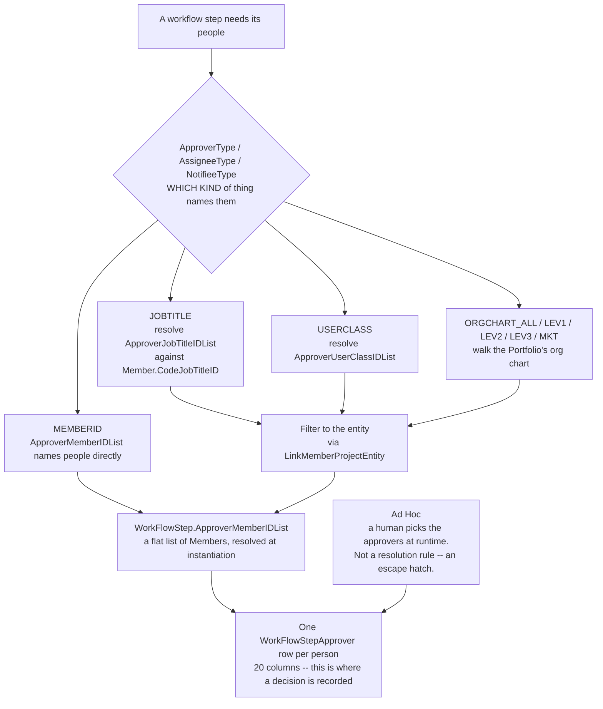

# Routing and approvals

**Stated up front.** Every workflow step routes to **three independent audiences** — approvers,
assignees and notifiees — using a shared **principal selector**. The authoritative form of that
selector is the GraphQL enum `MemberNotifyType: [ORGCHART_ALL, ORGCHART_LEV1, ORGCHART_LEV2,
ORGCHART_LEV3, ORGCHART_MKT, USERCLASS, JOBTITLE, MEMBERID]` (**Observed**,
`../../data-model/graphql-api.md`), which contains the vendor help text's four categories exactly
and refines "Org Chart Level" into five concrete values. The live UI adds a fifth category the
schema does not name: **Ad Hoc**. The three roles are **not** symmetric: approvers decide and their
decisions are individually recorded; assignees do the work and only their notification state is
recorded; notifiees get an email and no record at all. Routing resolves to named people once, at
step instantiation, after which the step keeps only a flat member list. Escalation is two-tier
(warn the actor, then alert a manager) and **never reassigns or auto-decides** — it only sends more
email.

**The live tenant barely uses any of this.** Of 19 configured steps, **17 route by named Member**,
one by Job Title and one by Ad Hoc (**Observed**,
`../layouts-and-forms/forms-vs-pages-vs-layouts.md`). The rich role-based routing the schema
supports is, in practice, almost entirely unused — which is itself a finding: ASG's real processes
name individuals. That is also why pain points 9 and 10 in
[`README.md`](README.md#known-engine-defects-and-gaps-as-reported-by-asg-users) (no delegation, no
bulk user substitution) bite so hard.

## 1. The three roles

| | Approver | Assignee | Notifiee |
|---|---|---|---|
| Template routing fields | `ApproverType`, `ApproverMemberIDList`, `ApproverJobTitleIDList`, `ApproverUserClassIDList` | `AssigneeType`, `AssigneeMemberIDList`, `AssigneeJobTitleIDList`, `AssigneeUserClassIDList` | `NotifieeType`, `NotifieeMemberIDList`, `NotifieeJobTitleIDList`, `NotifieeUserClassIDList` |
| Template "is required" predicate | `ComputedRequiresApprovers` | `ComputedRequiresAssignees` | — |
| Instance flat list | `WorkFlowStep.ApproverMemberIDList` | `WorkFlowStep.AssigneeMemberIDList` | `WorkFlowStep.NotifieeMemberIDList` |
| Per-person runtime row | **`WorkFlowStepApprover`** (20 cols) | **`WorkFlowStepAssignee`** (11 cols) | **none** |
| Can take a decision? | **Yes** — `WorkFlowTemplateStepActionID`, `ActionTakenName`, `HasApproved`, `HasTakenAction` | **No** — no action columns exist | No |
| Signature captured? | Yes — `SignatureDate` | No | No |
| Comment captured? | Yes — `ActionComment` + `PriorActionComment` | No | No |
| Delivery/ack tracked? | Yes — `EMailSentStatus`, `NotifyAcknowledgedStatus` | Yes — same two columns | **No** |
| SLA duration | `DurationDaysApprovers` → `DueDateApprovers` | `DurationDaysAssignees` → `DueDateAssignees` | none |
| Warn / alert offsets | `DaysUntilWarnApprovers`, `DaysUntilAlertApprovers` | `DaysUntilWarnAssignees`, `DaysUntilAlertAssignees` | none |
| Dashboard alert flag | `EMailAlertApprovers` | `EMailAlertAssignees` | none |
| Start-of-step notification | `NotifyStepApproversStarted` | `NotifyStepAssigneesStarted` | none |
| Page layout | `PageLayoutApproversID` — *"Select which form layout approvers should see for this step"* | `PageLayoutAssigneesID` — *"…which form layout assignees should see"* | none |
| Reassignment field | `ReassignApproversJobTitleIDList` | `ReassignAssigneesJobTitleIDList` | none |

Every cell above is **Observed** from S1 field lists and S2 definitions, except the arrows in the
SLA row, which are **Derived**.

**Reading of the asymmetry** (**Derived**): an assignee *fills in the form and presses Submit*
(`ProjectEntity.FormSubmitButton`), which stamps
`WorkFlowStep.SubmitForApprovalByMemberID`/`SubmitForApprovalDate` — one stamp for the whole step,
not one per assignee. An approver *presses one of the step's action buttons*, which writes a
`WorkFlowStepApprover` row naming the exact `WorkFlowTemplateStepActionID` chosen. The engine
therefore records **who decided what** but only **who submitted**, singular.

## 2. Three competing routing vocabularies, reconciled

Three sources describe "how a step picks its people" and **they do not agree**. Reconciling them is
the single most important thing this document does, because a rebuild has to pick one model.

| Source | Vocabulary | Values | Confidence |
|---|---|---|---|
| **Vendor field help** for `ApproverType` / `AssigneeType` / `NotifieeType` | *"Select the category of approver you want to use, **such as** by Job Title, User Class, Member, or Org Chart Level"* | 4, and the phrase *"such as"* makes the list explicitly **illustrative, not exhaustive** | Observed — `_xlsx_lucernex_jcrew.txt` line 7308 and its two siblings |
| **GraphQL enum `MemberNotifyType`** | `ORGCHART_ALL`, `ORGCHART_LEV1`, `ORGCHART_LEV2`, `ORGCHART_LEV3`, `ORGCHART_MKT`, `USERCLASS`, `JOBTITLE`, `MEMBERID` | 8 | Observed — `../../data-model/graphql-api.md` |
| **GraphQL enum `AssigneeType`** | `ALL`, `PARENT`, `REGION1`, `REGION2`, `MARKET`, `JOB_TITLE` | 6 | Observed — same |
| **Live UI column `Approval Level`** | `Member`, `Job Title`, `Ad Hoc` | 3 observed in use | Observed — `../layouts-and-forms/forms-vs-pages-vs-layouts.md` |

### The reconciliation

**Derived, and this is the load-bearing conclusion of this document: these are two orthogonal
dimensions plus a runtime escape hatch, not one enum with disagreeing definitions.**



**Read the diagram against what the tenants actually do.** Across the 19 AF steps the `Approval Level`
column reads **`Member` ×16**, **`Ad Hoc` ×2**, **`Job Title` ×1** — the last being `User Request`
step 1, routed to *System Administrator*. The **org-chart and user-class branches are built and
unused in both tenants**, and `Job Title` is exercised exactly once.

**Derived, and it is the sharpest thing the diagram shows.** Every branch converges on the same
place: a flat `ApproverMemberIDList` on the instance, then one `WorkFlowStepApprover` row per person.
**The routing rule is evaluated once, at instantiation, and then discarded** — the instance keeps
people, not the rule that chose them. That is why a member leaving breaks in-flight instances, and
why *"positions in the model, people in the data"* is a description of the **storage**, not just of
tenant habit.


**Dimension 1 — the principal selector: *what kind of thing names the people*.** `MemberNotifyType`
is this dimension in its complete form. It contains all four categories the vendor help names
(`MEMBERID`, `JOBTITLE`, `USERCLASS`, and `ORGCHART_*`), it resolves the vendor help's vague "Org
Chart Level" into five concrete values, and the vendor help's *"such as"* explains why the help text
lists fewer. Because the vendor uses **identical wording** for all three of `ApproverType`,
`AssigneeType` and `NotifieeType`, one shared vocabulary across the three roles is the natural
reading.

| # | Principal category | `MemberNotifyType` value | Template column | Resolves against | Confidence |
|---|---|---|---|---|---|
| 1 | **Named member** | `MEMBERID` | `*MemberIDList` (`sTYPE_MEMBER`) | Nothing — already named people. **17 of 19 live steps use this.** | Observed |
| 2 | **Job Title** | `JOBTITLE` | `*JobTitleIDList` (`sCODE_JOB_TITLE`) | `Member.CodeJobTitleID` / `CodeJobTitleIDList`, filtered to the entity via `LinkMemberProjectEntity`. **1 live step uses this** (`User Request` step 1 → *System Administrator*). | Observed |
| 3 | **User Class** | `USERCLASS` | `*UserClassIDList` (`sCODE_USER_CLASS`) | `Member.CodeUserClassID`; the class itself is `UserClassSecurity`. **No live step uses this.** | Derived |
| 4 | **Org chart, all levels** | `ORGCHART_ALL` | none on `WorkFlowTemplateStep` — only `WorkFlowTemplateStepMember.OrgChartLevel` | `Member.SupervisorID`, walked to the top | Derived |
| 5 | **Org chart, level 1 / 2 / 3** | `ORGCHART_LEV1` … `LEV3` | same | `Member.SupervisorID`, walked exactly 1, 2 or 3 hops. **The depth is bounded at three** | Observed (the enum) |
| 6 | **Org chart, market** | `ORGCHART_MKT` | same | `ProjectEntity.CodeMarketAreaID` / `CodeMarketTypeID` crossed with the org chart | Derived |

`WorkFlowTemplateStep.OrgChartLevel`'s absence is now explained: the org-chart variants are values of
the *type* discriminator, not a separate list column. `WorkFlowTemplateStepMember.OrgChartLevel`
(a `Number`) stores the depth when one is needed.

**Dimension 2 — the scope selector: *where to look for those people*.** The GraphQL `AssigneeType`
enum is not a principal kind at all. `PARENT`, `REGION1`, `REGION2` and `MARKET` are **entity
hierarchy** concepts — `ProjectEntity` carries `RegionID`, `RootRegionID`, `SubRegionID`,
`CodeMarketAreaID` and `CodeMarketTypeID` (**Observed**, `_lucernex_objects_summary.txt`
`ProjectEntity` block). Read as a scope, the enum is coherent: *search for the principal across
`ALL` entities, or on the `PARENT` entity, or at region level 1, region level 2, or market level*.
`JOB_TITLE` appearing in both enums is the overlap that makes the two look like rivals; it is the
one value that is meaningful on either axis.

**The escape hatch — `Ad Hoc`.** The live UI's third value appears in neither enum. It maps to
`WorkFlowTemplateStepMember.IsAdhoc` / `AdhocMemberID` and to `WorkFlow.AdhocMemberID`
(**Derived**): the step declares *"a person is chosen at runtime here"* and names nobody at design
time. The live grid shows an **empty `Approver` column** for both Ad Hoc steps, which is exactly
what that reading predicts. This upgrades ad-hoc assignment from "an override" (§5) to **a
first-class routing category**.

### What is still unresolved

`ApproverType`, `AssigneeType` and `NotifieeType` are `sTYPE_UNFORMATTED_NUMBER` on
`WorkFlowTemplateStep` — raw integers, not code FKs — so **which** of these vocabularies the legacy
column actually encodes is unproven. The GraphQL enums may belong to the modern API surface and the
legacy JSP columns to an older, narrower model. **Open question OQ-8**, now sharper: read one saved
step through the GraphQL Explorer and compare the returned enum value against the integer in the
JSP form.

The normalised routing-target table `WorkFlowTemplateStepMember` carries all four flat categories
plus the ad-hoc flag:

| Field | Schema type | UI label | Req | Definition (vendor help text) |
|---|---|---|---|---|
| `AdhocMemberID` *(catalog only)* | — | Adhoc Member ID |  |  |
| `CodeJobTitleID` *(catalog only)* | — | WF Template Step Member Job Title |  |  |
| `CodeUserClassID` *(catalog only)* | — | WF Template Step Member User Class |  |  |
| `IsAdhoc` *(catalog only)* | — | Is Adhoc? |  |  |
| `MemberID` *(catalog only)* | — | WF Template Step Member |  |  |
| `OrgChartLevel` *(catalog only)* | — | WF Template Step Member Org Chart Level |  |  |
| `StepMemberResponsibility` *(catalog only)* | — | WF Template Step Member Responsibility | Y |  |
| `WorkFlowTemplateStepID` *(catalog only)* | — | WF Template Step Member Step | Y |  |
| `WorkFlowTemplateStepMemberID` *(catalog only)* | — | WF Template Step Member RecID |  |  |

That nine-column table carries `MemberID`, `CodeJobTitleID`, `CodeUserClassID` **and**
`OrgChartLevel` — all four flat categories — plus `IsAdhoc`, `AdhocMemberID` and
`StepMemberResponsibility`. **Derived: `WorkFlowTemplateStepMember` is the normalised routing-target
table, and the `*IDList` columns on `WorkFlowTemplateStep` are a denormalised projection of it for
the three categories that fit in a list column.** It has no physical table in S1
(**Open question OQ-2**), which remains the biggest hole in this analysis.

The identical shape appears on `NotifyTemplateMember` (`MemberID`, `CodeJobTitleID`,
`CodeUserClassID`, `OrgChartLevel`) and a subset on `LinkTaskByCodeMember` (`CodeJobTitleID`,
`OrgChartLevel`, no user class) — **Observed**, S1 line 126 and S3. That the notification targeting
enum is the one named `MemberNotifyType`, and that it is the most complete of the three
vocabularies, is not a coincidence: **the principal selector is a platform-wide convention that the
notification subsystem happens to expose most fully.** A rebuild should model it once, as a
reusable principal selector with an orthogonal scope selector, and let workflow, notification and
task assignment all consume it.

## 3. The org chart

`Member.SupervisorID` (`Member ID`, self-referencing) is the org chart. **Observed**, S1 `Member`
block. The GraphQL enum bounds it: `ORGCHART_LEV1`, `ORGCHART_LEV2`, `ORGCHART_LEV3`, plus
`ORGCHART_ALL` and `ORGCHART_MKT` — **three explicit levels, not an arbitrary depth**
(**Observed**, `../../data-model/graphql-api.md`). *"The org chart is therefore a real, queryable
structure, not just a display artefact."* `WorkFlowTemplateStepMember.OrgChartLevel` being a
`Number` is consistent with storing 1, 2 or 3.

From **whom** the hops are counted is still unstated — the initiator? the assignee? the entity's
manager? **Open question OQ-22**, and it is the difference between "my manager approves" and "the
regional director approves".

`LinkMemberProjectEntity.IsManager` (**Observed**, S1 line for `LinkMemberProjectEntity`) marks a
member as a manager *of a specific entity*, which is the most likely anchor for
`DaysUntilAlert*`'s *"a **manager** is notified"*. **Inferred.**

`ProjectEntity.ManagerIDList` is a second, denormalised manager list on the entity itself
(**Observed**, S1 `ProjectEntity` block). Which of the two the alert path reads is
**Open question OQ-23**.

Corroborating evidence that job titles drive assignment, **Observed** from S2 (`Member.CodeJobTitleID`,
line 4082): *"A job title is more specific to the person than the job function. **The Job Title is
used when auto-assigning things like tasks, work flow steps, and notifications.**"*

## 4. The entity roster — how a job title becomes a person

`LinkMemberProjectEntity` (7 cols) is the per-entity team roster and the join that makes role-based
routing resolvable:

| Field | Schema type | UI label | Req | Definition (vendor help text) |
|---|---|---|---|---|
| `AddedByOrgChart` *(catalog only)* | — | Added By Org Chart? | Y |  |
| `AssignedCodeJobTitleIDList` | Dropdown (Job Title Code) | Entity Assigned Job Title List |  | This field updates the database to include the job titles that override the member's default job title. |
| `BillRate1` *(catalog only)* | — | Billing Rate 1 |  |  |
| `BillRate2` *(catalog only)* | — | Billing Rate 2 |  |  |
| `CodeJobFunctionID` *(catalog only)* | — | Job Function |  |  |
| `CodeJobTitleID` *(catalog only)* | — | Job Title |  |  |
| `CodeJobTitleIDList` | Dropdown (Job Title Code) | Entity Job Title List |  | This field lists the job titles currently configured for the member on this entity. |
| `CodeUserClassID` *(catalog only)* | — | User Class |  |  |
| `EmployerID` *(catalog only)* | — | Employer |  |  |
| `HTMLAddress` *(catalog only)* | — | Address |  |  |
| `IsManager` | Boolean | Is Manager? | Y | If this field's value is true, the member is a manager on the entity. |
| `LinkMemberProjectEntityID` *(catalog only)* | — | Link Member Project Entity RecID |  |  |
| `MemberID` | Member ID | Member | Y | The member ID of the user on the entity. |
| `ModifiedByID` | Member ID | Modified By |  | The Modified By field is a system-populated field which captures the name of the member who made a change to a record. |
| `ModifiedDate` | Time | Modified Date |  | The Modified Date field is a system-populated field which captures the date that a modification is made to a record. |
| `PEMgr_CodeJobFunctionID` *(catalog only)* | — | Job Function |  |  |
| `PEMgr_CodeJobTitleID` *(catalog only)* | — | Manager Title |  |  |
| `PEMgr_CodeUserClassID` *(catalog only)* | — | User Class |  |  |
| `PEMgr_EmployerID` *(catalog only)* | — | Employer |  |  |
| `PEMgr_HTMLAddress` *(catalog only)* | — | Address |  |  |
| `PEMgr_MemberID` *(catalog only)* | — | Manager Name |  |  |
| `PEMgr_ModifiedByID` *(catalog only)* | — | Modified By |  |  |
| `PEMgr_ModifiedDate` *(catalog only)* | — | Modified Date |  |  |
| `ProjectEntityID` | Entity ID | Entity | Y | The ProjectEntityID is the Base Entity System Identifier for associated tasks, folders, documents, forms, and other records. It is assigned automatically by the system, and is not editable. |

Two job-title columns coexist: `CodeJobTitleIDList` and `AssignedCodeJobTitleIDList`. **Inferred:**
the first is the member's own titles, the second the titles they have been *assigned* on this
entity — i.e. a person can hold a role on one contract that they do not hold globally. **Open
question OQ-24**, and it matters: routing "by Job Title" resolves differently under each reading.

The complete resolution chain, **Derived**:

```
step routing rule                     roster                          people
────────────────────────────────────  ──────────────────────────────  ──────────────────
ApproverType = Job Title              LinkMemberProjectEntity
ApproverJobTitleIDList = {LA, LAM} ──▶  WHERE ProjectEntityID = the  ──▶ {m1, m3, m7}
                                          workflow's entity
                                        AND job title ∈ the list

ApproverType = User Class             Member.CodeUserClassID
ApproverUserClassIDList = {Approver}──▶  ∩ entity roster             ──▶ {m3, m9}

ApproverType = Member                 (none)                        ──▶ {m4}
ApproverMemberIDList = {m4}

ApproverType = Org Chart Level        Member.SupervisorID walked n  ──▶ {m2}
WorkFlowTemplateStepMember             hops from an unstated anchor
  .OrgChartLevel = n                   (OQ-22)
                                                    │
                                                    ▼
                               WorkFlowStep.ApproverMemberIDList  (flat, frozen)
                               one WorkFlowStepApprover row per member
```

## 5. Ad-hoc assignment — a first-class routing category

**Upgraded by the live capture.** `Ad Hoc` is one of the three values rendered in the
`Approval Level` column, alongside `Member` and `Job Title` (**Observed**,
`../layouts-and-forms/forms-vs-pages-vs-layouts.md`). It is used on **`Rent Payment
Review/Approval` step 2 — "Approve Rent Preview File (ASG)"** and **`User Request` step 2 — "Submit
Revisions"**, and in both cases the `Approver` column is **empty**. That empty cell is the
observable signature of a runtime-chosen principal.

This is not, as the schema alone suggested, merely an override on top of rule-based routing. It is
a routing category the administrator selects at design time, meaning *"defer this choice to the
person who kicks the workflow off"*. Its schema locus is
`WorkFlowTemplateStepMember.IsAdhoc`/`AdhocMemberID`, and its runtime locus is
`WorkFlow.AdhocMemberID` filled from `Issue.WorkFlowAdhocMemberID`. **Derived.**

Note what ASG uses it for: the *ASG-side* approval of a rent payment file, and the revision step of
a user request. Both are cases where the right person depends on the specific request. A rebuild
must support it; it is not a legacy wart.

| Field | Object | Definition | Source |
|---|---|---|---|
| `AutoAssignInitiator` | `WorkFlowTemplate` | *"the system will automatically assign the person who kicks off the work flow as an ad hoc assignee to the kickoff step or form, **and on any step that requires an ad hoc assignee** in the work flow."* | **Observed**, S2 |
| `AdhocMemberID` | `WorkFlow` | *"Select an ad hoc assignee from this field."* One slot for the whole instance. | **Observed**, S2 |
| `WorkFlowAdhocMemberID` | `Issue` | *"This field lists **the members of the entity** who can be selected as an ad hoc assignee."* | **Observed**, S2 |
| `PassAdhocToNewWF` | `WorkFlowTemplateStepAction` | *"…assign the ad hoc member assigned to this task to the first task in the new work flow kicked off by this step."* | **Observed**, S2 |
| `IsAdhoc`, `AdhocMemberID` | `WorkFlowTemplateStepMember` | Marks a template routing target as an ad-hoc slot to be filled at runtime. | **Inferred** |

**Derived:** a step can declare *"an ad-hoc assignee acts here"* without naming anyone; the person
is chosen when the workflow is kicked off (from the form's `WorkFlowAdhocMemberID` picker, scoped to
the entity's members) or auto-set to the initiator. There is exactly **one** ad-hoc slot per
workflow instance, and it carries into spawned workflows only if the spawning action says so.

`Member.IsUnassignedWorkFlowApprover` and `WorkFlowTemplateStep.UnassignedApproverID` look like the
same idea for approvers, but S2 says of both: *"This field is a placeholder for an upcoming
feature."* **Observed** — dead.

## 6. Quorum and conflict

The only quorum control is `WorkFlowTemplateStepAction.RequireAllApprovers` — *"require all
qualified approvers **on the entity** to take **the same action** on the work flow step for the
work flow to progress."* **Observed.**

| Setting | Behaviour | Confidence |
|---|---|---|
| `RequireAllApprovers = true` | Every qualified approver must press **the same button** before the workflow advances. | Observed |
| `RequireAllApprovers = false` | The first approver to act decides. | Inferred — the definition states only the true case |

What the schema does **not** provide, all **Derived** from exhaustive field inspection:

- **No sequence.** `WorkFlowStepApprover` has no order, level, or tier column. Approval is
  structurally parallel. Corroborated by S4 line 352: *"the UI does not indicate if the approval
  process is sequential or parallel."*
- **No vote tally, no threshold, no percentage.** All-or-first, nothing between. No "any 2 of 5".
- **No tie-break.** S4 line 362 reports the exact failure this predicts: *"if Dana takes one
  action, Jen takes another, and then Jess takes a third option, the workflow can't move forward…
  Right now, I can't do that."* With `RequireAllApprovers = true` and divergent choices, the
  unanimity condition can never be satisfied and the step deadlocks with no recovery path in the
  data model. **This is a schema-level defect, not a UI bug.**
- **No abstain, no recusal, no delegate.** S4 line 340 asks for out-of-office delegation; nothing in
  the schema supports it.
- **No amount banding.** See [`step-actions.md` OQ-19](step-actions.md#open-questions).

## 7. Escalation and SLA

Per role, three numbers and one implicit clock. **Observed** definitions, **Derived** arithmetic.

| Template field | Vendor definition | Instance field | Computed date |
|---|---|---|---|
| `DurationDaysApprovers` | *"how long in days an approver has to complete a step"* | `DurationDaysApprovers` | `DueDateApprovers` = `StartDate` + duration |
| `DurationDaysAssignees` | *"how long in days an assignee has to complete a step"* | `DurationDaysAssignees` | `DueDateAssignees` |
| `DaysUntilWarnApprovers` | *"how many days there will be before **an approver receives a notification** that this step has not been completed"* | `DaysUntilWarnApprovers` | `ComputedWarnDateApprovers` |
| `DaysUntilWarnAssignees` | *"…before **an assignee receives a notification**…"* | `DaysUntilWarnAssignees` | `ComputedWarnDateAssignees` |
| `DaysUntilAlertApprovers` | *"…before **a manager is notified** that this step has not been completed"* | `DaysUntilAlertApprovers` | `ComputedAlertDateApprovers` |
| `DaysUntilAlertAssignees` | *"…before **a manager is notified**…"* | `DaysUntilAlertAssignees` | `ComputedAlertDateAssignees` |
| `DaysUntilNotification` | *"the number of days **after the form completion date** a notification should be sent"* | *(none — hidden)* | `ComputedDueDateNotification` |

Two tiers: **Warn** goes to the actor, **Alert** goes to a manager. The distinction is stated
explicitly and consistently across all four definitions. **Observed.**

What escalation does **not** do (**Derived**, exhaustive): it never reassigns, never auto-approves,
never auto-denies, never advances the step, never cancels, and never raises priority. It sends
email or a dashboard alert and stops. `WorkFlowStep.Priority` is copied from the template and never
changed. Corroborated by S4 line 354: *"Passive Audit Trail… There are no proactive alerts for
at-risk items beyond the basic duration triggers."*

Whether "days" means calendar or working days is unstated for workflow steps. It *is* stated for
schedule tasks — *"Duration refers to **working days only**"* (**Observed**, S2 `Task.ActualDuration`)
— and a `HolidaySchedule` object exists (**Observed**, S3, 8 leaves, *"a named calendar of
holidays… used in schedule/task date calculations"*). Whether the workflow SLA clock honours it is
**Open question OQ-25**, and it changes every due date in a migration.

## 8. Reassignment

`ReassignApproversJobTitleIDList` / `ReassignAssigneesJobTitleIDList` — *"**When added to a form**,
this field allows users with appropriate permissions to reassign approvers/assignees **by job
title**."* **Observed**, S2.

Three things follow, all **Derived**:

1. Reassignment is a **form field placed on a page layout**, not a workflow operation. It appears
   only if an administrator adds it to the assignee or approver layout.
2. It reassigns **by job title only** — you cannot reassign to a named person through this
   mechanism.
3. It lives on the **template**, not the instance, so reassignment re-runs the job-title resolution
   rather than editing the frozen member list. Whether the reassignment persists back to the
   template (affecting all future instances) or only to the running step is **Open question OQ-26**
   — and the two answers are very different products.

"Users with appropriate permissions" is undefined. The permission ladder is now Observed —
`SecurityLevel: [DEFAULT, NO_ACCESS, VIEW, EDIT, DELETE]` (**Observed**,
`../../data-model/graphql-api.md`), applied at least down to page-layout granularity — and
`UserClassSecurity.CodeSecurityPrivilegeID` is the likely gate. Which level the reassignment fields
demand is **Inferred** and unresolved.

## 9. Vendor collaboration

`WorkFlowTemplate.EnableVendorCollaboration` + `CollaboratorJobTitleIDList` (**Observed**, S1/S3;
no vendor help text for either) open a workflow to external users, scoped by job title. External
parties are `Member` rows whose `EmployerID` points at a vendor `Employer`; `Member.AnySiteLoginName`
/ `AnySitePassword` are the external-login columns. **Inferred.**

**The live tenant does not use it.** The `Manage Work Flows` grid renders a
`Collaborator Job Titles` column and it is **empty for all four workflows** (**Observed**,
`../layouts-and-forms/forms-vs-pages-vs-layouts.md`). That column is
`WorkFlowTemplate.CollaboratorJobTitleIDList` — **Derived**, from the exact name match. Vendor
collaboration is therefore configured-but-unused here, and a rebuild can defer it. The bidding
module below is the only place the capability is exercised in the product, and ASG's four
workflows are all internal lease-accounting processes.

**⊘ The bidding module is out of scope** (2026-09-10), but it is the only place in the product where
vendor collaboration is actually exercised, so it is retained as the worked example for a capability
ASG Edge+ may eventually need. Combined with the live tenant leaving `Collaborator Job Titles` empty
on all four workflows, vendor collaboration is **doubly deferrable**: out of scope as a module, and
unused as a feature. The worked example: `BidderIssue.MemberIDList`, `IsBidInviteAccepted`,
`NotificationDate`, and the `BidPackage` submit buttons `InviteBidders`, `NotifyAllBidders`,
`NotifyWinningBidder`, `NotifyLosingBidders`, `CanceledBidNotification` (**Observed**, S1/S3).
`Issue.IsPrivate` + `Member.IsViewPrivateIssueAllowed` are the visibility gate that keeps internal
forms away from collaborators (**Observed**, S1/S2: *"Only certain members will have access to
private issues."*).

## 10. Locking

Two independent locks on a step, neither with an expiry:

| Lock | Columns | Set by | Released by |
|---|---|---|---|
| Decision lock | `WorkFlowStep.IsReadOnly` | An action with `DisableEditAfterDecision` — *"prevents users from making any more changes after the step status is changed to Approved or Denied"* | Nothing in the schema |
| Checkout lock | `WorkFlowStep.CheckedOutByMemberID`, `CheckedOutDate`; also `Issue.CheckedOutByMemberID`, `CheckedOutDate` | The user pressing Checkout | The same user, or a sysadmin |

**Observed** columns; **Observed** definition for `DisableEditAfterDecision`. The checkout lock's
lack of an expiry column is the direct cause of the reported defect (S4 line 363: *"People check out
by mistake all the time… I have to manually navigate to each item and check it in."*). ASG's own
proposed fix is recorded there: rename to Lock/Unlock, grant managers the unlock right, and expire
after 48 hours.

## Open questions

Ranked by cost of getting them wrong.

1. **OQ-19 (repeated from [`step-actions.md`](step-actions.md)) — how is amount-banded approval
   routing done?** `Member` carries `PaymentApprovalMinAmount`/`MaxAmount`,
   `RecurringApprovalMinAmount`/`MaxAmount` and the two `Equip*` pairs, and no workflow field reads
   them. Open **Manage Work Flows** → a payment-approval step and look for any threshold control;
   then open **Member Administration** → a member and check whether those four pairs are populated.
2. **OQ-8 (sharpened) — which vocabulary does the legacy `ApproverType` integer encode?** Three
   competing vocabularies are now Observed (§2) and the reconciliation offered there is Derived, not
   proven. Open a step's approver configuration in **Manage Work Flows**, record the exact option
   list offered for *Approval Level*, then read the same saved step through the **GraphQL Explorer**
   and compare the returned enum value against the integer. This single comparison settles §2.
3. **OQ-40 — is `AssigneeType` a scope selector, as §2 concludes?** If `REGION1` / `REGION2` /
   `MARKET` / `PARENT` really are `ProjectEntity` hierarchy scopes, a step must have *both* a
   principal category and a scope. Check whether the step editor offers two controls or one.
4. **OQ-2 — does `WorkFlowTemplateStepMember` exist, and is Org Chart Level selectable?** Record
   what control appears when an org-chart option is chosen, and whether the depth is a free integer
   or a picklist of 1/2/3/All/Market matching `MemberNotifyType`.
4. **OQ-22 — Org Chart Level is relative to whom?** Configure a step with a level and observe who
   resolves.
5. **OQ-24 — `CodeJobTitleIDList` vs `AssignedCodeJobTitleIDList` on `LinkMemberProjectEntity`.**
   On a Contract's **Members/Contacts** tab, check whether a member's titles there differ from
   their global title in Member Administration.
6. **OQ-14 — the exact meaning of "all qualified approvers on the entity".** See
   [`step-actions.md`](step-actions.md#open-questions).
7. **OQ-26 — does form-level reassignment write back to the template?** Place
   `ReassignApproversJobTitleIDList` on an approver layout, use it on a running step, then re-open
   the template step and see whether its `ApproverJobTitleIDList` changed.
8. **OQ-25 — do workflow SLA days honour `HolidaySchedule` and working days?** Set
   `DurationDaysApprovers = 5` on a step started on a Thursday and read back `DueDateApprovers`.
9. **OQ-23 — which manager receives the `DaysUntilAlert*` notification?**
   `LinkMemberProjectEntity.IsManager`, `ProjectEntity.ManagerIDList`, or `Member.SupervisorID`?
   The `ORGCHART_LEV1` enum value suggests `SupervisorID` walked one hop.
10. **OQ-41 — how is assignee routing configured?** The live grid shows only `Approval Level` and
   `Approver`, both approver concepts. `WorkFlowTemplateStep` carries a full parallel set of
   assignee routing columns and a `PageLayoutAssigneesID`, none of which was rendered. Open the step
   editor and capture the assignee half.
11. **OQ-42 — why does the live tenant route 17 of 19 steps by named Member?** Deliberate policy, or
   role-based routing being unusable in practice (the "all-for-one" overload, feature list line
   360)? Ask ASG. The answer decides how much of the routing engine ASG Edge+ actually needs on
   day one.
10. **OQ-27 — what happens to a running workflow when a member is deactivated?** ASG states
    (S4 line 332) that deactivated users lose all access but *"Anything created or assigned to the
    deactivated user must stay in the system with user's details."* Confirm whether a step routed
    solely to a deactivated member deadlocks.
