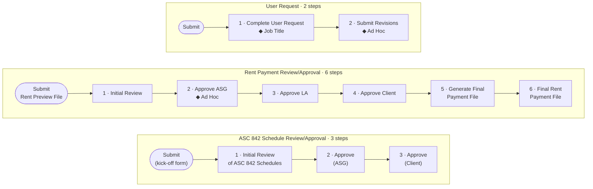
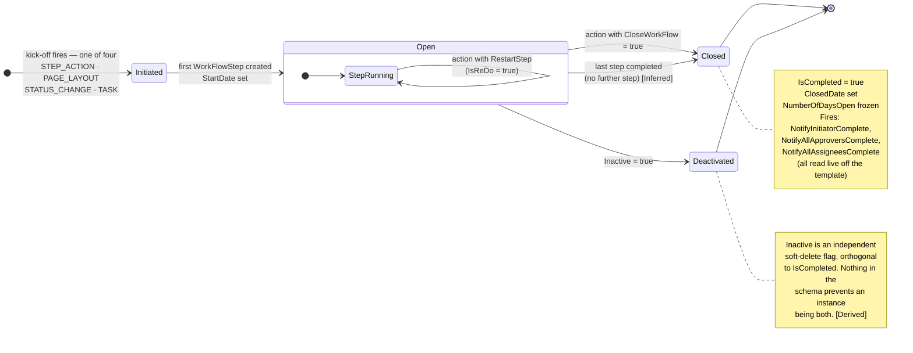
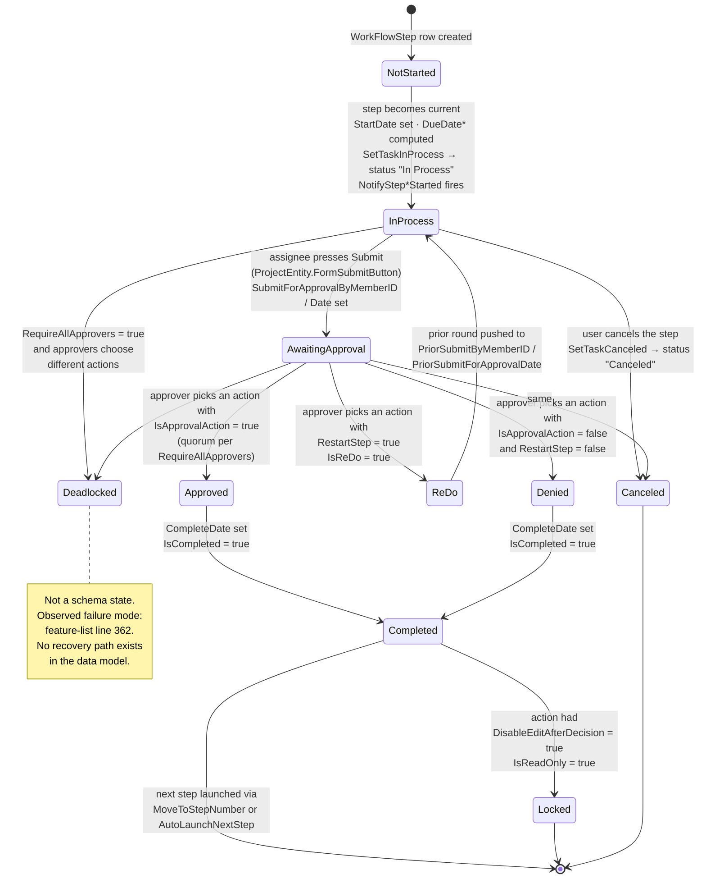
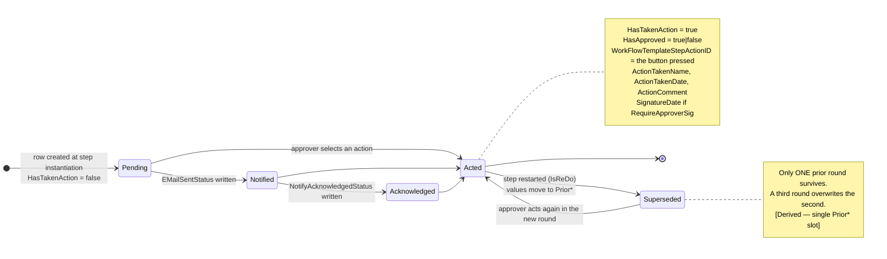

# The workflow state model

**Stated up front.** There are **three nested state machines**, not one: the **workflow instance**
(`WorkFlow.CodeWorkFlowStatusID` + `IsCompleted` + `ClosedDate` + `Inactive`), the **step**
(`WorkFlowStep.CodeWorkFlowStatusID` + `IsCompleted` + `IsReDo` + `IsReadOnly`), and the
**individual approver's decision** (`WorkFlowStepApprover.HasTakenAction` + `HasApproved`). Both the
workflow and the step draw their status from the *same* code table, `Work Flow Status Code`
(**Observed** — `CodeWorkFlowStatusID` on S1 lines 217 and 218 both bind `Dropdown (Work Flow
Status Code)`), which means a rebuild cannot give them separate enums without diverging.

### Correction: `Work Flow Status Code` is *not* a tenant-editable drop-down

An earlier revision of this document asserted that `Work Flow Status Code` is one of the fixed Firm
Drop Down categories and could therefore be read from **Manage Firm Drop Downs**. **That was an
inference stated as fact, and it is wrong.** The full 207-table platform code-table registry has
since been captured, and `Work Flow Status Code` **is not among the 207**
(**Observed**, `../../data-model/code-table-registry.md`). Anyone following the old instruction
would have found nothing.

The two facts reconcile cleanly. A code table of that name *does* exist — S1 declares
`CodeWorkFlowStatusID` with the type `Dropdown (Work Flow Status Code)` on both `WorkFlow` and
`WorkFlowStep` (**Observed**, lines 217-218). It is simply **not exposed for tenant editing**, which
is consistent with it governing engine behaviour rather than presentation: a tenant that could
rename or deactivate *Approved* would break the engine. **Derived.** The nearest tenant-editable
neighbours are `Approval Status Code` (2081), `Last Action Status Code` (2082) and
`Decision Status Code` (2025) — all present in the registry, none of them this one.

**The concrete status values therefore remain unobserved, and the route to them has changed** —
see the rewritten OQ-7 below. Four values are nevertheless **Observed indirectly**, from vendor help
text on other fields, and are marked as such throughout. Everything else is **Inferred** and must be
confirmed. OQ-7 is still the highest-priority item in this document.

## The Observed baseline: the process shape is linear

Before any inferred machinery, this is what the running system actually shows. **Observed**,
`../layouts-and-forms/forms-vs-pages-vs-layouts.md`.

Four workflows, 19 steps, **every step ordinal 1..N, every step of type `Form`, and no branch,
merge, join or parallel construct rendered anywhere.**

`Lease Admin Request` runs the same way over eight steps: Initial Review → Abstract Lease Document →
ASG Review of Lease Abstract → Client Review of Lease Abstract → Import Payment History/Sales →
Finalize → Finalize (Defaults) → Complete.

**Two cautions on reading this as proof of linearity.** First, the grid has **no column that could
display a jump target**, so it cannot render a branch even if one is configured — absence in the
grid is not absence in the configuration. Second, branching would live in
`WorkFlowTemplateStepAction.MoveToStepNumber`, an object no capture has opened
([`step-actions.md`](step-actions.md)). **The linear reading is the Observed baseline; branching is
unconfirmed in both directions.**

One live detail does hint at the answer. `Lease Admin Request` has two near-identical consecutive
steps — 6 *Finalize Lease Admin Request* and 7 *Finalize Lease Admin Requests (Defaults)*. Laying
two outcomes out in sequence rather than branching between them is the workaround you expect when
an engine cannot branch. **Inferred**, and it is exactly what OQ-44 should settle.

## What is directly observed about statuses

| Value | Where it is named | Applies to | Evidence |
|---|---|---|---|
| **In Process** | `WorkFlowTemplateStep.SetTaskInProcess` — *"…set the work flow step status to **'In Process'** when the step starts."* | Step | **Observed**, S2 |
| **Canceled** | `WorkFlowTemplateStep.SetTaskCanceled` — *"…set the work flow step status to **'Canceled'** when the user cancels the step."* | Step | **Observed**, S2 |
| **Approved** | `WorkFlowTemplateStepAction.DisableEditAfterDecision` — *"…after the step status is changed to **Approved** or Denied."* | Step | **Observed**, S2 |
| **Denied** | same | Step | **Observed**, S2 |

Two further facts about the vocabulary, both **Observed** from S2:

- *"the user cancels the step"* — **cancellation is a user action**, and it is not one of the three
  control-flow flags on `WorkFlowTemplateStepAction`. There is therefore a cancel path outside the
  action model. **Open question OQ-34.**
- `WorkFlowStep.IsReDo` — *"If this value is true, the step must be completed again. If false, the
  step can be completed and the user can progress to the next step. **This is related to the action
  the approver takes on the step.**"* Re-do is a *flag on the step*, not a status value.

The parallel `Task Status Code` vocabulary **is** fully observed and is a useful analogy but a
different enum: *"By default, this value is set to **Not Begun**. If you select **Canceled**, the
duration is set to 0. If you select **Completed**, the Percent Complete changes to 100%. If you
select **In-Process**, the Percent Complete is set to 99%."* (**Observed**, S2
`Task.CodeTaskStatusID`).

## The workflow instance state machine

**Derived** from the schema. The `Open` composite below is where the Observed linear sequence above
actually runs.

| State | Represented by | Confidence |
|---|---|---|
| Initiated | `WorkFlow` row exists, `CreatedDate` set, no `WorkFlowStep` yet. Entered by one of the four `KickOffMethod` values — `STEP_ACTION`, `PAGE_LAYOUT`, `STATUS_CHANGE`, `TASK` (**Observed**, `../../data-model/graphql-api.md`) | Inferred (the state); Observed (the trigger set) |
| Open | `IsCompleted = false`, `ClosedDate` null, `Inactive = false` | Derived |
| Closed | `IsCompleted = true` **and** `ClosedDate` set **and** a terminal `CodeWorkFlowStatusID` | Derived — three independent columns, unconstrained |
| Deactivated | `Inactive = true` | Observed — *"If true, this work flow has been deactivated on the Work Flow page."* |

## The step state machine

This is the machine that matters. Transitions are labelled with the **exact field** that causes
them, so each row is checkable against a live capture.

### States

| State | Represented by | Confidence | Evidence |
|---|---|---|---|
| **Not Started** | `StartDate` null | Inferred | By analogy with `Task Status Code`'s *Not Begun* |
| **In Process** | `CodeWorkFlowStatusID` = "In Process" | **Observed (value)** | `SetTaskInProcess` definition |
| **Awaiting Approval** | `SubmitForApprovalDate` set, `IsCompleted = false` | Derived | The three `SubmitForApproval*` columns exist for no other purpose |
| **Re-Do** | `IsReDo = true` | **Observed (flag)** | `WorkFlowStep.IsReDo` definition |
| **Approved** | `CodeWorkFlowStatusID` = "Approved" | **Observed (value)** | `DisableEditAfterDecision` definition |
| **Denied** | `CodeWorkFlowStatusID` = "Denied" | **Observed (value)** | same |
| **Completed** | `IsCompleted = true`, `CompleteDate` set | Derived | *"The date the work flow step was completed"* |
| **Locked** | `IsReadOnly = true` | Derived | `DisableEditAfterDecision` sets it |
| **Canceled** | `CodeWorkFlowStatusID` = "Canceled" | **Observed (value)** | `SetTaskCanceled` definition |
| **Checked Out** | `CheckedOutByMemberID` set — **orthogonal**, can coexist with any state | Derived | The two `CheckedOut*` columns |
| **Deadlocked** | *no schema representation* | **Observed (behaviour)** | Feature list line 362 |

### Transitions

| # | From | To | Trigger | Fields written | Confidence |
|---:|---|---|---|---|---|
| T1 | — | Not Started | `WorkFlowStep` row created from `WorkFlowTemplateStep` | 20 copied fields + `WorkFlowTemplateStepID` | Derived |
| T2 | Not Started | In Process | Step becomes current | `StartDate`; `DueDate`, `DueDateApprovers`, `DueDateAssignees`; the five `Computed*` escalation dates; `CurrentStepMemberIDList` | Derived |
| T3 | In Process | — | `NotifyStepAssigneesStarted` / `NotifyStepApproversStarted` fire on the enabled channels | `WorkFlowStepAssignee.EMailSentStatus`, `WorkFlowStepApprover.EMailSentStatus` | Observed (flags) |
| T4 | In Process | Awaiting Approval | Assignee presses Submit | `SubmitForApprovalByMemberID`, `SubmitForApprovalByMemberName`, `SubmitForApprovalDate` | Derived |
| T5 | Awaiting Approval | Approved | Action with `IsApprovalAction = true`, quorum met | `WorkFlowStepApprover.{WorkFlowTemplateStepActionID, ActionTakenName, ActionTakenDate, HasApproved = true, HasTakenAction = true, ActionComment}`; if `RequireApproverSig`, `SignatureDate`; step `CodeWorkFlowStatusID` = Approved | Observed + Derived |
| T6 | Awaiting Approval | Denied | Action with `IsApprovalAction = false`, `RestartStep = false` | same but `HasApproved = false`; step status = Denied | Observed + Derived |
| T7 | Awaiting Approval | Re-Do | Action with `RestartStep = true` | `IsReDo = true`; current round pushed to `PriorSubmitByMemberID`/`PriorSubmitForApprovalDate` and `WorkFlowStepApprover.Prior{ActionComment, ActionTakenDate, WFTemplateStepActionID}` | Observed (flag) + Derived |
| T8 | Re-Do | In Process | Assignee reopens the form | `SubmitForApproval*` cleared | Inferred |
| T9 | Approved / Denied | Completed | — | `IsCompleted = true`, `CompleteDate` | Derived |
| T10 | Completed | Locked | Action had `DisableEditAfterDecision = true` | `IsReadOnly = true` | Observed |
| T11 | Completed | — | The five `Notify*Complete` flags fire | per-row `EMailSentStatus` | Observed |
| T12 | Completed | *(next step)* | `MoveToStepNumber` set → jump to that `StepNumber`; else `AutoLaunchNextStep` → the next step **if it is a form** | new/updated `WorkFlowStep` | Observed; precedence unknown (OQ-16) |
| T13 | Completed | *(workflow closed)* | Action with `CloseWorkFlow = true` | `WorkFlow.IsCompleted`, `ClosedDate` | Observed |
| T14 | Completed | *(new workflow spawned)* | Action with `KickOffWorkFlowTemplateID` set; `PassAdhocToNewWF` / `PassPriorityToNewWF` carry two values across | new `WorkFlow` row | Observed |
| T15 | In Process / Awaiting Approval | Canceled | User cancels the step | `CodeWorkFlowStatusID` = Canceled; if `SetTaskCanceled`, the linked task too | Observed (value); mechanism unknown (OQ-34) |
| T16 | any | *(warn sent)* | System date reaches `ComputedWarnDateApprovers` / `…Assignees` | notification only — **no state change** | Observed |
| T17 | any | *(alert sent)* | System date reaches `ComputedAlertDateApprovers` / `…Assignees` | notification to a manager only — **no state change** | Observed |
| T18 | any | Checked Out | User presses Checkout | `CheckedOutByMemberID`, `CheckedOutDate`; **no expiry** | Derived |
| T18a | Not Started | In Process | Step routed **Ad Hoc**: the principal is chosen at runtime rather than resolved from a rule | `WorkFlow.AdhocMemberID` ← `Issue.WorkFlowAdhocMemberID` or the initiator (per `AutoAssignInitiator`) | Observed (the routing category, `../layouts-and-forms/forms-vs-pages-vs-layouts.md`) + Derived (the columns) |
| T19 | Awaiting Approval | **Deadlocked** | `RequireAllApprovers = true` and approvers select different actions | none — the step simply never satisfies its condition | Observed (behaviour), feature list line 362 |

**T16 and T17 are the whole of escalation.** No transition anywhere in this table is caused by time.
The engine has **no timer-driven state change at all** — deadlines only send email. **Derived**,
exhaustive over the field list.

## The approver decision state machine

Per `WorkFlowStepApprover` row. Three states, two flags.

`EMailSentStatus` and `NotifyAcknowledgedStatus` are **free `Text`**, not code FKs, so their value
sets are unknown. **Open question OQ-35.**

`WorkFlowStepAssignee` has the same two notification columns and **no decision columns at all** —
its state machine is Pending → Notified → Acknowledged and stops. **Observed**, S1 line 220.

## What the model cannot represent

All **Derived** by exhaustive inspection of the field lists.

| Missing capability | Consequence |
|---|---|
| No parallel branches, no fork, no join | A workflow is one token moving through numbered steps. Two things cannot be in flight at once within one instance. **Corroborated Observed**: all 19 live steps are ordinal with no parallel construct. |
| No sequential approval | All approvers on a step are peers with no order column. |
| No partial quorum | All-or-first only. No "2 of 3", no percentage, no weighting. |
| No tie-break or conflict resolution | Directly produces the observed deadlock (T19). |
| No timer-driven transition | Deadlines notify; they never advance, escalate-by-reassignment, or auto-decide. |
| No suspend / resume / hold | `Inactive` is a soft delete of the whole instance, not a pause. |
| No withdraw by initiator | Only `CloseWorkFlow` on an action, which requires an approver to press a button. |
| No parent pointer on a spawned workflow | The chain of custody breaks at every kick-off. |
| More than one prior round | Audit history is depth-1 and lossy. |
| No terminal-state constraint | `IsCompleted`, `ClosedDate` and `CodeWorkFlowStatusID` are three independent columns that nothing forces to agree. |

## Open questions

Ranked.

1. **OQ-7 (re-routed) — the full value set of `Work Flow Status Code`.** **Do not look in Manage
   Firm Drop Downs; it is not there.** Two routes remain, both cheap:

   **(a) The GraphQL API — preferred.** The API expands code tables to a pair,
   `codeContractStatusID { shortName longName }` (**Observed**,
   `../../data-model/graphql-api.md`). Query live `WorkFlow` and `WorkFlowStep` records selecting
   `codeWorkFlowStatusID { shortName longName }` and collect the distinct values; or introspect the
   field's type directly, which returns the whole enumeration whether or not any record uses it.
   Introspection is strictly better — it cannot miss a value that no live record happens to hold.

   **(b) The running UI.** Read the `Status` column on the **Work Flows** list and the step status
   on a live workflow. Cheaper to reach but only ever shows values currently in use.

   Confirm whether *In Process*, *Approved*, *Denied* and *Canceled* are present and what else is.
   **Everything inferred in this document depends on this answer.**

   `Last Action Status Code` (2082), `Task Status Code`, `Priority Code` and
   `Task Lead Lag Type Code` **are** in the tenant catalogue and can still be read from
   **Manage Firm Drop Downs** (`/en/admin/FirmCodeList.jsp`).
2. **OQ-44 — is the linear reading real, or an artefact of the grid?** Open the actions on
   `Rent Payment Review/Approval` steps 3-4 and on `Lease Admin Request` steps 6-7 and record every
   `MoveToStepNumber` value. If all are *current + 1* or null, linearity is confirmed in production.
   If any points backward or skips, the engine branches and the grid was simply hiding it. See
   [`step-actions.md` OQ-43](step-actions.md#open-questions), which is the same screen.
3. **OQ-34 — how is a step cancelled?** `SetTaskCanceled`'s definition says *"when the **user**
   cancels the step"*, but no `WorkFlowTemplateStepAction` field expresses cancel. Is it a separate
   UI control, a `sTYPE_SUBMITBUTTON`, or an action named "Cancel" whose behaviour is conventional?
4. **OQ-36 — does the workflow status differ from the step status?** Both bind the same dropdown.
   Start a workflow and compare the value shown on the **Work Flows** list against the value on the
   current step.
5. **OQ-16 / OQ-15 — T12 precedence** between `MoveToStepNumber`, `AutoLaunchNextStep` and
   `RestartStep`. See [`step-actions.md`](step-actions.md#open-questions).
6. **OQ-37 — what closes a workflow whose last step completes without a `CloseWorkFlow` action?**
   Cheaper than building a template: open the action on the terminal step of each live workflow —
   *Approve ASC 842 Schedules (Client)*, *Complete Lease Admin Request*, *Final Rent Payment File*,
   *Submit Revisions* — and check whether `Action Should Close Work Flow?` is ticked. If it is on
   all four, closure is explicit and a rebuild must require it. If not, there is an implicit
   end-of-sequence close.
7. **OQ-35 — the value sets of `EMailSentStatus` and `NotifyAcknowledgedStatus`.** Both are free
   text on both `WorkFlowStepApprover` and `WorkFlowStepAssignee`. Read the **Email Log**
   (`/en/reports/EMailLogs.jsp`) alongside a live step.
8. **OQ-38 — is there a step-level audit trail beyond the single `Prior*` slot?** Check
   **Audit Reports** (`/en/reports/…`) and the per-record **Audit Log** popup on a running workflow
   step. `TaskTemplateAudit` and the `audit-history-tables` family exist; whether workflow
   transitions are written there is unknown, and it decides whether ASG Edge+ can migrate history
   at all.
