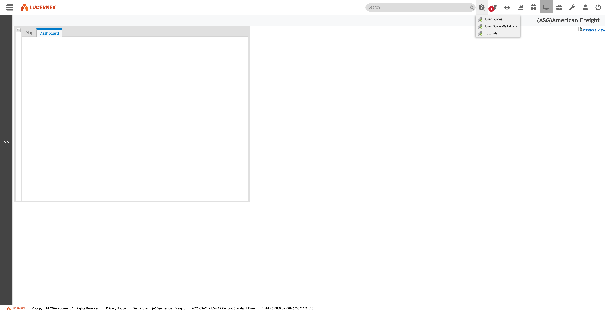

# 001 — Dashboard Home

## Identification

| Property | Value |
|---|---|
| Product | LxRetail / Lucernex |
| Tenant heading | `(ASG)American Freight` |
| Route | `https://train-americanfreight.lucernex.com/en/dashboard/DashboardDispatch.jsp` |
| Browser title | `LxRetail` |
| Captured | 2026-09-02 |
| Application build | `26.08.0.39 (2026/08/21 21:28)` |
| Server-displayed clock | Central Standard Time |

## Screenshot

> The screenshot includes the Help dropdown because that toolbar state was active at capture time. See 002 — Help Menu *(captured; document not yet written)*.

## Entry path

1. Open the tenant login page.
2. Enter the tenant-scoped identity fields.
3. Complete the password step.
4. Successful authentication redirects to `DashboardDispatch.jsp`.

Credentials are deliberately excluded from this repository.

## Visible layout

### Global header

- Hamburger/navigation icon at far left.
- Lucernex logo.
- Search input with a separate advanced-search icon.
- A row of icon-only global tools at the right.
- Current tenant/company heading below the toolbar at the far right.

### Main workspace

- A collapsible left-side strip/panel.
- Tabs:
  - **Map**
  - **Dashboard** — selected in this capture
  - **+** — likely creates an additional personal dashboard tab
- **Printable View** link.
- **Expand panel** control.
- Empty dashboard canvas for this user/tab in the captured state.

### Footer

- Lucernex logo and copyright notice.
- Privacy Policy link.
- Authenticated user and tenant context.
- Server time and time zone.
- Exact application build.

## Observed behavior

- The screen is rendered as an Ext JS workspace rather than a conventional document page.
- The left dashboard component tree is present but collapsed.
- The dashboard tab is user-configurable: the application retrieves tab names and a widget/component tree after the page loads.
- The server delivered three default tab definitions: `Map`, `Dashboard`, and `+`.
- No browser console errors or warnings were present during capture.

## Dashboard widgets discovered

The dashboard widget feed exposes a broad set of configurable components. Examples directly observed in the server response include:

- Add Form/Work Flow
- ASC 842 Recalculations
- Company Administration
- Critical Issues
- Dashboard Reports
- Data/PS Tools
- Entity Search
- Expense Schedules Not Approved or Denied
- Expiring Contracts
- FM Workbench
- Folder Administration
- Key Date Expiration
- Member Administration
- My Activities / Alerts / Approvals / Assignments
- My Contracts / Facilities / Leases / Locations / Projects
- My Work Orders / Work Queue
- Chart widgets: milestone, yearly bar, line, and pie

Tenant-specific dashboard report definitions observed include future kickouts, future openings, lease expirations, month-to-month leases, unprocessed transactions, and reconciliation/savings/default logs.

## Network and implementation observations

The page loaded:

- Ext JS `7.6.0`
- Ext Gantt `5.1.1`
- Lucernex application scripts under `/en/js/`
- OpenLayers plus Google Maps integration scripts
- Pendo in-product guidance
- Cloudflare browser analytics

Key same-origin requests:

| Purpose | Endpoint |
|---|---|
| Dashboard component tree | `/servlet/Dash?formSubmit=getTreeNodes&node=root` |
| User dashboard tabs | `POST /servlet/Dash` with `formSubmit=getTabNames` |
| Navigation tree | `/servlet/JSONDataRequest?reqType=RMTopMenu&node=root` |
| Layout names | `/servlet/uihelper?reqType=getLayoutNames` |

These endpoints show a server-rendered Java/JSP application enhanced with Ext JS components and JSON-serving servlets.

## Safety notes

- No widgets were added, rearranged, renamed, or removed.
- The `+` tab was not activated because it may create persistent user configuration.
- Printable View and other controls were not activated on this pass.

## Interpretation

This is not merely a reporting dashboard. It is the shell for a tenant-configured enterprise real-estate and lease-management system. The entity navigation and widget catalog indicate integrated support for leases/contracts, sites/facilities, equipment, work orders, expenses, project activity, workflows, reporting, demographic studies, and ASC 842 accounting processes.

## Open questions

- Which dashboard layout is intentionally assigned to `Test2 User`?
- Is the empty dashboard a permission outcome, an unconfigured personal tab, or a load issue?
- Which top-right toolbar icons are enabled by role versus always visible?
