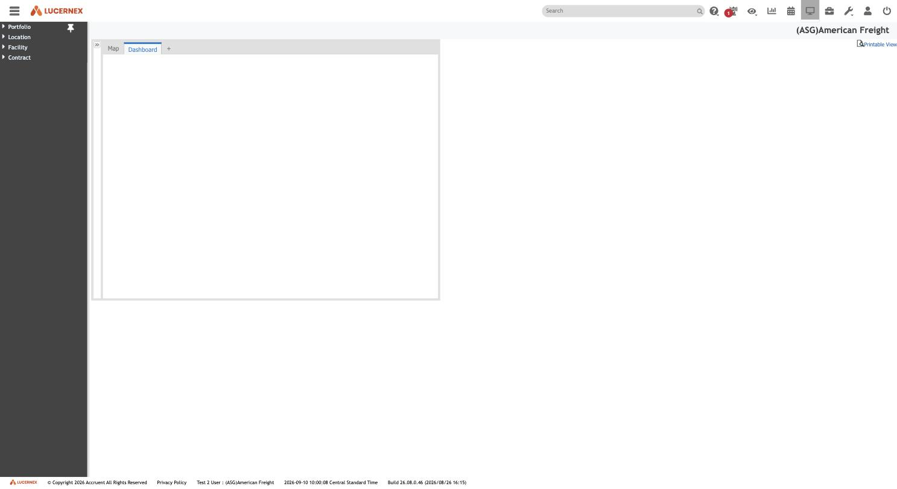

# 003 — Main navigation: the whole product in four roots

**Stated up front.** Everything a lease-administration user can reach in this tenant hangs off
**four** top-level entries: **Portfolio, Location, Facility, Contract**. That is the entire
end-user surface. The 223 record types in the schema collapse to four navigable roots, 24 groups
and **81 screens**.

Two things fall out of that immediately, and both matter more than the menu itself:

1. **Every root repeats the same opening group.** Portfolio, Location, Facility and Contract each
   begin with `Summary, Members/Contacts, Forms, Work Flow, Documents, Binders` (+ `Schedule` and/or
   `Budget` where relevant). That is the **`ProjectEntity` supertype rendered as a tab strip** —
   direct UI confirmation of what [`../data-model/project-entity.md`](../data-model/project-entity.md)
   derived from the foreign-key graph. Anything you can own gets those tabs for free.
2. **Contract carries more than the other three combined.** 39 screens against Portfolio's 14,
   Facility's 16 and Location's 12. The product is a lease-accounting system with a real-estate
   register attached, not the other way round.

| Property | Value |
|---|---|
| Route | `/en/dashboard/DashboardDispatch.jsp`, hamburger control top-left |
| Component | `Lx.ui.MenuTree` (ExtJS tree panel) |
| Nodes | 109 |
| Depth | 3 (root → group → screen) |
| Tenant | `(ASG)American Freight` |
| Captured | 2026-09-10, build `26.08.0.46` |
| Exploration mode | Read-only. The tree was expanded and read; no screen was mutated. |
| Machine-readable | [`../mindmap/navtree.json`](../mindmap/navtree.json) |

This document closes screen **003**, which had been marked *Pending* since the first exploration
session.

## The shape

| Root | Groups | Screens |
|---|---:|---:|
| Portfolio | 6 | 14 |
| Location | 4 | 12 |
| Facility | 8 | 16 |
| **Contract** | **6** | **39** |
| **Total** | **24** | **81** |

## The universal group

**Observed.** Every root opens with a `Details` group containing:

`Summary` · `Members/Contacts` · `Forms` · `Work Flow` · `Documents` · `Binders`

Portfolio adds `Budget`; Location and Facility add `Schedule` and `Budget`; Contract adds `Schedule`.

**Derived.** This is the `ProjectEntity` interface made visible. The GraphQL schema declares
`ProjectEntity` as an interface and 163 foreign keys point at it; here is what that buys a user —
every ownable thing automatically has people attached to it, request forms raised against it, a
workflow running on it, documents filed under it, and binders assembled from it.

For the rebuild this is the single most reusable idea in the navigation: **model the supertype once
and every entity inherits its tab strip.** Building Contract, Facility and Location as unrelated
aggregates would mean building those six screens three times.

Note also that `Forms` and `Work Flow` appear *as tabs on every entity*. That corroborates
[`../modules/layouts-and-forms/forms-vs-pages-vs-layouts.md`](../modules/layouts-and-forms/forms-vs-pages-vs-layouts.md):
a Form is an Issue raised against a ProjectEntity, so of course every entity can list its own.

## Contract — the 39 screens

The richest root, and the one the rebuild has to reproduce. Its six groups are a clean four-phase
split of lease administration, plus the universal group and reports.

### Details (7)
`Summary` · `Members/Contacts` · `Forms` · `Work Flow` · `Documents` · `Binders` · `Schedule`

### Abstract Info (8) — what the lease *says*
`Abstract Details` · `Terms` · `Amendments` · `Covenants` · `Key Dates` · `Responsibilities` ·
`Insurance` · `Co-Tenancy`

This is the output of the abstraction process — the eight screens an abstractor fills from the
signed document. It maps onto the `Lease Admin Request` workflow's step 2, *Abstract Lease Document*.

### Payment Info (12) — what money *moves*
`Payment Details` · `Recurring Expenses` · `Alternate Rent` · `Transactions` · `Invoices` ·
`Receipts` · `Recoveries` · `Scheduled Offsets` · `Allowances` · `Security Deposit` ·
`Percentage Rent` · `Sales`

The largest group. Note `Sales` sitting beside `Percentage Rent` — turnover rent needs reported
sales, so they are adjacent in the UI as they are in the schema.

### Accounting Info (7) — what the *books* say
`Accounting Details` · `Capital Lease Test` · `Straight-Line Rent` · `Accounting Assumptions` ·
**`ASC 842 Test`** · **`ASC 842 Rent Schedule`** · **`IFRS 16 Rent Schedule`**

**This is the accounting engine's user surface, and it settles a structural question.** The
*classification test* and the *rent schedule* are **separate screens**, exactly as
[`../modules/accounting/README.md`](../modules/accounting/README.md) derived from the schema:
`ContractFinancialTest` runs the tests, `SLSummary`/`SLPeriod` hold the schedules. The UI keeps them
apart too.

Note also that `Capital Lease Test` (the older ASC 840 test) survives alongside `ASC 842 Test` as its
own screen — the two coexist rather than one superseding the other.

**IFRS 16 has a screen but no configured schedule types** (its code table is empty — see
[`../data-model/code-table-registry.md`](../data-model/code-table-registry.md)). The capability is
present in the navigation and unused in the data.

### Accrual Info (4)
`Accrual Details` · `Expense Accruals` · `Transactions` · `Percentage Rent Accruals`

Accruals are a **peer of** payments and accounting, not a sub-topic of either. Worth noting for the
rebuild: this tenant treats accrual as its own phase of contract work.

### Reports (1)
`Contract Reports`

## The other three roots

### Portfolio (14)
Details (7, incl. `Budget`) · Demographics (`Criteria`, `Study Areas`, `Demographics`) ·
`Org Chart` · `Facility / Store List` · `Equipment` · `Program Reports`

Portfolio is the top of the ownership hierarchy and carries the org chart — consistent with workflow
routing resolving through `REGION1`/`REGION2`/`MARKET` positions.

### Location (12)
Details (8, incl. `Schedule` and `Budget`) · `Complex/Center Details` · Equipment (`Equipment`,
`Work Orders`) · `Location Reports`

### Facility (16)
Details (8) · Demographics (`Summary`, `Demographics Study`) · Asset Management (`Equipment (FF&E)`,
`Service Requests / Work Orders`) · `Space Management` · `Facility Expense` · `Pro Forma Lease` ·
`Responsibilities` · `Facility Reports`

`Pro Forma Lease` on Facility is the deal-modelling surface — a lease that does not exist yet,
modelled against a physical facility. Nothing in the corpus has explored it.

## What this changes

- **Screen coverage is now measurable.** 81 end-user screens exist. Before this capture, none had
  been opened; the entire corpus was built from admin screens and schema tools. That framing was
  stated in the previous status report and is now quantified.
- **The four-phase Contract split** (Abstract → Payment → Accounting → Accrual) is a better
  organising principle for the rebuild's Contract module than the schema's table grouping, because
  it is how the people who use it think.
- **`Pro Forma Lease`, `Space Management`, `Facility Expense`, `Work Orders`, `Binders`,
  `Study Areas` and `Org Chart`** are whole features with no documentation at all.

## Open questions

1. **What does a `Summary` screen actually render?** It is the first screen of every entity and has
   never been opened. It will be driven by one of the `ASG * Summary` page layouts documented in
   [008](../admin/008-manage-page-layouts.md) — opening it would connect the layout builder to its
   output for the first time.
2. **What is a `Binder`?** It appears on all four roots and matches the `Manage Binder Templates`
   admin link, also unexplored.
3. **Is `ASC 842 Test` the same record as `Capital Lease Test`** with a different layout, or a
   genuinely separate record? The schema says `ContractFinancialTest` holds both — so probably one
   record, two layouts, but that is **Inferred**.
4. **What does `Pro Forma Lease` model**, and does it share the Contract schema or have its own?
5. **`Scheduled Offsets` and `Recoveries`** appear as peers under Payment Info; the schema has
   `ScheduledOffsets`, `ExpenseRecovery` and `ExpenseOffset` — which screen maps to which table?
6. **Does the menu vary by user class?** This capture is one user (`Test 2 User`). A different
   security level may see more or fewer of the 81 screens, which would make the menu itself
   permission-driven data rather than fixed structure.
