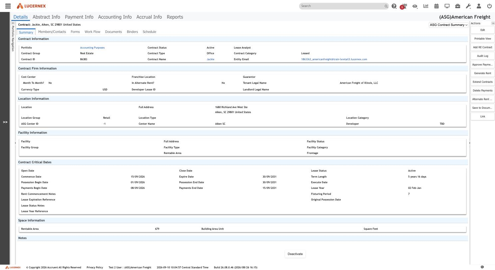
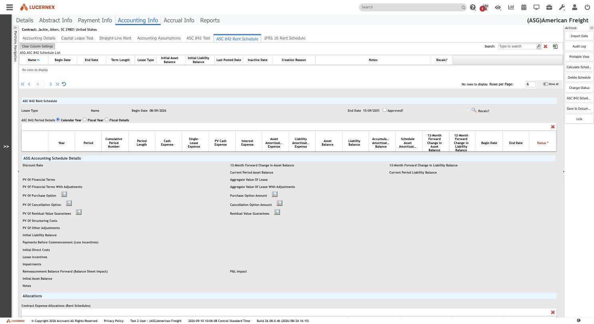

# 014 — A contract, as a user sees it

**Stated up front.** This is the first end-user screen anyone has opened. Everything in the corpus
before it came from admin screens and schema tools, which showed how Lucernex is *configured* but
never how it *behaves*. Two captures here close that gap for the highest-value case: the Contract
Summary, and the ASC 842 Rent Schedule.

The single most useful thing on the page is not a field. It is the **Actions panel** — eleven
buttons down the right-hand side, several of which run the accounting engine.

| Property | Value |
|---|---|
| Routes | `PForm.jsp?menuPLID=3494&requestedProjectEntityType=Contract` (Summary) · `PLForm.jsp?menuPLID=43785&…` (ASC 842 Rent Schedule) |
| Record | Contract `86383`, name `Jackie`, Aiken SC — training-tenant data |
| Tenant | `(ASG)American Freight`, build `26.08.0.46` |
| Captured | 2026-09-10 |
| Exploration mode | **Read-only.** No action button was pressed. `Generate Rent`, `Approve Payments`, `Delete Payments`, `Extend Contracts`, `Calculate Schedule`, `Delete Schedule`, `Change Status` and `Deactivate` were all observed and deliberately **not** invoked. |

## The Contract Summary

The page is the `ASG Contract Summary` layout — `PageLayoutID=96289`, the exact layout whose builder
was dissected in [008](../admin/008-manage-page-layouts.md) and whose conditional-rule engine was
cracked in [conditional-fields.md](../modules/layouts-and-forms/conditional-fields.md). **The builder
and its output are now connected end to end**, which was open question #1 of screen
[003](003-main-navigation.md).

The sections render exactly as the builder showed them: Contract Information, Contract Firm
Information, Location Information, Facility Information, Contract Critical Dates, Space Information,
Notes.

### Four things worth recording

**Both status fields are shown, and they disagree in kind.** `Contract Status = Active` sits in
Contract Information; `Lease Status = Active` sits in Contract Critical Dates. They are different
fields with different vocabularies, exactly as
[`../data-model/code-table-registry.md`](../data-model/code-table-registry.md) established — the
platform's three-value record flag and the tenant's nine-value lifecycle. Seeing them rendered side
by side settles any doubt that a rebuild could collapse them.

**Facility Information is empty.** This contract has a Location but no Facility. That is the
asymmetric-cardinality finding of [009](../admin/009-related-fields-and-data-model.md) showing up in
the UI: a contract may be attached to a location without a facility, and the section renders blank
rather than being hidden. *Note this is a layout with conditional-display capability where the
condition was evidently not used* — a real example of the cost of not using the rule engine.

**`Term Length` reads "5 years 16 days".** A computed value, derived from Commence 15/09/2026 and
Expire 30/09/2031 and rendered as prose, not stored as a number. This is the `COMPUTED` field type
from the GraphQL enum, visible in the wild.

**A layout picker sits above the page.** A dropdown offering `ASG Contract Summary` and
`ASG Lease Logs` lets the user re-render the same record through a different layout. **Observed** —
and it means layout choice is a runtime user decision, not only an administrator's assignment. The
`Setup Pages` screen in [008](../admin/008-manage-page-layouts.md) assigns the default; this picker
overrides it per view.

### The Actions panel — the engine's trigger surface

**Observed**, eleven actions:

| Action | Reading |
|---|---|
| `Edit` | Switch the layout to edit mode |
| `Printable View` | Render for print |
| `Add RE Contract` | Create a sibling real-estate contract |
| `Audit Log` | Field-level history for this record |
| **`Approve Payments`** | Payment approval — the Rent Payment workflow's surface |
| **`Generate Rent`** | **Run the rent generation engine for this contract** |
| **`Extend Contracts`** | Bulk-extend term |
| **`Delete Payments`** | Remove generated payments |
| `Alternate Rent …` | Alternate rent schedule maintenance |
| `Save to Document` | Persist the rendered page as a document |
| `Link` | Deep link to this record |

Plus a `Deactivate` button at the foot of the form.

**This is what `KickOffMethod: PAGE_LAYOUT` means.** The GraphQL enum
([`../data-model/graphql-api.md`](../data-model/graphql-api.md)) lists four ways a workflow starts,
one of them being "from a page layout". Here are the buttons. And it corroborates
[008](../admin/008-manage-page-layouts.md)'s finding that a layout can host business-action buttons
as well as fields — the layout is a workflow-composition surface, not just a form.

For the rebuild: **`Generate Rent` is the entry point to the whole payment engine, and it is a button
on a form.** Any ASG Edge+ design that models rent generation purely as a scheduled batch job will
miss that a user triggers it per contract, on demand, and expects to see the result immediately.

## The ASC 842 Rent Schedule

The accounting engine's output surface. It has four parts.

### 1. The schedule list

A grid of schedules for this contract (empty for this record). Columns:

`Name` · `Begin Date` · `End Date` · `Term Length` · `Lease Type` · **`Initial Asset Balance`** ·
**`Initial Liability Balance`** · `Last Posted Date` · `Inactive Date` · **`Creation Reason`** ·
`Notes` · **`Recalc?`**

`Creation Reason` binds to the `Schedule Creation Reason Code` table (`TableType=2160`), and
`Recalc?` is the UI face of `SLSummary.NeedsRecalculation` — both predicted by
[`../modules/accounting/README.md`](../modules/accounting/README.md) from the schema alone, both now
Observed.

### 2. The schedule header

`Lease Type` · `Name` · `Begin Date` · `End Date` · **`Approved?`** · **`Recalc?`**

**`Approved?` is a checkbox on the schedule itself.** This is the state the ASC 842 Schedule
Review/Approval workflow drives. The accounting module derived that schedules are approved rather
than published; the flag they are approved *into* is right here.

### 3. Period basis — a three-way switch

**`Calendar Year` | `Fiscal Year` | `Fiscal Details`** *(Observed, radio group)*

The schedule can be periodised three ways. This is a genuine accounting-policy control and sits
alongside `GaapAmortizeMode`'s `PER_DAY | PER_PERIOD`. A rebuild needs both switches.

### 4. The period grid — the amortisation schedule itself

The columns **are** the ASC 842 schedule:

`Year` · `Period` · `Cumulative Period Number` · `Period Length` · **`Cash Expense`** ·
**`Single-Lease Expense`** · **`PV Cash Expense`** · **`Interest Expense`** ·
**`Asset Amortization Expense`** · **`Liability Amortization Expense`** · **`Asset Balance`** ·
**`Liability Balance`** · **`Accumulated Amortization Balance`** · `Schedule Asset Amortization` ·
**`12-Month Forward Change in Asset Balance`** · **`12-Month Forward Change in Liability Balance`** ·
`Begin Date` · `End Date` · `Status *`

`Single-Lease Expense` is the operating-lease straight-line charge; `Interest Expense` plus
`Asset Amortization Expense` is the finance-lease pair. **Both are columns on the same row**, which
is how one engine serves both classifications — the classification decides which columns are
populated, not which table is written. That is a cleaner design than most rebuilds would reach for
unaided.

The two `12-Month Forward Change` columns are the current/non-current split needed for balance-sheet
presentation.

### 5. Measurement inputs

The `ASG Accounting Schedule Details` block is the initial-measurement surface:

`Discount Rate` · `PV Of Financial Terms` · `PV Of Financial Terms With Adjustments` ·
`PV Of Purchase Option` / `Purchase Option Amount` · `PV Of Cancellation Option` /
`Cancellation Option Amount` · `PV Of Residual Value Guarantees` / `Residual Value Guarantees` ·
`PV Of Structuring Costs` · `PV Of Other Adjustments` · `Initial Liability Balance` ·
`Payments Before Commencement (Less Incentives)` · `Initial Direct Costs` · `Lease Incentives` ·
`Impairments` · `Remeasurement Balance Forward (Balance Sheet Impact)` / **`P&L Impact`** ·
`Initial Asset Balance` · `Aggregate Value Of Lease` (± adjustments) ·
`Current Period Asset Balance` / `Current Period Liability Balance` ·
`12-Month Forward Change in Asset / Liability Balance`

Read as a formula, this is ASC 842 initial measurement in the order the standard states it:
liability = PV of payments, adjusted for purchase, cancellation and residual-value options; asset =
liability + initial direct costs + payments before commencement − incentives, then impaired and
remeasured. **The rebuild's accounting engine can be specified from this list of inputs**, and the
`Remeasurement … / P&L Impact` pair confirms remeasurement is modelled explicitly rather than as a
new schedule.

A separate `Allocations` section holds `Contract Expense Allocations (Rent Schedules)`.

### Actions on this screen

`Import Data` · `Audit Log` · `Printable View` · **`Calculate Schedule`** · **`Delete Schedule`** ·
**`Change Status`** · `ASC 842 Schedule …` · `Save to Document` · `Link`

**`Calculate Schedule` is the accounting engine's trigger** and **`Change Status`** is how a schedule
moves through the approval states. Both are per-contract, user-invoked buttons.

## What this changes for the rebuild

1. **The engine is user-triggered, not batch.** `Generate Rent` and `Calculate Schedule` are buttons
   on records. Model them as commands with immediate feedback.
2. **One schedule row serves both lease classifications.** Operating and finance columns coexist;
   classification selects which are populated.
3. **Approval is a flag on the schedule**, driven by a workflow, with `Change Status` as the manual
   path.
4. **Recalculation is explicit state** (`Recalc?`), not implicit invalidation.
5. **Layout choice is partly the user's**, via the picker — an unusual capability worth a deliberate
   decision rather than an accidental omission.

## Open questions

1. **What does `Generate Rent` actually produce**, and against which tables? It cannot be pressed on
   a live tenant without creating data — this needs a disposable record or an explicit go-ahead.
2. **What is `ASG Lease Logs`**, the second layout in the picker?
3. **What are the `Status` values on a schedule period row?** The column is marked required but this
   contract has no schedule rows.
4. **Why does this contract have no ASC 842 schedule** despite being Active with dates? Either none
   was generated, or generation is gated on something not visible here.
5. **`Import Data` on the schedule screen** — is a schedule importable from outside, bypassing the
   engine? That would be a significant finding for migration.
6. **What does `Add RE Contract` create**, and how does it relate to `MasterContractID`?
