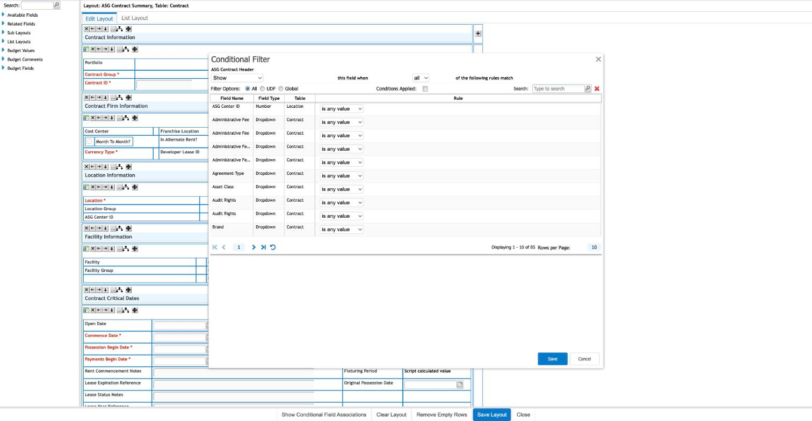
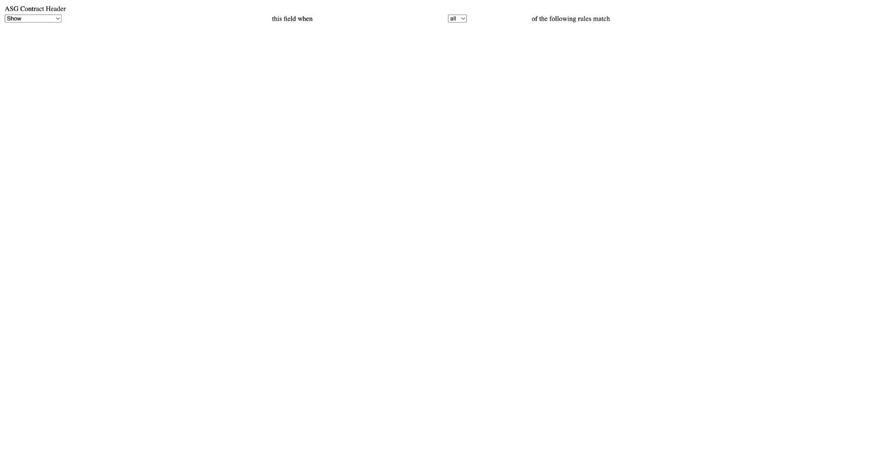

`/en/pagebuilder/ConditionFilterEx.jsp?fieldKey={key}&pageLayoutID={id}&ajax=true`

`docs/assets/screenshots/conditional-fields/conditional-filter-editor-contract-header.jpg`

`docs/assets/screenshots/conditional-fields/conditional-filter-standalone-no-host.jpg`

The UI over [[conditional-field]]. A **flat rule engine**: one action (`show` / `showAndRequire` /
`hide`), one combinator (`all` / `any`), and a list of criteria whose operators depend on the driver's
type. Drivers **cross foreign keys** into related entities — 85 cross-entity fields are available.

**Two method lessons live on this screen**, and they cost real time:

1. **The blocker was misdiagnosed.** Three documents recorded it as a popup/window-opener problem. The
   real dependency is on the host page's `Lx` JavaScript namespace — which is why the standalone
   capture above is blank.
2. **Reading the served HTML can never observe a rule.** The hidden
   `json.conditionalFieldsConfig` input is **always empty in the response**; the builder populates it
   client-side. See [[method-fetch-is-not-render]].

**The definitive read needs none of this:**
`GET /rest/businessObject/PageLayout/lxid/{id}?deep=true`.

`ConditionFilterEx.jsp` does **not** require `CustomObjectDelID` — `fieldKey` plus `pageLayoutID`
return a byte-identical response.

All screens: [[map-of-screens]] · caveat: [[caveat-viewport]]
