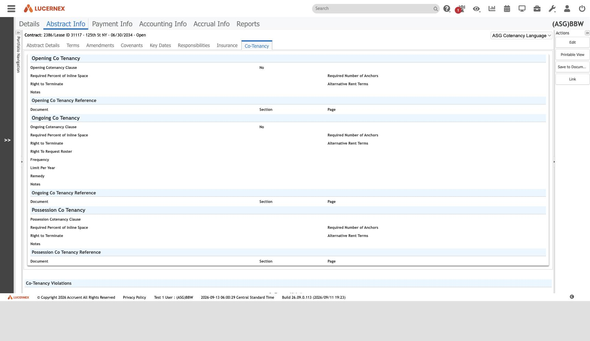

`PLForm.jsp — Contract : Abstract Info : Co-Tenancy`

`docs/assets/screenshots/bbw-enduser/ct-12-co-tenancy.jpg`

Rent reduction if an anchor tenant vacates. **Dropped from
[[equipment-contract|Equipment Contract]]** — the only screen removed from its `Abstract Info` group.

It is also one of the few places the two tenants genuinely diverge outside the AI pipeline:
[[tenant-american-freight|AF]] retains older layout variants (`ASG Co Tenancy`,
`ASG Contract Co Tenancy`) that [[tenant-bbw|BBW]] has replaced with `ASG Contract Cotenants` and
`ASG Cotenancy Language` ([[finding-publish-then-fork]]).

`Cotenancy Update` is one of BBW's 13 [[WorkFlowTemplate|workflow templates]] (2478, 2 steps).

See [[CoTenancy]]

All screens: [[map-of-screens]] · caveat: [[caveat-viewport]]
