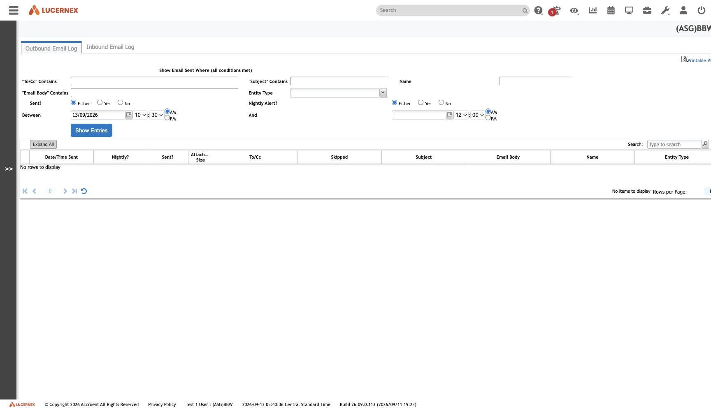

`/en/reports/EMailLogs.jsp`

`docs/assets/screenshots/bbw-admin/48-email-log.jpg` · `af-admin/54-email-log.jpg`

Behind it sits an **asymmetry** ([[rule-DOC-R-011]]): received-email attachments are **promoted into
ordinary [[Document]] and [[Folder]] records**, and there is **no equivalent for sent mail** —
`EMailSentLog` is a one-field stub against `EMailReceivedLog`'s 15.

**The product remembers what came in and not what went out.**

Which makes this screen the only surface over sent correspondence, and its contents unrecoverable from
the schema.

See [[module-documents-folders]]

All screens: [[map-of-screens]] · caveat: [[caveat-viewport]]
