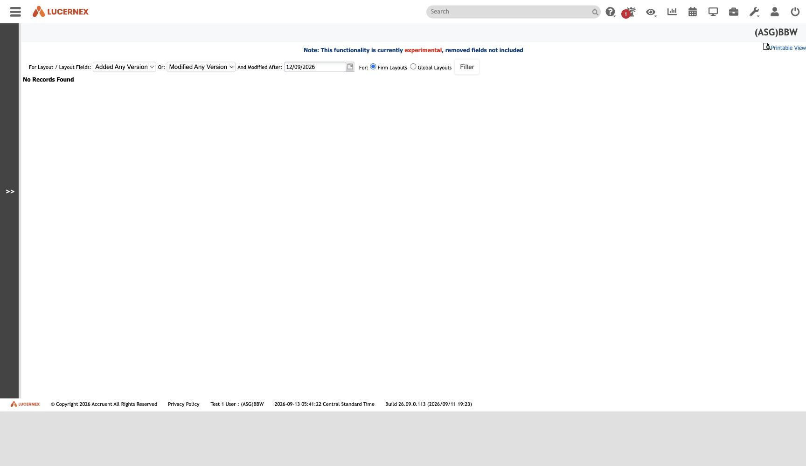

`/en/admin/ShowLayoutChanges.jsp`

`docs/assets/screenshots/bbw-admin/54-layout-changes.jpg` · `af-admin/63-layout-changes.jpg`

The only configuration-change audit in the product, and it covers layouts only.

**Which is exactly the gap [[finding-publish-then-fork]] describes from the other direction.** This
screen records *changes within a tenant*. Nothing records that a layout **arrived** from a template
set, or which version it arrived as — [[publish-and-fork|clone-on-import discards the lineage]].

So a tenant can answer *"who changed this layout last Tuesday"* and cannot answer *"is this layout
still the same as the one ASG publishes"*.

For ASG Edge+: keep this **and** add the provenance Lx omits.

See [[feature-page-layouts]] · [[three-publish-tiers]]

All screens: [[map-of-screens]] · caveat: [[caveat-viewport]]
