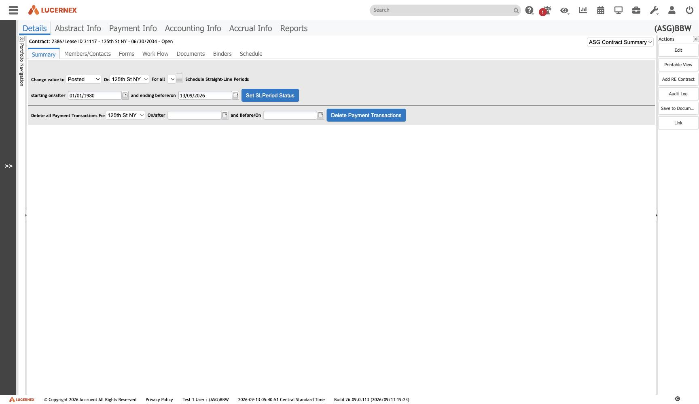
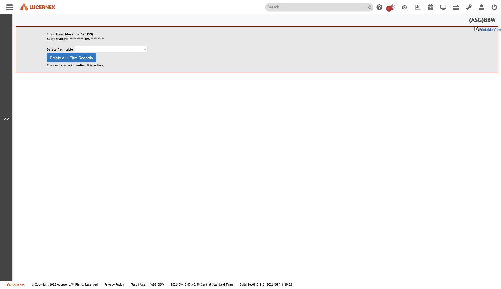

`/en/admin/lxadmin/*`

`docs/assets/screenshots/bbw-admin/50-modify-straight-line-status.jpg` · `af-admin/57-modify-straight-line-status.jpg`

Four tools under `/lxadmin/`, available to the vendor rather than the tenant:

| Tool | Route |
|---|---|
| Modify Straight Line Status | `SLDemoTweaks.jsp` |
| Data Conversion Cleaner | `DataLoadTweaks.jsp` |
| Test Email Address | `EmailTest.jsp` |
| [[screen-delete-entities\|Delete Entities]] | `DeleteEntities.jsp` |

**`Modify Straight Line Status` is the one worth thinking about.** Schedule approval is
[[finding-schedules-are-approved-not-published|irreversible]] to a user — *"once approved, it cannot be
un-approved"* ([[rule-ACC-R-050]]) — and here is a vendor tool for modifying exactly that state.

So the real rule is *"irreversible to the tenant, reversible by the vendor"*, which is a different
statement and a better one to design from.

`docs/assets/screenshots/bbw-admin/51-data-conversion-cleaner.jpg`

See [[module-accounting]] · [[feature-administration]]

All screens: [[map-of-screens]] · caveat: [[caveat-viewport]]
