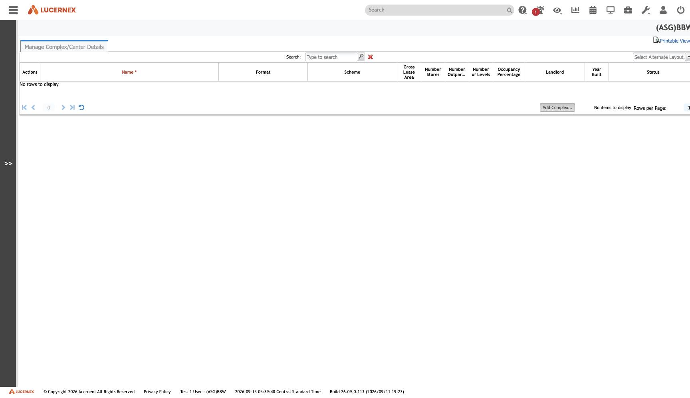

`/en/admin/ComplexEdit.jsp`

`docs/assets/screenshots/bbw-admin/42-manage-complex-center-details.jpg` · `af-admin/46-manage-complex-center-details.jpg`

[[Complex]] sits **above** [[Facility]] and is structurally unlike everything around it: **no parent,
no `ProjectEntityID`, and zero outbound foreign keys** ([[rule-FAC-R-009]]).

A pure grouping label, attached from below by the 11 objects that reference it. That puts it on the
[[hub-and-spoke|Hub]] side with the other firm-global objects.

See [[entity-scoped-vs-firm-global]] · [[module-facilities-locations]]

All screens: [[map-of-screens]] · caveats: [[caveat-viewport]] · [[caveat-one-equipment-contract]]
