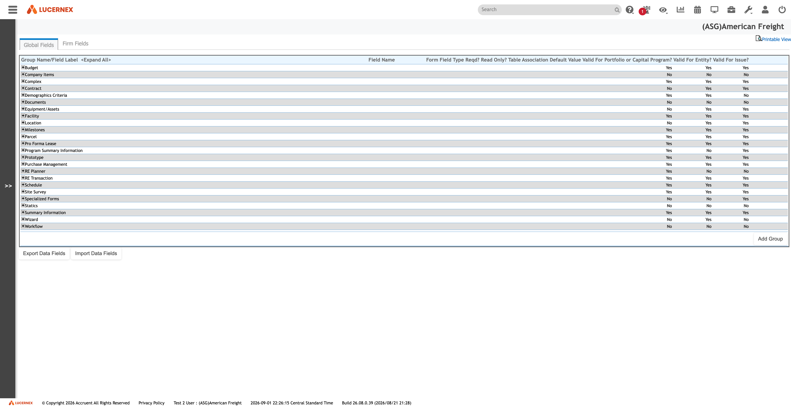

`/en/pagebuilder/ReportGroupAvailableFieldEdit.jsp?isGlobal={true|false}`

`docs/assets/screenshots/data-fields/manage-data-fields-global.png`

`docs/assets/screenshots/data-fields/manage-data-fields-firm.png`

The admin label is *"Manage Data Fields"*; the internal page title is *"Manage Report Group Available
Fields"* — the store is [[ReportGroupAvailableField]].

- Both scopes share **24 top-level groups and 320 subgroups**, and their **leaf paths are entirely
  disjoint**.
- Global **5,953 leaves / 6,297 rows**; Firm **205 leaves / 549 rows**.
- **202 of 205** Firm names start `Firm_`; **0 of 5,953** Global names do.
- Required = Yes: **637** Global, **0** Firm. Read Only = Yes: **0** in both — and that is
  [[security-ladder|correct, not an error]].

**It is read-only to a firm in both tenants**, and
[[finding-firm-fields-are-physical-columns|the reason is DDL]].

See [[data-field-catalog]] · [[feature-data-fields]]

All screens: [[map-of-screens]] · caveat: [[caveat-viewport]]
