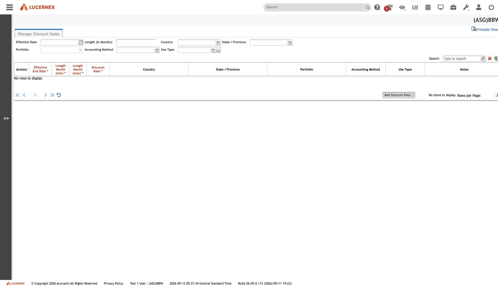

`/en/admin/ManageDiscountRates.jsp`

`docs/assets/screenshots/bbw-admin/25-manage-discount-rates.jpg` · `af-admin/26-manage-discount-rates.jpg`

**[[finding-discount-rate-table-empty]]** — the most consequential blocker in this corpus for the
accounting rebuild. Verified on both tenants, both on build `26.09.0.113`.

**Even empty, the column headers give the lookup key**, and it is richer than assumed: seven
dimensions including a **lease-length band** (an incremental-borrowing-rate curve, not a scalar) and
the **accounting method** (so the same lease can discount differently under ASC 842 and IFRS 16). See
[[DiscountRate]].

**And this screen settled a different question entirely.** The red `*` sits on **list column
headers** — `Effective End Date *`, `Length Month (min) *`, `Discount Rate *` — while `Country`,
`State / Province`, `Portfolio`, `Accounting Method` and `Use Type` carry none. A clean four-against-six
split on one layout, which is exactly what
[[finding-no-layout-level-required|closed the required-ness question]].

All screens: [[map-of-screens]] · caveat: [[caveat-viewport]]
