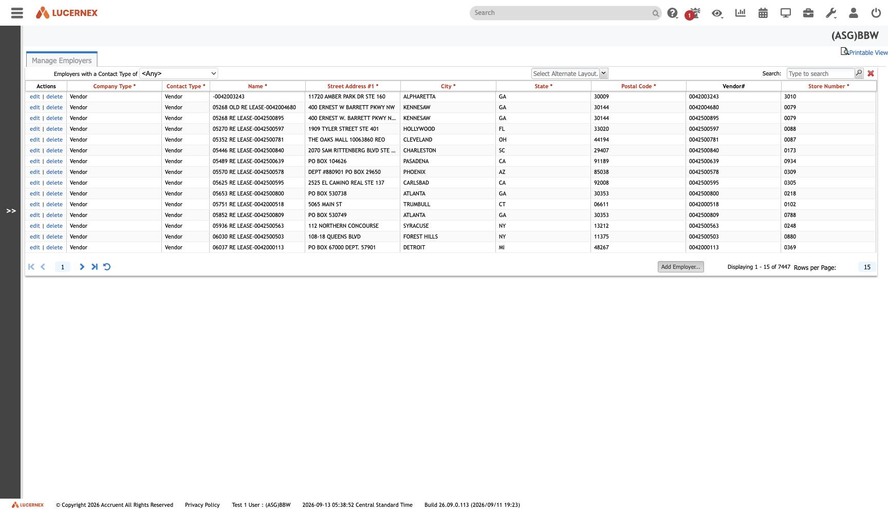

`/en/admin/EmployerEdit.jsp`

`docs/assets/screenshots/bbw-admin/35-manage-employers.jpg` · `af-admin/36-manage-employers.jpg`

**There is no `Vendor`, `Landlord` or `Tenant` object anywhere in the 223-object schema.** All three
are [[Employer]] under different column names ([[rule-PPL-R-004]]) — proved by
`PaymentTransaction.VendorID` being declared type **`Employer ID`**
([[screen-related-fields]]).

Fourth in the schema's in-degree ranking: **30 objects, 40 columns**. The property-tax family alone
references it in four separate roles.

So [[screen-manage-vendors|Manage Vendors]] is a different screen over the same table.

All screens: [[map-of-screens]] · caveat: [[caveat-viewport]]
