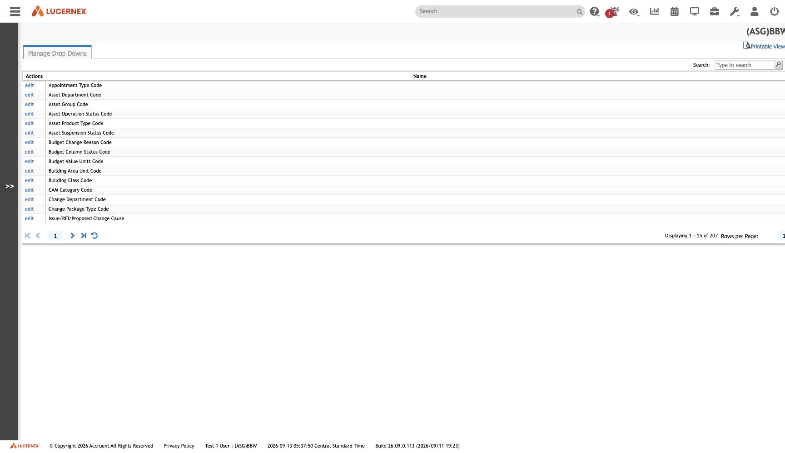
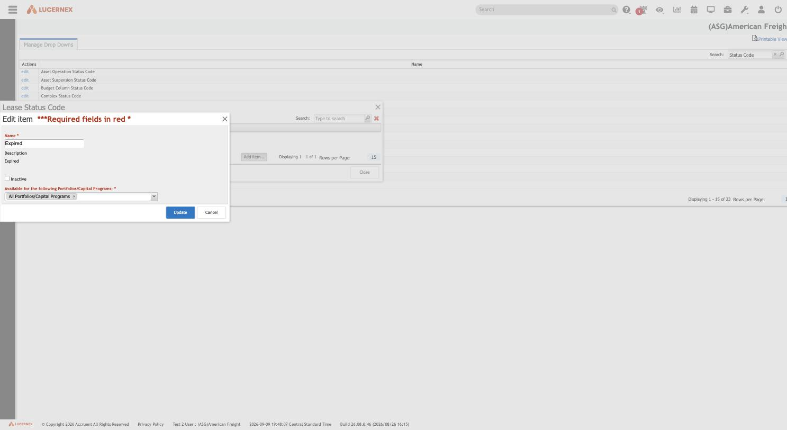

`/en/admin/FirmCodeList.jsp`

`docs/assets/screenshots/bbw-admin/27-manage-firm-drop-downs.jpg` · `af-admin/28-manage-firm-drop-downs.jpg`

**A fixed platform catalog of 207 [[code-table|code tables]]** — identical ids and names in both
tenants ([[finding-platform-seeded-by-id]]). The firm may edit *values*, never the list of tables.

Value census at [[tenant-american-freight|AF]]: **73 populated, 134 empty, 1,140 values — 154
protected, 986 deletable**.

`docs/assets/screenshots/drop-downs/firm-drop-downs-value-edit-portfolio-scope.png`

**Values are scoped to portfolios** through a required multi-select — so a code-table value is not
necessarily available everywhere in the tenant.

The `edit | delete` split in the Actions column is **not a reference count**:
[[finding-no-where-used-precedent]].

Distinct from [[screen-client-drop-downs]] — two registries, two routes, not two views.

All screens: [[map-of-screens]] · caveat: [[caveat-viewport]]
