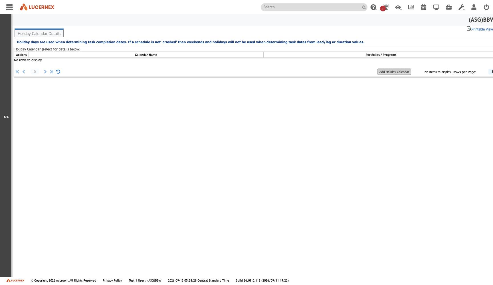

`/en/admin/ManageHolidayCalendar.jsp`

`docs/assets/screenshots/bbw-admin/32-manage-holiday-calendar.jpg` · `af-admin/33-manage-holiday-calendar.jpg`

**Zero rows** — and **corrected**: this feeds **project scheduling, not accounting**. The screen's own
help text says holiday days determine task completion dates.

So it belongs with [[module-projects-capital]] and [[rule-PRJ-R-005]], not with the accounting
reference data it sits beside on the admin dashboard.

It is one of only three [[soft-reference|soft `Holiday Calendar` typed columns]] in the entire schema.

See [[feature-reference-data]]

All screens: [[map-of-screens]] · caveat: [[caveat-viewport]]
