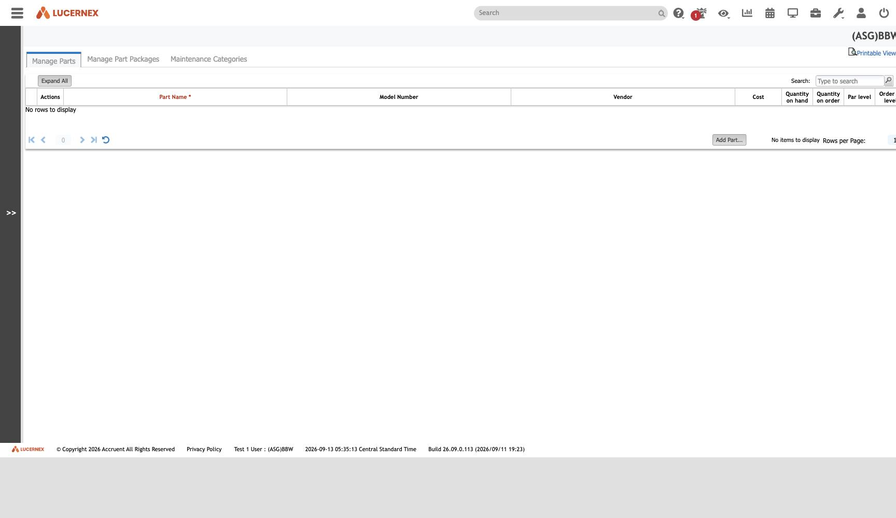

`/en/lease/PartEdit.jsp`

`docs/assets/screenshots/bbw-admin/07-manage-parts-and-inventory.jpg` · `af-admin/08-manage-parts-and-inventory.jpg`

**`QuantityOnHand` and `QuantityOnOrder` are single firm-wide counters** ([[rule-AST-R-015]]). A rebuild
that assumes per-location stock is adding a dimension the incumbent does not have.

Parts consumed on a job are recorded **against the [[Issue]], not the work order** —
`WorkOrder → Issue → LinkIssuePart` ([[rule-AST-R-014]]) — and `LinkIssuePart` (used) and
`LinkIssuePartOrder` (on order) are distinct records ([[rule-PRJ-R-009]]).

One of the three unrelated concerns filed under [[module-assets-equipment]], alongside [[Asset]] and
the maintenance loop.

All screens: [[map-of-screens]] · caveat: [[caveat-viewport]]
