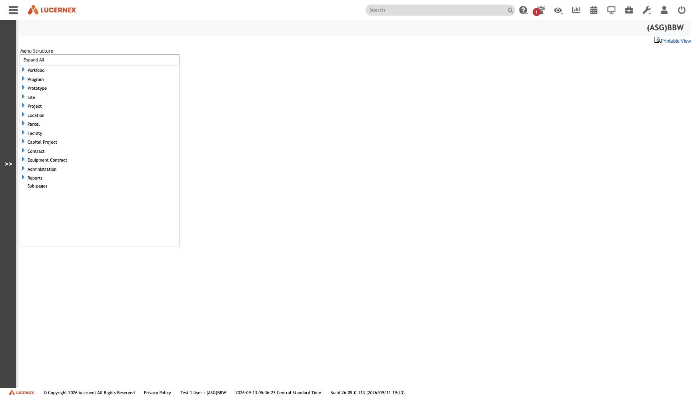

`/en/admin/ManageTopMenu.jsp`

`docs/assets/screenshots/bbw-admin/16-manage-top-menu.jpg` · `af-admin/17-manage-top-menu.jpg`

**The screen that reconciles 892 nodes against a 109-node [[navigation-tree]].** Fourteen structures
exist; four or five render.

Matching them against [[Firm]]'s entitlement flags:

| Menu structure | `Allow X?` | Renders |
|---|---|---|
| Portfolio, [[Location]], [[Facility]], [[Contract]] | Yes | **yes** |
| Program, [[Prototype]], Site, [[Project]], [[Parcel]], Capital Project | No | no |
| **[[equipment-contract\|Equipment Contract]]** (id **41087**) | **Yes** | **no** |

**Thirteen of fourteen line up exactly, and the fourteenth is what broke the model.**
[[tenant-american-freight|AF]] carries the entire `Equipment Contract` structure — id `41087`, 5
groups, **64 nodes**, the same `PageLayoutID` as [[tenant-bbw|BBW]]'s rendered root — and does not
render it. See [[finding-root-renders-iff-record-exists]].

AF is not equipment-free either: it has `Equipment` *groups* under Portfolio (`51793`) and Location
(`51796`), exactly as BBW does. **What it lacks is only the top-level root.**

All screens: [[map-of-screens]] · caveat: [[caveat-viewport]]
