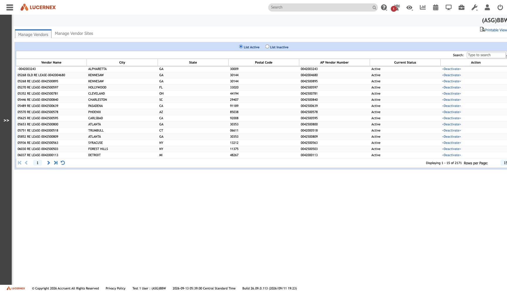

`/en/admin/VendorActivate.jsp`

`docs/assets/screenshots/bbw-admin/36-manage-vendors.jpg` · `af-admin/37-manage-vendors.jpg`

"Vendor" is a **relabelled [[Employer]]** ([[rule-PPL-R-004]]). The route name — `VendorActivate.jsp` —
says what distinguishes this screen: it is about the vendor *relationship* state, not a separate record
type.

Relevant to [[WorkFlowTemplate]]'s `Enable Vendor Collaboration` and `CollaboratorJobTitleIDList`
fields, and to the two `Vendor Change` workflows in [[tenant-bbw|BBW]].

See [[screen-manage-employers]] · [[module-people-parties]]

All screens: [[map-of-screens]] · caveat: [[caveat-viewport]]
