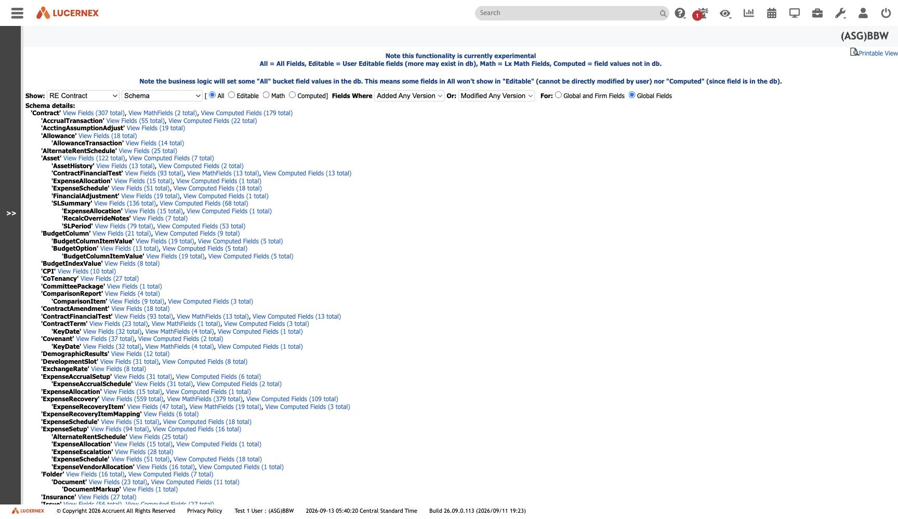

`/en/test/walkHierarchy.jsp`

`docs/assets/screenshots/data-model/walk-hierarchy-re-contract-schema.jpg`

`docs/assets/screenshots/bbw-admin/46-view-data-model-data-values-experimental.jpg`

A second, different view of the schema from
[[screen-view-object-model|View Object Model]]: **containment** rather than columns.

It nests ~70 owned child tables under [[Contract]]. **[[Facility]], [[Location]] and [[Organization]]
appear only as separate roots** — which is the containment-side confirmation that they are
[[subtype-root|independent subtype roots]], not children of the contract.

Marked *experimental* by the product itself. See [[screen-related-fields]] · [[foreign-key-graph]]

All screens: [[map-of-screens]] · caveat: [[caveat-viewport]]
